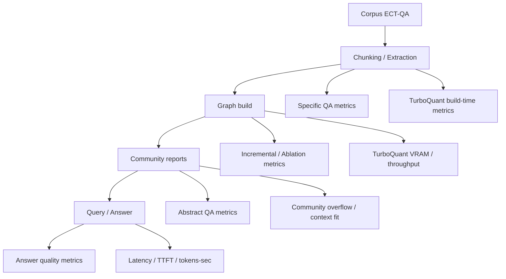

# TG-RAG Metrics: Baseline của tác giả vs. Metric bổ sung cho TurboQuant

> Mục tiêu của file này là **giữ nguyên baseline evaluation của tác giả trên ECT-QA**, sau đó **thêm metric riêng cho TurboQuant** để chứng minh lợi ích của local LLM/quantization mà **không làm lệch bài toán gốc**.

---

## 1) Ý tưởng cốt lõi

Tác giả TG-RAG đánh giá hệ thống trên 4 trục chính:

1. **Specific QA**
2. **Abstract QA**
3. **Incremental Evaluation**
4. **Ablation / Component Contribution**

TurboQuant là **phần bổ sung triển khai**, nên khi đánh giá phải dùng **cùng 4 trục đó** để đo chất lượng, rồi cộng thêm các metric về **hiệu năng local inference**.

Nói ngắn gọn:

- **Metric gốc của tác giả** → đo chất lượng hệ thống TG-RAG.
- **Metric TurboQuant bổ sung** → đo trade-off giữa tốc độ, VRAM và chất lượng khi thay LLM/API bằng local model.

---

## 2) Sơ đồ quan hệ giữa pipeline và metric

---

## 3) Baseline metric của tác giả

### 3.1 Specific QA

Dùng cho câu hỏi fact-based, multi-hop, có ground truth rõ.

**Metric chính**:
- `Correct`
- `Refusal`
- `Incorrect`
- `ROUGE-L`
- `Token F1`

**Ý nghĩa**:
- `Correct`: trả đúng fact/value và đúng temporal scope.
- `Refusal`: từ chối khi không đủ evidence.
- `Incorrect`: sai giá trị, sai thời gian, hallucination.
- `ROUGE-L` / `F1`: đo overlap lexical với ground truth.

**Khi TurboQuant được thêm vào**:
- giữ nguyên dataset và judge
- so baseline vs TurboQuant trên cùng question file
- nếu `F1`/`Correct` giảm mạnh, quantization đang làm mất chất lượng reasoning

---

### 3.2 Abstract QA

Dùng cho câu hỏi phân tích xu hướng, tổng hợp, nhiều góc nhìn.

**Metric chính**:
- `Comprehensiveness`
- `Diversity`
- `Temporal Coverage`
- `Overall Winner`

**Ý nghĩa**:
- `Comprehensiveness`: answer có đủ ý không.
- `Diversity`: answer có nhiều góc nhìn không.
- `Temporal Coverage`: answer có bám đúng timeline không.
- `Overall Winner`: tổng hợp cuối cùng của judge.

**Khi TurboQuant được thêm vào**:
- đây là nơi quantized model rất dễ tụt chất lượng nếu prompt packing kém
- cần so sánh tỷ lệ thắng pairwise với baseline
- đặc biệt chú ý `Temporal Coverage` vì đây là phần TG-RAG khác hẳn QA thường

---

### 3.3 Incremental Evaluation

Đo khả năng hệ thống khi corpus được update.

**Ba setting gốc**:
1. `Base queries on base corpus`
2. `Base queries on updated corpus`
3. `New queries on updated corpus`

**Metric chính**:
- base performance
- stability after update
- new query adaptability
- index/update token cost
- update cost ratio

**Ý nghĩa**:
- thêm dữ liệu mới có làm hỏng query cũ không?
- query mới có trả lời đúng không?
- incremental update có rẻ hơn rebuild toàn bộ không?

**Khi TurboQuant được thêm vào**:
- phải xem local LLM có giữ ổn định sau update không
- nếu quantization làm retriever/community summary lệch, điểm incremental sẽ giảm

---

### 3.4 Ablation / Component Contribution

Mục tiêu là chứng minh từng thành phần TG-RAG có đóng góp gì.

**So sánh gốc**:
- `Full TG-RAG`
- `w/o PPR`
- `w/o Temporal Retrieval`
- `w/o Temporal Indexing`

**Ý nghĩa**:
- phần temporal graph có thật sự giúp không?
- retrieval theo thời gian có cải thiện answer không?

**Khi TurboQuant được thêm vào**:
- TurboQuant không thay thế ablation của paper
- TurboQuant là một nhánh triển khai mới để so sánh với baseline full TG-RAG

---

## 4) Metric bổ sung riêng cho TurboQuant

Các metric này **không thay thế** metric của tác giả. Chúng chỉ giúp chứng minh local LLM/quantization có lợi ở đâu.

### 4.1 Efficiency / runtime

Đo tốc độ và độ ổn định chạy local.

**Metric đề xuất**:
- build time
- extraction throughput
- query latency
- p95 / p99 latency
- TTFT (time to first token)
- tokens/sec generation
- indexing/update time

**Ý nghĩa**:
- TurboQuant có giúp chạy nhanh hơn API không?
- bottleneck nằm ở extraction, embedding hay community report?

---

### 4.2 VRAM / memory footprint

Đặc biệt quan trọng với máy 16GB VRAM.

**Metric đề xuất**:
- peak VRAM
- VRAM per slot
- context utilization
- overflow count

**Ý nghĩa**:
- model 7B/14B local có fit được không?
- parallel/context có làm tràn slot không?
- community prompt có vượt budget không?

---

### 4.3 Quality retention

Đây là metric quan trọng nhất khi bạn muốn chứng minh TurboQuant “nhanh hơn nhưng không làm hỏng bài”.

**Cách đo**:
- lấy metric baseline của tác giả làm mốc
- so TurboQuant với baseline trên cùng dataset
- báo cáo `delta` hoặc `% drop`

**Ví dụ**:
- `Correct drop`
- `F1 drop`
- `Temporal Coverage drop`
- `Overall Winner win-rate drop`

**Ý nghĩa**:
- quantization có làm answer ngắn hơn, thiếu hơn, sai thời gian hơn không?
- nếu drop nhỏ nhưng speed gain lớn → TurboQuant có giá trị

---

### 4.4 Community report safety

Đây là metric thực tế cho build graph.

**Metric đề xuất**:
- community prompt overflow rate
- community report failure count
- average packed prompt length
- max packed prompt length
- retry count

**Ý nghĩa**:
- stage community có fit context mỗi slot không?
- local LLM có đủ ổn định để sinh report không?

---

## 5) Bảng so sánh: baseline vs TurboQuant

| Trục | Metric gốc của tác giả | Metric bổ sung cho TurboQuant |
|---|---|---|
| Specific QA | Correct / Refusal / Incorrect, ROUGE-L, F1 | latency, TTFT, quality retention delta |
| Abstract QA | Comprehensiveness, Diversity, Temporal Coverage, Overall Winner | pairwise win-rate drop, p95 latency |
| Incremental | base-on-base, base-on-updated, new-on-updated, update cost ratio | update time, failure count, VRAM peak |
| Ablation | full vs w/o PPR / w/o temporal retrieval / w/o temporal indexing | local model throughput, community overflow rate |

---

## 6) Nên report theo format nào?

Khi viết báo cáo hoặc slide, nên dùng format này:

### A. Baseline của tác giả
- mô tả 4 trục evaluation
- giữ nguyên dataset / judge / split

### B. TurboQuant setup
- model local 7B hoặc 14B
- embedding local HF
- context / parallel / batch settings

### C. Kết quả
- quality metrics gốc
- efficiency metrics bổ sung
- delta so với baseline

### D. Kết luận
- TurboQuant có giúp giảm chi phí không?
- chất lượng có giữ được không?
- trade-off có chấp nhận được không?

---

## 7) Nguyên tắc không làm lệch bài toán gốc

1. Không đổi question files.
2. Không đổi judge.
3. Không đổi cách tính metric gốc.
4. Không bỏ temporal dimensions để lấy tốc độ.
5. Chỉ thêm metric hiệu năng cho local LLM.

Nếu làm đúng, bạn sẽ chứng minh được:

> **TurboQuant là lớp tối ưu triển khai cho TG-RAG, không phải là một bài toán khác.**

---

## 8) Giải thích sâu hơn: 4 trục đánh giá của tác giả thực chất đo gì?

Phần này viết lại rõ hơn để tránh nhầm giữa **metric** và **trục đánh giá**.

### 8.1 Specific QA: đo độ đúng của câu trả lời fact-based

Specific QA không chỉ hỏi "có trả lời đúng không", mà còn hỏi:

- có đúng số liệu không
- có đúng mốc thời gian không
- có đúng phạm vi temporal scope không
- có bịa thêm fact không

Ví dụ câu hỏi:

> What was Western Digital Corporation's revenue in each quarter from 2023 Q1 to Q3?

Một câu trả lời tốt phải giữ đủ 3 điều:

1. đúng entity: Western Digital
2. đúng values: Q1/Q2/Q3
3. đúng timeline: chỉ trong năm 2023

Nghĩa là nếu model trả đúng số nhưng lẫn 2022 hoặc 2024 thì vẫn **sai về mặt evaluation**.

**Khi gắn TurboQuant**:

- nếu F1 vẫn cao nhưng Correct giảm, có thể model vẫn “na ná” câu trả lời nhưng sai temporal scope
- nếu Refusal tăng, model local đang quá thận trọng hoặc context retrieval kém
- nếu Incorrect tăng, quantization đang làm suy yếu reasoning hoặc prompt adherence

---

### 8.2 Abstract QA: đo chất lượng phần tổng hợp / phân tích

Abstract QA là nơi câu trả lời không còn là một fact đơn lẻ, mà là một đoạn phân tích xu hướng.

Ví dụ:

> How did energy companies navigate cost pressures across 2024?

Ở đây, answer tốt không nhất thiết phải giống reference từng chữ. Điều cần đo là:

- có bao quát đủ các yếu tố quan trọng không
- có đi qua nhiều góc nhìn không
- có bám đúng timeline không
- có trả lời “tổng thể” tốt hơn baseline không

**Temporal Coverage** đặc biệt quan trọng vì TG-RAG là temporal RAG. Một answer có thể rất hay về mặt ngôn ngữ, nhưng nếu bỏ mất Q3 hoặc trộn mốc năm thì vẫn kém.

**Khi gắn TurboQuant**:

- model nhỏ thường có xu hướng rút ngắn câu trả lời
- nếu prompt packing kém, answer bị thiếu phần mở rộng theo thời gian
- do đó cần nhìn riêng `Comprehensiveness` và `Temporal Coverage`, không chỉ nhìn `Overall Winner`

---

### 8.3 Incremental evaluation: đo hệ thống có chịu được update không

Điểm mạnh của TG-RAG là không giả định corpus tĩnh.

Đây là chỗ paper muốn trả lời:

- thêm dữ liệu mới có làm hỏng query cũ không?
- query mới trên dữ liệu mới có trả lời được không?
- cost update có rẻ hơn rebuild không?

Vì vậy, incremental evaluation phải nhìn đồng thời:

- **performance** trên base corpus
- **stability** sau khi thêm corpus mới
- **adaptability** với query mới
- **cost** của quá trình update

**Khi gắn TurboQuant**:

- nếu local LLM làm summary/temporal packing bị méo, query cũ có thể tụt điểm sau update
- nếu model nhỏ giúp update nhanh nhưng chất lượng giảm quá nhiều, ratio tốc độ/chất lượng không đáng giá

---

### 8.4 Ablation: chứng minh thành phần nào thực sự có ích

Paper gốc dùng ablation để chứng minh từng thành phần của TG-RAG có đóng góp thật.

Nghĩa là họ không chỉ nói “TG-RAG tốt hơn”, mà còn phải chỉ ra:

- temporal retrieval có giúp không
- temporal indexing có giúp không
- PPR / propagation có giúp không

**TurboQuant không thuộc ablation gốc**.
TurboQuant là một biến thể triển khai mới. Cho nên, khi báo cáo, cách đúng là:

- giữ nguyên ablation gốc
- thêm nhánh so sánh mới: `TG-RAG baseline` vs `TG-RAG + TurboQuant`

Như vậy bạn mới trả lời được câu hỏi:

> TurboQuant có giữ được lợi ích cốt lõi của TG-RAG hay không?

---

## 9) TurboQuant nên được đo như thế nào để bám đúng bài toán?

TurboQuant không nên được trình bày như một benchmark độc lập. Nó nên được trình bày như **một lớp triển khai local** cho TG-RAG.

### 9.1 Nhóm metric chất lượng bắt buộc giữ nguyên

Đây là nhóm metric baseline, không được thay đổi:

- Specific QA: `F1`, `ROUGE-L`, `Correct / Refusal / Incorrect`
- Abstract QA: `Comprehensiveness`, `Diversity`, `Temporal Coverage`, `Overall Winner`
- Incremental: `Base-on-base`, `Base-on-updated`, `New-on-updated`, `Update cost ratio`
- Ablation: full vs w/o components

### 9.2 Nhóm metric bổ sung cho TurboQuant

Nhóm này chỉ để trả lời: local LLM có đáng dùng không?

**Efficiency**:
- build time
- query latency
- p95 / p99 latency
- TTFT
- tokens/sec

**Resource**:
- peak VRAM
- VRAM per slot
- overflow count

**Stability**:
- community report failure count
- retry count
- prompt packing length

**Retention**:
- quality drop so với baseline
- win-rate drop trên abstract QA
- stability drop trên incremental QA

---

## 10) Nếu bạn viết báo cáo, nên diễn giải thế nào?

Bạn có thể chia báo cáo thành 3 lớp rất rõ:

### Lớp 1 — Baseline của tác giả

Giữ nguyên 4 trục:

1. Specific QA
2. Abstract QA
3. Incremental evaluation
4. Ablation

Mục tiêu của lớp này là chứng minh bạn hiểu paper gốc và không làm sai benchmark.

### Lớp 2 — TurboQuant setup

Mô tả:

- local LLM 7B/14B
- embedding local HF
- setup `parallel`, `context`, `batch`
- chạy trên máy 16GB VRAM

Mục tiêu của lớp này là chứng minh bạn đang thay API bằng local inference một cách có kiểm soát.

### Lớp 3 — TurboQuant metrics bổ sung

Chỉ ra:

- nhanh hơn bao nhiêu
- ngốn VRAM bao nhiêu
- có overflow hay không
- chất lượng tụt hay không

Đây là nơi bạn kết luận TurboQuant có thực sự hữu ích cho ECT-QA hay chỉ là “chạy được cho vui”.

---

## 11) Gợi ý một bảng experiment tối thiểu

| Run | Model | Embedding | Chất lượng baseline | Hiệu năng local | Ghi chú |
|---|---|---|---|---|---|
| A | Paper baseline / API | API or reference setup | Có | Không | Mốc so sánh |
| B | TurboQuant 7B | HF local | Có | Có | Kiểm tra local chạy được |
| C | TurboQuant 14B | HF local | Có | Có | Kiểm tra chất lượng cao hơn |

Bạn không cần quá nhiều biến thể ngay từ đầu. Chỉ cần so **baseline paper** với **TurboQuant local** là đã đủ để chứng minh luận điểm chính.

---

## 12) Chốt ngắn gọn để đưa vào report

> Chúng tôi giữ nguyên 4 trục đánh giá gốc của TG-RAG trên ECT-QA: Specific QA, Abstract QA, Incremental Evaluation, và Ablation. TurboQuant được xem là một biến thể triển khai local để thay thế API LLM, vì vậy ngoài quality metrics gốc, chúng tôi bổ sung thêm các metric về latency, throughput, VRAM, và community overflow nhằm đo trade-off giữa hiệu năng và chất lượng.

---

## 13) Gợi ý câu chốt cho báo cáo

> Chúng tôi giữ nguyên 4 trục đánh giá gốc của TG-RAG trên ECT-QA (Specific QA, Abstract QA, Incremental Evaluation, và Ablation), sau đó bổ sung các metric về latency, throughput, VRAM, và community overflow để đánh giá tác động của TurboQuant trong môi trường local LLM.

