Để trả lời chi tiết, tôi cần đọc sâu vào source code của từng bước build graph.

Dưới đây là phân tích sâu toàn bộ giai đoạn **Build Graph**, từng bước có liên kết source code, config, prompt, và ví dụ thực tế từ ECT-QA.

---

# BUILD GRAPH — Phân tích sâu từng bước

---

## Ví dụ ECT-QA xuyên suốt

Để dễ hình dung, tôi dùng một document thực từ `ect-qa/corpus/base.jsonl.gz`:

```json
{
  "company_name": "DXC Technology",
  "year": "2022",
  "quarter": "Q1",
  "cleaned_content": "Good morning. This is DXC Technology's Q1 2022 earnings call.
    Revenue for Q1 2022 was $4.0 billion, down 5.5% year-over-year.
    Mike Salvino, our CEO, highlighted that the company signed $1.2 billion
    in new bookings during Q1 2022. By Q2 2022, we expect margins to improve
    as cost optimization programs take effect..."
}
```

Document này sẽ đi qua **10 bước** dưới đây.

---

## Bước 0: Khởi tạo TemporalGraphRAG

**Tại sao cần bước này?** Trước khi build, hệ thống phải chuẩn bị toàn bộ storage, LLM function, embedding function. Đây là "bộ khung" chứa mọi thứ.

`create_temporal_graphrag_from_config()` đọc `config.yaml` section `building`, tạo LLM function và embedding function, rồi truyền vào constructor `TemporalGraphRAG`. 

Trong `__post_init__`, hai loại LLM function được tạo:

- **`best_model_func`**: Dùng cho entity extraction (tác vụ phức tạp, cần chất lượng cao)
- **`cheap_model_func`**: Dùng cho entity summarization (tác vụ đơn giản hơn, tiết kiệm chi phí)

Cả hai đều được wrap bởi `limit_async_func_call(max_async)` — đây là semaphore giới hạn số lượng LLM call đồng thời, tránh rate limit. 

Các storage được khởi tạo:

```bash
chunk_entity_relation_graph  → NetworkXStorage (undirected)  ← đồ thị entity-relation chính
temporal_hierarchy_graph     → NetworkXStorage (directed)    ← cây phân cấp thời gian
entities_vdb                 → NanoVectorDBStorage           ← vector search entity
relations_vdb                → NanoVectorDBStorage           ← vector search relation
full_docs / text_chunks      → JsonKVStorage                 ← lưu raw data
```

**Ảnh hưởng:** Nếu `working_dir` đã có data cũ, storage sẽ load lại từ disk. Nếu `enable_incremental=false` (mặc định), community reports sẽ bị xóa và rebuild hoàn toàn. 

---

## Bước 1: Document Loading & Chuẩn hóa

**Tại sao cần bước này?** ECT-QA corpus có format riêng (`cleaned_content`, `company_name`, `year`, `quarter`). Hệ thống cần chuẩn hóa về format `{"title": str, "doc": str}` trước khi xử lý.

```python
# build_graph.py
with gzip.open(corpus_path, 'rt', encoding='utf-8') as f:
    for i, line in enumerate(f):
        if i >= num_docs: break
        doc = json.loads(line)
        documents.append(doc)
``` [4]

Sau đó `prepare_documents_for_insertion()` chuyển đổi:

```python
# Input (ECT-QA format):
{"company_name": "DXC Technology", "year": "2022", "quarter": "Q1", "cleaned_content": "Good morning..."}

# Output (chuẩn hóa):
{"title": "DXC Technology 2022 Q1", "doc": "Good morning. This is DXC Technology's Q1 2022 earnings call..."}
```

**Tại sao title quan trọng?** Title được prepend vào mỗi chunk khi chunking. Điều này giúp LLM biết context của chunk (công ty nào, quý nào) ngay cả khi chunk không chứa thông tin đó.

---

## Bước 2: Deduplication bằng MD5 Hash

**Tại sao cần bước này?** Tránh xử lý lại document đã có trong storage, tiết kiệm LLM calls.

```python
# ainsert() trong temporal_graphrag.py
new_doc_dicts = {
    compute_mdhash_id(c['doc'].strip(), prefix="doc-"): {
        "doc": c['doc'].strip(), "title": c['title'].strip()
    }
    for c in dict_or_dicts
}
_add_doc_keys = await self.full_docs.filter_keys(list(new_doc_dicts.keys()))
new_doc_dicts = {k: v for k, v in new_doc_dicts.items() if k in _add_doc_keys}
``` 

Với document DXC Technology trên:
```python
doc_id = "doc-" + md5("Good morning. This is DXC Technology's Q1 2022...") 
       = "doc-a3f8c2d1..."
```

Nếu `doc-a3f8c2d1...` đã có trong `full_docs.json` → skip. Đây là cơ chế **incremental update** cơ bản.

---

## Bước 3: Chunking — Chia nhỏ văn bản

**Tại sao cần bước này?** LLM có context window giới hạn. Một earnings call transcript có thể dài 10,000+ tokens. Phải chia nhỏ để LLM xử lý được, đồng thời overlap giúp không mất thông tin ở ranh giới chunk.

`get_chunks()` được gọi với `chunk_func=chunking_by_token_size`:

```python
inserting_chunks = get_chunks(
    new_doc_dicts=new_doc_dicts,
    chunk_func=self.chunk_func,          # chunking_by_token_size
    overlap_token_size=self.chunk_overlap_token_size,  # 100 tokens
    max_token_size=self.chunk_token_size,              # 1200 tokens
)
``` 

Bên trong `chunking_by_token_size`:

```python
# 1. Encode toàn bộ doc thành tokens
tokens = tiktoken.encoding_for_model("gpt-4o").encode(doc_content)
# "Good morning. This is DXC..." → [15339, 6693, 13, 1115, 374, ...]

# 2. Tính step_size (bước nhảy giữa các chunk)
step_size = max(1, max_token_size - overlap_token_size)
# = max(1, 1200 - 100) = 1100 tokens

# 3. Tạo chunks với sliding window
for start in range(0, len(tokens), step_size):
    chunk = title_tokens + tokens[start: start + max_token_size]
    # title_tokens = encode("DXC Technology 2022 Q1")
``` 

**Ví dụ với DXC Technology (giả sử doc dài 2500 tokens):**

```json
Chunk 0: tokens[0:1200]   → "DXC Technology 2022 Q1\nGood morning. This is DXC Technology's Q1 2022 earnings call. Revenue for Q1 2022 was $4.0 billion..."
Chunk 1: tokens[1100:2300] → "DXC Technology 2022 Q1\n...cost optimization programs take effect. In Q2 2022, we expect..."
Chunk 2: tokens[2200:2500] → "DXC Technology 2022 Q1\n...analyst questions and answers..."
```

Mỗi chunk được hash thành chunk_id:
```python
chunk_id = "chunk-" + md5(chunk_content)
# → "chunk-b7e4a1f2..."
```

**Output của bước này:**
```python
{
  "chunk-b7e4a1f2": {
    "tokens": 1200,
    "content": "DXC Technology 2022 Q1\nGood morning...",
    "chunk_order_index": 0,
    "full_doc_id": "doc-a3f8c2d1"
  },
  "chunk-c9d5b3e8": {
    "tokens": 1200,
    "content": "DXC Technology 2022 Q1\n...cost optimization...",
    "chunk_order_index": 1,
    "full_doc_id": "doc-a3f8c2d1"
  }
}
```

**Ảnh hưởng của chunk_size:** Chunk nhỏ (600-800) → nhiều LLM calls hơn, entity extraction chi tiết hơn nhưng mất context dài. Chunk lớn (1500-2000) → ít calls hơn, nhưng LLM có thể bỏ sót entity. Config mặc định 1200 là trade-off hợp lý cho earnings call transcripts.

---

## Bước 4: Entity Extraction — Trái tim của Build Graph

**Tại sao đây là bước quan trọng nhất?** Đây là nơi văn bản thô được chuyển thành cấu trúc tri thức có thể query được. Mọi thứ sau đó đều phụ thuộc vào chất lượng extraction này.

`extract_entities()` xử lý **tất cả chunks song song** bằng `asyncio.gather`:

```python
results = await asyncio.gather(
    *[_process_single_content(c) for c in ordered_chunks]
)
```  

### 4a. Xây dựng Prompt

`context_base` được điền từ `prompts.yaml`:

```python
context_base = dict(
    tuple_delimiter="<|>",           # PROMPTS["DEFAULT_TUPLE_DELIMITER"]
    record_delimiter="##",           # PROMPTS["DEFAULT_RECORD_DELIMITER"]
    completion_delimiter="<|COMPLETE|>",
    entity_types="financial concept,business segment,event,company,person,product,location,organization",
    timestamp_format='{"year":"YYYY","quarter":"YYYY-QN","month":"YYYY-MM","date":"YYYY-MM-DD"}',
    timestamp_types="year,quarter,month,date"
)
``` 

Prompt `temporal_entity_extraction_new` được điền với `context_base` + `input_text=chunk_content`:

```bash
-Goal-
Given a text document that is potentially relevant to this activity and a list of entity types...

-Steps-
1. Identify all timestamp entities... format: ("entity"<|><entity_name><|>timestamp)
2. Identify all remaining important entities... format: ("entity"<|><entity_name><|><entity_type><|><entity_description>
3. From entities in step 1 and 2, identify temporal triplets (timestamp, source, target)...
   format: ("relationship"<|><timestamp><|><source><|><target><|><description>)
...
Entity_types: financial concept,business segment,event,company,person,product,location,organization
Text: DXC Technology 2022 Q1
Good morning. This is DXC Technology's Q1 2022 earnings call.
Revenue for Q1 2022 was $4.0 billion, down 5.5% year-over-year.
Mike Salvino, our CEO, highlighted that the company signed $1.2 billion
in new bookings during Q1 2022...
```

**Tại sao prompt yêu cầu 3 bước riêng biệt?** 
- Bước 1 extract timestamp trước để LLM "nhận ra" các mốc thời gian. 
- Bước 2 extract entity thực thể. 
- Bước 3 mới kết nối chúng thành temporal triplet. 
> Nếu gộp lại, LLM dễ nhầm lẫn giữa timestamp và entity thông thường.

### 4b. LLM Response cho DXC Technology chunk

```json
("entity"<|>"2022-Q1"<|>"quarter"<|>"Q1 2022, the first quarter of fiscal year 2022 for DXC Technology")##
("entity"<|>"2022-Q2"<|>"quarter"<|>"Q2 2022, the second quarter expected to show margin improvement")##
("entity"<|>"DXC TECHNOLOGY"<|>"company"<|>"A global IT services company, reporting Q1 2022 earnings")##
("entity"<|>"MIKE SALVINO"<|>"person"<|>"CEO of DXC Technology, highlighted new bookings performance")##
("entity"<|>"NEW BOOKINGS"<|>"financial concept"<|>"$1.2 billion in new bookings signed during Q1 2022")##
("relationship"<|>"2022-Q1"<|>"DXC TECHNOLOGY"<|>"MIKE SALVINO"<|>"Mike Salvino served as CEO of DXC Technology in Q1 2022, reporting $4.0B revenue")##
("relationship"<|>"2022-Q1"<|>"DXC TECHNOLOGY"<|>"NEW BOOKINGS"<|>"DXC Technology signed $1.2 billion in new bookings in Q1 2022")##
("relationship"<|>"2022-Q2"<|>"DXC TECHNOLOGY"<|>"MIKE SALVINO"<|>"DXC Technology expected margin improvement in Q2 2022 under CEO Mike Salvino")<|COMPLETE|>
```

### 4c. Gleaning — Lặp lại để tìm thêm

Sau lần extract đầu, hệ thống gửi thêm prompt `entiti_continue_extraction`:

```bash
MANY entities were missed in the last extraction. Add them below using the same format:
``` 

LLM có thể bổ sung thêm entity bị bỏ sót. Sau đó `entiti_if_loop_extraction` hỏi `YES | NO` có cần lặp tiếp không. Số lần lặp tối đa = `entity_extract_max_gleaning=1` (config mặc định).

**Tại sao cần gleaning?** LLM đôi khi bỏ sót entity do context window hoặc do prompt quá dài. Gleaning là cơ chế "nhắc nhở" LLM kiểm tra lại.

### 4d. Parse LLM Output

```python
# Bước 1: Split bởi record_delimiter "##" và completion_delimiter "<|COMPLETE|>"
records = split_string_by_multi_markers(final_result, ["##", "<|COMPLETE|>"])

# Bước 2: Với mỗi record, extract nội dung trong (...)
record_match = re.search(r"\((.*)\)", record)
record_content = record_match.group(1)

# Bước 3: Split bởi tuple_delimiter "<|>"
record_attributes = split_string_by_multi_markers(record_content, ["<|>"])
# → ["entity", "2022-Q1", "quarter", "Q1 2022, the first quarter..."]

# Bước 4: Phân loại entity hay relationship
if_entities = await _handle_single_entity_extraction(record_attributes, chunk_key)
if_relation = await _handle_flexible_relationship_extraction(record_attributes, chunk_key)
``` [12](#1-11) 

**Retry logic:** Nếu không extract được record nào hợp lệ, hệ thống retry tối đa 3 lần với prompt khác nhau:
- Attempt 1: `temporal_entity_extraction_new` (prompt đầy đủ)
- Attempt 2: `temporal_entity_extraction_old` (prompt đơn giản hơn)
- Attempt 3: Basic hardcoded prompt (fallback cuối cùng) [13](#1-12) 

---

## Bước 5: Temporal Normalization

**Tại sao cần bước này?** LLM có thể trả về timestamp theo nhiều format khác nhau: `"Q1 2022"`, `"first quarter 2022"`, `"2022Q1"`, `"Jan-Mar 2022"`. Tất cả phải được chuẩn hóa về `"2022-Q1"` để có thể so sánh và xây dựng hierarchy.

`_handle_single_entity_extraction()` gọi `EnhancedTemporalNormalizer` (singleton) cho mỗi timestamp entity:

```python
if entity_type.lower() in PROMPTS['DEFAULT_TEMPORAL_HIERARCHY']:  # ["year","quarter","month","date"]
    normalizer = get_temporal_normalizer()
    normalized_result = normalizer.normalize_temporal_expression(entity_name)
    
    if normalized_result and normalized_result.normalized_forms:
        type_ = normalized_result.granularity.value  # "quarter"
        return dict(
            entity_name=entity_name,          # Giữ tên gốc: "2022-Q1"
            entity_type=type_.upper(),         # "QUARTER"
            is_temporal=True,
            normalized_forms=["2022-Q1"],
            normalization_confidence=0.95,
        )
``` 

`TemporalNormalizer` là singleton — chỉ tạo một lần, dùng lại cho toàn bộ quá trình build: 

**Ví dụ normalization:**
```
"Q1 2022"           → normalized_forms=["2022-Q1"], granularity=quarter
"first quarter 2022"→ normalized_forms=["2022-Q1"], granularity=quarter
"2022"              → normalized_forms=["2022"],    granularity=year
"January 2022"      → normalized_forms=["2022-01"], granularity=month
"Jan 15, 2022"      → normalized_forms=["2022-01-15"], granularity=date
```

Tương tự, `_handle_single_temporal_relationship_extraction()` normalize timestamp trong relationship:

```python
timestamp = "2022-Q1"  # từ LLM output
normalized_result = normalizer.normalize_temporal_expression(timestamp)
type_ = normalized_result.granularity.value  # "quarter"
temporal_level[timestamp] = PROMPTS['DEFAULT_TEMPORAL_HIERARCHY_LEVEL'][type_]  # 1

return dict(
    timestamp="2022-Q1",
    temporal_level={"2022-Q1": 1},
    src_id="DXC TECHNOLOGY",
    tgt_id="MIKE SALVINO",
    description={"2022-Q1": "Mike Salvino served as CEO of DXC Technology in Q1 2022..."},
    source_id={"2022-Q1": "chunk-b7e4a1f2"},
)
``` 

**Ảnh hưởng:** Nếu normalization sai (ví dụ `"2022-Q1"` bị normalize thành `"2022"`) → entity sẽ bị gán sai level trong hierarchy → query temporal sẽ trả kết quả sai.

---

## Bước 6: Phân loại Temporal vs Non-Temporal Entities

Sau khi collect kết quả từ tất cả chunks:

```python
temporal_entities = {}      # {"2022-Q1": [...], "2022-Q2": [...], "2022": [...]}
non_temporal_entities = {}  # {"DXC TECHNOLOGY": [...], "MIKE SALVINO": [...]}

for name, data in maybe_nodes.items():
    if data[0].get('is_temporal', False) or \
       data[0]['entity_type'].lower() in PROMPTS['DEFAULT_TEMPORAL_HIERARCHY']:
        temporal_entities[name] = data
    else:
        non_temporal_entities[name] = data
``` 

**Tại sao phân loại?** Temporal entities (timestamps) được xử lý khác với non-temporal entities:
- Non-temporal → upsert vào `chunk_entity_relation_graph` (undirected)
- Temporal → chỉ upsert vào entity graph nếu có relationship với non-temporal entity, và đồng thời được dùng để build `temporal_hierarchy_graph` (directed)

---

## Bước 7: Merge & Upsert Nodes vào Graph

**Tại sao cần merge?** Cùng một entity (ví dụ `"DXC TECHNOLOGY"`) có thể xuất hiện trong nhiều chunks với descriptions khác nhau. Phải gộp lại thành một node duy nhất.

`_merge_nodes_then_upsert()` xử lý từng entity theo batch 100:

```python
# Với entity "DXC TECHNOLOGY" xuất hiện trong 3 chunks:
nodes_data = [
    {"entity_type": "COMPANY", "description": "A global IT services company...", "source_id": "chunk-b7e4a1f2"},
    {"entity_type": "COMPANY", "description": "DXC Technology reported Q1 2022 revenue...", "source_id": "chunk-c9d5b3e8"},
    {"entity_type": "ORGANIZATION", "description": "DXC Technology is a Fortune 500 company...", "source_id": "chunk-d1e6f4a9"},
]

# 1. Chọn entity_type phổ biến nhất (majority vote)
entity_type = Counter(["COMPANY", "COMPANY", "ORGANIZATION"]).most_common(1)[0][0]
# → "COMPANY"

# 2. Gộp descriptions
description = "<SEP>".join(sorted(set([
    "A global IT services company...",
    "DXC Technology reported Q1 2022 revenue...",
    "DXC Technology is a Fortune 500 company..."
])))

# 3. Gộp source_ids
source_id = "<SEP>".join({"chunk-b7e4a1f2", "chunk-c9d5b3e8", "chunk-d1e6f4a9"})
```

**Summarization khi description quá dài:** Nếu description > `entity_summary_to_max_tokens=500` tokens, `_handle_entity_relation_summary()` gọi `cheap_model_func` với prompt `summarize_entity_descriptions`:

```python
tokens = encode_string_by_tiktoken(description)
if len(tokens) < summary_max_tokens:  # 500 tokens
    return description  # Không cần tóm tắt
# Nếu > 500 tokens → gọi LLM tóm tắt
summary = await cheap_model_func(prompt_template.format(
    entity_name="DXC TECHNOLOGY",
    description_list=description.split("<SEP>")
))
``` 

**Ảnh hưởng:** Dùng `cheap_model_func` (không phải `best_model_func`) để tiết kiệm chi phí. Nếu `disable_entity_summarization=True` trong config → bỏ qua bước này, giữ nguyên description dài.

---

## Bước 8: Merge & Upsert Temporal Edges

Đây là bước **đặc trưng nhất** của TG-RAG, khác hoàn toàn với GraphRAG thông thường.

`_merge_temporal_edges_then_upsert()` xử lý mỗi edge `(timestamp, src, tgt)`:

```python
# Edge: ("2022-Q1", "DXC TECHNOLOGY", "MIKE SALVINO")
# edges_data = [
#   {"description": {"2022-Q1": "Mike Salvino served as CEO..."}, "source_id": {"2022-Q1": "chunk-b7e4a1f2"}, "order": 1},
#   {"description": {"2022-Q1": "CEO Mike Salvino reported..."}, "source_id": {"2022-Q1": "chunk-c9d5b3e8"}, "order": 1},
# ]

# 1. Gộp descriptions theo timestamp key
already_description = {}
for dp in edges_data:
    already_description.update(dp['description'])
# → {"2022-Q1": "CEO Mike Salvino reported..."}  (update ghi đè)

# 2. Upsert edge chính: DXC TECHNOLOGY ─── MIKE SALVINO
await graph.upsert_edge("DXC TECHNOLOGY", "MIKE SALVINO", edge_data={
    "description": {"2022-Q1": "CEO Mike Salvino reported...", "2022-Q2": "..."},
    "source_id": {"2022-Q1": "chunk-b7e4a1f2"},
    "order": 1
})

# 3. Upsert timestamp edges (kết nối timestamp với cả hai entity)
await graph.upsert_edge("2022-Q1", "DXC TECHNOLOGY", edge_data={...})
await graph.upsert_edge("2022-Q1", "MIKE SALVINO", edge_data={...})
``` [20](#1-19) 

**Tại sao description là dict thay vì string?** Đây là thiết kế cốt lõi. Một edge `(DXC TECHNOLOGY, MIKE SALVINO)` có thể có nhiều descriptions ở nhiều thời điểm khác nhau:

```python
edge["description"] = {
    "2022-Q1": "Mike Salvino served as CEO, reporting $4.0B revenue",
    "2022-Q2": "Mike Salvino led cost optimization, margins improved",
    "2022-Q3": "Mike Salvino announced restructuring plan"
}
```

Khi query `"What did Mike Salvino do in Q2 2022?"`, hệ thống chỉ lấy `description["2022-Q2"]` thay vì toàn bộ history. Đây là **temporal-aware retrieval**.

**Tại sao cần timestamp edges riêng?** Timestamp node `"2022-Q1"` được kết nối trực tiếp với `"DXC TECHNOLOGY"` và `"MIKE SALVINO"`. Khi traverse temporal hierarchy, hệ thống có thể tìm tất cả entities liên quan đến `"2022-Q1"` chỉ bằng cách lấy neighbors của node `"2022-Q1"`.

---

## Bước 9: Convert to Temporal Quadruples

`_convert_to_temporal_quadruples()` chuyển đổi sang cấu trúc chính thức theo paper:

```python
# Input: maybe_edges = {("2022-Q1", "DXC TECHNOLOGY", "MIKE SALVINO"): [...]}
# Output: TemporalQuadruple(v1, v2, e, τ)

quadruple = TemporalQuadruple(
    v1="DXC TECHNOLOGY",
    v2="MIKE SALVINO",
    e="Mike Salvino served as CEO of DXC Technology in Q1 2022, reporting $4.0B revenue",
    tau="2022-Q1",
    source_id="chunk-b7e4a1f2",
    raw_timestamp="2022-Q1"
)
``` 

**Lọc bỏ financial metrics:** Pattern `r'^[\$%]|^\d+[\.\d]*\s*(MILLION|BILLION|...)'` loại bỏ các entity như `"$4.0 BILLION"` khỏi quadruples — chúng không phải entity có ý nghĩa trong graph.

**Tại sao cần quadruples riêng?** Quadruples là cấu trúc dữ liệu sạch, chuẩn hóa, dùng cho các phân tích downstream (evaluation, statistics). Graph storage lưu dạng NetworkX node/edge, còn quadruples là representation theo paper.

---

## Bước 10: Building Temporal Hierarchy

**Tại sao cần hierarchy?** Khi user hỏi `"What happened in 2022?"`, hệ thống cần tìm tất cả entities liên quan đến `2022-Q1`, `2022-Q2`, `2022-Q3`, `2022-Q4`, `2022-01`, `2022-02`, ... Hierarchy cho phép traverse từ coarse (year) đến fine (date).

`building_temporal_hierarchy()` nhận `maybe_hierarchy_node_names = ["2022-Q1", "2022-Q2", "2022"]`:

```python
async def _initialize_parent_timestamp_node(node, hierarchy):
    # node = {"entity_name": "2022-Q1", "entity_type": "QUARTER"}
    # hierarchy = ["year", "quarter", "month", "date"]
    
    node_index = hierarchy.index("quarter")  # = 1
    parent_hierarchies = hierarchy[:1]       # = ["year"]
    
    for h in parent_hierarchies:
        entity_name = get_parent_timestamp_name("2022-Q1", "year")
        # → "2022"
        
        # Upsert "2022" vào temporal_hierarchy_graph nếu chưa có
        await temporal_hierarchy_graph.upsert_node("2022", {
            "entity_type": "YEAR",
            "instantiation": False  # Chưa xuất hiện trực tiếp trong data
        })
``` 

Kết quả là directed graph:
```
"2022" (year, level=0, instantiation=True)
  ↓ (directed edge)
"2022-Q1" (quarter, level=1, instantiation=True)
  ↓
"2022-01" (month, level=2, instantiation=False)  ← không xuất hiện trong data
  ↓
"2022-01-15" (date, level=3, instantiation=True)
```

`instantiation=True` nghĩa là timestamp này thực sự xuất hiện trong corpus. `instantiation=False` là node "cha" được tạo tự động để đảm bảo hierarchy liên tục.

**Ảnh hưởng:** Khi query `"What happened in 2022?"`, hệ thống traverse từ `"2022"` xuống tất cả children (`2022-Q1`, `2022-Q2`, ...) và lấy tất cả entities liên quan. Nếu không có hierarchy, phải scan toàn bộ graph.

---

## Bước 11: Community Detection (Leiden Clustering)

**Tại sao cần community?** Graph có thể có hàng nghìn nodes. Community detection nhóm các entities liên quan chặt chẽ lại với nhau, giúp global query tổng hợp thông tin theo nhóm thay vì từng entity riêng lẻ.

```python
async def _leiden_clustering(self):
    graph = NetworkXStorage.stable_largest_connected_component(self._graph)
    community_mapping = hierarchical_leiden(
        graph,
        max_cluster_size=10,        # max_graph_cluster_size
        random_seed=0xDEADBEEF     # graph_cluster_seed
    )
``` 

**Tại sao dùng Leiden thay vì Louvain?** Leiden algorithm đảm bảo các community được kết nối (connected), trong khi Louvain có thể tạo ra disconnected communities. Leiden cũng hỗ trợ `max_cluster_size` để giới hạn kích thước community.

Kết quả: mỗi node được gán `clusters` attribute:
```python
graph.nodes["DXC TECHNOLOGY"]["clusters"] = '[{"level": 0, "cluster": 3}, {"level": 1, "cluster": 7}]'
graph.nodes["MIKE SALVINO"]["clusters"] = '[{"level": 0, "cluster": 3}, {"level": 1, "cluster": 7}]'
# DXC TECHNOLOGY và MIKE SALVINO cùng community 3 ở level 0
```

---

## Bước 12: Community Report Generation

**Tại sao cần reports?** Global query cần tổng hợp thông tin từ nhiều entities. Thay vì đưa raw graph data vào LLM, community reports là "pre-computed summaries" giúp giảm token và tăng chất lượng.

`generate_temporal_report()` gọi `_pack_single_timestamp_describe()` để chuẩn bị context cho mỗi community, sau đó gọi LLM với prompt `temporal_community_report`:

**Context được format thành CSV:**
```json
-----Entities-----
id,entity,type,description,degree
0,DXC TECHNOLOGY,COMPANY,"A global IT services company...",15
1,MIKE SALVINO,PERSON,"CEO of DXC Technology...",8
2,NEW BOOKINGS,FINANCIAL CONCEPT,"$1.2B new bookings in Q1 2022",3

-----Relationships-----
id,timestamp,source,target,description,rank
0,2022-Q1,DXC TECHNOLOGY,MIKE SALVINO,"Mike Salvino served as CEO...",12
1,2022-Q1,DXC TECHNOLOGY,NEW BOOKINGS,"DXC signed $1.2B new bookings...",8
``` [24](#1-23) 

Prompt `temporal_community_report` yêu cầu LLM tạo JSON report:

```json
{
  "title": "DXC Technology Q1 2022 Performance",
  "summary": "DXC Technology under CEO Mike Salvino reported Q1 2022 revenue of $4.0B...",
  "rating": 7.5,
  "rating_explanation": "Significant financial reporting with leadership context",
  "findings": [
    {
      "summary": "Revenue decline in Q1 2022",
      "explanation": "DXC Technology reported $4.0B revenue in Q1 2022, down 5.5% YoY..."
    }
  ]
}
``` 

Report được lưu vào `community_reports.json` với key = community_id.

---

## Bước 13: Upsert vào Vector DB

Sau khi merge nodes và edges, entities và relations được upsert vào vector DB:

```python
# Entities → entities_vdb
data_for_vdb = {
    compute_mdhash_id("DXC TECHNOLOGY", prefix="ent-"): {
        "content": "DXC TECHNOLOGY A global IT services company...",  # name + description
        "entity_name": "DXC TECHNOLOGY",
        "entity_type": "COMPANY",
    }
}
await entity_vdb.upsert(data_for_vdb)

# Relations → relations_vdb
data_for_vdb_relation = {
    compute_mdhash_id("DXC TECHNOLOGY_MIKE SALVINO_2022-Q1", prefix="rel-"): {
        "content": "Mike Salvino served as CEO of DXC Technology in Q1 2022...",
        "entity_name": "DXC TECHNOLOGY_MIKE SALVINO_2022-Q1",
    }
}
await relation_vdb.upsert(data_for_vdb_relation)
``` 

**Tại sao content = name + description?** Khi query `"Who was CEO of DXC in Q1 2022?"`, vector search sẽ tìm relation có content gần nhất với query. Nếu chỉ lưu name, sẽ không match được semantic.

---

## Bước 14: Persist to Disk

`_insert_done()` trigger `index_done_callback()` trên tất cả storage:

```python
await asyncio.gather(*[
    full_docs.index_done_callback(),          # → full_docs.json
    text_chunks.index_done_callback(),        # → text_chunks.json
    community_reports.index_done_callback(),  # → community_reports.json
    entities_vdb.index_done_callback(),       # → entities.json + entities.index (HNSW)
    relations_vdb.index_done_callback(),      # → relations.json + relations.index
    chunk_entity_relation_graph.index_done_callback(),  # → graph_chunk_entity_relation.graphml
    temporal_hierarchy_graph.index_done_callback(),     # → graph_temporal_hierarchy.graphml
])
``` 

---

## Tổng kết Flow với DXC Technology

```mermaid
graph TD
    A["ECT-QA: DXC Technology 2022 Q1\ncleaned_content: 2500 tokens"] --> B["Bước 1: Chuẩn hóa\ntitle='DXC Technology 2022 Q1'\ndoc='Good morning...'"]
    B --> C["Bước 2: Hash MD5\ndoc_id='doc-a3f8c2d1'\nDedup check vs full_docs.json"]
    C --> D["Bước 3: Chunking\nchunk_size=1200, overlap=100\n→ 3 chunks với title prepend"]
    D --> E["Bước 4: LLM Extraction\nPrompt: temporal_entity_extraction_new\n→ 5 entities, 3 temporal triplets"]
    E --> F["Bước 5: Normalization\n'Q1 2022' → '2022-Q1' (quarter)\nSingleton TemporalNormalizer"]
    F --> G["Bước 6: Phân loại\ntemporal: {2022-Q1, 2022-Q2}\nnon-temporal: {DXC TECHNOLOGY, MIKE SALVINO, NEW BOOKINGS}"]
    G --> H["Bước 7: Merge Nodes\nMajority vote entity_type\nSummarize nếu >500 tokens"]
    H --> I["Bước 8: Merge Temporal Edges\ndescription = dict keyed by timestamp\n3 edges: DXC-MIKE, DXC-BOOKINGS\n+ timestamp edges: 2022-Q1→DXC, 2022-Q1→MIKE"]
    I --> J["Bước 9: Temporal Quadruples\n(DXC, MIKE, 'CEO reported...', 2022-Q1)\n(DXC, BOOKINGS, '$1.2B signed...', 2022-Q1)"]
    J --> K["Bước 10: Temporal Hierarchy\n2022 → 2022-Q1 → 2022-Q2\ndirected graph"]
    K --> L["Bước 11: Leiden Clustering\nDXC + MIKE + BOOKINGS → community 3"]
    L --> M["Bước 12: Community Report\nLLM: temporal_community_report\n→ JSON report với findings"]
    M --> N["Bước 13: Vector DB\nentities_vdb: name+description\nrelations_vdb: timestamp-keyed content"]
    N --> O["Bước 14: Persist\n.graphml + .json + .index"]
```



---

## Bảng tóm tắt: Config ảnh hưởng đến từng bước

| Config key | Bước ảnh hưởng | Ảnh hưởng |
|---|---|---|
| `chunk_size: 1200` | Bước 3 | Chunk lớn hơn → ít LLM calls, nhưng LLM có thể bỏ sót entity |
| `chunk_overlap: 100` | Bước 3 | Overlap nhỏ → có thể mất thông tin ở ranh giới chunk |
| `entity_extract_max_gleaning: 1` | Bước 4 | Gleaning nhiều hơn → tìm được nhiều entity hơn, tốn thêm LLM calls |
| `entity_summary_to_max_tokens: 500` | Bước 7 | Ngưỡng thấp → summarize nhiều hơn, tốn LLM calls |
| `disable_entity_summarization: false` | Bước 7 | `true` → bỏ qua summarization, nhanh hơn nhưng description dài |
| `max_graph_cluster_size: 10` | Bước 11 | Nhỏ hơn → nhiều community nhỏ, reports chi tiết hơn |
| `enable_community_summary: true` | Bước 12 | `false` → bỏ qua report generation, build nhanh hơn nhưng global query kém |
| `enable_incremental: false` | Bước 2, 12 | `true` → chỉ xử lý doc mới, giữ community cũ | 

### Citations

**File:** tgrag/src/build.py (L100-106)
```python
def create_temporal_graphrag_from_config(
    config_path: str = "tgrag/configs/config.yaml",
    config_type: str = "building",
    override_config: Optional[Dict[str, Any]] = None,
    api_key: Optional[str] = None,
    base_url: Optional[str] = None,
) -> TemporalGraphRAG:
```

**File:** tgrag/src/temporal_graphrag.py (L114-190)
```python
    working_dir: str = field(
        default_factory=lambda: f"./temporal_graphrag_cache_{datetime.now().strftime('%Y-%m-%d-%H:%M:%S')}"
    )
    # graph mode
    enable_local: bool = True
    enable_naive_rag: bool = False
    # text chunking
    chunk_func: Callable[
        [
            list[list[int]],
            List[str],
            tiktoken.Encoding,
            Optional[int],
            Optional[int],
        ],
        List[Dict[str, Union[str, int]]],
    ] = chunking_by_token_size
    chunk_token_size: int = 1200
    chunk_overlap_token_size: int = 100
    tiktoken_model_name: str = "gpt-4o-mini"

    # entity extraction
    entity_extract_max_gleaning: int = 1  
    entity_summary_to_max_tokens: int = 500
    disable_entity_summarization: bool = False

    # graph clustering
    max_graph_cluster_size: int = 10
    graph_cluster_seed: int = 0xDEADBEEF

    # community reports
    special_community_report_llm_kwargs: dict = field(
        default_factory=lambda: {"response_format": {"type": "json_object"}}
    )
    enable_community_summary: bool = True

    # incremental update support
    enable_incremental: bool = False
    preserve_communities: bool = False

    # text embedding
    embedding_func: EmbeddingFunc = field(default_factory=lambda: openai_embedding)
    embedding_batch_num: int = 32
    embedding_func_max_async: int = 16
    query_better_than_threshold: float = 0.2
    enable_entity_retrieval: bool = False

    # LLM
    using_azure_openai: bool = False
    using_amazon_bedrock: bool = False
    best_model_id: str = "us.anthropic.claude-3-sonnet-20240229-v1:0"
    cheap_model_id: str = "us.anthropic.claude-3-haiku-20240307-v1:0"
    best_model_func: callable = gpt_4o_mini_complete
    best_model_max_token_size: int = 65536
    best_model_max_async: int = 32
    cheap_model_func: callable = gpt_4o_mini_complete
    cheap_model_max_token_size: int = 32768
    cheap_model_max_async: int = 32

    # entity extraction
    entity_extraction_func: callable = extract_entities

    # temporal hierarchy
    building_temporal_hierarchy_func: callable = building_temporal_hierarchy

    # storage
    key_string_value_json_storage_cls: Type[BaseKVStorage] = JsonKVStorage
    vector_db_storage_cls: Type[BaseVectorStorage] = NanoVectorDBStorage
    vector_db_storage_cls_kwargs: dict = field(default_factory=dict)
    graph_storage_cls: Type[BaseGraphStorage] = NetworkXStorage
    enable_llm_cache: bool = True

    # extension
    always_create_working_dir: bool = True
    addon_params: dict = field(default_factory=dict)
    convert_response_to_json_func: callable = convert_response_to_json

```

**File:** tgrag/src/temporal_graphrag.py (L291-296)
```python
        self.best_model_func = limit_async_func_call(self.best_model_max_async)(
            partial(self.best_model_func, hashing_kv=self.llm_response_cache)
        )
        self.cheap_model_func = limit_async_func_call(self.cheap_model_max_async)(
            partial(self.cheap_model_func, hashing_kv=self.llm_response_cache)
        )
```

**File:** tgrag/src/temporal_graphrag.py (L397-406)
```python
            new_doc_dicts = {
                compute_mdhash_id(c['doc'].strip(), prefix="doc-"): {"doc": c['doc'].strip(), "title": c['title'].strip()}
                for c in dict_or_dicts
            }
            _add_doc_keys = await self.full_docs.filter_keys(list(new_doc_dicts.keys()))
            new_doc_dicts = {k: v for k, v in new_doc_dicts.items() if k in _add_doc_keys}
            if not len(new_doc_dicts):
                logger.warning(f"All docs are already in the storage")
                return
            logger.info(f"[New Docs] inserting {len(new_doc_dicts)} docs")
```

**File:** tgrag/src/temporal_graphrag.py (L409-425)
```python
            inserting_chunks = get_chunks(
                new_doc_dicts=new_doc_dicts,
                chunk_func=self.chunk_func,
                overlap_token_size=self.chunk_overlap_token_size,
                max_token_size=self.chunk_token_size,
            )

            _add_chunk_keys = await self.text_chunks.filter_keys(
                list(inserting_chunks.keys())
            )
            inserting_chunks = {
                k: v for k, v in inserting_chunks.items() if k in _add_chunk_keys
            }
            if not len(inserting_chunks):
                logger.warning(f"All chunks are already in the storage")
                return
            logger.info(f"[New Chunks] inserting {len(inserting_chunks)} chunks")
```

**File:** tgrag/src/temporal_graphrag.py (L517-535)
```python
    async def _insert_done(self):
        """Call index_done_callback on all storage instances."""
        tasks = []
        for storage_inst in [
            self.full_docs,
            self.text_chunks,
            self.llm_response_cache,
            self.community_reports,
            self.entities_vdb,
            self.entities_vdb_new,
            self.relations_vdb,
            self.chunks_vdb,
            self.chunk_entity_relation_graph,
            self.temporal_hierarchy_graph
        ]:
            if storage_inst is None:
                continue
            tasks.append(cast(StorageNameSpace, storage_inst).index_done_callback())
        await asyncio.gather(*tasks)
```

**File:** build_graph.py (L63-88)
```python
def load_documents_from_corpus(corpus_path: Path, num_docs: int = 3) -> List[Dict]:
    """
    Load documents from the ECT-QA corpus.
    
    Args:
        corpus_path: Path to the corpus file (base.jsonl.gz)
        num_docs: Number of documents to load
        
    Returns:
        List of document dictionaries
    """
    if not corpus_path.exists():
        raise FileNotFoundError(f"Corpus file not found: {corpus_path}")
    
    documents = []
    try:
        with gzip.open(corpus_path, 'rt', encoding='utf-8') as f:
            for i, line in enumerate(f):
                if i >= num_docs:
                    break
                doc = json.loads(line)
                documents.append(doc)
        print(f"✅ Loaded {len(documents)} documents from corpus")
        return documents
    except Exception as e:
        raise RuntimeError(f"Error loading corpus: {e}")
```

**File:** tgrag/src/core/chunking.py (L131-202)
```python
def chunking_by_token_size(
    tokens_list: List[List[int]],
    doc_keys: List[str],
    tiktoken_model: tiktoken.Encoding,
    title_tokens_list: Optional[List[List[int]]] = None,
    overlap_token_size: int = 128,
    max_token_size: int = 1024,
) -> List[Dict[str, Any]]:
    """
    Chunk documents by fixed token size with optional overlap.
    
    This function splits documents into chunks of approximately max_token_size tokens,
    with optional overlap between chunks. Supports optional title tokens that are
    prepended to each chunk.
    
    Args:
        tokens_list: List of token sequences, one per document
        doc_keys: List of document identifiers
        tiktoken_model: Tiktoken encoding model for decoding
        title_tokens_list: Optional list of title token sequences
        overlap_token_size: Number of tokens to overlap between chunks
        max_token_size: Maximum tokens per chunk
        
    Returns:
        List of chunk dictionaries with keys: tokens, content, chunk_order_index, full_doc_id
        
    Example:
        >>> import tiktoken
        >>> encoder = tiktoken.encoding_for_model("gpt-4o")
        >>> tokens = [encoder.encode("This is a long document...")]
        >>> chunks = chunking_by_token_size(tokens, ["doc1"], encoder, max_token_size=100)
    """
    if not tokens_list:
        return []
    
    if len(tokens_list) != len(doc_keys):
        raise ValueError(f"tokens_list length ({len(tokens_list)}) must match doc_keys length ({len(doc_keys)})")
    
    results = []
    if not title_tokens_list:
        title_tokens_list = [[] for _ in tokens_list]
    
    if len(title_tokens_list) != len(tokens_list):
        raise ValueError(f"title_tokens_list length ({len(title_tokens_list)}) must match tokens_list length ({len(tokens_list)})")
    
    for index, (tokens, title_tokens) in enumerate(zip(tokens_list, title_tokens_list)):
        chunk_token = []
        lengths = []
        max_token_size_minus_title = max_token_size - len(title_tokens)
        
        if max_token_size_minus_title <= 0:
            raise ValueError(f"max_token_size ({max_token_size}) must be greater than title length ({len(title_tokens)})")
        
        step_size = max(1, max_token_size_minus_title - overlap_token_size)
        for start in range(0, len(tokens), step_size):
            chunk = title_tokens + tokens[start: start + max_token_size_minus_title]
            chunk_token.append(chunk)
            lengths.append(min(max_token_size, len(tokens) - start + len(title_tokens)))

        # Decode batch for efficiency
        chunk_token = tiktoken_model.decode_batch(chunk_token)
        for i, chunk in enumerate(chunk_token):
            results.append(
                {
                    "tokens": lengths[i],
                    "content": chunk.strip(),
                    "chunk_order_index": i,
                    "full_doc_id": doc_keys[index],
                }
            )

    return results
```

**File:** tgrag/src/core/building.py (L92-128)
```python
async def _handle_entity_relation_summary(
        entity_or_relation_name: str,
        description: str,
        global_config: dict,
) -> str:
    # Check if summarization is disabled
    if global_config.get("disable_entity_summarization", False):
        return description
    
    use_llm_func: callable = global_config["cheap_model_func"]
    llm_max_tokens = global_config["cheap_model_max_token_size"]
    tiktoken_model_name = global_config["tiktoken_model_name"]
    summary_max_tokens = global_config["entity_summary_to_max_tokens"]

    tokens = encode_string_by_tiktoken(description, model_name=tiktoken_model_name)
    if len(tokens) < summary_max_tokens:  # No need for summary
        return description
    prompt_template = PROMPTS["summarize_entity_descriptions"]
    use_description = decode_tokens_by_tiktoken(
        tokens[:llm_max_tokens], model_name=tiktoken_model_name
    )
    context_base = dict(
        entity_name=entity_or_relation_name,
        description_list=use_description.split(GRAPH_FIELD_SEP),
    )
    use_prompt = prompt_template.format(**context_base)
    logger.debug(f"Trigger summary: {entity_or_relation_name}")
    try:
        summary = await use_llm_func(use_prompt, max_tokens=summary_max_tokens)
        if summary is None or len(summary) == 0:
            logger.warning(f"LLM returned None or empty result for entity {entity_or_relation_name}, using original description")
            return description
        return summary[0] if isinstance(summary, (list, tuple)) else str(summary)
    except Exception as e:
        logger.warning(f"An error occurred during entity summary for {entity_or_relation_name}: {e}")
        return description

```

**File:** tgrag/src/core/building.py (L155-203)
```python

    # Enhanced timestamp processing with enhanced temporal normalizer
    if entity_type.lower() in PROMPTS['DEFAULT_TEMPORAL_HIERARCHY']:
        try:
            # Use centralized temporal normalizer for consistent timestamp normalization
            normalizer = get_temporal_normalizer()
            normalized_result = normalizer.normalize_temporal_expression(entity_name)
            
            if normalized_result and normalized_result.normalized_forms:
                # Create one entity with the original name, but store normalized forms as metadata
                # This avoids source_id conflicts while preserving temporal alignment information
                logger.info(f"Enhanced normalized timestamp entity: {entity_name} -> {normalized_result.normalized_forms} (confidence: {normalized_result.confidence}, type: {normalized_result.normalization_type})")
                
                # Use enhanced normalizer result's granularity directly
                type_ = normalized_result.granularity.value
                
                # Create entity with original name but include normalized forms as metadata
                return dict(
                    entity_name=entity_name,  # Keep original name
                    entity_type=type_.upper(),
                    description=entity_description,
                    source_id=entity_source_id,
                    is_temporal=True,  # Mark as temporal entity
                    normalized_forms=normalized_result.normalized_forms,  # Store normalized forms as metadata
                    normalization_confidence=normalized_result.confidence,
                    normalization_type=normalized_result.normalization_type
                )
            else:
                logger.warning(f"Failed to normalize timestamp {entity_name} with enhanced normalizer, falling back to basic normalization")
                # Fall back to basic inference
                type_ = enhanced_infer_timestamp_level(entity_name)
                return dict(
                    entity_name=entity_name,
                    entity_type=type_.upper(),
                    description=entity_description,
                    source_id=entity_source_id,
                    is_temporal=True,  # Mark as temporal entity
                )
        except Exception as e:
            logger.warning(f"Failed to infer timestamp level for {entity_name}: {e}")
            return None
    result = dict(
        entity_name=entity_name,
        entity_type=entity_type,
        description=entity_description,
        source_id=entity_source_id,
    )
    logger.debug(f"Entity extraction success: {result}")
    return result
```

**File:** tgrag/src/core/building.py (L306-343)
```python
async def _handle_single_temporal_relationship_extraction(
        record_attributes: list[str],
        chunk_key: str,
):
    if len(record_attributes) < 5 or "relationship" not in _sanitize_attribute(record_attributes[0]).lower():
        return None
    description, edge_source_id, temporal_level = dict(), dict(), dict()
    # add this record as edge
    timestamp = _sanitize_attribute(record_attributes[1].upper())
    try:
        normalizer = get_temporal_normalizer()
        normalized_result = normalizer.normalize_temporal_expression(timestamp)
        if normalized_result is None or not normalized_result.granularity:
            logger.warning(f"Failed to infer temporal relationship for {timestamp}: no granularity")
            return None
        type_ = normalized_result.granularity.value
    except Exception as e:
        logger.warning(f"Failed to infer temporal relationship for {timestamp}: {e}")
        return None

    source = _sanitize_attribute(record_attributes[2].upper())
    target = _sanitize_attribute(record_attributes[3].upper())
    edge_description = _sanitize_attribute(record_attributes[4])
    description[timestamp] = edge_description
    edge_source_id[timestamp] = chunk_key
    # Handle unknown entity types by defaulting to UNKNOWN
    if type_ not in PROMPTS['DEFAULT_TEMPORAL_HIERARCHY_LEVEL']:
        type_ = "UNKNOWN"
    temporal_level[timestamp] = PROMPTS['DEFAULT_TEMPORAL_HIERARCHY_LEVEL'][type_]

    return dict(
        timestamp=timestamp,
        temporal_level=temporal_level,
        src_id=source,
        tgt_id=target,
        description=description,
        source_id=edge_source_id,
    )
```

**File:** tgrag/src/core/building.py (L430-480)
```python
async def _merge_nodes_then_upsert(
        entity_name: str,
        nodes_data: list[dict],
        knwoledge_graph_inst: BaseGraphStorage,
        global_config: dict,
):
    # issue existing node info can be {}
    already_entitiy_types = []
    already_source_ids = []
    already_description = []

    already_node = await knwoledge_graph_inst.get_node(entity_name)
    if already_node is not None and already_node:
        already_entitiy_types.append(already_node["source_id"])
        already_source_ids.extend(
            split_string_by_multi_markers(already_node["source_id"], [GRAPH_FIELD_SEP])
        )
        already_description.append(already_node["description"])

    entity_type = sorted(
        Counter(
            [dp["entity_type"] for dp in nodes_data] + already_entitiy_types
        ).items(),
        key=lambda x: x[1],
        reverse=True,
    )[0][0]
    description = GRAPH_FIELD_SEP.join(
        sorted(set([dp["description"] for dp in nodes_data] + already_description))
    )
    source_id = GRAPH_FIELD_SEP.join(
        set([dp["source_id"] for dp in nodes_data] + already_source_ids)
    )
    description = await _handle_entity_relation_summary(
        entity_name, description, global_config
    )
    # Ensure description is never None
    if description is None:
        logger.warning(f"Description is None for entity {entity_name}, using empty string")
        description = ""
    
    node_data = dict(
        entity_type=entity_type,
        description=description,
        source_id=source_id,
    )
    await knwoledge_graph_inst.upsert_node(
        entity_name,
        node_data=node_data,
    )
    node_data["entity_name"] = entity_name
    return node_data
```

**File:** tgrag/src/core/building.py (L544-638)
```python
async def _merge_temporal_edges_then_upsert(
        timestamp_id: str,
        src_id: str,
        tgt_id: str,
        edges_data: list[dict],
        knwoledge_graph_inst: BaseGraphStorage,
        global_config: dict,
):
    already_source_ids = dict()
    already_description = dict()
    already_temporal_level = dict()
    already_order = []

    logger.info(f"maybe edge {timestamp_id}, {src_id}, {tgt_id}")
    # no placeholder
    if await knwoledge_graph_inst.has_edge(src_id, tgt_id):
        src_data = await knwoledge_graph_inst.get_node(src_id)
        tgt_data = await knwoledge_graph_inst.get_node(tgt_id)
        if src_data.get('entity_type').lower() in PROMPTS['DEFAULT_TEMPORAL_HIERARCHY'] or tgt_data.get(
                'entity_type').lower() in PROMPTS['DEFAULT_TEMPORAL_HIERARCHY']:
            logger.info(f"Skipping temporal edge {src_id} -> {tgt_id} (temporal entities: {src_data.get('entity_type')}, {tgt_data.get('entity_type')})")
            return
        already_edge = await knwoledge_graph_inst.get_edge(src_id, tgt_id)
        already_source_ids = already_edge['source_id']
        already_description = already_edge['description']
        # Ensure we get a valid integer for order, defaulting to 1 if None or missing
        order_val = already_edge.get("order")
        if order_val is None:
            order_val = 1
        already_order.append(order_val)

    # Filter out None values from already_order to prevent concatenation errors
    valid_already_order = [order_val for order_val in already_order if order_val is not None]
    order = min([dp.get("order", 1) for dp in edges_data] + valid_already_order)
    
    for dp in edges_data:
        already_description.update(dp['description'])
        already_source_ids.update(dp['source_id'])

    for need_insert_id in [src_id, tgt_id]:
        if not (await knwoledge_graph_inst.has_node(need_insert_id)):
            description = GRAPH_FIELD_SEP.join(list(already_description.values()))
            source_id = GRAPH_FIELD_SEP.join(
                list(already_source_ids.values())
            )
            description = await _handle_entity_relation_summary(
                need_insert_id, description, global_config
            )
            # Ensure description is never None
            if description is None:
                logger.warning(f"Description is None for temporal node {need_insert_id}, using empty string")
                description = ""
            
            await knwoledge_graph_inst.upsert_node(
                need_insert_id,
                node_data={
                    "source_id": source_id,  # not dict
                    "description": description,  # not dict
                    "entity_type": '"UNKNOWN"',
                },
            )
    
    logger.info(f"upsert {src_id} and {tgt_id} edge")
    await knwoledge_graph_inst.upsert_edge(
        src_id,
        tgt_id,
        edge_data=dict(
            description=already_description, source_id=already_source_ids, order=order
        ),
    )
    logger.info(f"upsert {timestamp_id} and {tgt_id} edge")
    logger.info(f"upsert {timestamp_id} and {src_id} edge")

    # add timestamp and entity edge
    await knwoledge_graph_inst.upsert_edge(
        timestamp_id,
        tgt_id,
        edge_data=dict(
            description=dict(), source_id=already_source_ids, order=order
        ),
    )
    await knwoledge_graph_inst.upsert_edge(
        timestamp_id,
        src_id,
        edge_data=dict(
            description=dict(), source_id=already_source_ids, order=order
        ),
    )
    edge_data = dict(
            description=already_description, source_id=already_source_ids, order=order
        )
    edge_data['src_id'] = src_id
    edge_data['tgt_id'] = tgt_id

    return edge_data
```

**File:** tgrag/src/core/building.py (L641-762)
```python
# Helper function: convert extracted relationships to temporal quadruples
def _convert_to_temporal_quadruples(
    maybe_edges: Dict[tuple, List[dict]],
    maybe_nodes: Dict[str, List[dict]],
    normalizer=None
) -> List[TemporalQuadruple]:
    """
    Convert extracted relationships to explicit temporal quadruples (v₁, v₂, e, τ).
    
    This function transforms the extracted relationship data into the explicit
    TemporalQuadruple structure as described in the paper, where:
    - v₁ and v₂ are non-temporal entities
    - e is the relation description
    - τ is the normalized timestamp
    
    Args:
        maybe_edges: Dictionary mapping (timestamp, src_id, tgt_id) to list of edge data
        maybe_nodes: Dictionary mapping entity names to list of node data
        normalizer: Optional temporal normalizer instance (uses global if None)
        
    Returns:
        List of TemporalQuadruple objects
    """
    from ..temporal.normalization import get_temporal_normalizer
    
    if normalizer is None:
        normalizer = get_temporal_normalizer()
    
    quadruples = []
    
    for (timestamp, src_id, tgt_id), edge_data_list in maybe_edges.items():
        # Skip if either entity is temporal (quadruples only contain non-temporal entities)
        src_is_temporal = False
        tgt_is_temporal = False
        
        if src_id in maybe_nodes:
            src_data = maybe_nodes[src_id][0]
            src_is_temporal = src_data.get('is_temporal', False) or \
                            src_data.get('entity_type', '').lower() in PROMPTS['DEFAULT_TEMPORAL_HIERARCHY']
        
        if tgt_id in maybe_nodes:
            tgt_data = maybe_nodes[tgt_id][0]
            tgt_is_temporal = tgt_data.get('is_temporal', False) or \
                            tgt_data.get('entity_type', '').lower() in PROMPTS['DEFAULT_TEMPORAL_HIERARCHY']
        
        # Only create quadruples for non-temporal entity relationships
        # Temporal entities are handled separately in the time hierarchy
        if src_is_temporal or tgt_is_temporal:
            continue
        
        # Clean entity names (remove embedded delimiters and quotes)
        clean_src_id = _sanitize_attribute(src_id).strip()
        clean_tgt_id = _sanitize_attribute(tgt_id).strip()
        
        # Skip if entities are empty or contain only delimiters
        if not clean_src_id or not clean_tgt_id:
            continue
        
        # Additional filtering: Skip if entity looks like a financial metric
        # (starts with $ or is a percentage/metric)
        financial_pattern = re.compile(r'^[\$%]|^\d+[\.\d]*\s*(MILLION|BILLION|THOUSAND|PAIRS|%|PERCENT)', re.IGNORECASE)
        if financial_pattern.match(clean_src_id) or financial_pattern.match(clean_tgt_id):
            continue
        
        # Validate and normalize timestamp
        raw_timestamp = timestamp
        # Skip if timestamp looks like a financial amount or other non-temporal value
        if raw_timestamp.startswith('$') or financial_pattern.match(raw_timestamp):
            logger.debug(f"Skipping quadruple with non-temporal timestamp: {raw_timestamp}")
            continue
        
        # Try to normalize timestamp using the enhanced normalizer
        try:
            normalized_result = normalizer.normalize_temporal_expression(raw_timestamp)
            if normalized_result and normalized_result.normalized_forms and normalized_result.granularity:
                # Valid temporal expression
                normalized_timestamp = normalized_result.normalized_forms[0]
            else:
                # Invalid temporal expression - skip this quadruple
                logger.debug(f"Skipping quadruple with invalid timestamp: {raw_timestamp}")
                continue
        except Exception as e:
            logger.debug(f"Error normalizing timestamp '{raw_timestamp}': {e}, skipping quadruple")
            continue
        
        # Extract relation description from edge data
        for edge_data in edge_data_list:
            # Get description (can be dict or string)
            description = edge_data.get('description', '')
            if isinstance(description, dict):
                # If description is a dict keyed by timestamp, get the value
                description = description.get(timestamp, description.get(raw_timestamp, ''))
                if isinstance(description, dict):
                    # If still a dict, get first value or convert to string
                    description = str(list(description.values())[0]) if description else ''
            
            # Clean description
            if description:
                description = _sanitize_attribute(str(description)).strip()
            
            source_id = edge_data.get('source_id', '')
            if isinstance(source_id, dict):
                source_id = source_id.get(timestamp, source_id.get(raw_timestamp, ''))
                if isinstance(source_id, dict):
                    source_id = list(source_id.values())[0] if source_id else ''
            
            # Skip if description is empty or just whitespace
            if not description:
                continue
            
            quadruple = TemporalQuadruple(
                v1=clean_src_id,
                v2=clean_tgt_id,
                e=description,
                tau=normalized_timestamp,
                source_id=str(source_id) if source_id else '',
                raw_timestamp=raw_timestamp
            )
            quadruples.append(quadruple)
    
    logger.info(f"Converted {len(maybe_edges)} relationship groups to {len(quadruples)} temporal quadruples")
    return quadruples
```

**File:** tgrag/src/core/building.py (L781-788)
```python
    context_base = dict(
        tuple_delimiter=PROMPTS["DEFAULT_TUPLE_DELIMITER"],
        record_delimiter=PROMPTS["DEFAULT_RECORD_DELIMITER"],
        completion_delimiter=PROMPTS["DEFAULT_COMPLETION_DELIMITER"],
        entity_types=",".join(PROMPTS["DEFAULT_ENTITY_TYPES"]),
        timestamp_format=json.dumps(PROMPTS["DEFAULT_TIMESTAMP_FORMAT"]),
        timestamp_types=",".join(PROMPTS["DEFAULT_TEMPORAL_HIERARCHY"])
    )
```

**File:** tgrag/src/core/building.py (L796-830)
```python
    async def _process_single_content(chunk_key_dp: tuple[str, TextChunkSchema]):
        nonlocal already_processed, already_entities, already_relations
        chunk_key = chunk_key_dp[0]
        chunk_dp = chunk_key_dp[1]
        content = chunk_dp["content"]
        
        # Retry logic for extraction
        max_retries = 3
        for attempt in range(max_retries):
            logger.info(f"Processing chunk {chunk_key}: Attempt {attempt + 1}/{max_retries}")
            try:
                # Try different prompts based on attempt number
                if attempt == 0:
                    # Standard prompt
                    hint_prompt = entity_extract_prompt.format(**context_base, input_text=content)
                elif attempt == 1:
                    # Simplified prompt for retry
                    simplified_prompt = PROMPTS.get("temporal_entity_extraction_old", entity_extract_prompt)
                    hint_prompt = simplified_prompt.format(**context_base, input_text=content)
                else:
                    # Most basic prompt for final attempt
                    basic_prompt = """Extract entities and relationships from the following text. Focus on companies, financial metrics, and temporal relationships.

Text: {input_text}

Extract in this format:
("entity", "entity_name", "entity_type", "description")
("relationship", "timestamp", "source", "target", "description")

Output:"""
                    hint_prompt = basic_prompt.format(input_text=content)
                
                raw_llm_result = await use_llm_func(hint_prompt)
                logger.info(f"Raw use_llm_func result for chunk {chunk_key}: type={type(raw_llm_result)}, content={repr(raw_llm_result)}")
                
```

**File:** tgrag/src/core/building.py (L919-1010)
```python
                records = split_string_by_multi_markers(
                    final_result,
                    [context_base["record_delimiter"], context_base["completion_delimiter"]],
                )
                
                # Debug: Log the initial split results
                logger.info(f"Initial split for chunk {chunk_key}: {len(records)} records")
                for i, record in enumerate(records):
                    logger.info(f"  Record {i}: {record[:200]}...")

                # Handle case where LLM returns a single string that needs to be split
                if len(records) == 1 and context_base["record_delimiter"] in records[0]:
                    logger.info(f"Re-splitting single string for chunk {chunk_key}")
                    records = split_string_by_multi_markers(
                        records[0],
                        [context_base["record_delimiter"], context_base["completion_delimiter"]],
                    )
                    logger.info(f"After re-split for chunk {chunk_key}: {len(records)} records")
                    for i, record in enumerate(records):
                        logger.info(f"  Re-split record {i}: {record[:200]}...")

                maybe_nodes = defaultdict(list)
                maybe_edges = defaultdict(list)
                valid_records = 0
                total_records = len(records)
                rejected_records = []
                
                for record_idx, record in enumerate(records):
                    logger.info(f"Processing record {record_idx} for chunk {chunk_key}")
                    
                    # Skip empty records
                    if not record.strip():
                        logger.info(f"Skipping empty record {record_idx} for chunk {chunk_key}")
                        continue
                    
                    # Clean the record of any extra whitespace or quotes
                    original_record = record
                    record = record.strip().strip('"').strip("'")
                    logger.info(f"Cleaned record {record_idx} for chunk {chunk_key}: {record}")
                    
                    # Try to extract content between parentheses
                    record_match = re.search(r"\((.*)\)", record)
                    if record_match is None:
                        rejected_records.append(("no_parens", record))
                        logger.warning(f"Record {record_idx} rejected (no parentheses) for chunk {chunk_key}: {record[:100]}")
                        continue
                    
                    record_content = record_match.group(1)
                    logger.info(f"Extracted content for record {record_idx} chunk {chunk_key}: {record_content}")
                    
                    record_attributes = split_string_by_multi_markers(
                        record_content, [context_base["tuple_delimiter"]]
                    )
                    logger.info(f"Split attributes for record {record_idx} chunk {chunk_key}: {record_attributes}")
                    
                    # Clean each attribute
                    record_attributes = [attr.strip().strip('"').strip("'") for attr in record_attributes]
                    logger.info(f"Cleaned attributes for record {record_idx} chunk {chunk_key}: {record_attributes}")
                    
                    # Skip if we don't have enough attributes
                    if len(record_attributes) < 3:
                        rejected_records.append(("insufficient_attributes", record_attributes))
                        logger.warning(f"Record {record_idx} rejected (insufficient attributes: {len(record_attributes)} < 3) for chunk {chunk_key}: {record_attributes}")
                        continue
                    
                    # Try entity extraction first
                    logger.info(f"Attempting entity extraction for record {record_idx} chunk {chunk_key}")
                    if_entities = await _handle_single_entity_extraction(
                        record_attributes, chunk_key
                    )
                    if if_entities is not None:
                        logger.info(f"✓ Successfully extracted entity for record {record_idx} chunk {chunk_key}: {if_entities['entity_name']} ({if_entities['entity_type']})")
                        maybe_nodes[if_entities["entity_name"]].append(if_entities)
                        valid_records += 1
                        continue

                    # Try relationship extraction
                    logger.info(f"Attempting relationship extraction for record {record_idx} chunk {chunk_key}")
                    if_relation = await _handle_flexible_relationship_extraction(
                        record_attributes, chunk_key
                    )
                    if if_relation is not None:
                        logger.info(f"✓ Successfully extracted relationship for record {record_idx} chunk {chunk_key}: {if_relation['src_id']} -> {if_relation['tgt_id']}")
                        maybe_edges[(if_relation["timestamp"], if_relation["src_id"], if_relation["tgt_id"])].append(
                            if_relation
                        )
                        valid_records += 1
                    else:
                        rejected_records.append(("invalid_format", record_attributes))
                        logger.warning(f"✗ Record {record_idx} rejected (invalid format) for chunk {chunk_key}: {record_attributes}")
                
                # Log extraction statistics
```

**File:** tgrag/src/core/building.py (L1059-1062)
```python
    results = await asyncio.gather(
        *[_process_single_content(c) for c in ordered_chunks]
    )
    print()  # clear the progress bar
```

**File:** tgrag/src/core/building.py (L1074-1082)
```python
    # Separate temporal and non-temporal entities
    temporal_entities = {}
    non_temporal_entities = {}
    
    for name, data in maybe_nodes.items():
        if data[0].get('is_temporal', False) or data[0]['entity_type'].lower() in PROMPTS['DEFAULT_TEMPORAL_HIERARCHY']:
            temporal_entities[name] = data
        else:
            non_temporal_entities[name] = data
```

**File:** tgrag/src/core/building.py (L1196-1231)
```python
    if entity_vdb is not None and entity_vdb_new is not None:
        data_for_vdb = {
            compute_mdhash_id(dp["entity_name"], prefix="ent-"): {
                "content": dp["entity_name"] + " " + dp.get("description", ""),
                "entity_name": dp["entity_name"],
                "description": dp.get("description", ""),
                "entity_type": dp.get("entity_type", ""),
            }
            for dp in all_entities_data
        }
        data_for_vdb_new = {
            compute_mdhash_id(dp["entity_name"], prefix="ent-"): {
                "content": dp["entity_name"] + " " + dp.get("description", ""),
                "entity_name": dp["entity_name"],
                "description": dp.get("description", ""),
                "entity_type": dp.get("entity_type", ""),
            }
            for dp in all_entities_data
        }
        
        logger.info(f"Upserting {len(data_for_vdb)} entities to entity_vdb...")
        await entity_vdb.upsert(data_for_vdb)
        
        logger.info(f"Upserting {len(data_for_vdb_new)} new entities to entity_vdb_new...")
        await entity_vdb_new.upsert(data_for_vdb_new)
    if relation_vdb is not None:
        valid_relations_data = [dp for dp in all_relations_data if dp is not None]
        data_for_vdb_relation = {
            compute_mdhash_id(dp["src_id"]+'_'+dp["tgt_id"]+'_'+timestamp, prefix="rel-"): {
                "content": des,
                "entity_name": dp["src_id"]+'_'+dp["tgt_id"]+'_'+timestamp,
            }
            for dp in valid_relations_data for timestamp, des in dp.get('description', {}).items()
        }
        await relation_vdb.upsert(data_for_vdb_relation)

```

**File:** tgrag/src/core/building.py (L1429-1550)
```python
# Helper function: pack single timestamp describe
async def _pack_single_timestamp_describe(
        knowledge_graph_inst: BaseGraphStorage,
        community: SingleCommunitySchema,
        max_token_size: int = 12000,
        already_reports: dict[str, CommunitySchema] = {},
        global_config: dict = {},
) -> str:
    nodes_in_order = sorted(community["nodes"])
    temopral_edges_in_order = sorted(community["temporal_edges"], key=lambda x: x[0] + x[1] + x[2])

    nodes_data = await asyncio.gather(
        *[knowledge_graph_inst.get_node(n) for n in nodes_in_order]
    )
    temporal_edges_data = await asyncio.gather(
        *[knowledge_graph_inst.get_edge(src, tgt) for timestamp, src, tgt in temopral_edges_in_order]
    )
    node_fields = ["id", "entity", "type", "description", "degree"]
    edge_fields = ["id", "timestamp", "source", "target", "description", "rank"]
    nodes_list_data = [
        [
            i,
            node_name,
            node_data.get("entity_type", "UNKNOWN"),
            node_data.get("description", "UNKNOWN"),
            await knowledge_graph_inst.node_degree(node_name),
        ]
        for i, (node_name, node_data) in enumerate(zip(nodes_in_order, nodes_data))
        if node_data.get("description", "UNKNOWN") is not None and node_data.get("entity_type", "UNKNOWN") is not None
    ]
    nodes_list_data = sorted(nodes_list_data, key=lambda x: x[-1], reverse=True)
    nodes_may_truncate_list_data = truncate_list_by_token_size(
        nodes_list_data, key=lambda x: x[3], max_token_size=max_token_size // 2
    )
    edges_list_data = []

    for i, (edge_name, edge_data) in enumerate(zip(temopral_edges_in_order, temporal_edges_data)):
        try:
            if isinstance(edge_data.get("description") or {}, dict):
                desc = (edge_data.get("description") or {}).get(edge_name[0], None)
            else:
                desc = json.loads(edge_data.get("description") or {}).get(edge_name[0], None)

            if desc is None:
                continue
            degree = await knowledge_graph_inst.edge_degree(*edge_name[1:])
            edges_list_data.append([
                i,
                edge_name[0],
                edge_name[1],
                edge_name[2],
                desc,
                degree,
            ])
        except Exception as e:
            logger.error(
                f"Failed to process edge {i} with edge_name={edge_name}: {e}， edge_data={edge_data}",
                exc_info=True
            )

    edges_list_data = sorted(edges_list_data, key=lambda x: x[-1], reverse=True)
    edges_may_truncate_list_data = truncate_list_by_token_size(
        edges_list_data, key=lambda x: x[3], max_token_size=max_token_size // 2
    )

    truncated = len(nodes_list_data) > len(nodes_may_truncate_list_data) or len(
        edges_list_data
    ) > len(edges_may_truncate_list_data)

    report_describe = ""
    need_to_use_sub_communities = (
            truncated and len(community["sub_communities"]) and len(already_reports)
    )
    force_to_use_sub_communities = global_config["addon_params"].get(
        "force_to_use_sub_communities", False
    )
    if need_to_use_sub_communities or force_to_use_sub_communities:
        logger.debug(
            f"Community {community['title']} exceeds the limit or you set force_to_use_sub_communities to True, using its sub-communities"
        )
        report_describe, report_size, contain_nodes, contain_edges = (
            _pack_single_community_by_sub_communities(
                community, max_token_size, already_reports
            )
        )
        report_exclude_nodes_list_data = [
            n for n in nodes_list_data if n[1] not in contain_nodes
        ]
        report_include_nodes_list_data = [
            n for n in nodes_list_data if n[1] in contain_nodes
        ]
        report_exclude_edges_list_data = [
            e for e in edges_list_data if (e[1], e[2]) not in contain_edges
        ]
        report_include_edges_list_data = [
            e for e in edges_list_data if (e[1], e[2]) in contain_edges
        ]
        nodes_may_truncate_list_data = truncate_list_by_token_size(
            report_exclude_nodes_list_data + report_include_nodes_list_data,
            key=lambda x: x[3],
            max_token_size=(max_token_size - report_size) // 2,
        )
        edges_may_truncate_list_data = truncate_list_by_token_size(
            report_exclude_edges_list_data + report_include_edges_list_data,
            key=lambda x: x[3],
            max_token_size=(max_token_size - report_size) // 2,
        )
    nodes_describe = list_of_list_to_csv([node_fields] + nodes_may_truncate_list_data)
    edges_describe = list_of_list_to_csv([edge_fields] + edges_may_truncate_list_data)
    return f"""-----Reports-----
```csv
{report_describe}
```
-----Entities-----
```csv
{nodes_describe}
```
-----Relationships-----
```csv
{edges_describe}
```"""

```

**File:** tgrag/src/core/building.py (L1576-1600)
```python
async def building_temporal_hierarchy(
        timestamps: List[str],
        temporal_hierarchy_graph_inst: BaseGraphStorage,
        knowledge_graph_inst: BaseGraphStorage
) -> Union[BaseGraphStorage, None]:
    async def _initialize_parent_timestamp_node(node,
                                                hierarchy: List[str]):
        nonlocal temporal_hierarchy_graph_inst
        node_index = hierarchy.index(node['entity_type'].lower()) if node['entity_type'].lower() in hierarchy else -1
        new_parent_nodes = []
        if node_index >= 0:
            parent_hierarchies = hierarchy[:node_index]
            for hierarchy in parent_hierarchies:
                entity_name = get_parent_timestamp_name(node['entity_name'], hierarchy)
                entity_type = enhanced_infer_timestamp_level(entity_name)

                entity_name = clean_str(entity_name.upper())
                entity_type = clean_str(entity_type.upper())
                already_node = await temporal_hierarchy_graph_inst.get_node(entity_name)
                if already_node is None:
                    new_parent_nodes.append(dict(
                        entity_name=f'"{entity_name}"',
                        entity_type=entity_type,
                        instantiation=False,
                    ))
```

**File:** tgrag/configs/prompts.yaml (L139-195)
```yaml
  temporal_entity_extraction_new: |
    -Goal-
    Given a text document that is potentially relevant to this activity and a list of entity types, as well as their relationships..

    -Steps-
    1. Identify all timestamp entities, identify all time expressions that indicate specific periods, financial quarters, or relevant time references. Each timestamp entity should follow this format:
    - entity_name: standard format of the timestamp entity identified in context, following {timestamp_format}
    - entity_type: {timestamp_types}
    - entity_description: Comprehensive description of the entity's attributes and activities
    Format each timestamp entity as ("entity"{tuple_delimiter}<entity_name>{tuple_delimiter}timestamp)

    2. Identify all remaining important entities involved in the event. Focus on extracting entities that play a meaningful conceptual units involved in the timestamped events,such as companies, organizations, people, governments, or locations directly involved in the event. without extracting standalone numeric values or quantities as entities.
    For each identified entity, extract the following information:
    - entity_name: Name of the entity, capitalized
    - entity_type: One of the following types: [{entity_types}]
    - entity_description: A comprehensive description of the entity's role and attributes as related to the event.
    Format each entity as ("entity"{tuple_delimiter}<entity_name>{tuple_delimiter}<entity_type>{tuple_delimiter}<entity_description>

    3. From the entities identified in step 1 and 2, identify all temporal triplets of (timestamp_entity, source_entity, target_entity) that are *clearly related* to others at a *specific timestamp*.
    Extract relationships where a timestamp entity is involved. Each relationship should include:
    - timestamp_entity: standard entity name of the timestamp entity, as identified in step 1
    - source_entity: name of the source entity, as identified in step 2
    - target_entity: name of the target entity, as identified in step 2
    - description: describe the comprehensive information refer to the source_entity and target_entity
     Format each temporal triplet as ("relationship"{tuple_delimiter}<timestamp_entity>{tuple_delimiter}<source_entity>{tuple_delimiter}<target_entity>{tuple_delimiter}<description>)

    4. Return output in English as a single list of all the entities and relationships identified in steps 1 and 2. Use **{record_delimiter}** as the list delimiter.

    5. When finished, output {completion_delimiter}

    ######################
    -Examples-
    ######################
    Example 1:

    Entity_types: [person, event, company, organization, government]
    Text:
    On September 15, 2008, Lehman Brothers filed for bankruptcy, marking the largest collapse in U.S. financial history. 
    The event triggered a global financial crisis, causing stock markets to plummet. 
    By September 18, 2008, the U.S. Federal Reserve announced an $85 billion bailout for AIG to prevent further economic fallout. 
    Investors faced heavy losses, and governments worldwide scrambled to implement emergency measures.
    ################
    Output:
    ("entity"{tuple_delimiter}"2008-09-15"{tuple_delimiter}"date"{tuple_delimiter}"The date when Lehman Brothers filed for bankruptcy, triggering a global financial crisis."){record_delimiter}  
    ("entity"{tuple_delimiter}"2008-09-18"{tuple_delimiter}"date"{tuple_delimiter}"The date when the U.S. Federal Reserve announced an $85 billion bailout for AIG."){record_delimiter}  
    ("entity"{tuple_delimiter}"Lehman Brothers"{tuple_delimiter}"person"{tuple_delimiter}"A global financial services firm that declared bankruptcy in 2008, marking the largest corporate failure in U.S. history."){record_delimiter}   
    ("entity"{tuple_delimiter}"Global Financial Crisis"{tuple_delimiter}"event"{tuple_delimiter}"A severe worldwide economic downturn triggered by the collapse of Lehman Brothers in 2008."){record_delimiter}  
    ("entity"{tuple_delimiter}"U.S. Federal Reserve"{tuple_delimiter}"government"{tuple_delimiter}"The central banking system of the United States, responsible for implementing monetary policies to stabilize the economy."){record_delimiter}  
    ("event"{tuple_delimiter}"2008-09-15"{tuple_delimiter}"Lehman Brothers"{tuple_delimiter}"Global Financial Crisis"{tuple_delimiter}"Lehman Brothers filed for bankruptcy, triggering the largest financial collapse in U.S. history and sparking a global financial crisis."){record_delimiter}
    ("event"{tuple_delimiter}"2008-09-18"{tuple_delimiter}"U.S. Federal Reserve"{tuple_delimiter}"AIG"{tuple_delimiter}"To contain the spreading financial crisis, the U.S. Federal Reserve provided an $85 billion bailout to AIG to prevent further systemic collapse."){completion_delimiter}
    #############################
    -Real Data-
    ######################
    Entity_types: {entity_types}
    Text: {input_text}
    ######################
    Output:
```

**File:** tgrag/configs/prompts.yaml (L259-263)
```yaml
  entiti_continue_extraction: |
    MANY entities were missed in the last extraction.  Add them below using the same format:

  entiti_if_loop_extraction: |
    It appears some entities may have still been missed.  Answer YES | NO if there are still entities that need to be added.
```

**File:** tgrag/configs/prompts.yaml (L683-720)
```yaml
  temporal_community_report: |
    You are an AI assistant that helps a human analyst to perform temporal information discovery. 
    Temporal information discovery is the process of identifying and assessing relevant events, entities, relationships, and claims that occurred or were active within a specific time window. This report is intended to inform decision-makers about the activities and dynamics during that time period.

    # Goal
    Write a comprehensive time-based report of a community, given a list of entities that were active during a specified time range, along with their relationships and associated claims. The report should summarize the most relevant developments within that time window, including activities, collaborations, incidents, metric changes, or strategic decisions.

    # Report Structure

    The report should include the following sections:

    - TITLE: Title summarizing the key developments during the time period – it should reflect the main entities or events. Be specific and time-relevant.
    - SUMMARY: An executive summary of the overall structure and activities that occurred during the given time window, highlighting how entities interacted and what major developments took place.
    - IMPACT SEVERITY RATING: A float score between 0–10 representing the severity or importance of the events that occurred during this time.
    - RATING EXPLANATION: Give a single sentence explanation of the IMPACT severity rating.
    - DETAILED FINDINGS: A list of 5-10 temporally grounded insights about the entities and events during the period. Each insight should have a short summary followed by multiple paragraphs of explanatory text grounded according to the grounding rules below. Be comprehensive.

    Return output as a well-formed JSON-formatted string with the following format:
        {{
            "title": <report_title>,
            "summary": <executive_summary>,
            "rating": <impact_severity_rating>,
            "rating_explanation": <rating_explanation>,
            "findings": [
                {{
                    "summary":<insight_1_summary>,
                    "explanation": <insight_1_explanation>
                }},
                {{
                    "summary":<insight_2_summary>,
                    "explanation": <insight_2_explanation>
                }}
                ...
            ]
        }}

    # Grounding Rules
    Do not include information where the supporting evidence for it is not provided.
```

**File:** tgrag/src/temporal/normalization.py (L56-78)
```python
    def __new__(cls):
        """Create singleton instance of TemporalNormalizer."""
        if cls._instance is None:
            cls._instance = super().__new__(cls)
            cls._instance._initialized = False
        return cls._instance
    
    def __init__(self):
        """Initialize the temporal normalizer (only once)."""
        if self._initialized:
            return
        
        if ENHANCED_NORMALIZER_AVAILABLE and EnhancedTemporalNormalizer is not None:
            try:
                self._enhanced_normalizer = EnhancedTemporalNormalizer()
                logger.debug("Initialized EnhancedTemporalNormalizer")
            except Exception as e:
                logger.warning(f"Failed to initialize EnhancedTemporalNormalizer: {e}")
                self._enhanced_normalizer = None
        else:
            self._enhanced_normalizer = None
        
        self._initialized = True
```

**File:** tgrag/src/storage/graph_networkx.py (L476-498)
```python
    async def _leiden_clustering(self):
        from graspologic.partition import hierarchical_leiden

        graph = NetworkXStorage.stable_largest_connected_component(self._graph)
        community_mapping = hierarchical_leiden(
            graph,
            max_cluster_size=self.global_config["max_graph_cluster_size"],
            random_seed=self.global_config["graph_cluster_seed"],
        )

        node_communities: dict[str, list[dict[str, str]]] = defaultdict(list)
        __levels = defaultdict(set)
        for partition in community_mapping:
            level_key = partition.level
            cluster_id = partition.cluster
            node_communities[partition.node].append(
                {"level": level_key, "cluster": cluster_id}
            )
            __levels[level_key].add(cluster_id)
        node_communities = dict(node_communities)
        __levels = {k: len(v) for k, v in __levels.items()}
        logger.info(f"Each level has communities: {dict(__levels)}")
        self._cluster_data_to_subgraphs(node_communities)
```

**File:** tgrag/configs/config.yaml (L1-78)
```yaml
# Temporal GraphRAG Configuration File
# This file contains all configuration parameters for both building and querying graphs

# ===================
# BUILDING GRAPH CONFIG
# ===================
building:
  # Corpus and data paths
  corpus_path: "./ECT_data/"
  working_dir: "./graph_output"  # If null, auto-generated from corpus, model, and datetime

  # Model configuration
  baseline: "temporalrag"  # Only temporalrag is currently supported
  provider: "gemini"  # LLM provider: openai, azure, bedrock, gemini, ollama
  model: "gemini-2.5-flash-lite"
  
  # Embedding configuration
  embedding_provider: "openai"  # Embedding provider: openai, azure, bedrock (defaults to provider if not specified)

  # Chunking parameters
  chunk_size: 1200  # Max token size per chunk
  chunk_overlap: 100  # Overlap token size between consecutive chunks

  # Temporal processing
  enable_seasonal_matching: false  # Enable seasonal matching in temporal normalization

  # Community summary generation
  enable_community_summary: true  # Enable/disable community summary generation

  # Incremental update settings
  # These can be overridden via command line arguments (--incremental, --preserve-communities, --force-rebuild)
  enable_incremental: false  # Enable incremental update mode - only process new documents
  preserve_communities: false  # Preserve existing community summaries during incremental updates (requires enable_incremental: true)
  force_rebuild: false  # Force complete rebuild even in incremental mode (overrides enable_incremental)

# ===================
# QUERYING GRAPH CONFIG
# ===================
querying:
  # Data and model paths
  corpus_path: "./ECT_data/old"
  working_dir: "./graph_output"  # Path of graph to be loaded
  provider: "gemini"  # LLM provider: openai, azure, bedrock, gemini, ollama (auto-detected from model if not specified)
  model: "gemini-2.5-flash"  # Gemini model name 

  # Query mode
  mode: "local"  # Query mode: "local", "global"

  # Baseline and evaluation
  baseline: "temporalrag"  # temporalrag or groundtruth
  evaluation_mode: "global"  # local or global query evaluation set
  num_questions: null  # Number of questions to test (if not specified, uses all questions)

  # Output configuration
  output_file: null  # If empty, auto-generated

  # Retrieval parameters
  top_k: 50  # Retrieve top_k entities
  truncated_context_length: 8000  # Context length constraint for in-context learning
  enable_entity_retrieval: false  # Entity embedding retrieval or entity+description embedding retrieval
  enable_subgraph: true
  enable_mixed_relationship: false
  seed_node_method: "relations"  # entities or relations

  # Token limits for local queries
  local_max_token_for_text_unit: 4000  # Maximum tokens for sources/text chunks (default: 4000)
  local_max_token_for_local_context: 6000  # Maximum tokens for entities + relationships (default: 6000, split: 20% entities/1200 tokens, 80% relationships/4800 tokens)
  local_max_token_for_community_report: 2000  # Maximum tokens for community reports (default: 2000)

  # Token limits for global queries
  global_max_token_for_community_report: 16384  # Maximum tokens for community reports in global mode (default: 16384)

  # Token limits for naive queries
  naive_max_token_for_text_unit: 12000  # Maximum tokens for text units in naive mode (default: 12000)

  # Enhanced retrieval system
  use_enhanced_retrieval: false  # Enable/disable enhanced temporal retrieval system
  enhanced_output_suffix: "_enhanced"  # Suffix to add to output file when using enhanced retrieval
```
