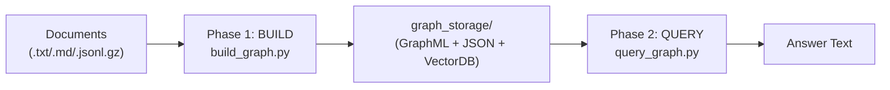
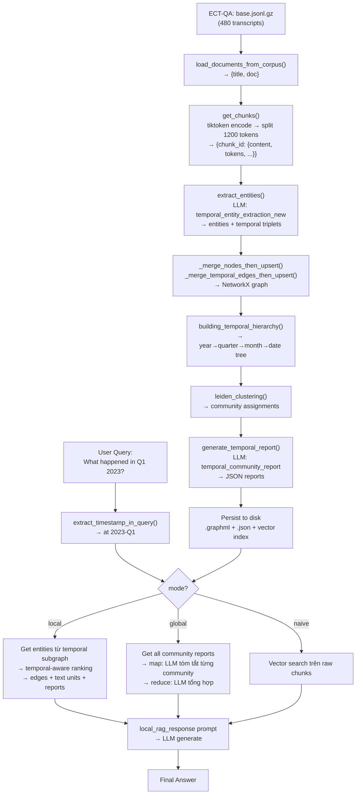

# Temporal-GraphRAG: Giải thích chi tiết toàn bộ hệ thống

---

## 1. Tổng quan kiến trúc

Temporal-GraphRAG (TG-RAG) là hệ thống RAG mô hình hóa tri thức dưới dạng **bi-level temporal graph** — đồ thị hai tầng có nhận thức thời gian. Điểm khác biệt cốt lõi so với RAG thông thường: mọi quan hệ đều được gắn timestamp, tạo thành **temporal quadruple** `(v₁, v₂, e, τ)` thay vì triplet thông thường.

```
v₁ = entity nguồn (non-temporal)
v₂ = entity đích (non-temporal)
e  = mô tả quan hệ
τ  = timestamp chuẩn hóa (ví dụ: "2024-Q1", "2024-01-15")
```

**Hai phase hoạt động:**



---

## 2. Cấu trúc thư mục & các thành phần

```bash
Temporal-GraphRAG/
├── build_graph.py              ← CLI entry point build
├── query_graph.py              ← CLI entry point query
├── tgrag/
│   ├── configs/
│   │   ├── config.yaml         ← Cấu hình LLM, chunking, query
│   │   └── prompts.yaml        ← Tất cả prompt LLM
│   └── src/
│       ├── temporal_graphrag.py    ← Class chính TemporalGraphRAG
│       ├── build.py                ← Factory function
│       ├── core/
│       │   ├── building.py         ← Logic build graph (extract, merge, hierarchy)
│       │   ├── querying.py         ← Logic query (local/global/naive)
│       │   ├── chunking.py         ← Chunking module
│       │   └── types.py            ← TemporalQuadruple, QueryParam, schemas
│       ├── storage/
│       │   ├── graph_networkx.py   ← NetworkX graph storage (GraphML)
│       │   ├── kv_json.py          ← JSON key-value storage
│       │   └── vector_nanovectordb.py ← Vector DB (nano-vectordb + hnswlib)
│       ├── temporal/
│       │   ├── normalization.py    ← Singleton TemporalNormalizer
│       │   └── normalizer.py       ← EnhancedTemporalNormalizer
│       └── llm/
│           ├── completion.py       ← LLM completion functions
│           └── embedding.py        ← Embedding functions
├── ect-qa/
│   ├── corpus/base.jsonl.gz    ← 480 earnings call transcripts (2020-2023)
│   └── questions/              ← local/global Q&A sets
```

---

## 3. PHASE 1: BUILD GRAPH — Chi tiết từng bước

### 3.1 Entry Point & Khởi tạo

Khi chạy `python build_graph.py`, flow bắt đầu:

```bash
build_graph.py::main()
  → create_temporal_graphrag_from_config(config_path, config_type="building")
    → ConfigLoader.get_config("building")
    → create_llm_function(provider, model)
    → create_embedding_function(embedding_provider)
    → TemporalGraphRAG(**params)
```

`create_temporal_graphrag_from_config()` trong `tgrag/src/build.py` đọc `config.yaml` section `building`, tạo LLM function và embedding function, rồi khởi tạo `TemporalGraphRAG`. 

Trong `__post_init__` của `TemporalGraphRAG`, các storage được khởi tạo:

| Storage instance | Namespace | Loại | Mục đích |
|---|---|---|---|
| `full_docs` | `full_docs` | JsonKVStorage | Lưu toàn bộ document gốc |
| `text_chunks` | `text_chunks` | JsonKVStorage | Lưu các chunk sau khi split |
| `community_reports` | `community_reports` | JsonKVStorage | Lưu báo cáo community |
| `chunk_entity_relation_graph` | `chunk_entity_relation` | NetworkXStorage (undirected) | Đồ thị entity-relation chính |
| `temporal_hierarchy_graph` | `temporal_hierarchy` | NetworkXStorage (directed) | Đồ thị phân cấp thời gian |
| `entities_vdb` | `entities` | NanoVectorDBStorage | Vector search cho entity |
| `relations_vdb` | `relations` | NanoVectorDBStorage | Vector search cho relation | [3](#0-2) 

---

### 3.2 Document Loading — 3 chiến lược

`build_graph.py` tự động detect loại input:

```
corpus_path là file .jsonl.gz  → load_documents_from_corpus()
corpus_path là file .txt/.md   → load_documents_from_txt_file()
corpus_path là directory       → load_documents_from_txt_directory()
```

**Output chuẩn hóa** (bất kể nguồn nào):
```python
[{"title": "Company 2023 Q1", "doc": "<full text content>"}]
```

Với ECT-QA corpus (`base.jsonl.gz`), mỗi dòng là JSON có `cleaned_content`, `company_name`, `year`, `quarter`. Hàm `prepare_documents_for_insertion()` chuyển đổi sang format chuẩn. 

---

### 3.3 Chunking — Chia nhỏ văn bản

Sau khi load documents, `graph_rag.insert(prepared_docs)` được gọi, bên trong `ainsert()`:

**Bước 1:** Hash document để dedup:
```python
new_doc_dicts = {
    compute_mdhash_id(c['doc'].strip(), prefix="doc-"): {"doc": ..., "title": ...}
    for c in dict_or_dicts
}
```

**Bước 2:** Gọi `get_chunks()`:

```bash
get_chunks(new_doc_dicts, chunk_func=chunking_by_token_size, ...)
  → tiktoken.encoding_for_model("gpt-4o").encode_batch(doc_contents)
  → chunking_by_token_size(tokens_list, doc_keys, tiktoken_model, ...)
  → return {chunk_id: {tokens, content, chunk_order_index, full_doc_id}}
```

**Hai chiến lược chunking:**

- **`chunking_by_token_size`** (mặc định): Chia theo số token cố định với overlap. Mỗi chunk = `max_token_size` tokens (default 1200), overlap = 100 tokens. Title được prepend vào mỗi chunk.

- **`chunking_by_separators`**: Dùng `SeparatorSplitter` — chia tại các ký tự tự nhiên (`\n\n`, `.`, `!`, `?`, v.v. từ `prompts.yaml`), sau đó merge lại để đảm bảo không vượt `max_token_size`. 

**Output của chunking:**
```python
{
  "chunk-<md5hash>": {
    "tokens": 1150,
    "content": "Apple Inc 2023 Q1\nRevenue grew 12% in Q1 2023...",
    "chunk_order_index": 0,
    "full_doc_id": "doc-<md5hash>"
  }
}
```

---

### 3.4 Entity & Relationship Extraction — Trái tim của Build Graph

Đây là bước quan trọng nhất. Hàm `extract_entities()` trong `building.py` xử lý từng chunk song song (async).

**Prompt được dùng:** `temporal_entity_extraction_new` từ `prompts.yaml`

**Context variables điền vào prompt:**
```python
context_base = {
    "tuple_delimiter": "<|>",
    "record_delimiter": "##",
    "completion_delimiter": "<|COMPLETE|>",
    "entity_types": "financial concept,business segment,event,company,person,product,location,organization",
    "timestamp_format": '{"year":"YYYY","quarter":"YYYY-QN","month":"YYYY-MM","date":"YYYY-MM-DD"}',
    "timestamp_types": "year,quarter,month,date"
}
```

**Prompt yêu cầu LLM làm 3 việc:**

1. **Bước 1 — Timestamp entities:** Tìm tất cả biểu thức thời gian, chuẩn hóa theo format `YYYY`, `YYYY-QN`, `YYYY-MM`, `YYYY-MM-DD`
2. **Bước 2 — Non-temporal entities:** Tìm company, person, event, v.v. (không lấy số liệu thuần túy)
3. **Bước 3 — Temporal triplets:** Tìm quan hệ dạng `(timestamp, source_entity, target_entity, description)` 

**Ví dụ output LLM cho đoạn text về Lehman Brothers:**
```json
("entity"<|>"2008-09-15"<|>"date"<|>"Date when Lehman Brothers filed for bankruptcy")##
("entity"<|>"Lehman Brothers"<|>"company"<|>"Global financial services firm...")##
("entity"<|>"Global Financial Crisis"<|>"event"<|>"Severe worldwide economic downturn...")##
("relationship"<|>"2008-09-15"<|>"Lehman Brothers"<|>"Global Financial Crisis"<|>"Lehman Brothers filed for bankruptcy, triggering the global financial crisis")<|COMPLETE|>
```

**Gleaning (lặp lại để tìm thêm):** Sau lần extract đầu, hệ thống gửi thêm prompt `entiti_continue_extraction` để LLM bổ sung entity bị bỏ sót. Số lần lặp = `entity_extract_max_gleaning` (default 1).

**Parse output LLM:**

Mỗi record được split bởi `##`, sau đó extract nội dung trong `(...)`, split bởi `<|>`:

```bash
Record: ("entity"<|>"2008-09-15"<|>"date"<|>"...")
  → record_attributes = ["entity", "2008-09-15", "date", "..."]
  → _handle_single_entity_extraction() → {entity_name, entity_type, description, source_id}

Record: ("relationship"<|>"2008-09-15"<|>"Lehman Brothers"<|>"Global Financial Crisis"<|>"...")
  → record_attributes = ["relationship", "2008-09-15", "Lehman Brothers", "Global Financial Crisis", "..."]
  → _handle_single_temporal_relationship_extraction() → {timestamp, src_id, tgt_id, description, temporal_level}
```

**Temporal Normalization:** Mỗi timestamp được đưa qua `EnhancedTemporalNormalizer` (singleton) để chuẩn hóa. Ví dụ: `"Q1 2023"` → `"2023-Q1"`, `"first quarter of 2023"` → `"2023-Q1"`. 

---

### 3.5 Merge & Upsert vào Graph

Sau khi extract từ tất cả chunks, kết quả được merge:

**Merge nodes (`_merge_nodes_then_upsert`):**
- Nếu entity đã tồn tại trong graph: gộp descriptions (join bằng `<SEP>`), chọn entity_type phổ biến nhất (majority vote), gộp source_ids
- Nếu description quá dài (> `entity_summary_to_max_tokens` = 500 tokens): gọi LLM với prompt `summarize_entity_descriptions` để tóm tắt
- Upsert vào `chunk_entity_relation_graph` (NetworkX undirected)

**Merge temporal edges (`_merge_temporal_edges_then_upsert`):**

Đây là điểm đặc biệt của TG-RAG. Mỗi edge giữa `(src, tgt)` lưu description dưới dạng **dict keyed by timestamp**:
```python
edge_data = {
    "description": {"2023-Q1": "Revenue grew 12%", "2023-Q2": "Revenue declined 5%"},
    "source_id": {"2023-Q1": "chunk-abc", "2023-Q2": "chunk-def"},
    "order": 1
}
```

Ngoài ra, timestamp node cũng được kết nối trực tiếp với cả `src` và `tgt`:
```bash
timestamp_node ─── src_entity
timestamp_node ─── tgt_entity
src_entity ─────── tgt_entity  (với description dict)
``` 

**Temporal Quadruples:** Sau merge, hàm `_convert_to_temporal_quadruples()` chuyển đổi sang cấu trúc `TemporalQuadruple(v1, v2, e, τ)` — đây là cấu trúc chính thức theo paper. 

---

### 3.6 Building Temporal Hierarchy

Sau entity extraction, `building_temporal_hierarchy()` xây dựng đồ thị phân cấp thời gian (directed graph):

```bash
2023 (year, level=0)
  └── 2023-Q1 (quarter, level=1)
        └── 2023-01 (month, level=2)
              └── 2023-01-15 (date, level=3)
```

Phân cấp được định nghĩa trong `prompts.yaml`:
```yaml
temporal_hierarchy_level:
  year: 0
  quarter: 1
  month: 2
  week: 2
  season: 2
  date: 3
  UNKNOWN: 3
``` [12](#0-11) 

Mỗi node trong temporal hierarchy graph có thuộc tính `instantiation=True` nếu nó thực sự xuất hiện trong data. Khi query, hệ thống traverse hierarchy này để tìm entities liên quan đến một khoảng thời gian.

---

### 3.7 Community Detection & Report Generation

Sau khi build graph, nếu `enable_community_summary=True`:

**Community Detection:** Dùng thuật toán **Leiden clustering** (từ `graspologic`) trên `chunk_entity_relation_graph`:
```python
community_mapping = hierarchical_leiden(
    graph,
    max_cluster_size=10,  # max_graph_cluster_size
    random_seed=0xDEADBEEF
)
```

Mỗi node được gán `clusters` attribute dạng JSON: `[{"level": 0, "cluster": 5}, {"level": 1, "cluster": 12}]`

**Community Report Generation:** Với mỗi community, LLM được gọi với prompt `temporal_community_report` để tạo báo cáo JSON:
```json
{
  "title": "March 2024 Housing Activism...",
  "summary": "...",
  "rating": 6.9,
  "rating_explanation": "...",
  "findings": [{"summary": "...", "explanation": "..."}]
}
```

---

### 3.8 Persist to Disk

Sau khi build xong, `_insert_done()` được gọi, trigger `index_done_callback()` trên tất cả storage:

- **NetworkXStorage** → ghi file `graph_chunk_entity_relation.graphml` và `graph_temporal_hierarchy.graphml`
- **JsonKVStorage** → ghi `full_docs.json`, `text_chunks.json`, `community_reports.json`, `llm_response_cache.json`
- **NanoVectorDBStorage** → ghi vector index files cho entities, relations 

**Output cuối cùng trong `graph_storage/`:**
```bash
graph_storage/
├── graph_chunk_entity_relation.graphml   ← Entity-relation graph
├── graph_temporal_hierarchy.graphml      ← Temporal hierarchy graph
├── full_docs.json                        ← Documents gốc
├── text_chunks.json                      ← Chunks đã split
├── community_reports.json                ← Community reports
├── llm_response_cache.json               ← Cache LLM responses
├── entities.json + entities.index        ← Vector DB entities
├── entities_new.json + entities_new.index
└── relations.json + relations.index      ← Vector DB relations
```

---

## 4. PHASE 2: QUERY GRAPH — Chi tiết từng mode

### 4.1 Entry Point & Khởi tạo Query

```
query_graph.py::main()
  → create_temporal_graphrag_from_config(config_type="querying")
  → QueryParam(mode, local_max_token_for_text_unit=4000, ...)
  → graph_rag.query(question, param=query_param)
    → loop.run_until_complete(aquery(query, param))
```

Đầu tiên, `aquery()` luôn gọi `get_temporal_hierarchy()` để load temporal hierarchy từ graph:

```python
temporal_hierarchy = await self.get_temporal_hierarchy()
# → temporal_hierarchy_graph.temporal_hierarchy(chunk_entity_relation_graph)
# → dict[timestamp_str, SingleTemporalSchema]
```

`SingleTemporalSchema` chứa: `level`, `title`, `temporal_edges`, `nodes` (entities liên quan), `chunk_ids`, `sub_communities`. 

---

### 4.2 Query Processing — Temporal Extraction

Trước khi retrieve, hệ thống extract temporal context từ câu hỏi bằng 2 LLM calls:

**Call 1 — `extract_timestamp_in_query`:**

Prompt ví dụ cho câu hỏi `"What happened in Q1 2023?"`:
```
Output: ("entity"<|>"at"<|>"2023-Q1"<|>"quarter")<|COMPLETE|>
```

Cho câu hỏi `"What changed between Q2 and Q4 2022?"`:
```
Output: ("entity"<|>"between"<|>"2022-Q2"<|>"2022-Q4"<|>"quarter")<|COMPLETE|>
```

Temporal logic có thể là: `at`, `before`, `after`, `between`. 

**Call 2 — `extract_temporal_hierarchy`:**

Xác định granularity của câu hỏi: `year`, `quarter`, `month`, `date`.

Kết quả: `aligned_timestamp_in_query` = list các timestamp đã chuẩn hóa, `temporal_granularity` = granularity level.

---

### 4.3 LOCAL MODE — Retrieval chi tiết

Local mode dùng cho câu hỏi về **sự kiện cụ thể** (specific facts).

**Flow:**

```
local_query(query, ...)
  Step 1: Extract timestamps từ query
  Step 2: Get seed nodes (entities hoặc relations)
  Step 3: Get temporal subgraph entities
  Step 4: Temporal-aware ranking
  Step 5: Get edges, text units, community reports
  Step 6: Build context table
  Step 7: LLM generate answer
```

**Step 2 — Seed nodes:**

Theo `seed_node_method` trong config:
- `"relations"` (default): Dùng `relations_vdb.query(query, top_k=50)` — vector search trên relation descriptions
- `"entities"`: Dùng `entities_vdb.query(query, top_k=50)` — vector search trên entity names+descriptions

**Step 3 — Temporal subgraph:**

```python
entities = await _get_entities_from_temporal_subgraph(timestamps, temporal_hierarchy)
```

Với mỗi timestamp trong query, tìm trong `temporal_hierarchy` dict → lấy `nodes` (entities liên quan đến timestamp đó). Nếu không đủ, mở rộng ra `_get_broader_temporal_entities()` (tìm theo năm).

**Step 4 — Temporal-aware ranking:**

Mỗi entity được score bởi `calculate_temporal_aware_rank()` với 4 factors:

```bash
final_rank = (
    temporal_alignment * 0.4 +   # Entity có timestamp khớp với query không?
    temporal_proximity * 0.3 +   # Timestamp entity gần query timestamp bao nhiêu?
    normalized_degree * 0.2 +    # Degree trong graph (connectivity)
    query_relevance * 0.1        # Keyword/semantic match với query
)
```

**Step 5 — Get context:**

- **Edges:** `_find_most_related_temporal_edges_from_entities()` → lấy edges có timestamp khớp, sort theo temporal rank, truncate theo `local_max_token_for_local_context` (6000 tokens, split 20% entities / 80% relations)
- **Text units:** `_find_most_related_temporal_text_unit_from_entities()` → lấy chunks gốc từ `source_id` của entities, truncate theo `local_max_token_for_text_unit` (4000 tokens)
- **Community reports:** `_find_most_related_temporal_community_from_entities()` → lấy reports của communities chứa entities, truncate theo `local_max_token_for_community_report` (2000 tokens)

**Step 6 — Build context table:**

Context được format thành bảng CSV:
```bash
-----Entities-----
id,entity,type,description
1,APPLE INC,company,"Apple Inc is a technology company..."
...

-----Relationships-----
id,source,target,description
1,APPLE INC,IPHONE,"description in 2023-Q1, Revenue from iPhone grew 15%..."
...

-----Sources-----
id,content
1,"Apple Inc 2023 Q1\nRevenue grew..."
...

-----Reports-----
id,report
1,"Community: Apple Products..."
```

**Step 7 — LLM generate:**

Prompt `local_rag_response` với `{context_data}` = bảng trên, `{response_type}` = "Multiple Paragraphs".

**Output của local mode:** `(response_text, retrieval_detail_dict)` 

---

### 4.4 GLOBAL MODE — Retrieval chi tiết

Global mode dùng cho câu hỏi về **xu hướng, tổng quan** (trends, summaries).

**Flow:**

```bash
global_query(query, ...)
  Step 1: Extract timestamps từ query
  Step 2: Get all community reports từ temporal hierarchy
  Step 3: Filter & sort communities theo temporal relevance
  Step 4: Map phase — LLM tóm tắt từng community
  Step 5: Reduce phase — LLM tổng hợp tất cả
```

**Step 2-3:** Lấy tất cả community reports từ `community_reports` storage, filter theo temporal relevance, sort theo rating, truncate theo `global_max_token_for_community_report` (16384 tokens).

**Step 4 — Map:** Với mỗi community report, gọi LLM với prompt `global_map_rag_points`:
```json
{
  "points": [
    {"description": "Apple's revenue grew 15% in Q1 2023", "score": 85},
    {"description": "iPhone sales declined in Q2 2023", "score": 70}
  ]
}
```

**Step 5 — Reduce:** Tổng hợp tất cả points từ map phase, sort theo score (descending), gọi LLM với prompt `global_reduce_rag_response` để tạo câu trả lời cuối cùng dạng markdown. 

**Output của global mode:** `response_text` (markdown)

---

### 4.5 NAIVE MODE — Baseline

Naive mode là RAG đơn giản, không dùng graph.

```bash
naive_query(query, chunks_vdb, text_chunks, ...)
  → chunks_vdb.query(query, top_k=...)  ← vector search trên raw chunks
  → truncate theo naive_max_token_for_text_unit (12000 tokens)
  → LLM với prompt naive_rag_response
```

Chỉ hoạt động khi `enable_naive_rag=True` trong config. 

---

## 5. Cấu hình Config — Chi tiết

### 5.1 `tgrag/configs/config.yaml`

```yaml
building:
  corpus_path: "./ECT_data/"        # Đường dẫn corpus
  working_dir: "./graph_output"     # Thư mục lưu graph
  provider: "gemini"                # LLM provider: openai/azure/bedrock/gemini/ollama
  model: "gemini-2.5-flash-lite"    # Model name
  embedding_provider: "openai"      # Provider cho embedding (gemini không hỗ trợ embedding)
  chunk_size: 1200                  # Max tokens/chunk
  chunk_overlap: 100                # Overlap tokens giữa chunks
  enable_community_summary: true    # Có tạo community reports không
  enable_incremental: false         # Incremental update mode
  preserve_communities: false       # Giữ community cũ khi incremental

querying:
  working_dir: "./graph_output"     # Phải trỏ đúng thư mục đã build
  provider: "gemini"
  model: "gemini-2.5-flash"
  mode: "local"                     # local/global/naive
  top_k: 50                         # Số entities retrieve
  seed_node_method: "relations"     # entities hoặc relations
  enable_subgraph: true
  local_max_token_for_text_unit: 4000
  local_max_token_for_local_context: 6000
  local_max_token_for_community_report: 2000
  global_max_token_for_community_report: 16384
  naive_max_token_for_text_unit: 12000
```

### 5.2 `tgrag/configs/prompts.yaml` — Các key quan trọng

| Key | Mục đích |
|---|---|
| `entity_types` | Danh sách loại entity LLM sẽ extract |
| `temporal_hierarchy` | `[year, quarter, month, date]` |
| `temporal_hierarchy_level` | Mapping level số cho mỗi granularity |
| `timestamp_format` | Format chuẩn cho từng granularity |
| `temporal_entity_extraction_new` | Prompt chính cho entity extraction |
| `extract_timestamp_in_query` | Prompt extract timestamp từ query |
| `extract_temporal_hierarchy` | Prompt xác định granularity của query |
| `local_rag_response` | Prompt generate answer (local mode) |
| `global_map_rag_points` | Prompt map phase (global mode) |
| `global_reduce_rag_response` | Prompt reduce phase (global mode) |
| `temporal_community_report` | Prompt tạo community report |
| `summarize_entity_descriptions` | Prompt tóm tắt entity description dài |

---

## 6. ECT-QA Dataset — Input/Output thực tế

**Input từ ECT-QA:**
```json
{
  "company_name": "Apple Inc",
  "year": "2023",
  "quarter": "Q1",
  "cleaned_content": "Good morning, everyone. Thank you for joining Apple's Q1 2023 earnings call..."
}
```

**Sau `prepare_documents_for_insertion()`:**
```python
{"title": "Apple Inc 2023 Q1", "doc": "Good morning, everyone..."}
```

**Sau chunking (chunk_size=1200):**
```python
{"chunk-abc123": {"tokens": 1150, "content": "Apple Inc 2023 Q1\nGood morning...", "chunk_order_index": 0, "full_doc_id": "doc-xyz"}}
```

**Sau entity extraction (LLM output parsed):**
```
Entities: 2023-Q1 (quarter), Apple Inc (company), iPhone (product), Tim Cook (person)
Temporal edges: (2023-Q1, Apple Inc, iPhone, "iPhone revenue grew 15% in Q1 2023")
```

**Sau build graph — Query "What was Apple's revenue in Q1 2023?":**
1. Extract timestamp: `at 2023-Q1`
2. Get entities từ temporal subgraph của `2023-Q1`: `[Apple Inc, iPhone, Tim Cook, ...]`
3. Rank theo temporal alignment
4. Get edges có `description["2023-Q1"]`
5. Get text chunks từ source_id
6. LLM generate: *"In Q1 2023, Apple Inc reported iPhone revenue growth of 15%..."*

---

## 7. Setup & Chạy dự án

### Bước 1: Clone & cài dependencies

```bash
git clone https://github.com/hanjiale/Temporal-GraphRAG.git
cd Temporal-GraphRAG

# Tạo virtual environment (Python 3.12+ required)
python -m venv venv
source venv/bin/activate  # Linux/Mac
# hoặc: venv\Scripts\activate  # Windows

pip install -r requirements.txt
```  

### Bước 2: Cấu hình API keys

```bash
cp .env.example .env
```

Chỉnh sửa `.env` theo provider bạn dùng:

```bash
# Nếu dùng Gemini (như config mặc định):
GOOGLE_API_KEY="your-google-api-key"
OPENAI_API_KEY="your-openai-api-key"   # Bắt buộc cho embedding (OpenAI)

# Nếu dùng OpenAI hoàn toàn:
OPENAI_API_KEY="your-openai-api-key"

# Nếu dùng Ollama (local, không cần key):
# OLLAMA_BASE_URL="http://localhost:11434"
```

**Lưu ý quan trọng:** Dù dùng Gemini cho LLM, embedding mặc định vẫn dùng OpenAI (`text-embedding-ada-002`). Bạn **bắt buộc** phải có `OPENAI_API_KEY` cho embedding trừ khi đổi `embedding_provider` sang `bedrock` hoặc `azure`. 

### Bước 3: Chỉnh `config.yaml`

```yaml
# tgrag/configs/config.yaml
building:
  provider: "gemini"              # Đổi thành "openai" nếu muốn
  model: "gemini-2.5-flash-lite"  # Hoặc "gpt-4o-mini" cho openai
  embedding_provider: "openai"    # Giữ openai cho embedding
  working_dir: "./graph_output"
  chunk_size: 1200
  enable_community_summary: true

querying:
  working_dir: "./graph_output"   # Phải khớp với building.working_dir
  provider: "gemini"
  model: "gemini-2.5-flash"
  mode: "local"                   # Đổi thành "global" cho trend questions
```

### Bước 4: Build Graph

```bash
# Build từ ECT-QA corpus (3 documents mặc định)
python build_graph.py --output_dir ./graph_output --num_docs 3

# Build từ file text của bạn
python build_graph.py --output_dir ./graph_output --corpus_path ./my_document.txt

# Build từ thư mục
python build_graph.py --output_dir ./graph_output --corpus_path ./my_docs/

# Override chunk size
python build_graph.py --output_dir ./graph_output --num_docs 5 --chunk_size 800

# Debug mode (verbose logging)
TG_RAG_DEBUG=true python build_graph.py --output_dir ./graph_output --num_docs 3
``` [26](#0-25) 

### Bước 5: Query Graph

```bash
# Local mode (specific facts)
python query_graph.py \
  --question "What was Apple's revenue in Q1 2023?" \
  --working_dir ./graph_output \
  --mode local

# Global mode (trends/summaries)
python query_graph.py \
  --question "How did tech companies perform across 2022-2023?" \
  --working_dir ./graph_output \
  --mode global

# Dùng config mặc định (mode từ config.yaml)
python query_graph.py --question "What happened in Q2 2022?"
``` [27](#0-26) 

### Bước 6 (Optional): Python API

```python
from tgrag import create_temporal_graphrag_from_config
from tgrag.src.core.types import QueryParam

# Build
graph = create_temporal_graphrag_from_config(
    config_path="tgrag/configs/config.yaml",
    config_type="building"
)
graph.insert([{"title": "Doc 1", "doc": "Content..."}])

# Query
graph_q = create_temporal_graphrag_from_config(
    config_path="tgrag/configs/config.yaml",
    config_type="querying"
)
param = QueryParam(mode="local", top_k=50)
response, details = graph_q.query("What happened in Q1 2023?", param=param)
print(response)
```

---

## 8. Tóm tắt Flow End-to-End



### Citations

**File:** tgrag/src/temporal_graphrag.py (L63-70)
```python
@dataclass
class TemporalGraphRAG:
    """Main class for Temporal GraphRAG operations.
    
    This class provides methods for:
    - Indexing documents and building temporal knowledge graphs
    - Querying graphs in local, global, or naive RAG modes
    
```

**File:** tgrag/src/temporal_graphrag.py (L220-290)
```python
        self.full_docs = self.key_string_value_json_storage_cls(
            namespace="full_docs", global_config=asdict(self)
        )

        self.text_chunks = self.key_string_value_json_storage_cls(
            namespace="text_chunks", global_config=asdict(self)
        )

        self.llm_response_cache = (
            self.key_string_value_json_storage_cls(
                namespace="llm_response_cache", global_config=asdict(self)
            )
            if self.enable_llm_cache
            else None
        )

        self.community_reports = self.key_string_value_json_storage_cls(
            namespace="community_reports", global_config=asdict(self)
        )
        self.chunk_entity_relation_graph = self.graph_storage_cls(
            namespace="chunk_entity_relation", global_config=asdict(self), is_directed=False
        )
        self.temporal_hierarchy_graph = self.graph_storage_cls(
            namespace="temporal_hierarchy", global_config=asdict(self), is_directed=True
        )

        self._temporal_hierarchy = None

        self.embedding_func = limit_async_func_call(self.embedding_func_max_async)(
            self.embedding_func
        )
        self.entities_vdb = (
            self.vector_db_storage_cls(
                namespace="entities",
                global_config=asdict(self),
                embedding_func=self.embedding_func,
                meta_fields={"entity_name"},
            )
            if self.enable_local
            else None
        )
        self.entities_vdb_new = (
            self.vector_db_storage_cls(
                namespace="entities_new",
                global_config=asdict(self),
                embedding_func=self.embedding_func,
                meta_fields={"entity_name"},
            )
            if self.enable_local
            else None
        )
        self.relations_vdb = (
            self.vector_db_storage_cls(
                namespace="relations",
                global_config=asdict(self),
                embedding_func=self.embedding_func,
                meta_fields={"entity_name", "content"},
            )
            if self.enable_local
            else None
        )
        self.chunks_vdb = (
            self.vector_db_storage_cls(
                namespace="chunks",
                global_config=asdict(self),
                embedding_func=self.embedding_func,
            )
            if self.enable_naive_rag
            else None
        )

```

**File:** tgrag/src/temporal_graphrag.py (L329-384)
```python
    async def aquery(self, query: str, param: QueryParam = QueryParam()):
        """Query the knowledge graph asynchronously.
        
        Args:
            query: Query string
            param: Query parameters
            
        Returns:
            Query response (and retrieval details for local mode)
        """
        if param.mode == "local" and not self.enable_local:
            raise ValueError("enable_local is False, cannot query in local mode")
        if param.mode == "naive" and not self.enable_naive_rag:
            raise ValueError("enable_naive_rag is False, cannot query in naive mode")
        temporal_hierarchy = await self.get_temporal_hierarchy()
        if param.mode == "local":
            global_config_dict = asdict(self)
            # Add full_docs to global_config so it can be accessed in local_query
            global_config_dict["full_docs"] = self.full_docs
            response, retrieval_detail = await local_query(
                query,
                self.chunk_entity_relation_graph,
                self.entities_vdb,
                self.relations_vdb,
                self.community_reports,
                self.text_chunks,
                temporal_hierarchy,
                param,
                global_config_dict,
            )
            await self._query_done()
            return response, retrieval_detail
        elif param.mode == "global":
            response = await global_query(
                query,
                self.chunk_entity_relation_graph,
                self.entities_vdb,
                self.relations_vdb,
                self.community_reports,
                self.text_chunks,
                temporal_hierarchy,
                param,
                asdict(self),
            )
        elif param.mode == "naive":
            response = await naive_query(
                query,
                self.chunks_vdb,
                self.text_chunks,
                param,
                asdict(self),
            )
        else:
            raise ValueError(f"Unknown mode {param.mode}")
        await self._query_done()
        return response
```

**File:** tgrag/src/build.py (L100-106)
```python
def create_temporal_graphrag_from_config(
    config_path: str = "tgrag/configs/config.yaml",
    config_type: str = "building",
    override_config: Optional[Dict[str, Any]] = None,
    api_key: Optional[str] = None,
    base_url: Optional[str] = None,
) -> TemporalGraphRAG:
```

**File:** tgrag/src/build.py (L188-205)
```python
    # Get embedding provider (defaults to LLM provider, but can be overridden)
    embedding_provider = config.get('embedding_provider', provider)
    # If embedding provider is gemini, default to openai (gemini embeddings not supported)
    if embedding_provider == "gemini":
        embedding_provider = "openai"
    
    embedding_base_url = base_url
    
    if embedding_provider == "openai":
        # Always use OpenAI API key for OpenAI embeddings
        embedding_api_key = get_api_key_for_provider("openai")
        if not embedding_api_key:
            raise ValueError(
                "OpenAI API key not found for embeddings. "
                "Please set OPENAI_API_KEY environment variable."
            )
        if not embedding_base_url:
            embedding_base_url = os.getenv('OPENAI_BASE_URL')
```

**File:** build_graph.py (L202-253)
```python
def prepare_documents_for_insertion(documents: List[Dict]) -> List[Dict]:
    """
    Convert documents to the format expected by TemporalGraphRAG.insert().
    Automatically detects the document format and processes accordingly.
    
    Args:
        documents: List of documents (either from corpus or txt files)
        
    Returns:
        List of documents in format {"title": str, "doc": str}
    """
    if not documents:
        return []
    
    # Auto-detect format: check if first document has 'title' and 'doc' keys (text format)
    # or 'cleaned_content'/'raw_content' keys (corpus format)
    first_doc = documents[0]
    is_corpus_format = 'cleaned_content' in first_doc or 'raw_content' in first_doc
    
    if not is_corpus_format:
        # Already in the correct format (from txt files)
        # Just validate and return
        for doc in documents:
            if 'title' not in doc or 'doc' not in doc:
                raise ValueError(f"Document missing required keys 'title' or 'doc': {list(doc.keys())}")
        return documents
    
    # Process corpus format documents
    prepared_docs = []
    for doc in documents:
        content = doc.get('cleaned_content', doc.get('raw_content', ''))
        if not content:
            print(f"⚠️  Warning: Document {doc.get('company_name', 'Unknown')} has no content, skipping")
            continue
        
        # Create a descriptive title
        company = doc.get('company_name', 'Unknown')
        year = doc.get('year', '')
        quarter = doc.get('quarter', '')
        if year and quarter:
            title = f"{company} {year} Q{quarter.upper()}"
        elif year:
            title = f"{company} {year}"
        else:
            title = company
        
        prepared_docs.append({
            'title': title,
            'doc': content
        })
    
    return prepared_docs
```

**File:** build_graph.py (L258-300)
```python
def main():
    """Main function to build the graph."""
    parser = argparse.ArgumentParser(
        description="Build Temporal GraphRAG knowledge graph from documents (ECT-QA corpus, text files, or directories) using config.yaml",
        formatter_class=argparse.ArgumentDefaultsHelpFormatter
    )
    parser.add_argument(
        '--config',
        type=str,
        default='tgrag/configs/config.yaml',
        help='Path to configuration file (default: tgrag/configs/config.yaml)'
    )
    parser.add_argument(
        '--output_dir',
        type=str,
        default=None,
        help='Output directory for graph storage (overrides config.working_dir if set)'
    )
    parser.add_argument(
        '--num_docs',
        type=int,
        default=3,
        help='Number of documents to process from the corpus'
    )
    parser.add_argument(
        '--corpus_path',
        type=str,
        default='ect-qa/corpus/base.jsonl.gz',
        help='Path to the corpus file (.jsonl.gz), text file (.txt/.md/.rst/.text/.log), or directory of text files (overrides config.corpus_path if set)'
    )
    parser.add_argument(
        '--chunk_size',
        type=int,
        default=None,
        help='Override chunk size from config'
    )
    parser.add_argument(
        '--chunk_overlap',
        type=int,
        default=None,
        help='Override chunk overlap from config'
    )
    
```

**File:** tgrag/src/core/chunking.py (L131-202)
```python
def chunking_by_token_size(
    tokens_list: List[List[int]],
    doc_keys: List[str],
    tiktoken_model: tiktoken.Encoding,
    title_tokens_list: Optional[List[List[int]]] = None,
    overlap_token_size: int = 128,
    max_token_size: int = 1024,
) -> List[Dict[str, Any]]:
    """
    Chunk documents by fixed token size with optional overlap.
    
    This function splits documents into chunks of approximately max_token_size tokens,
    with optional overlap between chunks. Supports optional title tokens that are
    prepended to each chunk.
    
    Args:
        tokens_list: List of token sequences, one per document
        doc_keys: List of document identifiers
        tiktoken_model: Tiktoken encoding model for decoding
        title_tokens_list: Optional list of title token sequences
        overlap_token_size: Number of tokens to overlap between chunks
        max_token_size: Maximum tokens per chunk
        
    Returns:
        List of chunk dictionaries with keys: tokens, content, chunk_order_index, full_doc_id
        
    Example:
        >>> import tiktoken
        >>> encoder = tiktoken.encoding_for_model("gpt-4o")
        >>> tokens = [encoder.encode("This is a long document...")]
        >>> chunks = chunking_by_token_size(tokens, ["doc1"], encoder, max_token_size=100)
    """
    if not tokens_list:
        return []
    
    if len(tokens_list) != len(doc_keys):
        raise ValueError(f"tokens_list length ({len(tokens_list)}) must match doc_keys length ({len(doc_keys)})")
    
    results = []
    if not title_tokens_list:
        title_tokens_list = [[] for _ in tokens_list]
    
    if len(title_tokens_list) != len(tokens_list):
        raise ValueError(f"title_tokens_list length ({len(title_tokens_list)}) must match tokens_list length ({len(tokens_list)})")
    
    for index, (tokens, title_tokens) in enumerate(zip(tokens_list, title_tokens_list)):
        chunk_token = []
        lengths = []
        max_token_size_minus_title = max_token_size - len(title_tokens)
        
        if max_token_size_minus_title <= 0:
            raise ValueError(f"max_token_size ({max_token_size}) must be greater than title length ({len(title_tokens)})")
        
        step_size = max(1, max_token_size_minus_title - overlap_token_size)
        for start in range(0, len(tokens), step_size):
            chunk = title_tokens + tokens[start: start + max_token_size_minus_title]
            chunk_token.append(chunk)
            lengths.append(min(max_token_size, len(tokens) - start + len(title_tokens)))

        # Decode batch for efficiency
        chunk_token = tiktoken_model.decode_batch(chunk_token)
        for i, chunk in enumerate(chunk_token):
            results.append(
                {
                    "tokens": lengths[i],
                    "content": chunk.strip(),
                    "chunk_order_index": i,
                    "full_doc_id": doc_keys[index],
                }
            )

    return results
```

**File:** tgrag/configs/prompts.yaml (L14-46)
```yaml
  # Default entity types for extraction
  entity_types:
    - "financial concept"
    - "business segment"
    - "event"
    - "company"
    - "person"
    - "product"
    - "location"
    - "organization"
  
  # Temporal hierarchy configuration
  temporal_hierarchy:
    - "year"
    - "quarter"
    - "month"
    - "date"
  
  temporal_hierarchy_level:
    year: 0
    quarter: 1
    month: 2
    week: 2
    season: 2
    date: 3
    UNKNOWN: 3
  
  timestamp_format:
    year: "YYYY"
    quarter: "YYYY-QN"
    month: "YYYY-MM"
    date: "YYYY-MM-DD"
  
```

**File:** tgrag/configs/prompts.yaml (L139-195)
```yaml
  temporal_entity_extraction_new: |
    -Goal-
    Given a text document that is potentially relevant to this activity and a list of entity types, as well as their relationships..

    -Steps-
    1. Identify all timestamp entities, identify all time expressions that indicate specific periods, financial quarters, or relevant time references. Each timestamp entity should follow this format:
    - entity_name: standard format of the timestamp entity identified in context, following {timestamp_format}
    - entity_type: {timestamp_types}
    - entity_description: Comprehensive description of the entity's attributes and activities
    Format each timestamp entity as ("entity"{tuple_delimiter}<entity_name>{tuple_delimiter}timestamp)

    2. Identify all remaining important entities involved in the event. Focus on extracting entities that play a meaningful conceptual units involved in the timestamped events,such as companies, organizations, people, governments, or locations directly involved in the event. without extracting standalone numeric values or quantities as entities.
    For each identified entity, extract the following information:
    - entity_name: Name of the entity, capitalized
    - entity_type: One of the following types: [{entity_types}]
    - entity_description: A comprehensive description of the entity's role and attributes as related to the event.
    Format each entity as ("entity"{tuple_delimiter}<entity_name>{tuple_delimiter}<entity_type>{tuple_delimiter}<entity_description>

    3. From the entities identified in step 1 and 2, identify all temporal triplets of (timestamp_entity, source_entity, target_entity) that are *clearly related* to others at a *specific timestamp*.
    Extract relationships where a timestamp entity is involved. Each relationship should include:
    - timestamp_entity: standard entity name of the timestamp entity, as identified in step 1
    - source_entity: name of the source entity, as identified in step 2
    - target_entity: name of the target entity, as identified in step 2
    - description: describe the comprehensive information refer to the source_entity and target_entity
     Format each temporal triplet as ("relationship"{tuple_delimiter}<timestamp_entity>{tuple_delimiter}<source_entity>{tuple_delimiter}<target_entity>{tuple_delimiter}<description>)

    4. Return output in English as a single list of all the entities and relationships identified in steps 1 and 2. Use **{record_delimiter}** as the list delimiter.

    5. When finished, output {completion_delimiter}

    ######################
    -Examples-
    ######################
    Example 1:

    Entity_types: [person, event, company, organization, government]
    Text:
    On September 15, 2008, Lehman Brothers filed for bankruptcy, marking the largest collapse in U.S. financial history. 
    The event triggered a global financial crisis, causing stock markets to plummet. 
    By September 18, 2008, the U.S. Federal Reserve announced an $85 billion bailout for AIG to prevent further economic fallout. 
    Investors faced heavy losses, and governments worldwide scrambled to implement emergency measures.
    ################
    Output:
    ("entity"{tuple_delimiter}"2008-09-15"{tuple_delimiter}"date"{tuple_delimiter}"The date when Lehman Brothers filed for bankruptcy, triggering a global financial crisis."){record_delimiter}  
    ("entity"{tuple_delimiter}"2008-09-18"{tuple_delimiter}"date"{tuple_delimiter}"The date when the U.S. Federal Reserve announced an $85 billion bailout for AIG."){record_delimiter}  
    ("entity"{tuple_delimiter}"Lehman Brothers"{tuple_delimiter}"person"{tuple_delimiter}"A global financial services firm that declared bankruptcy in 2008, marking the largest corporate failure in U.S. history."){record_delimiter}   
    ("entity"{tuple_delimiter}"Global Financial Crisis"{tuple_delimiter}"event"{tuple_delimiter}"A severe worldwide economic downturn triggered by the collapse of Lehman Brothers in 2008."){record_delimiter}  
    ("entity"{tuple_delimiter}"U.S. Federal Reserve"{tuple_delimiter}"government"{tuple_delimiter}"The central banking system of the United States, responsible for implementing monetary policies to stabilize the economy."){record_delimiter}  
    ("event"{tuple_delimiter}"2008-09-15"{tuple_delimiter}"Lehman Brothers"{tuple_delimiter}"Global Financial Crisis"{tuple_delimiter}"Lehman Brothers filed for bankruptcy, triggering the largest financial collapse in U.S. history and sparking a global financial crisis."){record_delimiter}
    ("event"{tuple_delimiter}"2008-09-18"{tuple_delimiter}"U.S. Federal Reserve"{tuple_delimiter}"AIG"{tuple_delimiter}"To contain the spreading financial crisis, the U.S. Federal Reserve provided an $85 billion bailout to AIG to prevent further systemic collapse."){completion_delimiter}
    #############################
    -Real Data-
    ######################
    Entity_types: {entity_types}
    Text: {input_text}
    ######################
    Output:
```

**File:** tgrag/configs/prompts.yaml (L268-311)
```yaml
  extract_timestamp_in_query: |
    -Goal-
    Given a user query that is potentially ask a time-related question, identify the timestamp entities in the query, follows the structure:
    - entity_name: standard format of the timestamp entity identified in context, following {timestamp_format}
    - entity_type: {timestamp_types}
    - temporal_logic: one of <at, before, after, between>
    If temporal_logic is <between>, format a pair of timestamp entities as ("entity"{tuple_delimiter}<between>{tuple_delimiter}<entity_name>{tuple_delimiter}<entity_name>{tuple_delimiter}<entity_type>)
    If temporal_logic is <at, before, after>, format a pair of timestamp entities as ("entity"{tuple_delimiter}<temporal_logic>{tuple_delimiter}<entity_name>{tuple_delimiter}<entity_type>)

    When finished, output {completion_delimiter}

    ######################
    -Examples-
    ######################
    Example 1:
    User Query:
    Who was the CEO of DXC Technology on January 1, 2022?
    ################
    Output:
    ("entity"{tuple_delimiter}"at"{tuple_delimiter}"2022-01-01"{tuple_delimiter}"date"){completion_delimiter}
    #############################
    Example 2:
    User Query:
    What strategic decisions were made between Q2 and Q4 2022?
    #############
    Output:
    ("entity"{tuple_delimiter}"between"{tuple_delimiter}"2022-Q2"{tuple_delimiter}"2022-Q4"{tuple_delimiter}"quarter"){completion_delimiter}

    #############################
    Example 3:
    User Query:
    What has changed in Aon's leadership after the NFP acquisition in 2023?
    #############
    Output:
    ("entity"{tuple_delimiter}"after"{tuple_delimiter}"2022"{tuple_delimiter}"year"){completion_delimiter}
    #############################

    Output:
    -Real Data-
    ######################
    User Query: {input_text}
    ######################
    Output:

```

**File:** tgrag/configs/prompts.yaml (L405-460)
```yaml
  global_map_rag_points: |
    ---Role---

    You are a helpful assistant responding to questions about data in the tables provided.


    ---Goal---

    Generate a response consisting of a list of key points that responds to the user's question, summarizing all relevant information in the input data tables.

    You should use the data provided in the data tables below as the primary context for generating the response.
    If you don't know the answer or if the input data tables do not contain sufficient information to provide an answer, just say so. Do not make anything up.

    Each key point in the response should have the following element:
    - Description: A comprehensive description of the point.
    - Importance Score: An integer score between 0-100 that indicates how important the point is in answering the user's question. An 'I don't know' type of response should have a score of 0.

    The response should be JSON formatted as follows:
    {{
        "points": [
            {{"description": "Description of point 1...", "score": score_value}},
            {{"description": "Description of point 2...", "score": score_value}}
        ]
    }}

    The response shall preserve the original meaning and use of modal verbs such as "shall", "may" or "will".
    Do not include information where the supporting evidence for it is not provided.


    ---Data tables---

    {context_data}

    ---Goal---

    Generate a response consisting of a list of key points that responds to the user's question, summarizing all relevant information in the input data tables.

    You should use the data provided in the data tables below as the primary context for generating the response.
    If you don't know the answer or if the input data tables do not contain sufficient information to provide an answer, just say so. But still try to provide a partial answer if possible.
    Do not make anything up.

    Each key point in the response should have the following element:
    - Description: A comprehensive description of the point.
    - Importance Score: An integer score between 0-100 that indicates how important the point is in answering the user's question. An 'I don't know' type of response should have a score of 0.

    The response shall preserve the original meaning and use of modal verbs such as "shall", "may" or "will".
    Do not include information where the supporting evidence for it is not provided.

    The response should be JSON formatted as follows:
    {{
        "points": [
            {{"description": "Description of point 1", "score": score_value}},
            {{"description": "Description of point 2", "score": score_value}}
        ]
    }}

```

**File:** tgrag/configs/prompts.yaml (L683-720)
```yaml
  temporal_community_report: |
    You are an AI assistant that helps a human analyst to perform temporal information discovery. 
    Temporal information discovery is the process of identifying and assessing relevant events, entities, relationships, and claims that occurred or were active within a specific time window. This report is intended to inform decision-makers about the activities and dynamics during that time period.

    # Goal
    Write a comprehensive time-based report of a community, given a list of entities that were active during a specified time range, along with their relationships and associated claims. The report should summarize the most relevant developments within that time window, including activities, collaborations, incidents, metric changes, or strategic decisions.

    # Report Structure

    The report should include the following sections:

    - TITLE: Title summarizing the key developments during the time period – it should reflect the main entities or events. Be specific and time-relevant.
    - SUMMARY: An executive summary of the overall structure and activities that occurred during the given time window, highlighting how entities interacted and what major developments took place.
    - IMPACT SEVERITY RATING: A float score between 0–10 representing the severity or importance of the events that occurred during this time.
    - RATING EXPLANATION: Give a single sentence explanation of the IMPACT severity rating.
    - DETAILED FINDINGS: A list of 5-10 temporally grounded insights about the entities and events during the period. Each insight should have a short summary followed by multiple paragraphs of explanatory text grounded according to the grounding rules below. Be comprehensive.

    Return output as a well-formed JSON-formatted string with the following format:
        {{
            "title": <report_title>,
            "summary": <executive_summary>,
            "rating": <impact_severity_rating>,
            "rating_explanation": <rating_explanation>,
            "findings": [
                {{
                    "summary":<insight_1_summary>,
                    "explanation": <insight_1_explanation>
                }},
                {{
                    "summary":<insight_2_summary>,
                    "explanation": <insight_2_explanation>
                }}
                ...
            ]
        }}

    # Grounding Rules
    Do not include information where the supporting evidence for it is not provided.
```

**File:** tgrag/src/core/building.py (L131-203)
```python
async def _handle_single_entity_extraction(
        record_attributes: list[str],
        chunk_key: str,
):
    if len(record_attributes) < 4:
        logger.debug(f"Entity extraction failed: insufficient attributes ({len(record_attributes)} < 4) for {record_attributes}")
        return None
    
    # Loosened condition to handle cases with or without quotes
    first_attr = _sanitize_attribute(record_attributes[0]).lower()
    if "entity" not in first_attr:
        logger.debug(f"Entity extraction failed: first attribute '{first_attr}' does not contain 'entity'")
        return None
    
    # add this record as a node in the G
    entity_name = _sanitize_attribute(record_attributes[1].upper())
    if not entity_name.strip():
        logger.debug(f"Entity extraction failed: empty entity name for chunk {chunk_key}, attributes: {record_attributes}")
        return None
    entity_type = _sanitize_attribute(record_attributes[2].upper())
    entity_description = _sanitize_attribute(record_attributes[3])
    entity_source_id = chunk_key
    
    logger.debug(f"Entity extraction processing: name='{entity_name}', type='{entity_type}', description='{entity_description[:50]}...'")

    # Enhanced timestamp processing with enhanced temporal normalizer
    if entity_type.lower() in PROMPTS['DEFAULT_TEMPORAL_HIERARCHY']:
        try:
            # Use centralized temporal normalizer for consistent timestamp normalization
            normalizer = get_temporal_normalizer()
            normalized_result = normalizer.normalize_temporal_expression(entity_name)
            
            if normalized_result and normalized_result.normalized_forms:
                # Create one entity with the original name, but store normalized forms as metadata
                # This avoids source_id conflicts while preserving temporal alignment information
                logger.info(f"Enhanced normalized timestamp entity: {entity_name} -> {normalized_result.normalized_forms} (confidence: {normalized_result.confidence}, type: {normalized_result.normalization_type})")
                
                # Use enhanced normalizer result's granularity directly
                type_ = normalized_result.granularity.value
                
                # Create entity with original name but include normalized forms as metadata
                return dict(
                    entity_name=entity_name,  # Keep original name
                    entity_type=type_.upper(),
                    description=entity_description,
                    source_id=entity_source_id,
                    is_temporal=True,  # Mark as temporal entity
                    normalized_forms=normalized_result.normalized_forms,  # Store normalized forms as metadata
                    normalization_confidence=normalized_result.confidence,
                    normalization_type=normalized_result.normalization_type
                )
            else:
                logger.warning(f"Failed to normalize timestamp {entity_name} with enhanced normalizer, falling back to basic normalization")
                # Fall back to basic inference
                type_ = enhanced_infer_timestamp_level(entity_name)
                return dict(
                    entity_name=entity_name,
                    entity_type=type_.upper(),
                    description=entity_description,
                    source_id=entity_source_id,
                    is_temporal=True,  # Mark as temporal entity
                )
        except Exception as e:
            logger.warning(f"Failed to infer timestamp level for {entity_name}: {e}")
            return None
    result = dict(
        entity_name=entity_name,
        entity_type=entity_type,
        description=entity_description,
        source_id=entity_source_id,
    )
    logger.debug(f"Entity extraction success: {result}")
    return result
```

**File:** tgrag/src/core/building.py (L430-480)
```python
async def _merge_nodes_then_upsert(
        entity_name: str,
        nodes_data: list[dict],
        knwoledge_graph_inst: BaseGraphStorage,
        global_config: dict,
):
    # issue existing node info can be {}
    already_entitiy_types = []
    already_source_ids = []
    already_description = []

    already_node = await knwoledge_graph_inst.get_node(entity_name)
    if already_node is not None and already_node:
        already_entitiy_types.append(already_node["source_id"])
        already_source_ids.extend(
            split_string_by_multi_markers(already_node["source_id"], [GRAPH_FIELD_SEP])
        )
        already_description.append(already_node["description"])

    entity_type = sorted(
        Counter(
            [dp["entity_type"] for dp in nodes_data] + already_entitiy_types
        ).items(),
        key=lambda x: x[1],
        reverse=True,
    )[0][0]
    description = GRAPH_FIELD_SEP.join(
        sorted(set([dp["description"] for dp in nodes_data] + already_description))
    )
    source_id = GRAPH_FIELD_SEP.join(
        set([dp["source_id"] for dp in nodes_data] + already_source_ids)
    )
    description = await _handle_entity_relation_summary(
        entity_name, description, global_config
    )
    # Ensure description is never None
    if description is None:
        logger.warning(f"Description is None for entity {entity_name}, using empty string")
        description = ""
    
    node_data = dict(
        entity_type=entity_type,
        description=description,
        source_id=source_id,
    )
    await knwoledge_graph_inst.upsert_node(
        entity_name,
        node_data=node_data,
    )
    node_data["entity_name"] = entity_name
    return node_data
```

**File:** tgrag/src/core/building.py (L544-638)
```python
async def _merge_temporal_edges_then_upsert(
        timestamp_id: str,
        src_id: str,
        tgt_id: str,
        edges_data: list[dict],
        knwoledge_graph_inst: BaseGraphStorage,
        global_config: dict,
):
    already_source_ids = dict()
    already_description = dict()
    already_temporal_level = dict()
    already_order = []

    logger.info(f"maybe edge {timestamp_id}, {src_id}, {tgt_id}")
    # no placeholder
    if await knwoledge_graph_inst.has_edge(src_id, tgt_id):
        src_data = await knwoledge_graph_inst.get_node(src_id)
        tgt_data = await knwoledge_graph_inst.get_node(tgt_id)
        if src_data.get('entity_type').lower() in PROMPTS['DEFAULT_TEMPORAL_HIERARCHY'] or tgt_data.get(
                'entity_type').lower() in PROMPTS['DEFAULT_TEMPORAL_HIERARCHY']:
            logger.info(f"Skipping temporal edge {src_id} -> {tgt_id} (temporal entities: {src_data.get('entity_type')}, {tgt_data.get('entity_type')})")
            return
        already_edge = await knwoledge_graph_inst.get_edge(src_id, tgt_id)
        already_source_ids = already_edge['source_id']
        already_description = already_edge['description']
        # Ensure we get a valid integer for order, defaulting to 1 if None or missing
        order_val = already_edge.get("order")
        if order_val is None:
            order_val = 1
        already_order.append(order_val)

    # Filter out None values from already_order to prevent concatenation errors
    valid_already_order = [order_val for order_val in already_order if order_val is not None]
    order = min([dp.get("order", 1) for dp in edges_data] + valid_already_order)
    
    for dp in edges_data:
        already_description.update(dp['description'])
        already_source_ids.update(dp['source_id'])

    for need_insert_id in [src_id, tgt_id]:
        if not (await knwoledge_graph_inst.has_node(need_insert_id)):
            description = GRAPH_FIELD_SEP.join(list(already_description.values()))
            source_id = GRAPH_FIELD_SEP.join(
                list(already_source_ids.values())
            )
            description = await _handle_entity_relation_summary(
                need_insert_id, description, global_config
            )
            # Ensure description is never None
            if description is None:
                logger.warning(f"Description is None for temporal node {need_insert_id}, using empty string")
                description = ""
            
            await knwoledge_graph_inst.upsert_node(
                need_insert_id,
                node_data={
                    "source_id": source_id,  # not dict
                    "description": description,  # not dict
                    "entity_type": '"UNKNOWN"',
                },
            )
    
    logger.info(f"upsert {src_id} and {tgt_id} edge")
    await knwoledge_graph_inst.upsert_edge(
        src_id,
        tgt_id,
        edge_data=dict(
            description=already_description, source_id=already_source_ids, order=order
        ),
    )
    logger.info(f"upsert {timestamp_id} and {tgt_id} edge")
    logger.info(f"upsert {timestamp_id} and {src_id} edge")

    # add timestamp and entity edge
    await knwoledge_graph_inst.upsert_edge(
        timestamp_id,
        tgt_id,
        edge_data=dict(
            description=dict(), source_id=already_source_ids, order=order
        ),
    )
    await knwoledge_graph_inst.upsert_edge(
        timestamp_id,
        src_id,
        edge_data=dict(
            description=dict(), source_id=already_source_ids, order=order
        ),
    )
    edge_data = dict(
            description=already_description, source_id=already_source_ids, order=order
        )
    edge_data['src_id'] = src_id
    edge_data['tgt_id'] = tgt_id

    return edge_data
```

**File:** tgrag/src/core/building.py (L796-910)
```python
    async def _process_single_content(chunk_key_dp: tuple[str, TextChunkSchema]):
        nonlocal already_processed, already_entities, already_relations
        chunk_key = chunk_key_dp[0]
        chunk_dp = chunk_key_dp[1]
        content = chunk_dp["content"]
        
        # Retry logic for extraction
        max_retries = 3
        for attempt in range(max_retries):
            logger.info(f"Processing chunk {chunk_key}: Attempt {attempt + 1}/{max_retries}")
            try:
                # Try different prompts based on attempt number
                if attempt == 0:
                    # Standard prompt
                    hint_prompt = entity_extract_prompt.format(**context_base, input_text=content)
                elif attempt == 1:
                    # Simplified prompt for retry
                    simplified_prompt = PROMPTS.get("temporal_entity_extraction_old", entity_extract_prompt)
                    hint_prompt = simplified_prompt.format(**context_base, input_text=content)
                else:
                    # Most basic prompt for final attempt
                    basic_prompt = """Extract entities and relationships from the following text. Focus on companies, financial metrics, and temporal relationships.

Text: {input_text}

Extract in this format:
("entity", "entity_name", "entity_type", "description")
("relationship", "timestamp", "source", "target", "description")

Output:"""
                    hint_prompt = basic_prompt.format(input_text=content)
                
                raw_llm_result = await use_llm_func(hint_prompt)
                logger.info(f"Raw use_llm_func result for chunk {chunk_key}: type={type(raw_llm_result)}, content={repr(raw_llm_result)}")
                
                # Handle the response based on its type
                if isinstance(raw_llm_result, tuple) and len(raw_llm_result) >= 2:
                    final_result = raw_llm_result[0]
                    logger.info(f"Extracted response from tuple for chunk {chunk_key}: {repr(final_result)}")
                elif isinstance(raw_llm_result, list) and len(raw_llm_result) > 0:
                    first_element = raw_llm_result[0]
                    if isinstance(first_element, tuple) and len(first_element) >= 2:
                        final_result = first_element[0]
                        logger.info(f"Extracted response from tuple in list for chunk {chunk_key}: {repr(final_result)}")
                    elif isinstance(first_element, str):
                        final_result = first_element
                        logger.info(f"Extracted string from list for chunk {chunk_key}: {repr(final_result)}")
                    else:
                        final_result = str(first_element)
                        logger.info(f"Converted list element to string for chunk {chunk_key}: {repr(final_result)}")
                elif isinstance(raw_llm_result, str):
                    final_result = raw_llm_result
                    logger.info(f"Using direct string response for chunk {chunk_key}: {repr(final_result)}")
                else:
                    final_result = str(raw_llm_result)
                    logger.warning(f"Fallback string conversion for chunk {chunk_key}: {repr(final_result)}")
                
                # Ensure final_result is a string
                if not isinstance(final_result, str):
                    final_result = str(final_result)
                    logger.warning(f"Final conversion to string for chunk {chunk_key}: {repr(final_result)}")

                history = pack_user_ass_to_openai_messages(hint_prompt, final_result, using_amazon_bedrock)
                for now_glean_index in range(entity_extract_max_gleaning):
                    try:
                        raw_glean_result = await use_llm_func(continue_prompt, history_messages=history)
                        # Handle the same response format issues
                        if isinstance(raw_glean_result, tuple) and len(raw_glean_result) >= 2:
                            glean_result = raw_glean_result[0]
                        elif isinstance(raw_glean_result, list) and len(raw_glean_result) > 0:
                            first_element = raw_glean_result[0]
                            if isinstance(first_element, tuple) and len(first_element) >= 2:
                                glean_result = first_element[0]
                            else:
                                glean_result = str(first_element)
                        elif isinstance(raw_glean_result, str):
                            glean_result = raw_glean_result
                        else:
                            glean_result = str(raw_glean_result)
                    except Exception as e:
                        logger.info(f"An error occurred during gleaning: {e}")
                        glean_result = ''

                    history += pack_user_ass_to_openai_messages(continue_prompt, glean_result, using_amazon_bedrock)
                    final_result += glean_result
                    if now_glean_index == entity_extract_max_gleaning - 1:
                        break

                    try:
                        raw_loop_result = await use_llm_func(
                            if_loop_prompt, history_messages=history
                        )
                        # Handle the same response format issues
                        if isinstance(raw_loop_result, tuple) and len(raw_loop_result) >= 2:
                            if_loop_result = raw_loop_result[0]
                        elif isinstance(raw_loop_result, list) and len(raw_loop_result) > 0:
                            first_element = raw_loop_result[0]
                            if isinstance(first_element, tuple) and len(first_element) >= 2:
                                if_loop_result = first_element[0]
                            else:
                                if_loop_result = str(first_element)
                        elif isinstance(raw_loop_result, str):
                            if_loop_result = raw_loop_result
                        else:
                            if_loop_result = str(raw_loop_result)
                    except Exception as e:
                        logger.info(f"An error occurred during loop check: {e}")
                        if_loop_result = ''
                    if_loop_result = if_loop_result.strip().strip('"').strip("'").lower()
                    if if_loop_result != "yes":
                        break

                # Debug: Log the raw LLM response
                logger.info(f"Processing chunk {chunk_key}: Raw LLM response length: {len(final_result)}")
                logger.info(f"Raw LLM response for chunk {chunk_key}: {repr(final_result)}")
```

**File:** tgrag/src/core/types.py (L15-47)
```python
class TemporalQuadruple:
    """Represents a temporal quadruple (v₁, v₂, e, τ) as described in the paper.
    
    A temporal quadruple captures a relationship between two entities at a specific time:
    - v₁: First entity (source, non-temporal)
    - v₂: Second entity (target, non-temporal)
    - e: Relation/edge description
    - τ (tau): Normalized timestamp when this relationship is active
    
    Attributes:
        v1: Source entity name
        v2: Target entity name
        e: Relation description/text
        tau: Normalized timestamp (e.g., "2024-Q1", "2024-01-15")
        source_id: Chunk ID where this quadruple was extracted from
        raw_timestamp: Original timestamp string before normalization (optional)
        
    Example:
        >>> quad = TemporalQuadruple(
        ...     v1="Apple Inc",
        ...     v2="iPhone",
        ...     e="launched",
        ...     tau="2024-Q1",
        ...     source_id="chunk-123",
        ...     raw_timestamp="Q1 2024"
        ... )
    """
    v1: str  # Source entity
    v2: str  # Target entity
    e: str   # Relation description
    tau: str  # Normalized timestamp
    source_id: str  # Chunk ID where extracted
    raw_timestamp: Optional[str] = None  # Original timestamp before normalization
```

**File:** tgrag/src/storage/graph_networkx.py (L139-141)
```python
    async def index_done_callback(self):
        NetworkXStorage.write_nx_graph(self._graph, self._graphml_xml_file)

```

**File:** tgrag/src/storage/graph_networkx.py (L476-498)
```python
    async def _leiden_clustering(self):
        from graspologic.partition import hierarchical_leiden

        graph = NetworkXStorage.stable_largest_connected_component(self._graph)
        community_mapping = hierarchical_leiden(
            graph,
            max_cluster_size=self.global_config["max_graph_cluster_size"],
            random_seed=self.global_config["graph_cluster_seed"],
        )

        node_communities: dict[str, list[dict[str, str]]] = defaultdict(list)
        __levels = defaultdict(set)
        for partition in community_mapping:
            level_key = partition.level
            cluster_id = partition.cluster
            node_communities[partition.node].append(
                {"level": level_key, "cluster": cluster_id}
            )
            __levels[level_key].add(cluster_id)
        node_communities = dict(node_communities)
        __levels = {k: len(v) for k, v in __levels.items()}
        logger.info(f"Each level has communities: {dict(__levels)}")
        self._cluster_data_to_subgraphs(node_communities)
```

**File:** tgrag/src/core/querying.py (L296-421)
```python
    """
    # Default ranking weights - can be overridden
    default_weights = {
        'temporal_alignment': 0.4,    # 40% - Temporal alignment with query
        'temporal_proximity': 0.3,    # 30% - How close in time
        'node_degree': 0.2,           # 20% - Graph connectivity
        'query_relevance': 0.1        # 10% - Query context matching
    }
    
    # Use custom weights if provided, otherwise use defaults
    weights = ranking_weights if ranking_weights else default_weights
    
    if not query_timestamps:
        # If no temporal context, fall back to normalized degree
        return min(node_degree / 100.0, 1.0)
    
    # Factor 1: Temporal Alignment
    temporal_alignment = 0.0
    entity_timestamps = set()
    
    # Extract timestamps from entity data
    if 'source_id' in entity:
        source_id = entity['source_id']
        if isinstance(source_id, dict):
            entity_timestamps.update(source_id.keys())
        elif isinstance(source_id, str):
            # Try to extract timestamp from string source_id
            timestamp_patterns = [
                r'\b\d{4}\b',  # Year: 2024
                r'\b\d{4}-\d{2}\b',  # Year-Month: 2024-03
                r'\b\d{4}-\d{2}-\d{2}\b',  # Year-Month-Day: 2024-03-15
                r'\b\d{4}Q[1-4]\b',  # Quarter: 2024Q1
            ]
            for pattern in timestamp_patterns:
                matches = re.findall(pattern, source_id)
                entity_timestamps.update(matches)
    
    # Check temporal alignment with query timestamps
    for query_ts in query_timestamps:
        for entity_ts in entity_timestamps:
            if temporal_overlap(query_ts, entity_ts):
                temporal_alignment += 1.0
                break
    
    # Normalize temporal alignment
    temporal_score = min(temporal_alignment / len(query_timestamps), 1.0)
    
    # Factor 2: Temporal Proximity
    temporal_proximity = 0.0
    if temporal_alignment > 0:
        # Calculate how close the entity's timestamps are to query timestamps
        proximity_scores = []
        for query_ts in query_timestamps:
            min_distance = float('inf')
            for entity_ts in entity_timestamps:
                distance = calculate_temporal_distance(query_ts, entity_ts)
                min_distance = min(min_distance, distance)
            if min_distance != float('inf'):
                # Convert distance to proximity score (closer = higher score)
                proximity_score = max(0, 1.0 - (min_distance / 10.0))  # Normalize to 0-1
                proximity_scores.append(proximity_score)
        
        if proximity_scores:
            temporal_proximity = sum(proximity_scores) / len(proximity_scores)
    
    # Factor 3: Normalized Node Degree
    normalized_degree = min(node_degree / 100.0, 1.0)
    
    # Factor 4: Query Context Relevance
    query_relevance = 0.0
    if query and 'entity_name' in entity:
        entity_name = entity['entity_name']
        
        if embedding_func:
            # Use cosine similarity for semantic relevance
            try:
                import numpy as np
                from sklearn.metrics.pairwise import cosine_similarity
                
                # Get embeddings for query and entity
                query_embedding = await embedding_func([query])
                entity_embedding = await embedding_func([entity_name])
                
                # Ensure embeddings are 2D arrays for cosine_similarity
                if query_embedding.ndim == 1:
                    query_embedding = query_embedding.reshape(1, -1)
                if entity_embedding.ndim == 1:
                    entity_embedding = entity_embedding.reshape(1, -1)
                
                # Calculate cosine similarity
                similarity = cosine_similarity(query_embedding, entity_embedding)[0][0]
                
                # Normalize similarity to 0-1 range (cosine similarity is already -1 to 1)
                query_relevance = max(0.0, similarity)
                
                logger.debug(f"Cosine similarity for '{entity_name}' vs query: {similarity:.3f}")
                
            except Exception as e:
                logger.warning(f"Failed to calculate cosine similarity: {e}, falling back to keyword matching")
                # Fall back to keyword matching if embedding fails
                query_lower = query.lower()
                entity_lower = entity_name.lower()
                
                if entity_lower in query_lower or query_lower in entity_lower:
                    query_relevance = 1.0
                elif any(word in entity_lower for word in query_lower.split()):
                    query_relevance = 0.5
        else:
            # Fall back to simple keyword matching if no embedding function provided
            query_lower = query.lower()
            entity_lower = entity_name.lower()
            
            if entity_lower in query_lower or query_lower in entity_lower:
                query_relevance = 1.0
            elif any(word in entity_lower for word in query_lower.split()):
                query_relevance = 0.5
    
    # Calculate final temporal-aware rank using configurable weights
    final_rank = (
        temporal_score * weights['temporal_alignment'] +
        temporal_proximity * weights['temporal_proximity'] +
        normalized_degree * weights['node_degree'] +
        query_relevance * weights['query_relevance']
    )
    
    return final_rank
```

**File:** tgrag/configs/config.yaml (L1-78)
```yaml
# Temporal GraphRAG Configuration File
# This file contains all configuration parameters for both building and querying graphs

# ===================
# BUILDING GRAPH CONFIG
# ===================
building:
  # Corpus and data paths
  corpus_path: "./ECT_data/"
  working_dir: "./graph_output"  # If null, auto-generated from corpus, model, and datetime

  # Model configuration
  baseline: "temporalrag"  # Only temporalrag is currently supported
  provider: "gemini"  # LLM provider: openai, azure, bedrock, gemini, ollama
  model: "gemini-2.5-flash-lite"
  
  # Embedding configuration
  embedding_provider: "openai"  # Embedding provider: openai, azure, bedrock (defaults to provider if not specified)

  # Chunking parameters
  chunk_size: 1200  # Max token size per chunk
  chunk_overlap: 100  # Overlap token size between consecutive chunks

  # Temporal processing
  enable_seasonal_matching: false  # Enable seasonal matching in temporal normalization

  # Community summary generation
  enable_community_summary: true  # Enable/disable community summary generation

  # Incremental update settings
  # These can be overridden via command line arguments (--incremental, --preserve-communities, --force-rebuild)
  enable_incremental: false  # Enable incremental update mode - only process new documents
  preserve_communities: false  # Preserve existing community summaries during incremental updates (requires enable_incremental: true)
  force_rebuild: false  # Force complete rebuild even in incremental mode (overrides enable_incremental)

# ===================
# QUERYING GRAPH CONFIG
# ===================
querying:
  # Data and model paths
  corpus_path: "./ECT_data/old"
  working_dir: "./graph_output"  # Path of graph to be loaded
  provider: "gemini"  # LLM provider: openai, azure, bedrock, gemini, ollama (auto-detected from model if not specified)
  model: "gemini-2.5-flash"  # Gemini model name 

  # Query mode
  mode: "local"  # Query mode: "local", "global"

  # Baseline and evaluation
  baseline: "temporalrag"  # temporalrag or groundtruth
  evaluation_mode: "global"  # local or global query evaluation set
  num_questions: null  # Number of questions to test (if not specified, uses all questions)

  # Output configuration
  output_file: null  # If empty, auto-generated

  # Retrieval parameters
  top_k: 50  # Retrieve top_k entities
  truncated_context_length: 8000  # Context length constraint for in-context learning
  enable_entity_retrieval: false  # Entity embedding retrieval or entity+description embedding retrieval
  enable_subgraph: true
  enable_mixed_relationship: false
  seed_node_method: "relations"  # entities or relations

  # Token limits for local queries
  local_max_token_for_text_unit: 4000  # Maximum tokens for sources/text chunks (default: 4000)
  local_max_token_for_local_context: 6000  # Maximum tokens for entities + relationships (default: 6000, split: 20% entities/1200 tokens, 80% relationships/4800 tokens)
  local_max_token_for_community_report: 2000  # Maximum tokens for community reports (default: 2000)

  # Token limits for global queries
  global_max_token_for_community_report: 16384  # Maximum tokens for community reports in global mode (default: 16384)

  # Token limits for naive queries
  naive_max_token_for_text_unit: 12000  # Maximum tokens for text units in naive mode (default: 12000)

  # Enhanced retrieval system
  use_enhanced_retrieval: false  # Enable/disable enhanced temporal retrieval system
  enhanced_output_suffix: "_enhanced"  # Suffix to add to output file when using enhanced retrieval
```

**File:** requirements.txt (L1-34)
```yaml
# Core dependencies
numpy>=1.24.0
openai>=1.0.0
python-dotenv>=1.0.0
tiktoken>=0.5.0
tqdm>=4.65.0
tenacity>=8.2.0

# Google Generative AI (for Gemini LLM provider)
google-genai>=0.2.0

# Graph and network analysis
networkx>=3.0

# Vector database libraries
nano-vectordb>=0.0.4.3
hnswlib>=0.7.0
xxhash>=3.2.0

# Async utilities
nest-asyncio>=1.5.0
aiohttp>=3.9.0

# Configuration files
PyYAML>=6.0
python-dateutil>=2.8.0

# Optional dependencies (uncomment if needed)

# Neo4j graph database (optional - only needed for Neo4jStorage)
# neo4j>=5.0.0

# AWS Bedrock (optional - only needed for Amazon Bedrock provider)
# aioboto3>=11.0.0
```

**File:** query_graph.py (L62-100)
```python
def main():
    """Main function to query the graph."""
    parser = argparse.ArgumentParser(
        description="Query Temporal GraphRAG knowledge graph using config.yaml",
        formatter_class=argparse.ArgumentDefaultsHelpFormatter
    )
    parser.add_argument(
        '--config',
        type=str,
        default='tgrag/configs/config.yaml',
        help='Path to configuration file (default: tgrag/configs/config.yaml)'
    )
    parser.add_argument(
        '--working_dir',
        type=str,
        default=None,
        help='Working directory where graph is stored (overrides config.working_dir if set)'
    )
    parser.add_argument(
        '--question',
        type=str,
        required=True,
        help='Question to ask the graph'
    )
    parser.add_argument(
        '--mode',
        type=str,
        choices=['local', 'global', 'naive'],
        default=None,
        help='Query mode: local, global, or naive (overrides config if specified)'
    )
    
    args = parser.parse_args()
    
    # Prepare override config
    override_config = {}
    if args.working_dir:
        override_config['working_dir'] = args.working_dir
    
```
