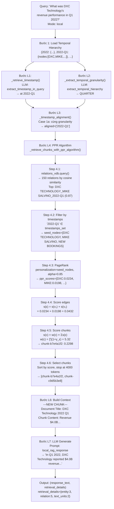

Để trả lời chi tiết, tôi cần đọc toàn bộ source code của querying pipeline. Đọc song song tất cả file liên quan.

# QUERY GRAPH — Phân tích sâu từng bước

---

## Ví dụ ECT-QA xuyên suốt

Dùng câu hỏi thực từ ECT-QA dataset, query trên graph đã build từ DXC Technology:

```
Query: "What was DXC Technology's revenue performance in Q1 2022?"
Mode: local
```

---

## Bước 0: Entry Point & Khởi tạo QueryParam

`query_graph.py` đọc config, tạo `TemporalGraphRAG` với `config_type="querying"`, rồi tạo `QueryParam`:

```python
query_param = QueryParam(
    mode="local",                              # từ config.yaml querying.mode
    top_k=50,                                  # số entities/relations retrieve
    local_max_token_for_text_unit=4000,        # giới hạn token cho text chunks
    local_max_token_for_local_context=6000,    # giới hạn token cho entities+relations
    local_max_token_for_community_report=2000, # giới hạn token cho community reports
    global_max_token_for_community_report=16384,
    naive_max_token_for_text_unit=12000,
)
``` 

Sau đó `graph_rag.query(question, param=query_param)` gọi `loop.run_until_complete(aquery(...))`.

---

## Bước 1: Load Temporal Hierarchy

Trước khi dispatch sang bất kỳ mode nào, `aquery()` luôn gọi:

```python
temporal_hierarchy = await self.get_temporal_hierarchy()
``` 

`get_temporal_hierarchy()` đọc `temporal_hierarchy_graph` (file `graph_temporal_hierarchy.graphml`) và chuyển thành dict `{timestamp_str: SingleTemporalSchema}`:

```python
{
  "2022": {
    "level": 0,
    "title": "2022",
    "temporal_edges": [["DXC TECHNOLOGY", "MIKE SALVINO", "2022-Q1"], ...],
    "nodes": ["DXC TECHNOLOGY", "MIKE SALVINO", "NEW BOOKINGS", ...],
    "sub_communities": ["2022-Q1", "2022-Q2", "2022-Q3", "2022-Q4"],
    "all_sub_communities": ["2022-Q1", "2022-Q2", ...]
  },
  "2022-Q1": {
    "level": 1,
    "title": "2022-Q1",
    "temporal_edges": [["DXC TECHNOLOGY", "MIKE SALVINO", "2022-Q1"], ...],
    "nodes": ["DXC TECHNOLOGY", "MIKE SALVINO", "NEW BOOKINGS"],
    "sub_communities": [],
    "all_sub_communities": []
  }
}
```

`SingleTemporalSchema` là TypedDict định nghĩa cấu trúc này: 

**Tại sao load hierarchy trước?** Mọi mode đều cần hierarchy để biết timestamp nào tồn tại trong data, và để traverse từ coarse → fine granularity.

---

## Bước 2: Dispatch theo Mode

```python
if param.mode == "local":
    response, retrieval_detail = await local_query(query, ..., temporal_hierarchy, ...)
elif param.mode == "global":
    response = await global_query(query, ..., temporal_hierarchy, ...)
elif param.mode == "naive":
    response = await naive_query(query, chunks_vdb, text_chunks, ...)
```

---

# LOCAL MODE — Chi tiết từng bước

Local mode dành cho câu hỏi về **sự kiện cụ thể** (specific facts). Đây là mode phức tạp nhất, dùng thuật toán PPR (Personalized PageRank) theo paper.

## Bước L1: Extract Timestamp từ Query

`_retrieve_timestamp()` gọi LLM với prompt `extract_timestamp_in_query`:

**Prompt được điền:**
```json
-Goal-
Given a user query that is potentially ask a time-related question, identify the timestamp entities...
- temporal_logic: one of <at, before, after, between>
If temporal_logic is <at, before, after>, format as ("entity"<|><temporal_logic><|><entity_name><|><entity_type>)

User Query: What was DXC Technology's revenue performance in Q1 2022?
``` 

**LLM output:**
```json
("entity"<|>"at"<|>"2022-Q1"<|>"quarter")<|COMPLETE|>
```

**Parse output:**
```python
record_attributes = ["entity", "at", "2022-Q1", "quarter"]
if_timestamp = {
    "temporal_logic": "at",
    "timestamp": "2022-Q1",
    "entity_type": "quarter"
}
```

**Normalize timestamp:** `EnhancedTemporalNormalizer` chuẩn hóa `"2022-Q1"` → `"2022-Q1"` (đã chuẩn).

**Xử lý temporal_logic:**

Với `temporal_logic = "at"`:
```python
found, matched_key = _find_timestamp_in_hierarchy("2022-Q1", temporal_hierarchy)
# → found=True, matched_key="2022-Q1"
timestamps = ["2022-Q1"]
sub_timestamps = temporal_hierarchy["2022-Q1"]["sub_communities"]  # = []
```

Với `temporal_logic = "before"` (ví dụ query "before Q2 2022"):
```python
sibling_nodes = ["2022-Q1", "2022-Q2", "2022-Q3", "2022-Q4"]  # tất cả quarter trong hierarchy
timestamps = [s for s in sibling_nodes if datetime(s) < datetime("2022-Q2")]
# → ["2022-Q1"]
```

Với `temporal_logic = "between"` (ví dụ "between Q1 and Q3 2022"):
```python
timestamps = [s for s in sibling_nodes if "2022-Q1" <= datetime(s) <= "2022-Q3"]
# → ["2022-Q1", "2022-Q2", "2022-Q3"]
``` 

**Output của bước này:**
```python
timestamp_in_query = ["2022-Q1"]
sub_timestamps = []
temporal_granularity = "quarter"
```

---

## Bước L2: Extract Temporal Granularity

Song song với bước L1, `_extract_temporal_granularity()` gọi LLM với prompt `extract_temporal_hierarchy`:

**Prompt:**
```json
-Goal-
Given a user query, identify the temporal granularity asked in the query.
- granularity: one of [year, quarter, month, date]

User Query: What was DXC Technology's revenue performance in Q1 2022?
```

**LLM output:**
```json
("granularity"<|>"quarter")<|COMPLETE|>
```

**Output:** `preferred_temporal_granularity = "QUARTER"`

**Tại sao cần 2 LLM calls riêng biệt?** `_retrieve_timestamp` xác định *timestamp cụ thể* và *temporal logic* (at/before/after/between). `_extract_temporal_granularity` xác định *granularity mong muốn* của câu trả lời. Hai thông tin này phục vụ mục đích khác nhau trong bước alignment tiếp theo.

---

## Bước L3: Timestamp Alignment

`_timestamp_alignment()` điều chỉnh timestamps theo granularity mong muốn:

```python
aligned_timestamp_in_query = await _timestamp_alignment(
    timestamp_in_query=["2022-Q1"],
    temporal_granularity="quarter",          # từ _retrieve_timestamp
    temporal_hierarchy=temporal_hierarchy,
    preferred_temporal_granularity="QUARTER" # từ _extract_temporal_granularity
)
```

**4 trường hợp xử lý:**

| Trường hợp | Điều kiện | Hành động |
|---|---|---|
| Case 1a | Cả hai cùng granularity | Dùng `timestamp_in_query` nguyên vẹn |
| Case 1b | preferred > granularity (finer) | Expand xuống sub_communities |
| Case 1c | preferred < granularity (coarser) | Lấy parent timestamp |
| Case 2 | Không có timestamp, có preferred | Lấy tất cả timestamps ở level preferred |
| Case 3 | Có timestamp, không có preferred | Dùng timestamp nguyên vẹn |

Với ví dụ của chúng ta (cả hai đều là `quarter`):
```python
aligned_timestamp_in_query = ["2022-Q1"]  # Case 1a: giữ nguyên
```

Ví dụ nếu query là "What happened in 2022?" (year) nhưng data chỉ có quarters:
```python
# preferred_granularity = "YEAR", timestamp = "2022"
# Case 1b: expand xuống sub_communities
aligned_timestamp_in_query = ["2022-Q1", "2022-Q2", "2022-Q3", "2022-Q4", "2022"]
```  

---

## Bước L4: PPR-based Chunk Retrieval (Thuật toán chính của paper)

Đây là **trái tim của local query** — thuật toán Personalized PageRank (PPR) theo paper. Được thực hiện trong `_retrieve_chunks_with_ppr_algorithm()`.

### Step 4.1: Query Relations Vector DB

```python
top_k_relations = query_param.top_k * 3  # = 50 * 3 = 150
relations_query_result = await relations_vdb.query(query, top_k=150)
```

Vector DB tìm 150 relations có embedding gần nhất với query embedding. Mỗi relation trong VDB có format:
```
entity_name = "DXC TECHNOLOGY_MIKE SALVINO_2022-Q1"
content = "description in 2022-Q1, Mike Salvino served as CEO of DXC Technology..."
```

**Tại sao dùng relations thay vì entities?** Relations chứa thông tin ngữ nghĩa phong phú hơn (description + timestamp). Query về "revenue performance" sẽ match với relation descriptions chứa từ "revenue", "performance", "Q1 2022" tốt hơn là chỉ match entity names. 

### Step 4.2: Filter Relations by Timestamps → Seed Nodes

```python
# Expand timestamps: "2022-Q1" → tất cả descendants
timestamps_set = _get_all_descendant_timestamps("2022-Q1", temporal_hierarchy)
# → {"2022-Q1"}  (không có sub-timestamps cho quarter)

# Filter relations
for relation in relations_query_result:
    entity_name = "DXC TECHNOLOGY_MIKE SALVINO_2022-Q1"
    parts = entity_name.split('_')
    # → src_id="DXC TECHNOLOGY", tgt_id="MIKE SALVINO", timestamp="2022-Q1"
    
    if timestamp in timestamps_set:  # "2022-Q1" ∈ {"2022-Q1"} → True
        seed_nodes.add("DXC TECHNOLOGY")
        seed_nodes.add("MIKE SALVINO")
        relation_metadata[("DXC TECHNOLOGY", "MIKE SALVINO", "2022-Q1")] = 0.87  # cosine similarity
```

**Tại sao cần filter theo timestamp?** Đây là bước temporal filtering cốt lõi. Nếu không filter, PPR sẽ lan truyền score sang tất cả entities trong graph, kể cả những entity không liên quan đến Q1 2022. 

### Step 4.3: Personalized PageRank (PPR)

```python
ppr_results = await knowledge_graph_inst.get_top_pagerank_nodes(
    personalization_nodes=list(seed_nodes),  # ["DXC TECHNOLOGY", "MIKE SALVINO", ...]
    top_k=query_param.top_k * 2,             # = 100
    alpha=0.85                               # damping factor
)
# → [(node_id, ppr_score), ...]
# → [("DXC TECHNOLOGY", 0.0234), ("MIKE SALVINO", 0.0198), ("NEW BOOKINGS", 0.0156), ...]
```

PPR lan truyền score từ seed nodes ra toàn graph. Nodes gần seed nodes (về mặt graph topology) nhận score cao hơn. `alpha=0.85` nghĩa là 85% xác suất tiếp tục đi theo edge, 15% quay về seed nodes.

**Tại sao dùng PPR thay vì chỉ lấy neighbors?** PPR capture được multi-hop relationships. Ví dụ: `DXC TECHNOLOGY → COST OPTIMIZATION PROGRAM → MARGIN IMPROVEMENT` — entity `MARGIN IMPROVEMENT` không trực tiếp liên quan đến query nhưng PPR sẽ cho nó score cao vì nó gần với seed nodes. 

### Step 4.4: Score Edges

```python
# s(ε) = s(v₁) + s(v₂)  (theo paper)
for i in range(len(ppr_results)):
    for j in range(i+1, len(ppr_results)):
        src_id = ppr_results[i][0]  # "DXC TECHNOLOGY"
        tgt_id = ppr_results[j][0]  # "MIKE SALVINO"
        
        edge_data = await graph.get_edge(src_id, tgt_id)
        if not edge_data: continue
        
        edge_score = ppr_scores["DXC TECHNOLOGY"] + ppr_scores["MIKE SALVINO"]
        # = 0.0234 + 0.0198 = 0.0432
``` [12](#2-11) 

### Step 4.5: Score Chunks

```python
# s(c) = w(c) * Σ s(ε)  (theo paper)
# w(c) = ∏ (1 + γ_ε)  với γ_ε là cosine similarity của relation với query

# edge_data["source_id"] = {"2022-Q1": "chunk-b7e4a1f2"}
for timestamp_clean in timestamps_set:  # "2022-Q1"
    if timestamp_clean in source_id_dict:
        chunk_id = source_id_dict["2022-Q1"]  # "chunk-b7e4a1f2"
        chunk_edge_scores["chunk-b7e4a1f2"] += edge_score  # Σ s(ε)
        chunk_edge_similarities["chunk-b7e4a1f2"].append(0.87)  # γ_ε

# Final score
for chunk_id, edge_score_sum in chunk_edge_scores.items():
    similarities = chunk_edge_similarities[chunk_id]  # [0.87, 0.72, 0.65]
    chunk_weight = 1.0
    for gamma in similarities:
        chunk_weight *= (1.0 + gamma)  # (1+0.87) * (1+0.72) * (1+0.65) = 5.32
    
    doc_scores[chunk_id] = chunk_weight * edge_score_sum
    # = 5.32 * 0.0432 = 0.2298
```

**Tại sao công thức này?** `w(c) = ∏(1 + γ_ε)` boost score của chunk nếu nhiều relations trong chunk đều có cosine similarity cao với query. Chunk chứa nhiều relevant relations sẽ được ưu tiên hơn chunk chỉ chứa 1 relation. 

### Step 4.6: Select Top Chunks by Token Limit

```python
sorted_chunks = sorted(doc_scores.items(), key=lambda x: x[1], reverse=True)
# → [("chunk-b7e4a1f2", 0.2298), ("chunk-c9d5b3e8", 0.1876), ...]

total_tokens = 0
max_tokens = 4000  # local_max_token_for_text_unit

for chunk_id, score in sorted_chunks[:top_k]:
    chunk_data = await text_chunks_db.get_by_id(chunk_id)
    chunk_tokens = len(encode(chunk_data["content"]))
    
    if total_tokens + chunk_tokens > max_tokens:
        break  # Dừng khi đạt token limit
    
    chunks.append(chunk_data)
    total_tokens += chunk_tokens
```

---

## Bước L5: Supplemental Evidence Retrieval (Fallback)

Nếu tổng evidence < 4 pieces, `_supplemental_evidence_retrieval()` thực hiện 6 chiến lược fallback:

```json
Strategy 1: Thử seed_node_method khác (entities thay vì relations)
Strategy 2: Broader temporal search (mở rộng ra cả năm 2022)
Strategy 3: General search với top_k * 2
Strategy 4: Lấy thêm relations cho entities mới tìm được
Strategy 5: Lấy thêm community reports
Strategy 6: Lấy thêm text units
``` [14](#2-13) 

**Tại sao cần fallback?** Nếu query hỏi về timestamp không tồn tại trong data (ví dụ "Q1 2019" nhưng data chỉ có 2020-2023), PPR sẽ không tìm được seed nodes. Fallback đảm bảo luôn có ít nhất một số evidence để LLM có thể trả lời.

---

## Bước L6: Build Context

Sau khi có `use_text_units`, context được format theo cấu trúc `---NEW CHUNK---`:

```python
chunk_formatter = """---NEW CHUNK---
Document Title: {full_doc_title}
Chunk Order Index: {chunk_order_index}
Chunk Content:
{chunk_content}
---END OF CHUNK---

"""

# Ví dụ output:
"""
---NEW CHUNK---
Document Title: DXC Technology 2022 Q1
Chunk Order Index: 0
Chunk Content:
DXC Technology 2022 Q1
Good morning. This is DXC Technology's Q1 2022 earnings call.
Revenue for Q1 2022 was $4.0 billion, down 5.5% year-over-year.
Mike Salvino, our CEO, highlighted that the company signed $1.2 billion
in new bookings during Q1 2022...
---END OF CHUNK---

---NEW CHUNK---
Document Title: DXC Technology 2022 Q1
Chunk Order Index: 1
Chunk Content:
DXC Technology 2022 Q1
...cost optimization programs take effect. By Q2 2022, we expect margins to improve...
---END OF CHUNK---
"""
```

**Lưu ý quan trọng:** Context trong local mode **chỉ chứa text chunks** (raw document content), không phải bảng CSV entities/relations như GraphRAG thông thường. Đây là thiết kế theo paper — PPR đã chọn ra chunks liên quan nhất, LLM đọc trực tiếp từ nguồn gốc. 

---

## Bước L7: LLM Generate Answer

```python
sys_prompt = PROMPTS["local_rag_response"].format(
    context_data=context,           # ---NEW CHUNK--- formatted text
    response_type="Multiple Paragraphs"
)

response = await use_model_func(
    query,                          # "What was DXC Technology's revenue performance in Q1 2022?"
    system_prompt=sys_prompt,
)
```

Prompt `local_rag_response` yêu cầu LLM:
1. Trả lời trực tiếp câu hỏi
2. Toàn diện — bao gồm tất cả chi tiết liên quan
3. Chính xác về thời gian
4. Thừa nhận giới hạn nếu thiếu thông tin
5. Linh hoạt với temporal expressions 

**Output của local_query:**
```python
response = "In Q1 2022, DXC Technology reported revenue of $4.0 billion, representing a 5.5% decline year-over-year. CEO Mike Salvino highlighted strong new bookings of $1.2 billion during the quarter, indicating positive momentum for future revenue..."

retrieval_details = {
    "entity": 3,
    "relation": 5,
    "community": 0,
    "text_units": 2,
    "total_evidence": 10
}
```

`aquery()` trả về `(response, retrieval_details)` cho local mode. 

---

# GLOBAL MODE — Chi tiết từng bước

Global mode dành cho câu hỏi về **xu hướng, tổng quan** (trends, summaries). Ví dụ: *"How did IT services companies perform across 2022?"*

## Bước G1: Filter & Sort Communities

```python
# Lấy tất cả timestamps trong temporal_hierarchy ở level <= query_param.level (=2)
community_schema = {
    k: v for k, v in temporal_hierarchy.items() if v["level"] <= 2
}
# → {"2022": {...}, "2022-Q1": {...}, "2022-Q2": {...}, ...}

# Sort: ưu tiên level thấp (coarser), nhiều edges, nhiều nodes
sorted_community_schemas = sorted(
    community_schema.items(),
    key=lambda x: (x[1]["level"], -len(x[1]['temporal_edges']), -len(x[1]['nodes'])),
)
# → [("2022", ...), ("2022-Q1", ...), ("2022-Q2", ...), ...]

# Giới hạn số communities
sorted_community_schemas = sorted_community_schemas[:512]  # global_max_consider_community

# Load reports từ community_reports storage
community_datas = await community_reports.get_by_ids([k[0] for k in sorted_community_schemas])

# Filter theo rating
community_datas = [c for c in community_datas if c["report_json"].get("rating", 0) >= 0]

# Sort cuối: nhiều edges + nodes + rating cao lên đầu
community_datas = sorted(
    community_datas,
    key=lambda x: (len(x["temporal_edges"]), len(x['nodes']), x["report_json"].get("rating", 0)),
    reverse=True,
)
``` 

## Bước G2: Map Phase — LLM tóm tắt từng community group

Communities được chia thành groups theo `global_max_token_for_community_report=16384` tokens. Mỗi group được xử lý song song:

```python
# Context cho mỗi group (CSV format):
"""
id,content,rating,importance
0,"DXC Technology Q1 2022 Performance\nDXC Technology under CEO Mike Salvino...",7.5,8
1,"IT Services Market Q2 2022\nThe IT services sector showed...",6.8,5
"""

# Prompt: global_map_rag_points
sys_prompt = PROMPTS["global_map_rag_points"].format(context_data=community_context)

response = await use_model_func(
    query,
    system_prompt=sys_prompt,
    response_format={"type": "json_object"}  # Force JSON output
)
``` 

**LLM output (JSON):**
```json
{
  "points": [
    {"description": "DXC Technology reported $4.0B revenue in Q1 2022, down 5.5% YoY, with $1.2B new bookings", "score": 85},
    {"description": "CEO Mike Salvino led cost optimization programs expected to improve margins in Q2 2022", "score": 72},
    {"description": "IT services sector faced headwinds in 2022 due to macroeconomic pressures", "score": 60}
  ]
}
``` 

## Bước G3: Reduce Phase — Tổng hợp tất cả points

```python
# Collect tất cả points từ tất cả groups
final_support_points = [
    {"analyst": 0, "answer": "DXC Technology reported $4.0B revenue...", "score": 85},
    {"analyst": 0, "answer": "CEO Mike Salvino led cost optimization...", "score": 72},
    {"analyst": 1, "answer": "IT services sector faced headwinds...", "score": 60},
    ...
]

# Filter score > 0, sort descending
final_support_points = sorted(final_support_points, key=lambda x: x["score"], reverse=True)

# Truncate theo token limit
final_support_points = truncate_list_by_token_size(
    final_support_points,
    key=lambda x: x["answer"],
    max_token_size=16384
)

# Format context
points_context = """
----Analyst 0----
Importance Score: 85
DXC Technology reported $4.0B revenue in Q1 2022, down 5.5% YoY...

----Analyst 0----
Importance Score: 72
CEO Mike Salvino led cost optimization programs...
"""

# Prompt: global_reduce_rag_response
response = await use_model_func(
    query,
    PROMPTS["global_reduce_rag_response"].format(
        report_data=points_context,
        response_type="Multiple Paragraphs"
    )
)
``` 

Prompt `global_reduce_rag_response` yêu cầu LLM tạo markdown response với **structural diversity** (varied headers, mixed narrative/analytical), **presentation diversity** (bullets, tables, paragraphs), **content diversity** (quantitative + qualitative).

**Output của global_query:** `response_text` (markdown, không có `retrieval_details`). 

---

# NAIVE MODE — Baseline đơn giản

Naive mode không dùng graph, chỉ vector search thuần túy:

```python
# 1. Vector search trên raw chunks
results = await chunks_vdb.query(query, top_k=50)
# → [{"id": "chunk-b7e4a1f2", "similarity": 0.87}, ...]

# 2. Load chunk data
chunks = await text_chunks_db.get_by_ids([r["id"] for r in results])

# 3. Truncate theo token limit
maybe_trun_chunks = truncate_list_by_token_size(
    chunks, key=lambda x: x["content"], max_token_size=12000
)

# 4. Format context
section = "--New Chunk--\n".join([c["content"] for c in maybe_trun_chunks])

# 5. LLM generate
sys_prompt = PROMPTS["naive_rag_response"].format(
    content_data=section,
    response_type="Multiple Paragraphs"
)
response = await use_model_func(query, system_prompt=sys_prompt)
```

**Tại sao naive mode tồn tại?** Dùng làm baseline để so sánh với local/global mode trong evaluation. Không có temporal awareness, không có graph traversal.

---

# Temporal-Aware Ranking — Cơ chế scoring chi tiết

Khi không dùng PPR (ví dụ khi `seed_node_method="entities"`), entities được rank bởi `calculate_temporal_aware_rank()` với 4 factors:

```python
final_rank = (
    temporal_score * 0.4 +      # Factor 1: Entity có timestamp khớp query không?
    temporal_proximity * 0.3 +  # Factor 2: Timestamp entity gần query timestamp bao nhiêu?
    normalized_degree * 0.2 +   # Factor 3: Degree trong graph (connectivity)
    query_relevance * 0.1       # Factor 4: Keyword/semantic match với query
)
```

**Factor 1 — Temporal Alignment (40%):**
```python
# Lấy timestamps từ entity's source_id (dict keyed by timestamp)
entity_timestamps = set(entity["source_id"].keys())  # {"2022-Q1", "2022-Q2"}

for query_ts in ["2022-Q1"]:
    for entity_ts in entity_timestamps:
        if temporal_overlap("2022-Q1", "2022-Q1"):  # True
            temporal_alignment += 1.0

temporal_score = min(temporal_alignment / len(query_timestamps), 1.0)  # = 1.0
```

**Factor 2 — Temporal Proximity (30%):**
```python
# Tính khoảng cách thời gian giữa query timestamp và entity timestamps
distance = calculate_temporal_distance("2022-Q1", "2022-Q1")  # = 0
proximity_score = max(0, 1.0 - (0 / 10.0))  # = 1.0
```

**Factor 3 — Node Degree (20%):**
```python
normalized_degree = min(node_degree / 100.0, 1.0)
# DXC TECHNOLOGY có degree=15 → 15/100 = 0.15
```

**Factor 4 — Query Relevance (10%):**
```python
# Cosine similarity giữa query embedding và entity name embedding
# Hoặc keyword matching nếu không có embedding
query_relevance = cosine_similarity(embed("revenue performance Q1 2022"), embed("DXC TECHNOLOGY"))
# ≈ 0.45
```

**Ranking weights có thể thay đổi theo query type:**

| Query Type | temporal_alignment | temporal_proximity | node_degree | query_relevance |
|---|---|---|---|---|
| `general` | 0.3 | 0.2 | 0.3 | 0.2 |
| `temporal` | 0.5 | 0.3 | 0.15 | 0.05 |
| `enumeration` | 0.25 | 0.2 | 0.25 | 0.3 |
| `comparison` | 0.35 | 0.25 | 0.25 | 0.15 | [24](#2-23) 

Tương tự, edges được rank bởi `calculate_temporal_aware_edge_rank()` với 5 factors (thêm `edge_weight`):

```python
final_rank = (
    temporal_score * 0.35 +
    temporal_proximity * 0.15 +
    normalized_degree * 0.05 +
    normalized_weight * 0.15 +
    query_relevance * 0.35      # Query relevance cao hơn cho edges (35%)
)
``` 

---

# Tổng kết Flow Query với ví dụ DXC Technology



---

# Bảng tóm tắt: Config ảnh hưởng đến Query

| Config key | Bước ảnh hưởng | Ảnh hưởng |
|---|---|---|
| `mode: "local"` | Dispatch | Dùng PPR algorithm, trả về `(response, retrieval_details)` |
| `mode: "global"` | Dispatch | Dùng Map-Reduce trên community reports |
| `top_k: 50` | L4 Step 4.1 | Số relations retrieve từ VDB (×3 = 150 candidates) |
| `seed_node_method: "relations"` | L4 | Dùng relations VDB để tìm seed nodes (mặc định) |
| `local_max_token_for_text_unit: 4000` | L4 Step 4.6 | Giới hạn token cho chunks được chọn |
| `local_max_token_for_local_context: 6000` | L6 | 20% cho entities (1200 tokens), 80% cho relations (4800 tokens) |
| `local_max_token_for_community_report: 2000` | L5 | Giới hạn community reports trong supplemental retrieval |
| `global_max_token_for_community_report: 16384` | G2 | Số tokens mỗi group trong map phase |
| `global_min_community_rating: 0` | G1 | Filter communities có rating thấp |
| `enable_subgraph: true` | L4 | Bật subgraph traversal trong PPR | 

### Citations

**File:** tgrag/src/core/types.py (L50-108)
```python
@dataclass
class QueryParam:
    """Query parameters for Temporal GraphRAG queries.
    
    Attributes:
        mode: Query mode - "local", "global", or "naive"
        only_need_context: If True, return only context without LLM response
        response_type: Type of response format (e.g., "Multiple Paragraphs")
        level: Hierarchy level for querying
        top_k: Number of top results to retrieve
        temporal_granularity: Temporal granularity filter (None for auto)
        seed_node_method: Method for seed node retrieval - "entities" or "relations"
        
        # Naive search parameters
        naive_max_token_for_text_unit: Maximum tokens for naive RAG text units
        
        # Local search parameters
        local_max_token_for_text_unit: Maximum tokens for local text units
        local_max_token_for_local_context: Maximum tokens for local context
        local_max_token_for_community_report: Maximum tokens for community reports
        local_community_single_one: If True, use single community for local queries
        sub_graph: If True, enable subgraph retrieval
        mix_relation: If True, enable mixed relationship retrieval
        
        # Global search parameters
        global_min_community_rating: Minimum community rating threshold
        global_max_consider_community: Maximum number of communities to consider
        global_max_token_for_community_report: Maximum tokens for community reports
        global_special_community_map_llm_kwargs: LLM kwargs for special community mapping
        
        retrieval_details: Optional dictionary for storing retrieval details
    """
    mode: Literal["local", "global", "naive"] = "global"
    only_need_context: bool = False
    response_type: str = "Multiple Paragraphs"
    level: int = 2
    top_k: int = 20
    temporal_granularity: None = None
    seed_node_method: Literal["entities", "relations"] = "entities"
    
    # Naive search parameters
    naive_max_token_for_text_unit: int = 12000
    
    # Local search parameters
    local_max_token_for_text_unit: int = 4000
    local_max_token_for_local_context: int = 6000
    local_max_token_for_community_report: int = 2000
    local_community_single_one: bool = False
    sub_graph: bool = False
    mix_relation: bool = False
    
    # Global search parameters
    global_min_community_rating: float = 0
    global_max_consider_community: float = 512
    global_max_token_for_community_report: int = 16384
    global_special_community_map_llm_kwargs: dict = field(
        default_factory=lambda: {"response_format": {"type": "json_object"}}
    )
    retrieval_details: dict = None
```

**File:** tgrag/src/core/types.py (L149-167)
```python
class SingleTemporalSchema(TypedDict):
    """Schema for a single temporal hierarchy node.
    
    Attributes:
        level: Hierarchy level of the temporal node
        title: Title/name of the temporal node
        temporal_edges: List of temporal edges as [source, target, timestamp] tuples
        nodes: List of node IDs in this temporal node
        chunk_ids: List of chunk IDs associated with this temporal node
        sub_communities: List of sub-community IDs
        all_sub_communities: List of all sub-community IDs (including nested)
    """
    level: int
    title: str
    temporal_edges: list[list[str, str, str]]
    nodes: list[str]
    chunk_ids: list[str]
    sub_communities: list[str]
    all_sub_communities: list[str]
```

**File:** tgrag/src/temporal_graphrag.py (L343-384)
```python
        temporal_hierarchy = await self.get_temporal_hierarchy()
        if param.mode == "local":
            global_config_dict = asdict(self)
            # Add full_docs to global_config so it can be accessed in local_query
            global_config_dict["full_docs"] = self.full_docs
            response, retrieval_detail = await local_query(
                query,
                self.chunk_entity_relation_graph,
                self.entities_vdb,
                self.relations_vdb,
                self.community_reports,
                self.text_chunks,
                temporal_hierarchy,
                param,
                global_config_dict,
            )
            await self._query_done()
            return response, retrieval_detail
        elif param.mode == "global":
            response = await global_query(
                query,
                self.chunk_entity_relation_graph,
                self.entities_vdb,
                self.relations_vdb,
                self.community_reports,
                self.text_chunks,
                temporal_hierarchy,
                param,
                asdict(self),
            )
        elif param.mode == "naive":
            response = await naive_query(
                query,
                self.chunks_vdb,
                self.text_chunks,
                param,
                asdict(self),
            )
        else:
            raise ValueError(f"Unknown mode {param.mode}")
        await self._query_done()
        return response
```

**File:** tgrag/configs/prompts.yaml (L268-311)
```yaml
  extract_timestamp_in_query: |
    -Goal-
    Given a user query that is potentially ask a time-related question, identify the timestamp entities in the query, follows the structure:
    - entity_name: standard format of the timestamp entity identified in context, following {timestamp_format}
    - entity_type: {timestamp_types}
    - temporal_logic: one of <at, before, after, between>
    If temporal_logic is <between>, format a pair of timestamp entities as ("entity"{tuple_delimiter}<between>{tuple_delimiter}<entity_name>{tuple_delimiter}<entity_name>{tuple_delimiter}<entity_type>)
    If temporal_logic is <at, before, after>, format a pair of timestamp entities as ("entity"{tuple_delimiter}<temporal_logic>{tuple_delimiter}<entity_name>{tuple_delimiter}<entity_type>)

    When finished, output {completion_delimiter}

    ######################
    -Examples-
    ######################
    Example 1:
    User Query:
    Who was the CEO of DXC Technology on January 1, 2022?
    ################
    Output:
    ("entity"{tuple_delimiter}"at"{tuple_delimiter}"2022-01-01"{tuple_delimiter}"date"){completion_delimiter}
    #############################
    Example 2:
    User Query:
    What strategic decisions were made between Q2 and Q4 2022?
    #############
    Output:
    ("entity"{tuple_delimiter}"between"{tuple_delimiter}"2022-Q2"{tuple_delimiter}"2022-Q4"{tuple_delimiter}"quarter"){completion_delimiter}

    #############################
    Example 3:
    User Query:
    What has changed in Aon's leadership after the NFP acquisition in 2023?
    #############
    Output:
    ("entity"{tuple_delimiter}"after"{tuple_delimiter}"2022"{tuple_delimiter}"year"){completion_delimiter}
    #############################

    Output:
    -Real Data-
    ######################
    User Query: {input_text}
    ######################
    Output:

```

**File:** tgrag/configs/prompts.yaml (L312-350)
```yaml
  # Extract temporal hierarchy from query
  extract_temporal_hierarchy: |
    -Goal-
    Given a user query that is potentially ask a time-related question, identify the temporal granularity asked in the query, follows the structure:
    - granularity: one of the following types: [{timestamp_types}]

    When finished, output {completion_delimiter}

    -Examples-
    ######################
    Example 1:
    User Query:
    Who was the CEO of DXC Technology on January 1, 2022?
    ################
    Output:
    ("granularity"{tuple_delimiter}"date"){completion_delimiter}
    #############################
    Example 2:
    User Query:
    How did high school attendance rates change each month in 2021 across California?
    #############
    Output:
    ("granularity"{tuple_delimiter}"month"){completion_delimiter}

    #############################
    Example 3:
    User Query:
    Which year did Meta invest the most in AI research?
    #############
    Output:
    ("granularity"{tuple_delimiter}"year"){completion_delimiter}
    #############################

    Output:
    -Real Data-
    ######################
    User Query: {input_text}
    ######################
    Output:
```

**File:** tgrag/configs/prompts.yaml (L352-403)
```yaml
  # Local RAG response prompt
  local_rag_response: |
    ---Role---

    You are a helpful assistant responding to questions about temporal data in the tables provided.

    ---Goal---

    Generate a comprehensive response that answers the user's question based on the available information in the input data tables. Your response should:

    1. **Answer the question directly** - Provide the specific information requested
    2. **Be comprehensive** - Include all relevant details from the available data
    3. **Be temporally accurate** - Ensure temporal information matches the question's scope
    4. **Acknowledge limitations** - If information is missing or unclear, explain what you can and cannot determine
    5. **Provide context** - Include relevant temporal context and relationships when helpful

    **Important Guidelines:**
    - If you have partial information that can help answer the question, provide that information and explain what's missing
    - Only say "No explicit evidence" if you truly have no relevant information at all
    - For temporal queries, be flexible with temporal expressions (e.g., "2023 Q4" vs "fourth quarter of 2023")
    - If the question asks for comparisons or trends, provide the available data even if incomplete
    - Use the data tables as your primary source of information

    ---Target response length and format---

    {response_type}

    ---Data tables---

    {context_data}

    ---Goal---

    Generate a comprehensive response that answers the user's question based on the available information in the input data tables. Your response should:

    1. **Answer the question directly** - Provide the specific information requested
    2. **Be comprehensive** - Include all relevant details from the available data
    3. **Be temporally accurate** - Ensure temporal information matches the question's scope
    4. **Acknowledge limitations** - If information is missing or unclear, explain what you can and cannot determine
    5. **Provide context** - Include relevant temporal context and relationships when helpful

    **Important Guidelines:**
    - If you have partial information that can help answer the question, provide that information and explain what's missing
    - Only say "No explicit evidence" if you truly have no relevant information at all
    - For temporal queries, be flexible with temporal expressions (e.g., "2023 Q4" vs "fourth quarter of 2023")
    - If the question asks for comparisons or trends, provide the available data even if incomplete
    - Use the data tables as your primary source of information

    ---Target response length and format---

    {response_type}

```

**File:** tgrag/configs/prompts.yaml (L405-459)
```yaml
  global_map_rag_points: |
    ---Role---

    You are a helpful assistant responding to questions about data in the tables provided.


    ---Goal---

    Generate a response consisting of a list of key points that responds to the user's question, summarizing all relevant information in the input data tables.

    You should use the data provided in the data tables below as the primary context for generating the response.
    If you don't know the answer or if the input data tables do not contain sufficient information to provide an answer, just say so. Do not make anything up.

    Each key point in the response should have the following element:
    - Description: A comprehensive description of the point.
    - Importance Score: An integer score between 0-100 that indicates how important the point is in answering the user's question. An 'I don't know' type of response should have a score of 0.

    The response should be JSON formatted as follows:
    {{
        "points": [
            {{"description": "Description of point 1...", "score": score_value}},
            {{"description": "Description of point 2...", "score": score_value}}
        ]
    }}

    The response shall preserve the original meaning and use of modal verbs such as "shall", "may" or "will".
    Do not include information where the supporting evidence for it is not provided.


    ---Data tables---

    {context_data}

    ---Goal---

    Generate a response consisting of a list of key points that responds to the user's question, summarizing all relevant information in the input data tables.

    You should use the data provided in the data tables below as the primary context for generating the response.
    If you don't know the answer or if the input data tables do not contain sufficient information to provide an answer, just say so. But still try to provide a partial answer if possible.
    Do not make anything up.

    Each key point in the response should have the following element:
    - Description: A comprehensive description of the point.
    - Importance Score: An integer score between 0-100 that indicates how important the point is in answering the user's question. An 'I don't know' type of response should have a score of 0.

    The response shall preserve the original meaning and use of modal verbs such as "shall", "may" or "will".
    Do not include information where the supporting evidence for it is not provided.

    The response should be JSON formatted as follows:
    {{
        "points": [
            {{"description": "Description of point 1", "score": score_value}},
            {{"description": "Description of point 2", "score": score_value}}
        ]
    }}
```

**File:** tgrag/configs/prompts.yaml (L462-523)
```yaml
  global_reduce_rag_response: |
    ---Role---

    You are a helpful assistant responding to questions about a dataset by synthesizing perspectives from multiple analysts.


    ---Goal---

    Generate a response of the target length and format that responds to the user's question, summarize all the reports from multiple analysts who focused on different parts of the dataset.

    Note that the analysts' reports provided below are ranked in the **descending order of importance**.

    If you don't know the answer or if the provided reports do not contain sufficient information to provide an answer, just say so. Do not make anything up.

    The final response should remove all irrelevant information from the analysts' reports and merge the cleaned information into a comprehensive answer that provides explanations of all the key points and implications appropriate for the response length and format.

    Add sections and commentary to the response as appropriate for the length and format. Style the response in markdown.

    The response shall preserve the original meaning and use of modal verbs such as "shall", "may" or "will".

    Do not include information where the supporting evidence for it is not provided.

    Create a comprehensive analysis that demonstrates diversity through:

    **STRUCTURAL DIVERSITY:**
    - Use varied section headers (mix of descriptive, analytical, and thematic headers)
    - Alternate between different organizational patterns within the same response
    - Combine narrative flow with analytical rigor
    - Mix chronological and thematic organization

    **PRESENTATION DIVERSITY:**
    - Vary paragraph styles (some analytical, some narrative, some data-focused)
    - Use different evidence presentation methods (direct quotes, summaries, bullet points, tables)
    - Mix formal analysis with accessible explanations
    - Alternate between macro and micro perspectives

    **CONTENT DIVERSITY:**
    - Present multiple analytical frameworks and perspectives
    - Include both quantitative and qualitative insights
    - Balance strategic, operational, and financial viewpoints
    - Show both short-term and long-term implications

    **STYLISTIC DIVERSITY:**
    - Vary sentence structures and lengths
    - Mix technical precision with engaging narrative
    - Use different transition styles between sections
    - Combine data-driven analysis with strategic insights

    ---Target response length and format---

    {response_type}


    ---Analyst Reports---

    {report_data}

    ---Target response length and format---

    {response_type}

    Add sections and commentary to the response as appropriate for the length and format. Style the response in markdown.
```

**File:** tgrag/src/core/querying.py (L123-194)
```python
# Helper function: create ranking config
def create_ranking_config(
    query_type: str = "general",
    temporal_focus: bool = True,
    custom_weights: dict = None
) -> dict:
    """
    Create ranking configuration based on query type and preferences.
    
    Args:
        query_type: Type of query ("general", "temporal", "enumeration", "comparison")
        temporal_focus: Whether to prioritize temporal relevance
        custom_weights: Optional custom weight overrides
    
    Returns:
        dict: Ranking configuration with weights
    """
    # Base configurations for different query types
    base_configs = {
        "general": {
            'temporal_alignment': 0.3,
            'temporal_proximity': 0.2,
            'node_degree': 0.3,
            'query_relevance': 0.2
        },
        "temporal": {
            'temporal_alignment': 0.5,
            'temporal_proximity': 0.3,
            'node_degree': 0.15,
            'query_relevance': 0.05
        },
        "enumeration": {
            'temporal_alignment': 0.25,
            'temporal_proximity': 0.2,
            'node_degree': 0.25,
            'query_relevance': 0.3
        },
        "comparison": {
            'temporal_alignment': 0.35,
            'temporal_proximity': 0.25,
            'node_degree': 0.25,
            'query_relevance': 0.15
        }
    }
    
    # Start with base config for query type
    config = base_configs.get(query_type, base_configs["general"]).copy()
    
    # Adjust for temporal focus
    if temporal_focus:
        # Boost temporal factors
        config['temporal_alignment'] = min(config['temporal_alignment'] * 1.2, 0.6)
        config['temporal_proximity'] = min(config['temporal_proximity'] * 1.1, 0.4)
        # Reduce non-temporal factors proportionally
        total_temporal = config['temporal_alignment'] + config['temporal_proximity']
        remaining_weight = 1.0 - total_temporal
        if remaining_weight > 0:
            config['node_degree'] = remaining_weight * 0.6
            config['query_relevance'] = remaining_weight * 0.4
    
    # Apply custom weight overrides
    if custom_weights:
        for key, value in custom_weights.items():
            if key in config:
                config[key] = value
    
    # Normalize weights to sum to 1.0
    total_weight = sum(config.values())
    if total_weight > 0:
        config = {k: v / total_weight for k, v in config.items()}
    
    return config
```

**File:** tgrag/src/core/querying.py (L424-582)
```python
# Helper function: calculate temporal aware edge rank
async def calculate_temporal_aware_edge_rank(
    edge: dict,
    query_timestamps: list[str],
    temporal_hierarchy: dict[str, SingleTemporalSchema],
    edge_degree: int,
    weight: float = 0.0,
    query: str = None,
    ranking_weights: dict = None,
    embedding_func = None
) -> float:
    """
    Calculate temporal-aware rank for an edge/relationship.
    
    Args:
        edge: Edge data dictionary
        query_timestamps: List of timestamps extracted from the query
        temporal_hierarchy: Temporal hierarchy data
        edge_degree: Original edge degree
        weight: Edge weight
        query: Original query string for additional context
        ranking_weights: Optional custom weights for ranking factors
        embedding_func: Optional embedding function for semantic similarity calculation
    
    Returns:
        float: Temporal-aware rank score (higher is better)
    """
    # Default ranking weights for edges - emphasize temporal alignment and weight
    default_weights = {
        'temporal_alignment': 0.35,    # 35% - Temporal alignment with query
        'temporal_proximity': 0.15,    # 15% - How close in time
        'edge_degree': 0.05,           # 5% - Graph connectivity
        'edge_weight': 0.15,            # 15% - Edge strength
        'query_relevance': 0.35        # 35% - Query context matching (lower for edges)
    }
    
    # Use custom weights if provided, otherwise use defaults
    weights = ranking_weights if ranking_weights else default_weights
    
    if not query_timestamps:
        # If no temporal context, fall back to normalized degree and weight
        normalized_degree = min(edge_degree / 100.0, 1.0)
        normalized_weight = min(weight / 10.0, 1.0)  # Assuming max weight around 10
        return (normalized_degree * 0.7) + (normalized_weight * 0.3)
    
    # Factor 1: Temporal Alignment
    temporal_alignment = 0.0
    edge_timestamps = set()
    
    # Extract timestamps from edge data
    if 'source_id' in edge:
        source_id = edge['source_id']
        if isinstance(source_id, dict):
            edge_timestamps.update(source_id.keys())
        elif isinstance(source_id, str):
            # Try to extract timestamp from string source_id
            timestamp_patterns = [
                r'\b\d{4}\b',  # Year: 2024
                r'\b\d{4}-\d{2}\b',  # Year-Month: 2024-03
                r'\b\d{4}-\d{2}-\d{2}\b',  # Year-Month-Day: 2024-03-15
                r'\b\d{4}Q[1-4]\b',  # Quarter: 2024Q1
            ]
            for pattern in timestamp_patterns:
                matches = re.findall(pattern, source_id)
                edge_timestamps.update(matches)
    
    # Check temporal alignment with query timestamps
    for query_ts in query_timestamps:
        for edge_ts in edge_timestamps:
            if temporal_overlap(query_ts, edge_ts):
                temporal_alignment += 1.0
                break
    
    # Normalize temporal alignment
    temporal_score = min(temporal_alignment / len(query_timestamps), 1.0)
    
    # Factor 2: Temporal Proximity
    temporal_proximity = 0.0
    if temporal_alignment > 0:
        # Calculate how close the edge's timestamps are to query timestamps
        proximity_scores = []
        for query_ts in query_timestamps:
            min_distance = float('inf')
            for edge_ts in edge_timestamps:
                distance = calculate_temporal_distance(query_ts, edge_ts)
                min_distance = min(min_distance, distance)
            if min_distance != float('inf'):
                # Convert distance to proximity score (closer = higher score)
                proximity_score = max(0, 1.0 - (min_distance / 10.0))
                proximity_scores.append(proximity_score)
        
        if proximity_scores:
            temporal_proximity = sum(proximity_scores) / len(proximity_scores)
    
    # Factor 3: Normalized Edge Degree
    normalized_degree = min(edge_degree / 100.0, 1.0)
    
    # Factor 4: Normalized Edge Weight
    normalized_weight = min(weight / 10.0, 1.0)  # Assuming max weight around 10
    
    # Factor 5: Query Context Relevance (for edge description)
    query_relevance = 0.0
    if query and 'description' in edge:
        edge_description = edge['description']
        
        if embedding_func:
            # Use cosine similarity for semantic relevance
            try:
                import numpy as np
                from sklearn.metrics.pairwise import cosine_similarity
                
                # Get embeddings for query and edge description
                query_embedding = await embedding_func([query])
                edge_embedding = await embedding_func([edge_description])
                
                # Ensure embeddings are 2D arrays for cosine_similarity
                if query_embedding.ndim == 1:
                    query_embedding = query_embedding.reshape(1, -1)
                if edge_embedding.ndim == 1:
                    edge_embedding = edge_embedding.reshape(1, -1)
                
                # Calculate cosine similarity
                similarity = cosine_similarity(query_embedding, edge_embedding)[0][0]
                
                # Normalize similarity to 0-1 range
                query_relevance = max(0.0, similarity)
                
                logger.debug(f"Edge cosine similarity vs query: {similarity:.3f}")
                
            except Exception as e:
                logger.warning(f"Failed to calculate edge cosine similarity: {e}, falling back to keyword matching")
                # Fall back to keyword matching if embedding fails
                query_lower = query.lower()
                description_lower = edge_description.lower()
                
                if description_lower in query_lower or query_lower in description_lower:
                    query_relevance = 1.0
                elif any(word in description_lower for word in query_lower.split()):
                    query_relevance = 0.5
        else:
            # Fall back to simple keyword matching if no embedding function provided
            query_lower = query.lower()
            description_lower = edge_description.lower()
            
            if description_lower in query_lower or query_lower in description_lower:
                query_relevance = 1.0
            elif any(word in description_lower for word in query_lower.split()):
                query_relevance = 0.5
    
    # Calculate final temporal-aware rank using configurable weights
    final_rank = (
        temporal_score * weights['temporal_alignment'] +
        temporal_proximity * weights['temporal_proximity'] +
        normalized_degree * weights['edge_degree'] +
        normalized_weight * weights['edge_weight'] +
        query_relevance * weights['query_relevance']
    )
    
    return final_rank
```

**File:** tgrag/src/core/querying.py (L1044-1251)
```python
# Helper function: retrieve timestamp
async def _retrieve_timestamp(
        query,
        temporal_hierarchy: dict[str, SingleTemporalSchema],
        global_config: dict, ):
    use_llm_func: callable = global_config["best_model_func"]
    retrieval_timestamp_prompt = PROMPTS['extract_timestamp_in_query']
    context_base = dict(
        tuple_delimiter=PROMPTS["DEFAULT_TUPLE_DELIMITER"],
        record_delimiter=PROMPTS["DEFAULT_RECORD_DELIMITER"],
        completion_delimiter=PROMPTS["DEFAULT_COMPLETION_DELIMITER"],
        timestamp_format=json.dumps(PROMPTS["DEFAULT_TIMESTAMP_FORMAT"]),
        timestamp_types=",".join(PROMPTS["DEFAULT_TEMPORAL_HIERARCHY"])
    )
    
    try:
        final_result = await use_llm_func(retrieval_timestamp_prompt.format(input_text=query, **context_base))
    except Exception as e:
        logger.info(f"An error occurred in timestamp extraction: {e}")
        final_result = ""
    
    # Handle None result from LLM function
    if final_result is None:
        logger.warning("LLM function returned None for timestamp extraction, using empty string")
        final_result = ""
    
    # Handle different return types from LLM function
    if isinstance(final_result, tuple):
        final_result = final_result[0] if len(final_result) > 0 else ""
    elif isinstance(final_result, list):
        final_result = final_result[0].get("text", "") if len(final_result) > 0 and isinstance(final_result[0], dict) else ""

    # Ensure final_result is a string
    if not isinstance(final_result, str):
        logger.warning(f"Unexpected final_result type: {type(final_result)}, converting to string")
        final_result = str(final_result) if final_result is not None else ""

    # If we still don't have a valid string, return empty results
    if not final_result.strip():
        logger.warning("No valid timestamp extraction result, returning empty results")
        return [], [], None

    records = split_string_by_multi_markers(
        final_result,
        [PROMPTS["DEFAULT_RECORD_DELIMITER"], PROMPTS["DEFAULT_COMPLETION_DELIMITER"]],
    )

    timestamp_candidates, temporal_granularity = [], None
    
    # Enhanced timestamp processing with centralized temporal normalizer
    normalizer = get_temporal_normalizer()
    
    for record in records:
        record = re.search(r"\((.*)\)", record)
        if record is None:
            continue
        record = record.group(1)
        record_attributes = split_string_by_multi_markers(
            record, [PROMPTS["DEFAULT_TUPLE_DELIMITER"]]
        )
        
        if_timestamp = await _handle_single_timestamp_extraction(
            record_attributes,
        )
        if if_timestamp is not None:
            # Enhanced normalization for timestamp values
            if normalizer:
                if isinstance(if_timestamp.get('timestamp'), str):
                    timestamp_value = if_timestamp['timestamp'].strip('"')
                    # Try to normalize the timestamp using the enhanced normalizer
                    normalized_result = normalizer.normalize_temporal_expression(timestamp_value)
                    if normalized_result.normalized_forms:
                        # Use the first normalized form (most confident) without quotes to match temporal hierarchy keys
                        if_timestamp['timestamp'] = normalized_result.normalized_forms[0]
                        if_timestamp['normalized_confidence'] = normalized_result.confidence
                        if_timestamp['normalized_forms'] = normalized_result.normalized_forms  # Store all forms for potential use
                        logger.info(f"Enhanced normalized timestamp: {timestamp_value} -> {normalized_result.normalized_forms[0]} (confidence: {normalized_result.confidence}, type: {normalized_result.normalization_type})")
                elif isinstance(if_timestamp.get('timestamp'), list):
                    # Handle list of timestamps (for 'between' logic)
                    normalized_timestamps = []
                    for ts in if_timestamp['timestamp']:
                        ts_clean = ts.strip('"')
                        normalized_result = normalizer.normalize_temporal_expression(ts_clean)
                        if normalized_result.normalized_forms:
                            # Use the first normalized form without quotes to match temporal hierarchy keys
                            normalized_timestamps.append(normalized_result.normalized_forms[0])
                            logger.info(f"Enhanced normalized timestamp: {ts_clean} -> {normalized_result.normalized_forms[0]} (confidence: {normalized_result.confidence}, type: {normalized_result.normalization_type})")
                        else:
                            normalized_timestamps.append(ts)
                    if_timestamp['timestamp'] = normalized_timestamps
            
            timestamp_candidates.append(if_timestamp)
    
    # search real timestamps in graph
    type2num = PROMPTS["DEFAULT_TEMPORAL_HIERARCHY_LEVEL"]
    timestamps = []
    sub_timestamps = []
    
    for ts in timestamp_candidates:
        if ts is None:
            logger.warning("Skipping None timestamp candidate")
            continue
        try:
            if ts.get('temporal_logic') == 'before':
                temporal_granularity = ts.get('entity_type')
                if not temporal_granularity:
                    logger.warning("Missing entity_type in timestamp candidate")
                    continue
                sibling_nodes = [key for key, value in temporal_hierarchy.items() if
                                 value['level'] == type2num.get(temporal_granularity.lower(), 'UNKNOWN')]
                sibling_nodes_sorted = sort_timestamp_by_datetime(sibling_nodes)
                timestamp_value = ts.get('timestamp')
                if not timestamp_value:
                    logger.warning("Missing timestamp in timestamp candidate")
                    continue
                timestamps = [s_n for s_n in sibling_nodes_sorted if
                              convert_timestamp_to_datetime(s_n) < convert_timestamp_to_datetime(timestamp_value)]
                for timestamp in timestamps:
                    found, matched_key = _find_timestamp_in_hierarchy(timestamp, temporal_hierarchy)
                    if found:
                        sub_timestamps.extend(temporal_hierarchy[matched_key]['sub_communities'])
                    else:
                        logger.warning(f"Timestamp {timestamp} not found in temporal hierarchy")
                        
            elif ts.get('temporal_logic') == 'after':
                temporal_granularity = ts.get('entity_type')
                if not temporal_granularity:
                    logger.warning("Missing entity_type in timestamp candidate")
                    continue
                sibling_nodes = [key for key, value in temporal_hierarchy.items() if
                                 value['level'] == type2num.get(temporal_granularity.lower(), 'UNKNOWN')]
                sibling_nodes_sorted = sort_timestamp_by_datetime(sibling_nodes)

                timestamp_value = ts.get('timestamp')
                if not timestamp_value:
                    logger.warning("Missing timestamp in timestamp candidate")
                    continue
                timestamps = [s_n for s_n in sibling_nodes_sorted if
                              convert_timestamp_to_datetime(s_n) > convert_timestamp_to_datetime(timestamp_value)]
                for timestamp in timestamps:
                    found, matched_key = _find_timestamp_in_hierarchy(timestamp, temporal_hierarchy)
                    if found:
                        sub_timestamps.extend(temporal_hierarchy[matched_key]['sub_communities'])
                    else:
                        logger.warning(f"Timestamp {timestamp} not found in temporal hierarchy")
                        
            elif ts.get('temporal_logic') == 'at':
                temporal_granularity = ts.get('entity_type')
                if not temporal_granularity:
                    logger.warning("Missing entity_type in timestamp candidate")
                    continue
                timestamp_value = ts.get('timestamp')
                if not timestamp_value:
                    logger.warning("Missing timestamp in timestamp candidate")
                    continue
                found, matched_key = _find_timestamp_in_hierarchy(timestamp_value, temporal_hierarchy)
                if found:
                    sub_timestamps.extend(temporal_hierarchy[matched_key]['sub_communities'])
                    timestamps.append(matched_key)
                else:
                    logger.warning(f"Timestamp {timestamp_value} not found in temporal hierarchy")
                    
            elif ts.get('temporal_logic') == 'between':
                temporal_granularity = ts.get('entity_type')
                if not temporal_granularity:
                    logger.warning("Missing entity_type in timestamp candidate")
                    continue
                timestamp_value = ts.get('timestamp')
                if not timestamp_value or not isinstance(timestamp_value, list) or len(timestamp_value) < 2:
                    logger.warning("Missing or invalid timestamp list in timestamp candidate")
                    continue
                sibling_nodes = [key for key, value in temporal_hierarchy.items() if
                                 value['level'] == type2num.get(temporal_granularity.lower(), 'UNKNOWN')]
                sibling_nodes_sorted = sort_timestamp_by_datetime(sibling_nodes)
                timestamps = [s_n for s_n in sibling_nodes_sorted if
                              convert_timestamp_to_datetime(timestamp_value[0]) <= convert_timestamp_to_datetime(
                                  s_n) <= convert_timestamp_to_datetime(timestamp_value[1])]
                for timestamp in timestamps:
                    found, matched_key = _find_timestamp_in_hierarchy(timestamp, temporal_hierarchy)
                    if found:
                        sub_timestamps.extend(temporal_hierarchy[matched_key]['sub_communities'])
                    else:
                        logger.warning(f"Timestamp {timestamp} not found in temporal hierarchy")
                        
            # Handle cases where temporal_logic is not specified (default to 'at')
            else:
                temporal_granularity = ts.get('entity_type')
                if not temporal_granularity:
                    logger.warning("Missing entity_type in timestamp candidate")
                    continue
                timestamp_value = ts.get('timestamp')
                if not timestamp_value:
                    logger.warning("Missing timestamp in timestamp candidate")
                    continue
                
                found, matched_key = _find_timestamp_in_hierarchy(timestamp_value, temporal_hierarchy)
                if found:
                    sub_timestamps.extend(temporal_hierarchy[matched_key]['sub_communities'])
                    timestamps.append(matched_key)
                    logger.info(f"Found timestamp match: {timestamp_value} -> {matched_key}")
                else:
                    logger.warning(f"Timestamp {timestamp_value} not found in temporal hierarchy")
                        
        except Exception as e:
            logger.warning(f"Error processing timestamp candidate {ts}: {e}")
            continue

    return timestamps, sub_timestamps, temporal_granularity
```

**File:** tgrag/src/core/querying.py (L1309-1365)
```python
# Helper function: timestamp alignment
async def _timestamp_alignment(
        timestamp_in_query: list[str],
        temporal_granularity: str,
        temporal_hierarchy: dict[str, SingleTemporalSchema],
        preferred_temporal_granularity: None = None,
):
    from ..utils.helpers import get_parent_timestamp_name
    
    type2num = PROMPTS["DEFAULT_TEMPORAL_HIERARCHY_LEVEL"]
    aligned_timestamp_in_query = []
    
    # Debug: Log input parameters
    logger.info(f"DEBUG: _timestamp_alignment called with:")
    logger.info(f"DEBUG:   timestamp_in_query: {timestamp_in_query}")
    logger.info(f"DEBUG:   temporal_granularity: {temporal_granularity}")
    logger.info(f"DEBUG:   preferred_temporal_granularity: {preferred_temporal_granularity}")
    logger.info(f"DEBUG:   temporal_hierarchy keys: {list(temporal_hierarchy.keys())}")
    logger.info(f"DEBUG:   type2num: {type2num}")
    
    if timestamp_in_query and preferred_temporal_granularity:
        logger.info(f"DEBUG: Case 1: Both timestamp_in_query and preferred_temporal_granularity exist")
        if preferred_temporal_granularity == temporal_granularity:
            logger.info(f"DEBUG:   Granularities match, using timestamp_in_query as-is")
            aligned_timestamp_in_query = timestamp_in_query
        # break down
        elif type2num.get(preferred_temporal_granularity.lower(), 'UNKNOWN') > type2num.get(
                temporal_granularity.lower(), 'UNKNOWN'):
            logger.info(f"DEBUG:   Preferred granularity is higher level, breaking down timestamps")
            for timestamp in timestamp_in_query:
                found, matched_key = _find_timestamp_in_hierarchy(timestamp, temporal_hierarchy)
                if found:
                    timestamp_data = temporal_hierarchy[matched_key]
                    if 'sub_communities' in timestamp_data:
                        logger.info(f"DEBUG:     Adding sub_communities for {timestamp} -> {matched_key}: {timestamp_data['sub_communities']}")
                        aligned_timestamp_in_query.extend(timestamp_data['sub_communities'])
            aligned_timestamp_in_query.extend(timestamp_in_query)
        # higher level
        elif type2num.get(preferred_temporal_granularity.lower(), 'UNKNOWN') < type2num.get(
                temporal_granularity.lower(), 'UNKNOWN'):
            logger.info(f"DEBUG:   Preferred granularity is lower level, getting parent timestamps")
            aligned_timestamp_in_query = [get_parent_timestamp_name(timestamp, preferred_temporal_granularity) for
                                          timestamp in timestamp_in_query]
            aligned_timestamp_in_query.extend(timestamp_in_query)
    elif not timestamp_in_query and preferred_temporal_granularity:
        logger.info(f"DEBUG: Case 2: No timestamp_in_query but preferred_temporal_granularity exists")
        aligned_timestamp_in_query = [key for key, value in temporal_hierarchy.items() if
                                      value['level'] == preferred_temporal_granularity]
        logger.info(f"DEBUG:   Found timestamps with preferred granularity: {aligned_timestamp_in_query}")
    elif timestamp_in_query and not preferred_temporal_granularity:
        logger.info(f"DEBUG: Case 3: timestamp_in_query exists but no preferred_temporal_granularity")
        aligned_timestamp_in_query = timestamp_in_query
    else:
        logger.info(f"DEBUG: Case 4: Neither timestamp_in_query nor preferred_temporal_granularity exists")
    
    logger.info(f"DEBUG: Final aligned_timestamp_in_query: {aligned_timestamp_in_query}")
    return aligned_timestamp_in_query
```

**File:** tgrag/src/core/querying.py (L1498-1516)
```python
    # Step 1: Retrieve top K relation edges ranked by cosine similarity
    # Use TOP_K * 3 to get more candidates 
    top_k_relations = query_param.top_k * 3
    logger.info(f"========== Step 1: Query Relations Vector DB ==========")
    logger.info(f"Query: '{query}'")
    logger.info(f"Top K relations to retrieve: {top_k_relations}")
    logger.info(f"Query will be embedded and compared to relation embeddings via cosine similarity")
    relations_query_result = await relations_vdb.query(query, top_k=top_k_relations)
    logger.info(f"Retrieved {len(relations_query_result)} relation edges")
    if relations_query_result:
        logger.info(f"Top 10 relation results:")
        for i, rel in enumerate(relations_query_result[:10]):
            logger.info(f"  {i+1}. {rel.get('entity_name', 'UNKNOWN')} (similarity: {rel.get('similarity', 0):.4f})")
    else:
        logger.warning(f"No relations found!")
    
    if not relations_query_result:
        logger.warning("No relations found for query, falling back to entity-based retrieval")
        return []
```

**File:** tgrag/src/core/querying.py (L1518-1598)
```python
    # Step 2: Filter edges by timestamps T_q to get temporally filtered seed set V^t_q
    logger.info(f"========== Step 2: Filter Relations by Timestamps ==========")
    logger.info(f"Query timestamps (aligned): {aligned_timestamp_in_query}")
    no_timestamp = not aligned_timestamp_in_query
    logger.info(f"No timestamp filtering: {no_timestamp}")
    seed_nodes = set()
    relation_metadata = {}  # Store relation metadata: {(src, tgt, timestamp): similarity}

    timestamps_set = set()
    if not no_timestamp and temporal_hierarchy:
        logger.info(f"Expanding timestamps using temporal hierarchy...")
        for query_ts in aligned_timestamp_in_query:
            descendants = _get_all_descendant_timestamps(query_ts, temporal_hierarchy)
            logger.info(f"  '{query_ts}' -> {len(descendants)} descendants: {sorted(list(descendants))[:10]}...")
            timestamps_set.update(descendants)
        # strip quotes
        timestamps_set = {ts.replace('"', '').replace("'", '') for ts in timestamps_set}
        logger.info(f"Expanded from {len(aligned_timestamp_in_query)} to {len(timestamps_set)} total timestamps")
        logger.info(f"All expanded timestamps: {sorted(list(timestamps_set))}")
    elif not no_timestamp:
        timestamps_set = {ts.replace('"', '').replace("'", '') for ts in aligned_timestamp_in_query}
        logger.info(f"No temporal hierarchy available, using query timestamps as-is: {sorted(list(timestamps_set))}")
    
    logger.info(f"Processing {len(relations_query_result)} relations to extract seed nodes...")
    matched_count = 0
    skipped_count = 0
    for idx, relation in enumerate(relations_query_result):
        entity_name = relation.get('entity_name', '')
        similarity = relation.get('similarity', 0.0)
        
        # Parse relation name: format is "src_tgt_timestamp"
        names = entity_name.split('_')
        if len(names) >= 2:
            src_id = names[0]
            tgt_id = names[1]
            
            if no_timestamp:
                # No timestamp filtering: include all relations 
                seed_nodes.add(src_id)
                seed_nodes.add(tgt_id)
                if idx < 5:  # Log first 5 for debugging
                    logger.info(f"  [{idx+1}] {entity_name} -> seed nodes: {src_id}, {tgt_id} (no timestamp filter)")
                matched_count += 1
            else:
                # Filter by timestamps: only include relations with timestamps in T_q
                if len(names) == 3: 
                    timestamp = names[2]
                    # Strip quotes from timestamp for comparison 
                    timestamp_clean = timestamp.replace('"', '').replace("'", '')
                    if timestamp_clean in timestamps_set:
                        seed_nodes.add(src_id)
                        seed_nodes.add(tgt_id)
                        relation_metadata[(src_id, tgt_id, timestamp_clean)] = similarity
                        if matched_count < 5:  # Log first 5 matches
                            logger.info(f"  [{idx+1}] {entity_name} -> MATCHED (timestamp: {timestamp_clean}) -> seed nodes: {src_id}, {tgt_id}")
                        matched_count += 1
                    else:
                        if skipped_count < 5:  # Log first 5 skips
                            logger.info(f"  [{idx+1}] {entity_name} -> SKIPPED (timestamp: {timestamp_clean} not in timestamps_set)")
                        skipped_count += 1
                elif len(names) == 2:
                    # No timestamp in relation name - could include or exclude based on policy
                    # For now, exclude
                    if skipped_count < 5:
                        logger.info(f"  [{idx+1}] {entity_name} -> SKIPPED (no timestamp in relation name)")
                    skipped_count += 1
    
    logger.info(f"Filtering summary: {matched_count} relations matched, {skipped_count} skipped")
    
    if not seed_nodes:
        logger.warning(f"========== ERROR: No seed nodes found after timestamp filtering! ==========")
        relation_timestamps = set()
        for relation in relations_query_result:
            entity_name = relation.get('entity_name', '')
            names = entity_name.split('_')
            if len(names) >= 3:
                relation_timestamps.add(names[2])
        logger.warning(f"Query timestamps (expanded): {sorted(list(timestamps_set))}")
        logger.warning(f"Found relation timestamps in retrieved relations: {sorted(list(relation_timestamps))[:30]}")
        logger.warning(f"Total unique relation timestamps: {len(relation_timestamps)}")
        return []
```

**File:** tgrag/src/core/querying.py (L1605-1622)
```python
    # Step 3: Run PPR on G^K_q with V^t_q as personalization vector
    logger.info(f"========== Step 4: Run PageRank ==========")
    logger.info(f"Personalization nodes (seed nodes): {len(seed_nodes)}")
    logger.info(f"Top K to retrieve: {query_param.top_k * 2}")
    logger.info(f"Alpha (damping factor): 0.85")
    ppr_results = await knowledge_graph_inst.get_top_pagerank_nodes(
        personalization_nodes=list(seed_nodes),
        top_k=query_param.top_k * 2,  # Get more nodes for edge scoring
        alpha=0.85
    )
    logger.info(f"PPR computed for {len(ppr_results)} nodes")
    if ppr_results:
        logger.info(f"Top 10 PPR results:")
        for i, (node_id, score) in enumerate(ppr_results[:10]):
            logger.info(f"  {i+1}. {node_id} (PPR score: {score:.6f})")
    
    # Create PPR score lookup: s(v) for each entity v
    ppr_scores = {node_id: score for node_id, score in ppr_results}
```

**File:** tgrag/src/core/querying.py (L1624-1691)
```python
    # Step 4: Score edges: s(ε) = 1[τ ∈ T_q] (s(v₁) + s(v₂))
    # Step 5: Score chunks: s(c) = w(c) Σ_{ε∈E_q} s(ε) where w(c) = ∏_{ε∈E(c)} (1 + γ_ε)
    # For paper's algorithm: we need to:
    # 1. Accumulate s(ε) for each chunk: Σ_{ε∈E_q} s(ε)
    # 2. Calculate w(c) = ∏_{ε∈E(c)} (1 + γ_ε) for each chunk
    # 3. Final score: s(c) = w(c) * Σ_{ε∈E_q} s(ε)
    
    chunk_edge_scores = defaultdict(float)  # chunk_id -> Σ s(ε) (sum of edge scores)
    chunk_edge_similarities = defaultdict(list)  # chunk_id -> list of γ_ε for edges in that chunk
    
    edges_processed = 0
    edges_with_data = 0
    chunks_scored = 0
    
    # Iterate over PPR results to find edges between top entities
    for i in range(len(ppr_results)):
        for j in range(i + 1, len(ppr_results)):
            edges_processed += 1
            src_id = ppr_results[i][0]
            tgt_id = ppr_results[j][0]
            
            # Get edge data from knowledge graph
            edge_data = await knowledge_graph_inst.get_edge(src_id, tgt_id)
            if not edge_data:
                continue
            
            edges_with_data += 1
            
            edges_with_data += 1
            
            # Calculate edge score: s(ε) = s(v₁) + s(v₂)
            edge_score = ppr_scores.get(src_id, 0.0) + ppr_scores.get(tgt_id, 0.0)
            
            # Get source_id which maps timestamps to chunk IDs
            source_id_dict = edge_data.get('source_id', {})
            
            # Handle dict format (temporal edges): source_id is a dict mapping timestamps to chunk IDs
            if isinstance(source_id_dict, dict):
                # Find corresponding similarity from relation_metadata for this edge
                # Try to match by (src, tgt) first, then by timestamp if available
                edge_similarity = 0.0
                for (s, t, ts), sim in relation_metadata.items():
                    if s == src_id and t == tgt_id:
                        edge_similarity = sim
                        break
                
                if no_timestamp:
                    # Include all timestamps: 1[τ ∈ T_q] = 1 for all
                    for timestamp, chunk_id in source_id_dict.items():
                        # Accumulate edge score: Σ s(ε)
                        chunk_edge_scores[chunk_id] += edge_score
                        # Store similarity for weight calculation: w(c) = ∏_{ε∈E(c)} (1 + γ_ε)
                        chunk_edge_similarities[chunk_id].append(edge_similarity)
                        chunks_scored += 1
                else:
                    # Filter by timestamps: 1[τ ∈ T_q] = 1 only if τ ∈ T_q
                    # Use expanded timestamps_set for matching
                    for timestamp_clean in timestamps_set:
                        # Check both with and without quotes
                        for ts_variant in [timestamp_clean, f'"{timestamp_clean}"', timestamp_clean.replace('"', '')]:
                            if ts_variant in source_id_dict:
                                chunk_id = source_id_dict[ts_variant]
                                # Accumulate edge score: Σ s(ε) where 1[τ ∈ T_q] = 1
                                chunk_edge_scores[chunk_id] += edge_score
                                # Store similarity for weight calculation
                                chunk_edge_similarities[chunk_id].append(edge_similarity)
                                chunks_scored += 1
                                break
```

**File:** tgrag/src/core/querying.py (L1714-1779)
```python
    # Calculate final chunk scores: s(c) = w(c) * Σ_{ε∈E_q} s(ε)
    logger.info(f"========== Step 6: Calculate Final Chunk Scores ==========")
    doc_scores = {}
    for chunk_id, edge_score_sum in chunk_edge_scores.items():
        # Calculate w(c) = ∏_{ε∈E(c)} (1 + γ_ε)
        similarities = chunk_edge_similarities.get(chunk_id, [])
        chunk_weight = 1.0
        for gamma_epsilon in similarities:
            chunk_weight *= (1.0 + gamma_epsilon)
        
        # Final score: s(c) = w(c) * Σ_{ε∈E_q} s(ε)
        doc_scores[chunk_id] = chunk_weight * edge_score_sum
    
    # Step 6: Select chunks in descending order of s(c) until token count reaches L_ctx
    sorted_chunks = sorted(doc_scores.items(), key=lambda x: x[1], reverse=True)
    logger.info(f"Scored {len(sorted_chunks)} chunks total")
    if sorted_chunks:
        logger.info(f"Top 10 chunk scores:")
        for i, (chunk_id, score) in enumerate(sorted_chunks[:10]):
            logger.info(f"  {i+1}. {chunk_id} (score: {score:.6f})")
    else:
        logger.warning(f"No chunks scored! This means no edges were matched to chunks.")
    
    # Limit to top_k chunks first
    logger.info(f"========== Step 7: Retrieve Chunk Data ==========")
    logger.info(f"Selecting top {query_param.top_k} chunks by score")
    top_chunk_ids = [chunk_id for chunk_id, score in sorted_chunks[:query_param.top_k]]
    logger.info(f"Selected {len(top_chunk_ids)} chunk IDs to retrieve")
    
    # Retrieve chunk data
    chunks = []
    tiktoken_model_name = global_config.get("tiktoken_model_name", "gpt-4o-mini")
    from ..utils.helpers import encode_string_by_tiktoken
    
    total_tokens = 0
    max_tokens = query_param.local_max_token_for_text_unit
    logger.info(f"Token limit: {max_tokens}")
    
    for i, chunk_id in enumerate(top_chunk_ids):
        try:
            chunk_data = await text_chunks_db.get_by_id(chunk_id)
            if chunk_data is None:
                logger.warning(f"  [{i+1}] Chunk {chunk_id} not found in text_chunks_db")
                continue
            
            # Count tokens in chunk content
            chunk_content = chunk_data.get("content", "")
            chunk_tokens = len(encode_string_by_tiktoken(chunk_content, model_name=tiktoken_model_name))
            
            # Check if adding this chunk would exceed token limit
            if total_tokens + chunk_tokens > max_tokens:
                logger.info(f"Reached token limit ({total_tokens}/{max_tokens}), stopping chunk retrieval")
                logger.info(f"  Would add {chunk_tokens} tokens from chunk {chunk_id}, but limit exceeded")
                break
            
            chunks.append(chunk_data)
            total_tokens += chunk_tokens
            logger.info(f"  [{i+1}] Retrieved chunk {chunk_id} ({chunk_tokens} tokens, total: {total_tokens}/{max_tokens})")
            
        except Exception as e:
            logger.warning(f"Error retrieving chunk {chunk_id}: {e}")
            continue
    
    logger.info(f"========== Final Result ==========")
    logger.info(f"Retrieved {len(chunks)} chunks with total {total_tokens} tokens (limit: {max_tokens})")
    return chunks
```

**File:** tgrag/src/core/querying.py (L1838-2019)
```python
# Helper function: supplemental evidence retrieval
async def _supplemental_evidence_retrieval(
        query: str,
        entities_vdb: BaseVectorStorage,
        relations_vdb: BaseVectorStorage,
        knowledge_graph_inst: BaseGraphStorage,
        aligned_timestamp_in_query: list[str],
        temporal_hierarchy: dict[str, SingleTemporalSchema],
        query_param: QueryParam,
        global_config: dict,
        existing_evidence: dict,
        community_reports: BaseKVStorage[TemporalSchema],
        text_chunks_db: BaseKVStorage[TextChunkSchema],
) -> dict:
    """
    Supplemental evidence retrieval when primary retrieval is insufficient.
    """
    additional_evidence = {
        'entities': [],
        'relations': [],
        'communities': [],
        'text_units': []
    }
    
    # Strategy 1: Try alternative seed node method
    if query_param.seed_node_method == "entities":
        logger.info("Trying relations-based retrieval as supplement")
        try:
            relation_results = await _get_seed_nodes_from_relations(query, relations_vdb, query_param.top_k, knowledge_graph_inst)
            if relation_results:
                # Get node data for relation results
                relation_node_datas = await asyncio.gather(
                    *[knowledge_graph_inst.get_node(r["entity_name"]) for r in relation_results]
                )
                node_degrees = await asyncio.gather(
                    *[knowledge_graph_inst.node_degree(r["entity_name"]) for r in relation_results]
                )
                relation_node_datas = []
                for k, n, d in zip(relation_results, relation_node_datas, node_degrees):
                    if n is not None:
                        rank = await calculate_temporal_aware_rank(
                            n, 
                            aligned_timestamp_in_query, 
                            temporal_hierarchy, 
                            d,
                            query
                        )
                        relation_node_datas.append({**n, "entity_name": k["entity_name"], "rank": rank})
                
                # Filter out duplicates
                existing_entity_names = {e["entity_name"] for e in existing_evidence.get('entities', [])}
                new_entities = [e for e in relation_node_datas if e["entity_name"] not in existing_entity_names]
                additional_evidence['entities'].extend(new_entities)
        except Exception as e:
            logger.warning(f"Failed to get supplemental relation results: {e}")
    
    # Strategy 2: Try broader temporal search
    if aligned_timestamp_in_query and len(additional_evidence['entities']) < 2:
        logger.info("Trying broader temporal search as supplement")
        try:
            # Get all available timestamps in the same year
            query_years = set()
            for ts in aligned_timestamp_in_query:
                if isinstance(ts, str):
                    if ts.isdigit() and len(ts) == 4:
                        query_years.add(ts)
                    elif '-' in ts:
                        year_part = ts.split('-')[0]
                        if year_part.isdigit() and len(year_part) == 4:
                            query_years.add(year_part)
            
            if query_years:
                # Get all timestamps in the same years
                broader_timestamps = []
                for ts in temporal_hierarchy.keys():
                    ts_clean = ts.strip('"')
                    if any(year in ts_clean for year in query_years):
                        broader_timestamps.append(ts)
                
                if broader_timestamps:
                    sub_graph_entities = await _get_entities_from_temporal_subgraph(broader_timestamps, temporal_hierarchy)
                    broader_results = await entities_vdb.temporal_query(query, sub_graph_entities=sub_graph_entities,
                                                                        top_k=query_param.top_k)
                    
                    if broader_results:
                        broader_node_datas = await asyncio.gather(
                            *[knowledge_graph_inst.get_node(r["entity_name"]) for r in broader_results]
                        )
                        broader_node_degrees = await asyncio.gather(
                            *[knowledge_graph_inst.node_degree(r["entity_name"]) for r in broader_results]
                        )
                        broader_node_datas = []
                        for k, n, d in zip(broader_results, broader_node_datas, broader_node_degrees):
                            if n is not None:
                                rank = await calculate_temporal_aware_rank(
                                    n, 
                                    aligned_timestamp_in_query, 
                                    temporal_hierarchy, 
                                    d,
                                    query
                                )
                                broader_node_datas.append({**n, "entity_name": k["entity_name"], "rank": rank})
                        
                        # Filter out duplicates
                        existing_entity_names = {e["entity_name"] for e in existing_evidence.get('entities', []) + additional_evidence['entities']}
                        new_broader_entities = [e for e in broader_node_datas if e["entity_name"] not in existing_entity_names]
                        additional_evidence['entities'].extend(new_broader_entities)
        except Exception as e:
            logger.warning(f"Failed to get broader temporal results: {e}")
    
    # Strategy 3: Try general search with higher top_k
    if len(additional_evidence['entities']) < 2:
        logger.info("Trying general search with higher top_k as supplement")
        try:
            general_results = await entities_vdb.query(query, top_k=query_param.top_k * 2)
            if general_results:
                general_node_datas = await asyncio.gather(
                    *[knowledge_graph_inst.get_node(r["entity_name"]) for r in general_results]
                )
                general_node_degrees = await asyncio.gather(
                    *[knowledge_graph_inst.node_degree(r["entity_name"]) for r in general_results]
                )
                general_node_datas = []
                for k, n, d in zip(general_results, general_node_datas, general_node_degrees):
                    if n is not None:
                        rank = await calculate_temporal_aware_rank(
                            n, 
                            aligned_timestamp_in_query, 
                            temporal_hierarchy, 
                            d,
                            query
                        )
                        general_node_datas.append({**n, "entity_name": k["entity_name"], "rank": rank})
                
                # Filter out duplicates
                existing_entity_names = {e["entity_name"] for e in existing_evidence.get('entities', []) + additional_evidence['entities']}
                new_general_entities = [e for e in general_node_datas if e["entity_name"] not in existing_entity_names]
                additional_evidence['entities'].extend(new_general_entities)
        except Exception as e:
            logger.warning(f"Failed to get general search results: {e}")
    
    # Strategy 4: Get additional relations for new entities
    if additional_evidence['entities']:
        try:
            additional_relations = await _find_most_related_temporal_edges_from_entities(
                additional_evidence['entities'], query_param, knowledge_graph_inst, aligned_timestamp_in_query, query_param.top_k,
                temporal_hierarchy, query
            )
            additional_evidence['relations'] = additional_relations
        except Exception as e:
            logger.warning(f"Failed to get additional relations: {e}")
    
    # Strategy 5: Get additional communities
    try:
        additional_communities = await _find_most_related_temporal_community_from_entities(
            query_param, community_reports, aligned_timestamp_in_query
        )
        # Filter out duplicates
        existing_community_ids = {c.get('id', '') for c in existing_evidence.get('communities', [])}
        new_communities = [c for c in additional_communities if c.get('id', '') not in existing_community_ids]
        additional_evidence['communities'] = new_communities
    except Exception as e:
        logger.warning(f"Failed to get additional communities: {e}")
    
    # Strategy 6: Get additional text units
    if query_param.local_max_token_for_text_unit and additional_evidence['entities']:
        try:
            if aligned_timestamp_in_query:
                additional_text_units = await _find_most_related_temporal_text_unit_from_entities(
                    additional_evidence['entities'], query_param, text_chunks_db, knowledge_graph_inst, aligned_timestamp_in_query
                )
            else:
                additional_text_units = await _find_most_related_text_unit_from_entities(
                    additional_evidence['entities'], query_param, text_chunks_db, knowledge_graph_inst,
                )
            additional_evidence['text_units'] = additional_text_units
        except Exception as e:
            logger.warning(f"Failed to get additional text units: {e}")
    
    logger.info(f"Supplemental retrieval added: {len(additional_evidence['entities'])} entities, {len(additional_evidence['relations'])} relations, {len(additional_evidence['communities'])} communities, {len(additional_evidence['text_units'])} text units")
    
    return additional_evidence
```

**File:** tgrag/src/core/querying.py (L2159-2197)
```python
    processed_chunks = []
    chunk_formatter = """---NEW CHUNK---
Document Title: {full_doc_title}
Chunk Order Index: {chunk_order_index}
Chunk Content:
{chunk_content}
---END OF CHUNK---

"""
    
    for i, chunk in enumerate(use_text_units):
        chunk_content = chunk.get("content", "")
        chunk_order_index = chunk.get("chunk_order_index", i)
        full_doc_id = chunk.get("full_doc_id", "")
        
        # Get document title from full_docs if available
        full_doc_title = "Unknown Document"
        if full_docs_db and full_doc_id:
            try:
                doc_data = await full_docs_db.get_by_id(full_doc_id)
                if doc_data:
                    full_doc_title = doc_data.get("title", full_doc_id)
            except Exception as e:
                logger.debug(f"Could not retrieve title for doc {full_doc_id}: {e}")
                full_doc_title = full_doc_id
        
        formatted_chunk = chunk_formatter.format(
            chunk_content=chunk_content,
            chunk_order_index=chunk_order_index,
            full_doc_title=full_doc_title
        )
        processed_chunks.append(formatted_chunk)
    
    # Combine all chunks into context 
    context = "".join(processed_chunks)
    
    logger.info(f"[BUILD CONTEXT] Final context built: {len(use_text_units)} text chunks formatted")
    logger.info(f"[BUILD CONTEXT] Skipped {len(node_datas)} entities, {len(use_relations)} relations, {len(use_communities)} communities")
    return context, retrieval_details
```

**File:** tgrag/src/core/querying.py (L2200-2243)
```python
# Helper function: map global communities
async def _map_global_communities(
        query: str,
        communities_data: list[TemporalSchema],
        query_param: QueryParam,
        global_config: dict,
):
    use_string_json_convert_func = global_config["convert_response_to_json_func"]
    use_model_func = global_config["best_model_func"]
    community_groups = []
    while len(communities_data):
        this_group = truncate_list_by_token_size(
            communities_data,
            key=lambda x: x["report_string"],
            max_token_size=query_param.global_max_token_for_community_report,
        )
        community_groups.append(this_group)
        communities_data = communities_data[len(this_group):]

    async def _process(community_truncated_datas: list[TemporalSchema]) -> dict:
        communities_section_list = [["id", "content", "rating", "importance"]]
        for i, c in enumerate(community_truncated_datas):
            communities_section_list.append(
                [
                    i,
                    c["report_string"],
                    c["report_json"].get("rating", 0),
                    len(c["temporal_edges"]) + len(c['nodes']),  # 要改 不是全部的temporal edge
                ]
            )
        community_context = list_of_list_to_csv(communities_section_list)
        sys_prompt_temp = PROMPTS["global_map_rag_points"]
        sys_prompt = sys_prompt_temp.format(context_data=community_context)
        response = await use_model_func(
            query,
            system_prompt=sys_prompt,
            **query_param.global_special_community_map_llm_kwargs,
        )
        data = use_string_json_convert_func(response)
        return data.get("points", [])

    logger.info(f"Grouping to {len(community_groups)} groups for global search")
    responses = await asyncio.gather(*[_process(c) for c in community_groups])
    return responses
```

**File:** tgrag/src/core/querying.py (L2246-2291)
```python
# Main function: local query
async def local_query(
        query,
        knowledge_graph_inst: BaseGraphStorage,
        entities_vdb: BaseVectorStorage,
        relations_vdb: BaseVectorStorage,
        community_reports: BaseKVStorage[TemporalSchema],
        text_chunks_db: BaseKVStorage[TextChunkSchema],
        temporal_hierarchy: dict[str, SingleTemporalSchema],
        query_param: QueryParam,
        global_config: dict,
) -> str:
    try:
        use_model_func = global_config["best_model_func"]
        full_docs_db = global_config.get("full_docs")
        context, retrieval_details = await _build_local_query_context(
            query,
            knowledge_graph_inst,
            entities_vdb,
            relations_vdb,
            community_reports,
            text_chunks_db,
            temporal_hierarchy,
            query_param,
            global_config,
            full_docs_db=full_docs_db,
        )
        if query_param.only_need_context:
            return context, retrieval_details  # Return tuple with 2 elements
        if context is None:
            return PROMPTS["fail_response"], {"entity": 0, "relation": 0, "community": 0}
        sys_prompt_temp = PROMPTS["local_rag_response"]
        sys_prompt = sys_prompt_temp.format(
            context_data=context, response_type=query_param.response_type
        )
        logger.info(f"query: \n{query}")
        logger.info(f"prompt: \n{sys_prompt}")
        response = await use_model_func(
            query,
            system_prompt=sys_prompt,
        )
        logger.info(f"response: \n{response}")
        return response, retrieval_details
    except Exception as e:
        logger.error(f"Error in local_query for query '{query}': {str(e)}")
        return PROMPTS["fail_response"], {"entity": 0, "relation": 0, "community": 0}
```

**File:** tgrag/src/core/querying.py (L2294-2336)
```python
# Main function: global query
async def global_query(
        query,
        knowledge_graph_inst: BaseGraphStorage,
        entities_vdb: BaseVectorStorage,
        relations_vdb: BaseVectorStorage,
        community_reports: BaseKVStorage[TemporalSchema],
        text_chunks_db: BaseKVStorage[TextChunkSchema],
        temporal_hierarchy: dict[str, SingleTemporalSchema],
        query_param: QueryParam,
        global_config: dict,
) -> str:
    community_schema = temporal_hierarchy
    community_schema = {
        k: v for k, v in community_schema.items() if v["level"] <= query_param.level
    }
    if not len(community_schema):
        return PROMPTS["fail_response"]
    use_model_func = global_config["best_model_func"]

    sorted_community_schemas = sorted(
        community_schema.items(),
        key=lambda x: (x[1]["level"], -len(x[1]['temporal_edges']), -len(x[1]['nodes'])),
        reverse=False,
    )
    sorted_community_schemas = sorted_community_schemas[
                               : query_param.global_max_consider_community
                               ]
    community_datas = await community_reports.get_by_ids(
        [k[0] for k in sorted_community_schemas]
    )
    community_datas = [c for c in community_datas if c is not None]
    community_datas = [
        c
        for c in community_datas
        if c["report_json"].get("rating", 0) >= query_param.global_min_community_rating
    ]
    community_datas = sorted(
        community_datas,
        key=lambda x: (len(x["temporal_edges"]), len(x['nodes']), x["report_json"].get("rating", 0)),
        reverse=True,
    )
    logger.info(f"Revtrieved {len(community_datas)} communities")
```

**File:** tgrag/src/core/querying.py (L2356-2382)
```python
    final_support_points = sorted(
        final_support_points, key=lambda x: x["score"], reverse=True
    )
    final_support_points = truncate_list_by_token_size(
        final_support_points,
        key=lambda x: x["answer"],
        max_token_size=query_param.global_max_token_for_community_report,
    )
    points_context = []
    for dp in final_support_points:
        points_context.append(
            f"""----Analyst {dp['analyst']}----
Importance Score: {dp['score']}
{dp['answer']}
"""
        )
    points_context = "\n".join(points_context)
    if query_param.only_need_context:
        return points_context
    sys_prompt_temp = PROMPTS["global_reduce_rag_response"]
    response = await use_model_func(
        query,
        sys_prompt_temp.format(
            report_data=points_context, response_type=query_param.response_type
        ),
    )
    return response
```

**File:** tgrag/src/core/querying.py (L2385-2417)
```python
# Main function: naive query
async def naive_query(
        query,
        chunks_vdb: BaseVectorStorage,
        text_chunks_db: BaseKVStorage[TextChunkSchema],
        query_param: QueryParam,
        global_config: dict,
):
    use_model_func = global_config["best_model_func"]
    results = await chunks_vdb.query(query, top_k=query_param.top_k)
    if not len(results):
        return PROMPTS["fail_response"]
    chunks_ids = [r["id"] for r in results]
    chunks = await text_chunks_db.get_by_ids(chunks_ids)

    maybe_trun_chunks = truncate_list_by_token_size(
        chunks,
        key=lambda x: x["content"],
        max_token_size=query_param.naive_max_token_for_text_unit,
    )
    logger.info(f"Truncate {len(chunks)} to {len(maybe_trun_chunks)} chunks")
    section = "--New Chunk--\n".join([c["content"] for c in maybe_trun_chunks])
    if query_param.only_need_context:
        return section
    sys_prompt_temp = PROMPTS["naive_rag_response"]
    sys_prompt = sys_prompt_temp.format(
        content_data=section, response_type=query_param.response_type
    )
    response = await use_model_func(
        query,
        system_prompt=sys_prompt,
    )
    return response
```

**File:** tgrag/configs/config.yaml (L38-78)
```yaml
# ===================
querying:
  # Data and model paths
  corpus_path: "./ECT_data/old"
  working_dir: "./graph_output"  # Path of graph to be loaded
  provider: "gemini"  # LLM provider: openai, azure, bedrock, gemini, ollama (auto-detected from model if not specified)
  model: "gemini-2.5-flash"  # Gemini model name 

  # Query mode
  mode: "local"  # Query mode: "local", "global"

  # Baseline and evaluation
  baseline: "temporalrag"  # temporalrag or groundtruth
  evaluation_mode: "global"  # local or global query evaluation set
  num_questions: null  # Number of questions to test (if not specified, uses all questions)

  # Output configuration
  output_file: null  # If empty, auto-generated

  # Retrieval parameters
  top_k: 50  # Retrieve top_k entities
  truncated_context_length: 8000  # Context length constraint for in-context learning
  enable_entity_retrieval: false  # Entity embedding retrieval or entity+description embedding retrieval
  enable_subgraph: true
  enable_mixed_relationship: false
  seed_node_method: "relations"  # entities or relations

  # Token limits for local queries
  local_max_token_for_text_unit: 4000  # Maximum tokens for sources/text chunks (default: 4000)
  local_max_token_for_local_context: 6000  # Maximum tokens for entities + relationships (default: 6000, split: 20% entities/1200 tokens, 80% relationships/4800 tokens)
  local_max_token_for_community_report: 2000  # Maximum tokens for community reports (default: 2000)

  # Token limits for global queries
  global_max_token_for_community_report: 16384  # Maximum tokens for community reports in global mode (default: 16384)

  # Token limits for naive queries
  naive_max_token_for_text_unit: 12000  # Maximum tokens for text units in naive mode (default: 12000)

  # Enhanced retrieval system
  use_enhanced_retrieval: false  # Enable/disable enhanced temporal retrieval system
  enhanced_output_suffix: "_enhanced"  # Suffix to add to output file when using enhanced retrieval
```
