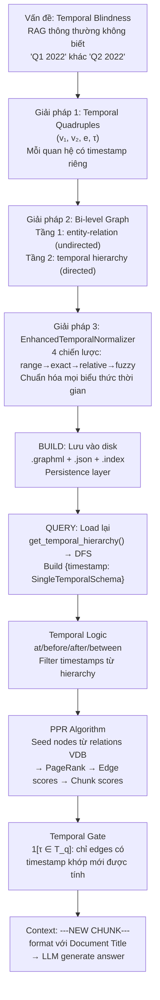

Để trả lời toàn diện, tôi cần đọc thêm nhiều phần quan trọng chưa được khai thác sâu.

Tôi đã có đủ thông tin. Để đọc thêm phần PPR implementation và incremental update trước khi viết câu trả lời toàn diện.

Dưới đây là phân tích sâu về các phần còn lại, tập trung vào **vấn đề thời gian**, **kỹ thuật cốt lõi**, **cầu nối Build→Query**, **thuật toán PPR**, và **scalability**.

---

# Phần 1: Vấn đề gốc rễ — Tại sao cần Temporal-GraphRAG?

Paper "RAG Meets Temporal Graphs: Time-Sensitive Modeling and Retrieval for Evolving Knowledge" (arXiv:2510.13590) xuất phát từ một quan sát đơn giản nhưng quan trọng: **RAG thông thường bị "mù thời gian" (temporal blindness)**.

Hãy hình dung corpus ECT-QA: 480 earnings call transcripts từ 24 công ty, trải dài 2020–2024. Một câu hỏi như *"What was DXC Technology's revenue in Q1 2022?"* đòi hỏi hệ thống phải:

1. Biết rằng câu hỏi đang hỏi về **Q1 2022**, không phải Q2 2022 hay Q1 2023
2. Tìm đúng đoạn văn bản nói về **Q1 2022** của DXC Technology
3. Không nhầm lẫn với dữ liệu của các quý khác

RAG thông thường (vector search thuần túy) không làm được điều này vì:
- Embedding của "revenue Q1 2022" và "revenue Q2 2022" rất gần nhau trong không gian vector
- Không có cơ chế lọc theo thời gian
- Khi corpus lớn, nhiều chunks có nội dung tương tự nhưng khác thời điểm

**Giải pháp của tác giả:** Mô hình hóa tri thức dưới dạng **temporal quadruple** `(v₁, v₂, e, τ)` — mỗi quan hệ được gắn timestamp cụ thể. Đây là đơn vị tri thức cơ bản của toàn bộ hệ thống.  

---

# Phần 2: Kỹ thuật xử lý thời gian — Trái tim của hệ thống

## 2.1 Temporal Normalization — Chuẩn hóa biểu thức thời gian

Đây là vấn đề khó nhất trong xử lý thời gian: cùng một thời điểm có thể được diễn đạt theo vô số cách. Trong earnings call transcripts, người ta nói:

```
"Q1 2022", "first quarter of 2022", "the quarter ended March 2022",
"Q1FY22", "January-March 2022", "this quarter" (khi đang ở Q1 2022)
```

Tất cả đều chỉ cùng một thời điểm: `2022-Q1`.

`EnhancedTemporalNormalizer` xử lý điều này qua **4 chiến lược theo thứ tự ưu tiên**:

**Chiến lược 1 — Range normalization** (ưu tiên cao nhất): Xử lý biểu thức khoảng thời gian như `"Q1-Q3 2024"` → `["2024-Q1", "2024-Q2", "2024-Q3"]`. Tại sao ưu tiên cao nhất? Vì range expressions thường rõ ràng nhất và cần expand thành nhiều timestamps. 

**Chiến lược 2 — Exact normalization**: Xử lý các format chuẩn như `"2022-Q1"`, `"2022-01-15"`, `"2022"`. Confidence = 1.0 vì không có ambiguity.

**Chiến lược 3 — Relative normalization**: Xử lý `"last year"`, `"this quarter"`, `"current year"` dựa trên `reference_date`. Confidence = 0.8 vì phụ thuộc vào thời điểm tham chiếu. 

**Chiến lược 4 — Fuzzy normalization** (ưu tiên thấp nhất): Xử lý các biểu thức không rõ ràng bằng regex pattern matching. Confidence = 0.5–0.7. Ví dụ: `"early 2022"` → `"2022"` (confidence 0.5).

**Tại sao cần confidence score?** Khi có nhiều normalized forms, hệ thống dùng form có confidence cao nhất. Khi confidence thấp, hệ thống có thể fallback sang broader temporal search. 

## 2.2 Bi-level Graph Structure — Hai tầng đồ thị

Tác giả thiết kế **hai đồ thị riêng biệt** thay vì một đồ thị duy nhất. Đây là quyết định kiến trúc quan trọng nhất:

**Tầng 1 — `chunk_entity_relation_graph` (undirected NetworkX graph):**
Lưu quan hệ giữa các entities. Mỗi edge có `description` là **dict keyed by timestamp**:

```python
# Edge: DXC TECHNOLOGY ─── MIKE SALVINO
edge_data = {
    "description": {
        "2022-Q1": "Mike Salvino served as CEO, reporting $4.0B revenue",
        "2022-Q2": "Mike Salvino led cost optimization program",
        "2022-Q3": "Mike Salvino announced restructuring"
    },
    "source_id": {
        "2022-Q1": "chunk-b7e4a1f2",
        "2022-Q2": "chunk-c9d5b3e8",
        "2022-Q3": "chunk-d1e2f3a4"
    },
    "weight": 3  # số lần xuất hiện
}
```

**Tại sao description là dict?** Đây là điểm mấu chốt. Nếu description là string, khi query "Q1 2022" hệ thống phải đọc toàn bộ history của edge rồi mới lọc. Với dict, hệ thống chỉ cần `description["2022-Q1"]` — O(1) lookup thay vì O(n) scan.

**Tầng 2 — `temporal_hierarchy_graph` (directed NetworkX graph):**
Lưu cây phân cấp thời gian. Directed vì quan hệ cha-con có hướng rõ ràng:

```
"2022" → "2022-Q1" → "2022-01"
                   → "2022-02"
                   → "2022-03"
       → "2022-Q2" → "2022-04"
                   ...
```

**Tại sao cần hierarchy riêng?** Khi query "What happened in 2022?", hệ thống cần tìm tất cả entities liên quan đến `2022-Q1`, `2022-Q2`, `2022-Q3`, `2022-Q4`. Nếu không có hierarchy, phải scan toàn bộ graph. Với hierarchy, chỉ cần traverse từ node `"2022"` xuống tất cả children — O(depth) thay vì O(n).

## 2.3 Temporal Quadruples — Cấu trúc chính thức theo paper

Sau khi merge nodes và edges vào graph, `_convert_to_temporal_quadruples()` tạo ra list `TemporalQuadruple(v₁, v₂, e, τ)`. Đây là representation sạch, chuẩn hóa, chỉ chứa **non-temporal entities**:

```python
# Lọc bỏ temporal entities (timestamps) khỏi quadruples
if src_is_temporal or tgt_is_temporal:
    continue  # Timestamps được xử lý riêng trong hierarchy

# Lọc bỏ financial metrics
financial_pattern = re.compile(r'^[\$%]|^\d+[\.\d]*\s*(MILLION|BILLION|...)')
if financial_pattern.match(clean_src_id):
    continue
``` 

**Tại sao lọc bỏ financial metrics?** Entities như `"$4.0 BILLION"` không có ý nghĩa trong graph — chúng là giá trị, không phải thực thể. Nếu giữ lại, graph sẽ có hàng nghìn nodes vô nghĩa làm nhiễu PPR algorithm.

---

# Phần 3: Cầu nối Build → Query — Persistence Layer

Đây là phần thường bị bỏ qua nhưng rất quan trọng. Sau khi build xong, hệ thống lưu **7 loại file** vào `working_dir`:

```bash
graph_output/
├── graph_chunk_entity_relation.graphml    ← Tầng 1: entity-relation graph
├── graph_temporal_hierarchy.graphml       ← Tầng 2: temporal hierarchy
├── full_docs.json                         ← Raw documents
├── text_chunks.json                       ← Chunks sau khi split
├── community_reports.json                 ← Pre-computed community summaries
├── entities.json + entities.index         ← Vector DB cho entities (HNSW index)
├── entities_new.json + entities_new.index ← Vector DB cho entities mới
└── relations.json + relations.index       ← Vector DB cho relations (HNSW index)
```

**Khi query load lại:**

`NetworkXStorage.__post_init__()` tự động load `.graphml` file nếu tồn tại:

```python
def __post_init__(self):
    self._graphml_xml_file = os.path.join(working_dir, f"graph_{namespace}.graphml")
    preloaded_graph = NetworkXStorage.load_nx_graph(self._graphml_xml_file)
    self._graph = preloaded_graph or nx.Graph()
``` 

**Vấn đề GraphML serialization:** GraphML chỉ hỗ trợ primitive types (string, int, float). Nhưng edge `description` là dict. Giải pháp: `clean_graphml_attributes()` serialize dict thành JSON string khi write, `restore_graphml_attributes()` parse lại khi read:

```python
# Write: dict → JSON string
graph.edges[s, t]["description"] = json.dumps({"2022-Q1": "...", "2022-Q2": "..."})

# Read: JSON string → dict
parsed = json.loads(v)
if isinstance(parsed, dict):
    G.edges[s, t][k] = parsed
``` 

**`get_temporal_hierarchy()` — Cầu nối chính:**

Khi query bắt đầu, `get_temporal_hierarchy()` đọc `temporal_hierarchy_graph` và chạy DFS để build dict `{timestamp: SingleTemporalSchema}`. Đây là bước quan trọng nhất trong quá trình chuyển tiếp:

```python
# DFS traverse từ root nodes xuống
def dfs_helper(node_id):
    node = temporal_entity_tree_dict[node_id]
    total_entities = set(node.get("entities", []))
    total_edges = set(node.get("temporal_edges", []))
    
    for child_id in node.get("children", []):
        r = dfs_helper(child_id)
        total_entities.update(r[0])  # Gộp entities từ tất cả children
        total_edges.update(r[1])     # Gộp edges từ tất cả children
    
    # Lưu kết quả tổng hợp
    temporal_entity_tree_dict[node_id]["all_entities"] = list(total_entities)
    temporal_entity_tree_dict[node_id]["all_temporal_edges"] = list(total_edges)
``` [8](#3-7) 

Kết quả là dict `temporal_hierarchy` với mỗi timestamp node biết **tất cả entities và edges** trong subtree của nó — kể cả từ các children. Đây là "pre-computed aggregation" giúp query nhanh hơn nhiều.

---

# Phần 4: Thuật toán PPR — Chi tiết toán học

PPR (Personalized PageRank) là thuật toán trung tâm của local query. Tác giả chọn PPR vì nó giải quyết được bài toán: **"Tìm các entities liên quan nhất đến một tập seed nodes trong graph"** — đây chính xác là những gì cần làm sau khi đã xác định được timestamps.

## 4.1 Tại sao PPR thay vì BFS/DFS?

BFS/DFS từ seed nodes sẽ lấy tất cả neighbors trong k hops — không phân biệt được node nào quan trọng hơn. PPR lan truyền "importance score" theo cấu trúc graph, tự nhiên ưu tiên nodes có nhiều kết nối với seed nodes.

## 4.2 Công thức PPR

PPR là biến thể của PageRank với **personalization vector** `p`:

```bash
s(v) = α × Σ_{u→v} [s(u) / out_degree(u)] + (1-α) × p(v)
```

Trong đó:
- `α = 0.85` (damping factor): Xác suất tiếp tục đi theo edge
- `(1-α) = 0.15`: Xác suất "teleport" về seed nodes
- `p(v)`: Personalization vector — bằng `1/|seed_nodes|` cho seed nodes, 0 cho các nodes khác

**Ý nghĩa trực quan:** Hãy tưởng tượng một "random walker" bắt đầu từ một seed node. Ở mỗi bước, walker có 85% xác suất đi theo một edge ngẫu nhiên, và 15% xác suất teleport về một trong các seed nodes. Sau nhiều bước, xác suất dừng tại mỗi node chính là PPR score của node đó. 

## 4.3 Từ PPR scores đến Chunk scores

Sau khi có PPR scores `s(v)` cho mỗi entity, hệ thống tính score cho edges và chunks:

**Edge score** (công thức từ paper):
```bash
s(ε) = 1[τ ∈ T_q] × (s(v₁) + s(v₂))
```

`1[τ ∈ T_q]` là indicator function: bằng 1 nếu timestamp của edge nằm trong query timestamps, bằng 0 nếu không. Đây là **temporal gate** — chỉ những edges có timestamp khớp mới được tính điểm.

**Chunk score** (công thức từ paper):
```bash
s(c) = w(c) × Σ_{ε∈E(c)} s(ε)
```

Trong đó `w(c) = ∏_{ε∈E(c)} (1 + γ_ε)` là **chunk weight** — tích của `(1 + cosine_similarity)` cho tất cả edges trong chunk đó.

**Tại sao dùng tích thay vì tổng cho w(c)?** Tích có tính chất multiplicative: một chunk có nhiều edges liên quan sẽ được boost mạnh hơn. Nếu dùng tổng, một chunk có 10 edges yếu có thể beat một chunk có 1 edge rất mạnh. 

## 4.4 Ví dụ số học với DXC Technology

```bash
Query: "What was DXC Technology's revenue in Q1 2022?"
Seed nodes: {DXC TECHNOLOGY, MIKE SALVINO, NEW BOOKINGS}
(từ relations VDB với timestamp "2022-Q1")

PPR scores (α=0.85):
  DXC TECHNOLOGY: 0.0234  (seed node, high score)
  MIKE SALVINO:   0.0198  (seed node, high score)
  NEW BOOKINGS:   0.0187  (seed node, high score)
  REVENUE:        0.0089  (neighbor của DXC, medium score)
  COST OPTIMIZATION: 0.0045  (2-hop từ seed, low score)

Edge scores (τ="2022-Q1" ∈ T_q):
  ε(DXC, MIKE, 2022-Q1): 1 × (0.0234 + 0.0198) = 0.0432
  ε(DXC, BOOKINGS, 2022-Q1): 1 × (0.0234 + 0.0187) = 0.0421
  ε(DXC, REVENUE, 2022-Q2): 0 × (...) = 0  ← temporal gate!

Chunk scores:
  chunk-b7e4a1f2 (chứa cả 2 edges trên):
    w(c) = (1 + 0.87) × (1 + 0.82) = 1.87 × 1.82 = 3.40
    s(c) = 3.40 × (0.0432 + 0.0421) = 3.40 × 0.0853 = 0.290

  chunk-c9d5b3e8 (chứa 1 edge):
    w(c) = (1 + 0.75) = 1.75
    s(c) = 1.75 × 0.0421 = 0.074

→ chunk-b7e4a1f2 được chọn trước (score cao hơn)
```

---

# Phần 5: Scalability — Khi graph phình to

## 5.1 Async Processing — Xử lý song song

Vấn đề lớn nhất khi data nhiều là **LLM calls tốn thời gian**. Với 480 documents, mỗi document ~2500 tokens, chunk_size=1200 → ~2 chunks/doc → ~960 chunks → 960 LLM calls cho entity extraction.

Giải pháp: `asyncio.gather()` xử lý tất cả chunks song song, giới hạn bởi semaphore `limit_async_func_call(max_async)`:

```python
# Tất cả chunks được xử lý đồng thời
results = await asyncio.gather(
    *[_process_single_content(c) for c in ordered_chunks]
)
``` 

`best_model_max_async=32` nghĩa là tối đa 32 LLM calls đồng thời. Với Gemini rate limit, đây là trade-off giữa tốc độ và không bị throttle.

## 5.2 Incremental Update — Không rebuild từ đầu

Khi thêm documents mới (ví dụ: thêm transcripts năm 2024 vào corpus đã có 2020-2023), `enable_incremental=true` cho phép chỉ xử lý documents mới:

```python
# Dedup bằng MD5 hash
_add_doc_keys = await self.full_docs.filter_keys(list(new_doc_dicts.keys()))
new_doc_dicts = {k: v for k, v in new_doc_dicts.items() if k in _add_doc_keys}
# Chỉ xử lý docs chưa có trong storage

# Preserve communities nếu được cấu hình
if self.enable_incremental and self.preserve_communities:
    existing_communities = await self.community_reports.all_keys()
    # Giữ lại community reports cũ, chỉ generate cho communities mới
``` 

**Tại sao incremental update quan trọng?** Community report generation là bước tốn kém nhất (mỗi community = 1 LLM call). Với 480 documents, có thể có hàng trăm communities. Nếu phải rebuild toàn bộ mỗi khi thêm 1 document mới, chi phí sẽ rất lớn.

## 5.3 Token Limits — Kiểm soát context window

Khi graph lớn, số entities và relations tìm được có thể rất nhiều. Hệ thống dùng `truncate_list_by_token_size()` để đảm bảo không vượt context window của LLM:

```python
# Entities: 20% của local_max_token_for_local_context = 1200 tokens
node_datas = truncate_list_by_token_size(
    node_datas,
    key=lambda x: x.get("description", ""),
    max_token_size=int(query_param.local_max_token_for_local_context * 0.2),
)

# Relations: 80% = 4800 tokens
use_relations = truncate_list_by_token_size(
    use_relations,
    key=lambda x: x.get("description", ""),
    max_token_size=int(query_param.local_max_token_for_local_context * 0.8),
)
``` 

**Tại sao 20/80 split?** Relations chứa nhiều thông tin hơn entities (description + timestamp context). Entities chỉ cần tên và type để LLM hiểu context. Tỷ lệ 20/80 phản ánh điều này.

## 5.4 Supplemental Evidence Retrieval — Fallback khi PPR thất bại

Khi PPR không tìm được đủ evidence (< 4 pieces), hệ thống có **6 chiến lược fallback** theo thứ tự:

```bash
Strategy 1: Thử relations-based retrieval (nếu đang dùng entities method)
Strategy 2: Broader temporal search (mở rộng ra cả năm thay vì chỉ quarter)
Strategy 3: General search với top_k × 2
Strategy 4: Get additional relations cho entities mới tìm được
Strategy 5: Get additional community reports
Strategy 6: Get additional text units
``` 

**Tại sao cần fallback?** Khi query về một timestamp không có trong data (ví dụ: hỏi về Q3 2019 nhưng corpus chỉ có 2020-2024), PPR sẽ không tìm được seed nodes. Fallback đảm bảo hệ thống vẫn trả về câu trả lời hữu ích thay vì fail hoàn toàn.

---

# Phần 6: Tổng kết — Vì sao thiết kế này giải quyết được temporal blindness



**Điểm mấu chốt của thiết kế:**

| Vấn đề | Giải pháp | Tại sao hiệu quả |
|---|---|---|
| Temporal ambiguity | `EnhancedTemporalNormalizer` | 4 chiến lược, confidence scoring |
| Temporal filtering | `description` là dict keyed by timestamp | O(1) lookup thay vì O(n) scan |
| Cross-granularity query | Temporal hierarchy + DFS | Traverse từ year → quarter → month |
| Temporal logic | `at/before/after/between` | Xử lý mọi loại temporal constraint |
| Graph traversal | PPR với seed nodes | Lan truyền importance theo cấu trúc graph |
| Scalability | Incremental update + async | Chỉ xử lý data mới, song song hóa |
| Large graph | Token limits + truncation | Đảm bảo không vượt LLM context window | 

### Citations

**File:** tgrag/src/core/types.py (L14-47)
```python
@dataclass
class TemporalQuadruple:
    """Represents a temporal quadruple (v₁, v₂, e, τ) as described in the paper.
    
    A temporal quadruple captures a relationship between two entities at a specific time:
    - v₁: First entity (source, non-temporal)
    - v₂: Second entity (target, non-temporal)
    - e: Relation/edge description
    - τ (tau): Normalized timestamp when this relationship is active
    
    Attributes:
        v1: Source entity name
        v2: Target entity name
        e: Relation description/text
        tau: Normalized timestamp (e.g., "2024-Q1", "2024-01-15")
        source_id: Chunk ID where this quadruple was extracted from
        raw_timestamp: Original timestamp string before normalization (optional)
        
    Example:
        >>> quad = TemporalQuadruple(
        ...     v1="Apple Inc",
        ...     v2="iPhone",
        ...     e="launched",
        ...     tau="2024-Q1",
        ...     source_id="chunk-123",
        ...     raw_timestamp="Q1 2024"
        ... )
    """
    v1: str  # Source entity
    v2: str  # Target entity
    e: str   # Relation description
    tau: str  # Normalized timestamp
    source_id: str  # Chunk ID where extracted
    raw_timestamp: Optional[str] = None  # Original timestamp before normalization
```

**File:** tgrag/src/temporal/normalizer.py (L67-76)
```python
@dataclass
class TemporalNormalizationResult:
    """Enhanced result object for temporal normalization"""
    normalized_forms: List[str]  # Multiple possible normalized forms
    temporal_ranges: List[TemporalRange]  # Temporal ranges covered
    granularity: TemporalGranularity
    confidence: float
    original_expression: str
    normalization_type: str  # 'exact', 'range', 'relative', etc.
    additional_context: Dict[str, any]  # Additional metadata
```

**File:** tgrag/src/temporal/normalizer.py (L181-210)
```python
    def _try_range_normalization(self, expression: str) -> Optional[TemporalNormalizationResult]:
        """Handle range expressions like 'Q1-Q3 2024', 'SPRING-SUMMER 2024'"""
        
        # Quarter ranges
        quarter_range_match = re.match(r'Q([1-4])-Q([1-4])\s+(\d{4})', expression)
        if quarter_range_match:
            start_q, end_q, year = int(quarter_range_match.group(1)), int(quarter_range_match.group(2)), int(quarter_range_match.group(3))
            
            start_month = (start_q - 1) * 3 + 1
            end_month = end_q * 3
            
            start_date = datetime(year, start_month, 1)
            end_date = datetime(year, end_month, 28)  # Conservative end
            if end_month == 12:
                end_date = datetime(year, 12, 31)
            else:
                end_date = datetime(year, end_month + 1, 1) - timedelta(days=1)
            
            normalized_forms = [f"{year}-Q{q}" for q in range(start_q, end_q + 1)]
            temporal_ranges = [TemporalRange(start_date, end_date, TemporalGranularity.QUARTER, 0.9, expression)]
            
            return TemporalNormalizationResult(
                normalized_forms=normalized_forms,
                temporal_ranges=temporal_ranges,
                granularity=TemporalGranularity.QUARTER,
                confidence=0.9,
                original_expression=expression,
                normalization_type="quarter_range",
                additional_context={"quarters": list(range(start_q, end_q + 1)), "year": year}
            )
```

**File:** tgrag/src/temporal/normalizer.py (L501-558)
```python
    def _try_relative_normalization(self, expression: str) -> Optional[TemporalNormalizationResult]:
        """Handle relative temporal expressions"""
        
        # This year, last year, next year
        if expression in ["THIS YEAR", "CURRENT YEAR"]:
            year = self.reference_date.year
            start_date = datetime(year, 1, 1)
            end_date = datetime(year, 12, 31)
            
            return TemporalNormalizationResult(
                normalized_forms=[str(year)],
                temporal_ranges=[TemporalRange(start_date, end_date, TemporalGranularity.YEAR, 0.8, expression)],
                granularity=TemporalGranularity.YEAR,
                confidence=0.8,
                original_expression=expression,
                normalization_type="relative_year",
                additional_context={"relative_to": self.reference_date.isoformat()}
            )
        
        if expression == "LAST YEAR":
            year = self.reference_date.year - 1
            start_date = datetime(year, 1, 1)
            end_date = datetime(year, 12, 31)
            
            return TemporalNormalizationResult(
                normalized_forms=[str(year)],
                temporal_ranges=[TemporalRange(start_date, end_date, TemporalGranularity.YEAR, 0.8, expression)],
                granularity=TemporalGranularity.YEAR,
                confidence=0.8,
                original_expression=expression,
                normalization_type="relative_year",
                additional_context={"relative_to": self.reference_date.isoformat()}
            )
        
        # This quarter, last quarter
        if expression in ["THIS QUARTER", "CURRENT QUARTER"]:
            current_quarter = (self.reference_date.month - 1) // 3 + 1
            year = self.reference_date.year
            normalized_form = f"{year}-Q{current_quarter}"
            
            quarter_info = self.QUARTER_PATTERNS[f"Q{current_quarter}"]
            start_date = datetime(year, quarter_info["start_month"], 1)
            end_month = quarter_info["end_month"]
            if end_month == 12:
                end_date = datetime(year, 12, 31)
            else:
                end_date = datetime(year, end_month + 1, 1) - timedelta(days=1)
            
            return TemporalNormalizationResult(
                normalized_forms=[normalized_form],
                temporal_ranges=[TemporalRange(start_date, end_date, TemporalGranularity.QUARTER, 0.8, expression)],
                granularity=TemporalGranularity.QUARTER,
                confidence=0.8,
                original_expression=expression,
                normalization_type="relative_quarter",
                additional_context={"relative_to": self.reference_date.isoformat(), "quarter": current_quarter}
            )
        
```

**File:** tgrag/src/storage/graph_networkx.py (L30-47)
```python

        def restore_graphml_attributes(G: nx.Graph):
            for s, t, data in G.edges(data=True):
                for k, v in data.items():
                    if isinstance(v, str):
                        try:
                            parsed = json.loads(v)
                            if isinstance(parsed, dict):
                                G.edges[s, t][k] = parsed
                        except json.JSONDecodeError:
                            pass
            return G

        if os.path.exists(file_name):
            graph = nx.read_graphml(file_name)
            restore_graphml_attributes(graph)
            return graph
        return None
```

**File:** tgrag/src/storage/graph_networkx.py (L124-141)
```python
    def __post_init__(self):
        self._graphml_xml_file = os.path.join(
            self.global_config["working_dir"], f"graph_{self.namespace}.graphml"
        )
        preloaded_graph = NetworkXStorage.load_nx_graph(self._graphml_xml_file)
        if preloaded_graph is not None:
            logger.info(
                f"Loaded graph from {self._graphml_xml_file} with {preloaded_graph.number_of_nodes()} nodes, {preloaded_graph.number_of_edges()} edges"
            )
        # self._graph = preloaded_graph or nx.Graph()
        self._graph = preloaded_graph or (nx.DiGraph() if self.is_directed else nx.Graph())
        self._clustering_algorithms = {
            "leiden": self._leiden_clustering,
        }

    async def index_done_callback(self):
        NetworkXStorage.write_nx_graph(self._graph, self._graphml_xml_file)

```

**File:** tgrag/src/storage/graph_networkx.py (L433-466)
```python
        def dfs_helper(node_id: str):
            nonlocal temporal_entity_tree_dict
            node = temporal_entity_tree_dict[node_id]
            total_entities = set(node.get("entities", []))
            total_edges = set(node.get("temporal_edges", []))
            total_chunk_ids = set(node.get("chunk_ids", []))
            total_children = set(node.get("children", []))
            for child_id in node.get("children", []):
                r = dfs_helper(child_id)
                total_entities.update(r[0])
                total_edges.update(r[1])
                total_chunk_ids.update(r[2])
                total_children.update(r[3])


            temporal_entity_tree_dict[node_id]["all_entities"] = list(total_entities)
            temporal_entity_tree_dict[node_id]["all_temporal_edges"] = list(total_edges)
            temporal_entity_tree_dict[node_id]["all_chunk_ids"] = list(total_chunk_ids)
            temporal_entity_tree_dict[node_id]["all_timestamp_children"] = list(total_children)


            return total_entities, total_edges, total_chunk_ids, total_children

        temporal_entity_tree_dict = await build_temporal_entity_dict(self._graph, entity_relation_graph_inst)

        for node_id, node_dict in temporal_entity_tree_dict.items():
            dfs_helper(node_id)
            results[node_id]['level'] = node_dict['level']
            results[node_id]['title'] = node_id
            results[node_id]['temporal_edges'] = [list(edge) for edge in node_dict['all_temporal_edges']]
            results[node_id]['nodes'] = node_dict['all_entities']
            results[node_id]['sub_communities'] = node_dict['children']
            results[node_id]['chunk_ids'] = node_dict['all_chunk_ids']
            results[node_id]['all_sub_communities'] = node_dict['all_timestamp_children']
```

**File:** tgrag/src/storage/graph_networkx.py (L500-592)
```python
    async def personalized_pagerank(self, 
                                   personalization_nodes: list[str] = None,
                                   personalization_weights: dict[str, float] = None,
                                   alpha: float = 0.85,
                                   max_iter: int = 100,
                                   tol: float = 1e-06,
                                   weight: str = 'weight') -> dict[str, float]:
        """
        Compute personalized PageRank for the graph.
        
        Args:
            personalization_nodes: List of node IDs to personalize towards. If None, uses all nodes equally.
            personalization_weights: Dict mapping node IDs to personalization weights. 
                                   If None, equal weights are assigned to personalization_nodes.
            alpha: Damping parameter for PageRank (default: 0.85)
            max_iter: Maximum number of iterations (default: 100)
            tol: Error tolerance for convergence (default: 1e-06)
            weight: Edge attribute to use as weight (default: 'weight')
            
        Returns:
            Dict mapping node IDs to their personalized PageRank scores
            
        Example:
            # Personalize towards specific nodes
            ppr_scores = await storage.personalized_pagerank(
                personalization_nodes=['node1', 'node2'],
                alpha=0.9
            )
            
            # Use custom weights
            ppr_scores = await storage.personalized_pagerank(
                personalization_weights={'node1': 0.7, 'node2': 0.3}
            )
        """
        if not self._graph.number_of_nodes():
            logger.warning("Graph is empty, returning empty PageRank scores")
            return {}
        
        # Create personalization vector
        personalization = None
        if personalization_nodes is not None:
            if personalization_weights is not None:
                # Use provided weights
                personalization = personalization_weights.copy()
                # Normalize weights to sum to 1
                total_weight = sum(personalization.values())
                if total_weight > 0:
                    personalization = {k: v/total_weight for k, v in personalization.items()}
                else:
                    logger.warning("All personalization weights are zero, using uniform distribution")
                    personalization = None
            else:
                # Equal weights for personalization nodes
                if personalization_nodes:
                    weight_per_node = 1.0 / len(personalization_nodes)
                    personalization = {node: weight_per_node for node in personalization_nodes}
                else:
                    personalization = None
        
        # Ensure all personalization nodes exist in the graph
        if personalization is not None:
            missing_nodes = [node for node in personalization.keys() if not self._graph.has_node(node)]
            if missing_nodes:
                logger.warning(f"Personalization nodes not found in graph: {missing_nodes}")
                # Remove missing nodes from personalization
                personalization = {k: v for k, v in personalization.items() if k not in missing_nodes}
                # Renormalize if any nodes were removed
                if personalization:
                    total_weight = sum(personalization.values())
                    personalization = {k: v/total_weight for k, v in personalization.items()}
                else:
                    personalization = None
        
        try:
            # Compute personalized PageRank
            ppr_scores = nx.pagerank(
                self._graph,
                alpha=alpha,
                personalization=personalization,
                max_iter=max_iter,
                tol=tol,
                weight=weight
            )
            
            logger.info(f"Computed personalized PageRank for {len(ppr_scores)} nodes")
            if personalization:
                logger.info(f"Personalized towards {len(personalization)} nodes: {list(personalization.keys())}")
            
            return ppr_scores
            
        except Exception as e:
            logger.error(f"Error computing personalized PageRank: {e}")
            return {}
```

**File:** tgrag/src/core/building.py (L641-762)
```python
# Helper function: convert extracted relationships to temporal quadruples
def _convert_to_temporal_quadruples(
    maybe_edges: Dict[tuple, List[dict]],
    maybe_nodes: Dict[str, List[dict]],
    normalizer=None
) -> List[TemporalQuadruple]:
    """
    Convert extracted relationships to explicit temporal quadruples (v₁, v₂, e, τ).
    
    This function transforms the extracted relationship data into the explicit
    TemporalQuadruple structure as described in the paper, where:
    - v₁ and v₂ are non-temporal entities
    - e is the relation description
    - τ is the normalized timestamp
    
    Args:
        maybe_edges: Dictionary mapping (timestamp, src_id, tgt_id) to list of edge data
        maybe_nodes: Dictionary mapping entity names to list of node data
        normalizer: Optional temporal normalizer instance (uses global if None)
        
    Returns:
        List of TemporalQuadruple objects
    """
    from ..temporal.normalization import get_temporal_normalizer
    
    if normalizer is None:
        normalizer = get_temporal_normalizer()
    
    quadruples = []
    
    for (timestamp, src_id, tgt_id), edge_data_list in maybe_edges.items():
        # Skip if either entity is temporal (quadruples only contain non-temporal entities)
        src_is_temporal = False
        tgt_is_temporal = False
        
        if src_id in maybe_nodes:
            src_data = maybe_nodes[src_id][0]
            src_is_temporal = src_data.get('is_temporal', False) or \
                            src_data.get('entity_type', '').lower() in PROMPTS['DEFAULT_TEMPORAL_HIERARCHY']
        
        if tgt_id in maybe_nodes:
            tgt_data = maybe_nodes[tgt_id][0]
            tgt_is_temporal = tgt_data.get('is_temporal', False) or \
                            tgt_data.get('entity_type', '').lower() in PROMPTS['DEFAULT_TEMPORAL_HIERARCHY']
        
        # Only create quadruples for non-temporal entity relationships
        # Temporal entities are handled separately in the time hierarchy
        if src_is_temporal or tgt_is_temporal:
            continue
        
        # Clean entity names (remove embedded delimiters and quotes)
        clean_src_id = _sanitize_attribute(src_id).strip()
        clean_tgt_id = _sanitize_attribute(tgt_id).strip()
        
        # Skip if entities are empty or contain only delimiters
        if not clean_src_id or not clean_tgt_id:
            continue
        
        # Additional filtering: Skip if entity looks like a financial metric
        # (starts with $ or is a percentage/metric)
        financial_pattern = re.compile(r'^[\$%]|^\d+[\.\d]*\s*(MILLION|BILLION|THOUSAND|PAIRS|%|PERCENT)', re.IGNORECASE)
        if financial_pattern.match(clean_src_id) or financial_pattern.match(clean_tgt_id):
            continue
        
        # Validate and normalize timestamp
        raw_timestamp = timestamp
        # Skip if timestamp looks like a financial amount or other non-temporal value
        if raw_timestamp.startswith('$') or financial_pattern.match(raw_timestamp):
            logger.debug(f"Skipping quadruple with non-temporal timestamp: {raw_timestamp}")
            continue
        
        # Try to normalize timestamp using the enhanced normalizer
        try:
            normalized_result = normalizer.normalize_temporal_expression(raw_timestamp)
            if normalized_result and normalized_result.normalized_forms and normalized_result.granularity:
                # Valid temporal expression
                normalized_timestamp = normalized_result.normalized_forms[0]
            else:
                # Invalid temporal expression - skip this quadruple
                logger.debug(f"Skipping quadruple with invalid timestamp: {raw_timestamp}")
                continue
        except Exception as e:
            logger.debug(f"Error normalizing timestamp '{raw_timestamp}': {e}, skipping quadruple")
            continue
        
        # Extract relation description from edge data
        for edge_data in edge_data_list:
            # Get description (can be dict or string)
            description = edge_data.get('description', '')
            if isinstance(description, dict):
                # If description is a dict keyed by timestamp, get the value
                description = description.get(timestamp, description.get(raw_timestamp, ''))
                if isinstance(description, dict):
                    # If still a dict, get first value or convert to string
                    description = str(list(description.values())[0]) if description else ''
            
            # Clean description
            if description:
                description = _sanitize_attribute(str(description)).strip()
            
            source_id = edge_data.get('source_id', '')
            if isinstance(source_id, dict):
                source_id = source_id.get(timestamp, source_id.get(raw_timestamp, ''))
                if isinstance(source_id, dict):
                    source_id = list(source_id.values())[0] if source_id else ''
            
            # Skip if description is empty or just whitespace
            if not description:
                continue
            
            quadruple = TemporalQuadruple(
                v1=clean_src_id,
                v2=clean_tgt_id,
                e=description,
                tau=normalized_timestamp,
                source_id=str(source_id) if source_id else '',
                raw_timestamp=raw_timestamp
            )
            quadruples.append(quadruple)
    
    logger.info(f"Converted {len(maybe_edges)} relationship groups to {len(quadruples)} temporal quadruples")
    return quadruples
```

**File:** tgrag/src/core/building.py (L1059-1062)
```python
    results = await asyncio.gather(
        *[_process_single_content(c) for c in ordered_chunks]
    )
    print()  # clear the progress bar
```

**File:** tgrag/src/core/querying.py (L1470-1490)
```python
# Helper function: retrieve chunks using paper's PPR-based algorithm
async def _retrieve_chunks_with_ppr_algorithm(
        query: str,
        relations_vdb: BaseVectorStorage,
        knowledge_graph_inst: BaseGraphStorage,
        aligned_timestamp_in_query: list[str],
        text_chunks_db: BaseKVStorage[TextChunkSchema],
        query_param: QueryParam,
        global_config: dict,
        temporal_hierarchy: dict[str, SingleTemporalSchema] = None,
) -> list[TextChunkSchema]:
    """
    Retrieve chunks using the paper's local retrieval algorithm:
    1. Retrieve top K relation edges ranked by cosine similarity (γ_ε = cos(e_q, e_ε))
    2. Filter edges by timestamps T_q to get temporally filtered seed set V^t_q
    3. Run PPR on G^K_q with V^t_q as personalization vector → s(v) for each entity v
    4. For each edge ε = (v₁, v₂, e, τ) ∈ E_q, assign s(ε) = 1[τ ∈ T_q] (s(v₁) + s(v₂))
    5. For each chunk c, s(c) = w(c) Σ_{ε∈E_q} s(ε) where w(c) = ∏_{ε∈E(c)} (1 + γ_ε)
    6. Select chunks in descending order of s(c) until token count reaches L_ctx
    """
    logger.info(f"========================================")
```

**File:** tgrag/src/core/querying.py (L1624-1730)
```python
    # Step 4: Score edges: s(ε) = 1[τ ∈ T_q] (s(v₁) + s(v₂))
    # Step 5: Score chunks: s(c) = w(c) Σ_{ε∈E_q} s(ε) where w(c) = ∏_{ε∈E(c)} (1 + γ_ε)
    # For paper's algorithm: we need to:
    # 1. Accumulate s(ε) for each chunk: Σ_{ε∈E_q} s(ε)
    # 2. Calculate w(c) = ∏_{ε∈E(c)} (1 + γ_ε) for each chunk
    # 3. Final score: s(c) = w(c) * Σ_{ε∈E_q} s(ε)
    
    chunk_edge_scores = defaultdict(float)  # chunk_id -> Σ s(ε) (sum of edge scores)
    chunk_edge_similarities = defaultdict(list)  # chunk_id -> list of γ_ε for edges in that chunk
    
    edges_processed = 0
    edges_with_data = 0
    chunks_scored = 0
    
    # Iterate over PPR results to find edges between top entities
    for i in range(len(ppr_results)):
        for j in range(i + 1, len(ppr_results)):
            edges_processed += 1
            src_id = ppr_results[i][0]
            tgt_id = ppr_results[j][0]
            
            # Get edge data from knowledge graph
            edge_data = await knowledge_graph_inst.get_edge(src_id, tgt_id)
            if not edge_data:
                continue
            
            edges_with_data += 1
            
            edges_with_data += 1
            
            # Calculate edge score: s(ε) = s(v₁) + s(v₂)
            edge_score = ppr_scores.get(src_id, 0.0) + ppr_scores.get(tgt_id, 0.0)
            
            # Get source_id which maps timestamps to chunk IDs
            source_id_dict = edge_data.get('source_id', {})
            
            # Handle dict format (temporal edges): source_id is a dict mapping timestamps to chunk IDs
            if isinstance(source_id_dict, dict):
                # Find corresponding similarity from relation_metadata for this edge
                # Try to match by (src, tgt) first, then by timestamp if available
                edge_similarity = 0.0
                for (s, t, ts), sim in relation_metadata.items():
                    if s == src_id and t == tgt_id:
                        edge_similarity = sim
                        break
                
                if no_timestamp:
                    # Include all timestamps: 1[τ ∈ T_q] = 1 for all
                    for timestamp, chunk_id in source_id_dict.items():
                        # Accumulate edge score: Σ s(ε)
                        chunk_edge_scores[chunk_id] += edge_score
                        # Store similarity for weight calculation: w(c) = ∏_{ε∈E(c)} (1 + γ_ε)
                        chunk_edge_similarities[chunk_id].append(edge_similarity)
                        chunks_scored += 1
                else:
                    # Filter by timestamps: 1[τ ∈ T_q] = 1 only if τ ∈ T_q
                    # Use expanded timestamps_set for matching
                    for timestamp_clean in timestamps_set:
                        # Check both with and without quotes
                        for ts_variant in [timestamp_clean, f'"{timestamp_clean}"', timestamp_clean.replace('"', '')]:
                            if ts_variant in source_id_dict:
                                chunk_id = source_id_dict[ts_variant]
                                # Accumulate edge score: Σ s(ε) where 1[τ ∈ T_q] = 1
                                chunk_edge_scores[chunk_id] += edge_score
                                # Store similarity for weight calculation
                                chunk_edge_similarities[chunk_id].append(edge_similarity)
                                chunks_scored += 1
                                break
            elif isinstance(source_id_dict, str):
                # Regular edges: source_id is a string (GRAPH_FIELD_SEP-separated chunk IDs)
                chunk_ids = split_string_by_multi_markers(source_id_dict, [GRAPH_FIELD_SEP])
                
                # Find similarity for this edge
                edge_similarity = 0.0
                for (s, t, ts), sim in relation_metadata.items():
                    if s == src_id and t == tgt_id:
                        edge_similarity = sim
                        break
                
                # For string format, we can't filter by timestamp, so include all chunks
                for chunk_id in chunk_ids:
                    chunk_edge_scores[chunk_id] += edge_score
                    chunk_edge_similarities[chunk_id].append(edge_similarity)
                    chunks_scored += 1
    
    logger.info(f"Edge processing summary:")
    logger.info(f"  Total edge pairs checked: {edges_processed}")
    logger.info(f"  Edges with data found: {edges_with_data}")
    logger.info(f"  Unique chunks scored: {len(chunk_edge_scores)}")
    
    # Calculate final chunk scores: s(c) = w(c) * Σ_{ε∈E_q} s(ε)
    logger.info(f"========== Step 6: Calculate Final Chunk Scores ==========")
    doc_scores = {}
    for chunk_id, edge_score_sum in chunk_edge_scores.items():
        # Calculate w(c) = ∏_{ε∈E(c)} (1 + γ_ε)
        similarities = chunk_edge_similarities.get(chunk_id, [])
        chunk_weight = 1.0
        for gamma_epsilon in similarities:
            chunk_weight *= (1.0 + gamma_epsilon)
        
        # Final score: s(c) = w(c) * Σ_{ε∈E_q} s(ε)
        doc_scores[chunk_id] = chunk_weight * edge_score_sum
    
    # Step 6: Select chunks in descending order of s(c) until token count reaches L_ctx
    sorted_chunks = sorted(doc_scores.items(), key=lambda x: x[1], reverse=True)
    logger.info(f"Scored {len(sorted_chunks)} chunks total")
    if sorted_chunks:
```

**File:** tgrag/src/core/querying.py (L1838-1946)
```python
# Helper function: supplemental evidence retrieval
async def _supplemental_evidence_retrieval(
        query: str,
        entities_vdb: BaseVectorStorage,
        relations_vdb: BaseVectorStorage,
        knowledge_graph_inst: BaseGraphStorage,
        aligned_timestamp_in_query: list[str],
        temporal_hierarchy: dict[str, SingleTemporalSchema],
        query_param: QueryParam,
        global_config: dict,
        existing_evidence: dict,
        community_reports: BaseKVStorage[TemporalSchema],
        text_chunks_db: BaseKVStorage[TextChunkSchema],
) -> dict:
    """
    Supplemental evidence retrieval when primary retrieval is insufficient.
    """
    additional_evidence = {
        'entities': [],
        'relations': [],
        'communities': [],
        'text_units': []
    }
    
    # Strategy 1: Try alternative seed node method
    if query_param.seed_node_method == "entities":
        logger.info("Trying relations-based retrieval as supplement")
        try:
            relation_results = await _get_seed_nodes_from_relations(query, relations_vdb, query_param.top_k, knowledge_graph_inst)
            if relation_results:
                # Get node data for relation results
                relation_node_datas = await asyncio.gather(
                    *[knowledge_graph_inst.get_node(r["entity_name"]) for r in relation_results]
                )
                node_degrees = await asyncio.gather(
                    *[knowledge_graph_inst.node_degree(r["entity_name"]) for r in relation_results]
                )
                relation_node_datas = []
                for k, n, d in zip(relation_results, relation_node_datas, node_degrees):
                    if n is not None:
                        rank = await calculate_temporal_aware_rank(
                            n, 
                            aligned_timestamp_in_query, 
                            temporal_hierarchy, 
                            d,
                            query
                        )
                        relation_node_datas.append({**n, "entity_name": k["entity_name"], "rank": rank})
                
                # Filter out duplicates
                existing_entity_names = {e["entity_name"] for e in existing_evidence.get('entities', [])}
                new_entities = [e for e in relation_node_datas if e["entity_name"] not in existing_entity_names]
                additional_evidence['entities'].extend(new_entities)
        except Exception as e:
            logger.warning(f"Failed to get supplemental relation results: {e}")
    
    # Strategy 2: Try broader temporal search
    if aligned_timestamp_in_query and len(additional_evidence['entities']) < 2:
        logger.info("Trying broader temporal search as supplement")
        try:
            # Get all available timestamps in the same year
            query_years = set()
            for ts in aligned_timestamp_in_query:
                if isinstance(ts, str):
                    if ts.isdigit() and len(ts) == 4:
                        query_years.add(ts)
                    elif '-' in ts:
                        year_part = ts.split('-')[0]
                        if year_part.isdigit() and len(year_part) == 4:
                            query_years.add(year_part)
            
            if query_years:
                # Get all timestamps in the same years
                broader_timestamps = []
                for ts in temporal_hierarchy.keys():
                    ts_clean = ts.strip('"')
                    if any(year in ts_clean for year in query_years):
                        broader_timestamps.append(ts)
                
                if broader_timestamps:
                    sub_graph_entities = await _get_entities_from_temporal_subgraph(broader_timestamps, temporal_hierarchy)
                    broader_results = await entities_vdb.temporal_query(query, sub_graph_entities=sub_graph_entities,
                                                                        top_k=query_param.top_k)
                    
                    if broader_results:
                        broader_node_datas = await asyncio.gather(
                            *[knowledge_graph_inst.get_node(r["entity_name"]) for r in broader_results]
                        )
                        broader_node_degrees = await asyncio.gather(
                            *[knowledge_graph_inst.node_degree(r["entity_name"]) for r in broader_results]
                        )
                        broader_node_datas = []
                        for k, n, d in zip(broader_results, broader_node_datas, broader_node_degrees):
                            if n is not None:
                                rank = await calculate_temporal_aware_rank(
                                    n, 
                                    aligned_timestamp_in_query, 
                                    temporal_hierarchy, 
                                    d,
                                    query
                                )
                                broader_node_datas.append({**n, "entity_name": k["entity_name"], "rank": rank})
                        
                        # Filter out duplicates
                        existing_entity_names = {e["entity_name"] for e in existing_evidence.get('entities', []) + additional_evidence['entities']}
                        new_broader_entities = [e for e in broader_node_datas if e["entity_name"] not in existing_entity_names]
                        additional_evidence['entities'].extend(new_broader_entities)
        except Exception as e:
            logger.warning(f"Failed to get broader temporal results: {e}")
```

**File:** tgrag/src/core/querying.py (L2114-2131)
```python
    # Truncate evidence to fit token limits while maintaining diversity
    node_datas = truncate_list_by_token_size(
        node_datas,
        key=lambda x: x.get("description", "UNKNOWN"),
        max_token_size=int(query_param.local_max_token_for_local_context * 0.2),  # Increased allocation
    )

    # Log before truncation
    logger.info(f"Before truncation: {len(use_relations)} relations retrieved")
    
    use_relations = truncate_list_by_token_size(
        use_relations,
        key=lambda x: x.get("description", "UNKNOWN"),
        max_token_size=int(query_param.local_max_token_for_local_context * 0.8),  # Increased allocation
    )
    
    # Log after truncation
    logger.info(f"After truncation: {len(use_relations)} relations kept (token limit: {int(query_param.local_max_token_for_local_context * 0.8)})")
```

**File:** tgrag/src/temporal_graphrag.py (L430-494)
```python
            # Initialize variable for community preservation
            existing_communities = []
            
            # Incremental update: preserve existing community summaries if enabled
            if self.enable_incremental and self.preserve_communities:
                logger.info("[Incremental Mode] Preserving existing community summaries...")
                existing_communities = await self.community_reports.all_keys()
                if existing_communities:
                    logger.info(f"Found {len(existing_communities)} existing community summaries to preserve")
                else:
                    logger.info("No existing community summaries found")
            else:
                logger.info("[Standard Mode] Dropping all existing community summaries")
                await self.community_reports.drop()

            # ---------- extract/summary entity and upsert to graph
            logger.info("[Entity Extraction]...")

            try:
                maybe_new_kg, maybe_new_hierarchy_node_names, _ = await asyncio.wait_for(
                    self.entity_extraction_func(
                        inserting_chunks,
                        knwoledge_graph_inst=self.chunk_entity_relation_graph,
                        entity_vdb=self.entities_vdb,
                        entity_vdb_new=self.entities_vdb_new,
                        relation_vdb=self.relations_vdb,
                        global_config=asdict(self),
                        using_amazon_bedrock=self.using_amazon_bedrock,
                    ),
                    timeout=21600  
                )
            except asyncio.TimeoutError:
                logger.error("Entity extraction timed out after 6 hours. This may indicate an issue with the LLM or network connectivity, or the dataset is too large.")
                raise
            if maybe_new_kg is None:
                logger.warning("No new entities found")
                return
            self.chunk_entity_relation_graph = maybe_new_kg
            
            # ---------- update clusterings of graph
            logger.info("[Building Temporal Hierarchy]...")
            logger.info(f"Found {len(maybe_new_hierarchy_node_names)} new hierarchy node names")

            await self.building_temporal_hierarchy_func(
                maybe_new_hierarchy_node_names,
                temporal_hierarchy_graph_inst=self.temporal_hierarchy_graph,
                knowledge_graph_inst=self.chunk_entity_relation_graph
            )

            # Generate community reports only if enabled
            if self.enable_community_summary:
                logger.info("[Generating Community Reports]...")
                await generate_temporal_report(
                    self.community_reports,
                    knowledge_graph_inst=self.chunk_entity_relation_graph,
                    temporal_hierarchy_graph_inst=self.temporal_hierarchy_graph,
                    global_config=asdict(self)
                )
                
                # Incremental update: restore preserved community summaries
                if self.enable_incremental and self.preserve_communities:
                    logger.info("[Incremental Mode] Restoring preserved community summaries...")
                    logger.info(f"Would restore {len(existing_communities)} preserved community summaries")
            else:
                logger.info("[Community Reports] Skipped (disabled in configuration)")
```

**File:** README.md (L1-16)
```markdown
# Temporal-GraphRAG (TG-RAG)


[](https://huggingface.co/datasets/austinmyc/ECT-QA)

Official implementation of **"RAG Meets Temporal Graphs: Time-Sensitive Modeling and Retrieval for Evolving Knowledge"**.

## Overview

Temporal-GraphRAG (TG-RAG) addresses the temporal blindness in conventional RAG systems by modeling knowledge as a bi-level temporal graph. This enables precise time-aware retrieval and efficient incremental updates as corpora evolve.

**Key Advantages:**
- 🕐 Explicit temporal fact representation
- 📊 Multi-granularity temporal summaries
- 🔄 Efficient incremental updates
- 🎯 Dynamic time-aware retrieval
```
