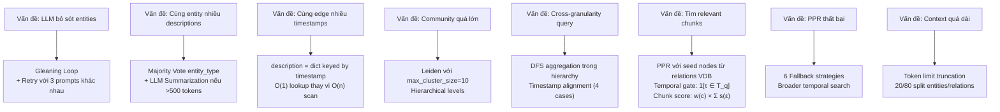

# cau hoi khi prompt
```bash
Nhưng từ các thuật toán bạn chưa giải thích rõ trong từng bước ra sao của build graph hay query graph ? Tại vì cái tôi cần là hiểu sâu hơn của từng bước khi build graph, khi query graph để xử lý đúng bài toán ra sao, tại sao làm như v, cấu hình thế nào? Ứng dụng ra sao nữa
```

Để trả lời chi tiết về từng thuật toán, tôi cần đọc sâu vào source code của các bước quan trọng nhất.

Dưới đây là phân tích sâu về **từng thuật toán cụ thể** trong mỗi bước của Build Graph và Query Graph, giải thích tại sao dùng thuật toán đó, cấu hình ảnh hưởng ra sao, và ứng dụng thực tế.

---

# BUILD GRAPH — Thuật toán từng bước

---

## B1: Chunking — Sliding Window với Token Overlap

**Thuật toán:** Sliding window với bước nhảy cố định.

```bash
step_size = max_token_size - overlap_token_size
         = 1200 - 100 = 1100 tokens

Chunk 0: tokens[0 : 1200]
Chunk 1: tokens[1100 : 2300]   ← overlap 100 tokens với chunk 0
Chunk 2: tokens[2200 : 3400]   ← overlap 100 tokens với chunk 1
```

**Tại sao dùng sliding window?** Vì thông tin quan trọng thường nằm ở ranh giới giữa hai đoạn. Ví dụ: câu "Revenue in Q1 2022 was $4.0B, which represents..." có thể bị cắt đôi. Overlap 100 tokens đảm bảo cả hai chunks đều chứa đủ context để LLM hiểu.

**Tại sao title được prepend vào mỗi chunk?** Khi chunk 2 chứa phần Q&A cuối transcript, LLM không biết đây là của công ty nào, quý nào. Title `"DXC Technology 2022 Q1"` được prepend giúp LLM luôn có context đầy đủ. [1]

**Config ảnh hưởng:**
- `chunk_size: 1200` — Nhỏ hơn → nhiều chunks → nhiều LLM calls → tốn tiền hơn nhưng extract chi tiết hơn. Lớn hơn → ít calls nhưng LLM có thể bỏ sót entities ở cuối chunk.
- `chunk_overlap: 100` — Tăng lên 200 → ít mất thông tin ở ranh giới hơn nhưng tăng số tokens xử lý.

---

## B2: Entity Extraction — LLM + Gleaning Loop + Retry

Đây là bước tốn kém nhất và phức tạp nhất. Hàm `_process_single_content()` xử lý từng chunk với **3 lớp bảo vệ**:

**Lớp 1 — Retry với exponential backoff (tối đa 3 lần):**

```python
for attempt in range(3):
    if attempt == 0:
        hint_prompt = entity_extract_prompt.format(...)  # Prompt đầy đủ
    elif attempt == 1:
        hint_prompt = simplified_prompt.format(...)      # Prompt đơn giản hơn
    else:
        hint_prompt = basic_prompt.format(...)           # Prompt tối giản nhất
    
    raw_llm_result = await use_llm_func(hint_prompt)
    # ...
    if valid_records > 0:
        break  # Thành công, thoát retry loop
    else:
        await asyncio.sleep(2 ** attempt)  # 1s, 2s, 4s backoff
```

**Tại sao cần 3 prompt khác nhau?** Một số LLM (đặc biệt Gemini) đôi khi trả về format không đúng với prompt phức tạp. Prompt đơn giản hơn ở attempt 2-3 tăng khả năng nhận được output hợp lệ. 

**Lớp 2 — Gleaning Loop (tối đa `entity_extract_max_gleaning=1` lần):**

```python
history = pack_user_ass_to_openai_messages(hint_prompt, final_result)

for now_glean_index in range(entity_extract_max_gleaning):
    glean_result = await use_llm_func(continue_prompt, history_messages=history)
    # continue_prompt = "MANY entities were missed. Add them below using the same format:"
    
    history += pack_user_ass_to_openai_messages(continue_prompt, glean_result)
    final_result += glean_result  # Nối thêm vào kết quả
    
    # Hỏi LLM có còn entities bị bỏ sót không
    if_loop_result = await use_llm_func(if_loop_prompt, history_messages=history)
    # if_loop_prompt = "It appears some entities may have still been missed. Answer YES | NO"
    if if_loop_result.strip().lower() != "yes":
        break  # LLM nói không còn → dừng gleaning
```

**Tại sao cần gleaning?** LLM có xu hướng bỏ sót entities khi chunk dài. Gleaning là kỹ thuật "multi-turn conversation" — sau lần extract đầu, hỏi LLM "còn thiếu gì không?" và tiếp tục extract. Với `entity_extract_max_gleaning=1`, chỉ gleaning 1 lần để cân bằng giữa chất lượng và chi phí. 

**Lớp 3 — Async Gather (tất cả chunks song song):**

```python
results = await asyncio.gather(
    *[_process_single_content(c) for c in ordered_chunks]
)
```

Tất cả chunks được xử lý đồng thời, giới hạn bởi `best_model_max_async=32` (semaphore). Với 960 chunks, thay vì xử lý tuần tự (960 × ~2s = ~32 phút), async gather chạy 32 chunks cùng lúc → ~60 lần nhanh hơn. 

**Parse output LLM:** Sau khi nhận raw text từ LLM, hệ thống split theo `record_delimiter="##"` và `completion_delimiter="<|COMPLETE|>"`, rồi với mỗi record dùng regex `\((.*)\)` để extract nội dung trong ngoặc, rồi split theo `tuple_delimiter="<|>"`:

```json
Raw: ("entity"<|>"2022-Q1"<|>"quarter"<|>"Q1 2022 earnings period")##
     ("relationship"<|>"2022-Q1"<|>"DXC TECHNOLOGY"<|>"MIKE SALVINO"<|>"CEO reported...")<|COMPLETE|>

→ Record 1: ["entity", "2022-Q1", "quarter", "Q1 2022 earnings period"]
→ Record 2: ["relationship", "2022-Q1", "DXC TECHNOLOGY", "MIKE SALVINO", "CEO reported..."]
``` 

---

## B3: Temporal Normalization — Singleton + 4 Chiến lược

`get_temporal_normalizer()` trả về singleton `TemporalNormalizer`. Singleton pattern đảm bảo chỉ khởi tạo `EnhancedTemporalNormalizer` một lần duy nhất — quan trọng vì normalizer load nhiều regex patterns và có thể tốn memory.

Khi `_handle_single_entity_extraction()` gặp entity có `entity_type` trong `DEFAULT_TEMPORAL_HIERARCHY = ["year", "quarter", "month", "date"]`, nó gọi:

```python
normalizer = get_temporal_normalizer()
normalized_result = normalizer.normalize_temporal_expression("Q1 2022")
```

Bên trong, `EnhancedTemporalNormalizer` thử 4 chiến lược theo thứ tự:

```bash
1. _try_range_normalization("Q1 2022")   → None (không phải range)
2. _try_exact_normalization("Q1 2022")   → None (không phải format chuẩn)
3. _try_relative_normalization("Q1 2022") → None (không phải relative)
4. _try_fuzzy_normalization("Q1 2022")   → "2022-Q1" (confidence=0.9)
```

Output là `TemporalNormalizationResult`:
```python
TemporalNormalizationResult(
    normalized_forms=["2022-Q1"],
    granularity=TemporalGranularity.QUARTER,
    confidence=0.9,
    normalization_type="fuzzy"
)
```

**Tại sao cần confidence?** Khi confidence thấp (< 0.5), hệ thống có thể fallback sang `enhanced_infer_timestamp_level()` — một hàm đơn giản hơn dùng regex pattern matching. Confidence cao (1.0) từ exact normalization được ưu tiên hơn. 

---

## B4: Phân loại Temporal vs Non-temporal

Sau khi extract xong tất cả chunks, hệ thống phân loại entities:

```python
for name, data in maybe_nodes.items():
    if data[0].get('is_temporal', False) or \
       data[0]['entity_type'].lower() in PROMPTS['DEFAULT_TEMPORAL_HIERARCHY']:
        temporal_entities[name] = data    # → temporal_hierarchy_graph
    else:
        non_temporal_entities[name] = data  # → chunk_entity_relation_graph
```

**Tại sao phân loại?** Temporal entities (timestamps) không nên nằm trong entity-relation graph như các entities thông thường — chúng là "trục thời gian", không phải "nhân vật". Nếu để lẫn, Leiden clustering sẽ nhóm timestamps vào communities không có ý nghĩa.

**Ngoại lệ:** Temporal entities có quan hệ với non-temporal entities (ví dụ: `2022-Q1 → DXC TECHNOLOGY`) vẫn được thêm vào entity-relation graph để tạo edges kết nối timestamp với entity. 

---

## B5: Merge Nodes — Counter + Majority Vote + LLM Summarization

Cùng một entity có thể được extract nhiều lần từ nhiều chunks khác nhau với descriptions khác nhau. `_merge_nodes_then_upsert()` giải quyết bằng 3 bước:

**Bước 1 — Majority vote cho entity_type:**
```python
entity_type = sorted(
    Counter(
        [dp["entity_type"] for dp in nodes_data] + already_entity_types
    ).items(),
    key=lambda x: x[1],  # sort by count
    reverse=True,
)[0][0]  # lấy type có count cao nhất
```

Ví dụ: "DXC TECHNOLOGY" được extract 5 lần: 3 lần là "COMPANY", 2 lần là "ORGANIZATION" → entity_type = "COMPANY".

**Tại sao majority vote?** LLM không nhất quán — cùng entity có thể được classify khác nhau ở các chunks khác nhau. Majority vote là cách đơn giản và hiệu quả để chọn type đúng nhất.

**Bước 2 — Concatenate descriptions:**
```python
description = GRAPH_FIELD_SEP.join(
    sorted(set([dp["description"] for dp in nodes_data] + already_description))
)
```

`GRAPH_FIELD_SEP = "<SEP>"`. Tất cả descriptions được join lại, deduplicated bằng `set()`.

**Bước 3 — LLM Summarization nếu description quá dài:**
```python
tokens = encode_string_by_tiktoken(description)
if len(tokens) >= entity_summary_to_max_tokens:  # 500 tokens
    # Gọi cheap_model_func để summarize
    summary = await use_llm_func(
        PROMPTS["summarize_entity_descriptions"].format(
            entity_name=entity_name,
            description_list=description.split(GRAPH_FIELD_SEP)
        )
    )
```

**Tại sao dùng `cheap_model_func` cho summarization?** Summarization là tác vụ đơn giản hơn extraction — không cần model mạnh nhất. Dùng model rẻ hơn (ví dụ: `gpt-4o-mini` thay vì `gpt-4o`) tiết kiệm chi phí đáng kể khi có hàng nghìn entities.  

---

## B6: Merge Temporal Edges — Dict keyed by Timestamp

`_merge_temporal_edges_then_upsert()` là bước quan trọng nhất tạo ra cấu trúc dữ liệu đặc trưng của Temporal-GraphRAG:

```python
# Merge descriptions từ nhiều chunks
for dp in edges_data:
    already_description.update(dp['description'])  # dict.update()
    already_source_ids.update(dp['source_id'])

# Kết quả: description là dict keyed by timestamp
edge_data = {
    "description": {
        "2022-Q1": "Mike Salvino reported $4.0B revenue",
        "2022-Q2": "Mike Salvino led cost optimization"
    },
    "source_id": {
        "2022-Q1": "chunk-b7e4a1f2",
        "2022-Q2": "chunk-c9d5b3e8"
    }
}
```

**Sau đó tạo thêm 2 edges kết nối timestamp với entities:**
```python
# Edge: 2022-Q1 ─── DXC TECHNOLOGY
await knowledge_graph_inst.upsert_edge("2022-Q1", "DXC TECHNOLOGY", ...)
# Edge: 2022-Q1 ─── MIKE SALVINO
await knowledge_graph_inst.upsert_edge("2022-Q1", "MIKE SALVINO", ...)
```

**Tại sao cần 2 edges phụ này?** Khi query "What happened in Q1 2022?", hệ thống cần tìm tất cả entities liên quan đến `2022-Q1`. Edges `2022-Q1 → DXC TECHNOLOGY` và `2022-Q1 → MIKE SALVINO` cho phép graph traversal trực tiếp từ timestamp node đến entities.

**Tại sao description là dict thay vì string?** Khi query "What happened in Q1 2022?", hệ thống chỉ cần `description["2022-Q1"]` — O(1) lookup. Nếu description là string chứa tất cả timestamps, phải parse lại — O(n). 

---

## B7: Convert to Temporal Quadruples

Sau khi merge xong, `_convert_to_temporal_quadruples()` tạo explicit `TemporalQuadruple(v₁, v₂, e, τ)`:

```python
for (timestamp, src_id, tgt_id), edge_data_list in maybe_edges.items():
    # Bỏ qua nếu src hoặc tgt là temporal entity
    if src_is_temporal or tgt_is_temporal:
        continue
    
    # Bỏ qua nếu entity là financial metric ($4.0B, 15%, ...)
    if financial_pattern.match(clean_src_id):
        continue
    
    # Normalize timestamp
    normalized_result = normalizer.normalize_temporal_expression(timestamp)
    normalized_timestamp = normalized_result.normalized_forms[0]
    
    quadruple = TemporalQuadruple(
        v1="DXC TECHNOLOGY",
        v2="MIKE SALVINO",
        e="Mike Salvino served as CEO reporting $4.0B revenue",
        tau="2022-Q1",
        source_id="chunk-b7e4a1f2"
    )
```

**Tại sao filter financial metrics?** LLM đôi khi extract "$4.0B" hoặc "15%" như entities. Quadruples chỉ nên chứa named entities có ý nghĩa ngữ nghĩa, không phải số liệu thuần túy. 

---

## B8: Vector DB Upsert — Content = Name + Description

```python
# Entities → entities_vdb
data_for_vdb = {
    compute_mdhash_id("DXC TECHNOLOGY", prefix="ent-"): {
        "content": "DXC TECHNOLOGY " + "A global IT services company...",
        "entity_name": "DXC TECHNOLOGY",
    }
}

# Relations → relations_vdb
# Key format: "src_tgt_timestamp"
data_for_vdb_relation = {
    compute_mdhash_id("DXC TECHNOLOGY_MIKE SALVINO_2022-Q1", prefix="rel-"): {
        "content": "Mike Salvino served as CEO reporting $4.0B revenue",
        "entity_name": "DXC TECHNOLOGY_MIKE SALVINO_2022-Q1",
    }
}
```

**Tại sao content = name + description cho entities?** Khi query "Who was CEO of DXC in Q1 2022?", vector search cần match với entity "MIKE SALVINO" có description "CEO of DXC Technology". Nếu chỉ lưu name "MIKE SALVINO", cosine similarity với query sẽ thấp. Description cung cấp semantic context.

**Tại sao key của relation là `"src_tgt_timestamp"`?** Khi PPR tìm được relation `"DXC TECHNOLOGY_MIKE SALVINO_2022-Q1"`, hệ thống parse key này để extract `src="DXC TECHNOLOGY"`, `tgt="MIKE SALVINO"`, `timestamp="2022-Q1"` — đây là seed nodes cho PPR.

---

## B9: Leiden Clustering — Hierarchical Community Detection

```python
from graspologic.partition import hierarchical_leiden

graph = NetworkXStorage.stable_largest_connected_component(self._graph)
community_mapping = hierarchical_leiden(
    graph,
    max_cluster_size=10,      # max_graph_cluster_size
    random_seed=0xDEADBEEF   # graph_cluster_seed
)
```

**Tại sao Leiden thay vì Louvain?** Leiden algorithm (Traag et al., 2019) giải quyết vấn đề của Louvain: Louvain có thể tạo ra "disconnected communities" — các nodes trong cùng community nhưng không có đường đi giữa chúng. Leiden đảm bảo mọi community đều connected. Ngoài ra, Leiden hỗ trợ `max_cluster_size` để giới hạn kích thước community.

**Tại sao `stable_largest_connected_component`?** PageRank và Leiden chỉ hoạt động tốt trên connected graphs. Nếu graph có nhiều isolated nodes hoặc small components, lấy largest connected component đảm bảo thuật toán hoạt động đúng.

**Tại sao `max_cluster_size=10`?** Community report generation gọi LLM cho mỗi community. Community quá lớn → context quá dài → LLM bị truncate → report kém chất lượng. Community nhỏ (≤10 nodes) đảm bảo context vừa đủ.

**Hierarchical Leiden** tạo ra nhiều levels:
```json
Level 0: 3 communities lớn (DXC+MIKE+BOOKINGS, APPLE+TIM+IPHONE, ...)
Level 1: 7 communities nhỏ hơn (sub-communities của level 0)
```

Mỗi node được gán `clusters = '[{"level": 0, "cluster": 3}, {"level": 1, "cluster": 7}]'`.  

---

## B10: Building Temporal Hierarchy — DFS Aggregation

`building_temporal_hierarchy()` xây dựng cây phân cấp thời gian theo 2 phase:

**Phase 1 — Tạo parent nodes:**
```python
async def _initialize_parent_timestamp_node(node, hierarchy):
    # node = {"entity_name": "2022-Q1", "entity_type": "QUARTER"}
    # hierarchy = ["year", "quarter", "month", "date"]
    
    node_index = hierarchy.index("quarter")  # = 1
    parent_hierarchies = hierarchy[:1]       # = ["year"]
    
    for h in parent_hierarchies:
        entity_name = get_parent_timestamp_name("2022-Q1", "year")
        # → "2022"
        
        if not await temporal_hierarchy_graph.has_node("2022"):
            await temporal_hierarchy_graph.upsert_node("2022", {
                "entity_type": "YEAR",
                "instantiation": False  # Chưa xuất hiện trực tiếp
            })
        # Tạo directed edge: "2022" → "2022-Q1"
        await temporal_hierarchy_graph.upsert_edge("2022", "2022-Q1", ...)
``` [13](#4-12) 

**Phase 2 — DFS để aggregate entities từ children:**
```python
def dfs_helper(node_id: str):
    node = temporal_entity_tree_dict[node_id]
    total_entities = set(node.get("entities", []))
    total_edges = set(node.get("temporal_edges", []))
    
    for child_id in node.get("children", []):
        r = dfs_helper(child_id)  # Đệ quy xuống children
        total_entities.update(r[0])  # Gộp entities từ children
        total_edges.update(r[1])
    
    # "2022" biết tất cả entities của 2022-Q1, 2022-Q2, 2022-Q3, 2022-Q4
    temporal_entity_tree_dict[node_id]["all_entities"] = list(total_entities)
```

**Tại sao DFS?** Khi query "What happened in 2022?", hệ thống cần tất cả entities từ tất cả quarters của 2022. DFS pre-computes aggregation này một lần khi build, thay vì phải traverse lại mỗi khi query.

---

## B11: Community Report Generation — CSV Context + LLM JSON

`_pack_single_timestamp_describe()` chuẩn bị context cho LLM theo format CSV:

```python
node_fields = ["id", "entity", "type", "description", "degree"]
edge_fields = ["id", "timestamp", "source", "target", "description", "rank"]

# Sort nodes by degree (descending) — nodes quan trọng nhất lên đầu
nodes_list_data = sorted(nodes_list_data, key=lambda x: x[-1], reverse=True)

# Truncate nếu vượt token limit
nodes_may_truncate_list_data = truncate_list_by_token_size(
    nodes_list_data, key=lambda x: x[3], max_token_size=max_token_size // 2
)
```

**Tại sao sort by degree?** Nodes có degree cao (nhiều kết nối) thường là entities quan trọng nhất trong community. Khi truncate, đảm bảo giữ lại entities quan trọng nhất.

**Tại sao dùng CSV thay vì JSON cho context?** CSV compact hơn JSON — ít tokens hơn cho cùng lượng thông tin. Với `max_token_size=12000` cho community context, mỗi token tiết kiệm được đều quan trọng. 

---

# QUERY GRAPH — Thuật toán từng bước

---

## Q1: Timestamp Extraction — LLM + Parse + Normalize

LLM được gọi với prompt `extract_timestamp_in_query`. Output được parse theo cùng cơ chế với entity extraction:

```
Output: ("entity"<|>"at"<|>"2022-Q1"<|>"quarter")<|COMPLETE|>
→ record_attributes = ["entity", "at", "2022-Q1", "quarter"]
→ temporal_logic = "at", timestamp = "2022-Q1"
```

Sau đó `EnhancedTemporalNormalizer` normalize `"2022-Q1"` → `"2022-Q1"` (đã chuẩn, confidence=1.0).

**Xử lý temporal_logic:**

| Logic | Thuật toán | Ví dụ |
|---|---|---|
| `at` | Tìm exact match trong hierarchy | `"2022-Q1"` → `["2022-Q1"]` |
| `before` | Filter siblings có datetime < query_ts | `"before 2022-Q2"` → `["2022-Q1"]` |
| `after` | Filter siblings có datetime > query_ts | `"after 2022-Q2"` → `["2022-Q3", "2022-Q4"]` |
| `between` | Filter siblings trong range | `"between Q1 and Q3"` → `["2022-Q1", "2022-Q2", "2022-Q3"]` | [16](#4-15) 

---

## Q2: Timestamp Alignment — 4 Cases

`_timestamp_alignment()` điều chỉnh timestamps theo granularity mong muốn. Đây là bước tinh tế nhất:

```
Case 1a: query_granularity == preferred_granularity
  → aligned = query_timestamps (không thay đổi)
  Ví dụ: query "Q1 2022" (quarter), preferred "quarter" → ["2022-Q1"]

Case 1b: query_granularity coarser than preferred
  → Expand xuống children
  Ví dụ: query "2022" (year), preferred "quarter"
  → ["2022-Q1", "2022-Q2", "2022-Q3", "2022-Q4"]

Case 1c: query_granularity finer than preferred
  → Collapse lên parent
  Ví dụ: query "2022-01-15" (date), preferred "quarter"
  → ["2022-Q1"]

Case 2: No preferred granularity
  → Dùng query_timestamps as-is
```

**Tại sao cần alignment?** Nếu user hỏi "What happened in 2022?" nhưng data chỉ có quarterly timestamps, hệ thống cần expand "2022" → ["2022-Q1", "2022-Q2", "2022-Q3", "2022-Q4"] để tìm được tất cả relevant data.

---

## Q3: PPR Algorithm — 7 Bước Chi tiết

Đây là thuật toán trung tâm của local query. Hàm `_retrieve_chunks_with_ppr_algorithm()`:

**Step 1 — Query Relations VDB:**
```python
top_k_relations = query_param.top_k * 3  # 50 × 3 = 150 relations
relations_query_result = await relations_vdb.query(query, top_k=150)
# → [{"entity_name": "DXC TECHNOLOGY_MIKE SALVINO_2022-Q1", "similarity": 0.87}, ...]
```

**Tại sao top_k × 3?** Sau khi filter theo timestamp, nhiều relations sẽ bị loại. Lấy 3× nhiều hơn đảm bảo sau filter vẫn còn đủ seed nodes. 

**Step 2 — Expand Timestamps via Hierarchy:**
```python
for query_ts in aligned_timestamp_in_query:  # ["2022-Q1"]
    descendants = _get_all_descendant_timestamps(query_ts, temporal_hierarchy)
    # "2022-Q1" → {"2022-Q1", "2022-01", "2022-02", "2022-03", "2022-01-15", ...}
    timestamps_set.update(descendants)
```

**Tại sao expand descendants?** Nếu data có edge với timestamp `"2022-01"` (month) nhưng query là `"2022-Q1"` (quarter), không expand sẽ bỏ sót edge này. Expand đảm bảo tất cả finer-grained timestamps trong range đều được include. 

**Step 3 — Filter Relations → Seed Nodes:**
```python
for relation in relations_query_result:
    entity_name = relation["entity_name"]  # "DXC TECHNOLOGY_MIKE SALVINO_2022-Q1"
    names = entity_name.split('_')
    src_id, tgt_id, timestamp = names[0], names[1], names[2]
    
    if timestamp in timestamps_set:  # "2022-Q1" ∈ {"2022-Q1", "2022-01", ...}
        seed_nodes.add(src_id)   # "DXC TECHNOLOGY"
        seed_nodes.add(tgt_id)   # "MIKE SALVINO"
        relation_metadata[(src_id, tgt_id, timestamp)] = similarity  # 0.87
``` [19](#4-18) 

**Step 4 — Personalized PageRank:**
```python
ppr_results = await knowledge_graph_inst.get_top_pagerank_nodes(
    personalization_nodes=list(seed_nodes),  # ["DXC TECHNOLOGY", "MIKE SALVINO", ...]
    top_k=query_param.top_k * 2,             # 100 nodes
    alpha=0.85
)
```

Bên trong `personalized_pagerank()`:
```python
# Tạo personalization vector: equal weight cho mỗi seed node
weight_per_node = 1.0 / len(seed_nodes)  # 1/3 = 0.333 nếu có 3 seed nodes
personalization = {node: weight_per_node for node in seed_nodes}

# Gọi NetworkX PageRank
ppr_scores = nx.pagerank(
    self._graph,
    alpha=0.85,              # 85% follow edge, 15% teleport to seed
    personalization=personalization,
    max_iter=100,
    tol=1e-06,
    weight='weight'          # Dùng edge weight
)
```

**Tại sao α=0.85?** Đây là giá trị chuẩn trong PageRank (Google dùng 0.85). α cao → random walker ít teleport về seed nodes → scores lan rộng hơn trong graph. α thấp → scores tập trung hơn quanh seed nodes. 0.85 là trade-off tốt giữa locality và coverage. 

**Step 5 — Score Edges (Temporal Gate):**
```python
for i in range(len(ppr_results)):
    for j in range(i + 1, len(ppr_results)):
        src_id, tgt_id = ppr_results[i][0], ppr_results[j][0]
        edge_data = await knowledge_graph_inst.get_edge(src_id, tgt_id)
        
        # s(ε) = s(v₁) + s(v₂)
        edge_score = ppr_scores.get(src_id, 0.0) + ppr_scores.get(tgt_id, 0.0)
        
        source_id_dict = edge_data.get('source_id', {})  # {"2022-Q1": "chunk-b7e4", ...}
        
        # Temporal gate: 1[τ ∈ T_q]
        for timestamp_clean in timestamps_set:
            if timestamp_clean in source_id_dict:
                chunk_id = source_id_dict[timestamp_clean]
                chunk_edge_scores[chunk_id] += edge_score      # Σ s(ε)
                chunk_edge_similarities[chunk_id].append(similarity)  # γ_ε
```

**Tại sao duyệt tất cả cặp (i,j) trong top PPR nodes?** Không phải mọi cặp nodes đều có edge. Duyệt tất cả cặp và check `get_edge()` đảm bảo không bỏ sót edge nào giữa top-ranked nodes. 

**Step 6 — Score Chunks:**
```python
for chunk_id, edge_score_sum in chunk_edge_scores.items():
    # w(c) = ∏_{ε∈E(c)} (1 + γ_ε)
    chunk_weight = 1.0
    for gamma_epsilon in chunk_edge_similarities[chunk_id]:
        chunk_weight *= (1.0 + gamma_epsilon)
    
    # s(c) = w(c) × Σ s(ε)
    doc_scores[chunk_id] = chunk_weight * edge_score_sum
```

**Tại sao tích thay vì tổng cho w(c)?** Tích có tính chất multiplicative: chunk có 3 edges với similarity 0.8, 0.7, 0.9 sẽ có `w = 1.8 × 1.7 × 1.9 = 5.81`. Chunk có 1 edge với similarity 0.95 sẽ có `w = 1.95`. Tích thưởng mạnh cho chunks có nhiều relevant edges — đây là hành vi mong muốn vì chunk đó chứa nhiều thông tin liên quan đến query.

**Step 7 — Select Chunks by Token Limit:**
```python
sorted_chunks = sorted(doc_scores.items(), key=lambda x: x[1], reverse=True)
top_chunk_ids = [chunk_id for chunk_id, score in sorted_chunks[:query_param.top_k]]

total_tokens = 0
for chunk_id in top_chunk_ids:
    chunk_data = await text_chunks_db.get_by_id(chunk_id)
    chunk_tokens = len(encode_string_by_tiktoken(chunk_content))
    
    if total_tokens + chunk_tokens > max_tokens:  # 4000 tokens
        break  # Dừng khi đạt token limit
    
    chunks.append(chunk_data)
    total_tokens += chunk_tokens
```

**Tại sao dừng theo token limit thay vì top_k?** Token limit đảm bảo context không vượt LLM context window. Một chunk có thể dài 1200 tokens, nên top_k=50 chunks có thể = 60,000 tokens — vượt xa context window. Dừng theo token limit (4000) đảm bảo LLM nhận được context vừa đủ. 

---

## Q4: Build Context — `---NEW CHUNK---` Format

```python
chunk_formatter = """---NEW CHUNK---
Document Title: {full_doc_title}
Chunk Order Index: {chunk_order_index}
Chunk Content:
{chunk_content}
---END OF CHUNK---

"""
```

**Tại sao format này?** LLM cần biết:
- `Document Title`: Chunk này từ công ty nào, quý nào (context)
- `Chunk Order Index`: Chunk này là phần đầu hay cuối transcript (temporal ordering)
- `---NEW CHUNK---` delimiter: Phân biệt rõ ràng các chunks khác nhau

**Tại sao không dùng entities/relations trong context?** Theo source code comment: *"Only using text units (original chunks), not entities/relations/communities"*. Lý do: raw text chunks chứa đầy đủ thông tin gốc, trong khi entities/relations là abstractions có thể mất thông tin. LLM generate tốt hơn từ raw text.

---

## Q5: Supplemental Evidence — 6 Fallback Strategies

Khi PPR tìm được < 4 pieces of evidence, hệ thống thử 6 chiến lược theo thứ tự:

```
Strategy 1: Thử relations-based retrieval (nếu đang dùng entities method)
Strategy 2: Broader temporal search (mở rộng ra cả năm)
Strategy 3: General search với top_k × 2 (không filter timestamp)
Strategy 4: Get additional relations cho entities mới tìm được
Strategy 5: Get additional community reports
Strategy 6: Get additional text units
```

**Strategy 2 — Broader temporal search:**
```python
# Nếu query "2022-Q1" không tìm được gì, thử tất cả timestamps trong 2022
query_years = {"2022"}
broader_timestamps = [ts for ts in temporal_hierarchy.keys()
                      if any(year in ts for year in query_years)]
# → ["2022", "2022-Q1", "2022-Q2", "2022-Q3", "2022-Q4", "2022-01", ...]
```

**Tại sao cần 6 strategies?** Đảm bảo hệ thống luôn trả về câu trả lời hữu ích, ngay cả khi:
- Timestamp không tồn tại trong data
- Graph quá thưa (sparse)
- Query quá specific 

---

## Tổng kết: Thuật toán → Vấn đề → Giải pháp



### Citations

**File:** tgrag/src/core/chunking.py (L131-202)
```python
def chunking_by_token_size(
    tokens_list: List[List[int]],
    doc_keys: List[str],
    tiktoken_model: tiktoken.Encoding,
    title_tokens_list: Optional[List[List[int]]] = None,
    overlap_token_size: int = 128,
    max_token_size: int = 1024,
) -> List[Dict[str, Any]]:
    """
    Chunk documents by fixed token size with optional overlap.
    
    This function splits documents into chunks of approximately max_token_size tokens,
    with optional overlap between chunks. Supports optional title tokens that are
    prepended to each chunk.
    
    Args:
        tokens_list: List of token sequences, one per document
        doc_keys: List of document identifiers
        tiktoken_model: Tiktoken encoding model for decoding
        title_tokens_list: Optional list of title token sequences
        overlap_token_size: Number of tokens to overlap between chunks
        max_token_size: Maximum tokens per chunk
        
    Returns:
        List of chunk dictionaries with keys: tokens, content, chunk_order_index, full_doc_id
        
    Example:
        >>> import tiktoken
        >>> encoder = tiktoken.encoding_for_model("gpt-4o")
        >>> tokens = [encoder.encode("This is a long document...")]
        >>> chunks = chunking_by_token_size(tokens, ["doc1"], encoder, max_token_size=100)
    """
    if not tokens_list:
        return []
    
    if len(tokens_list) != len(doc_keys):
        raise ValueError(f"tokens_list length ({len(tokens_list)}) must match doc_keys length ({len(doc_keys)})")
    
    results = []
    if not title_tokens_list:
        title_tokens_list = [[] for _ in tokens_list]
    
    if len(title_tokens_list) != len(tokens_list):
        raise ValueError(f"title_tokens_list length ({len(title_tokens_list)}) must match tokens_list length ({len(tokens_list)})")
    
    for index, (tokens, title_tokens) in enumerate(zip(tokens_list, title_tokens_list)):
        chunk_token = []
        lengths = []
        max_token_size_minus_title = max_token_size - len(title_tokens)
        
        if max_token_size_minus_title <= 0:
            raise ValueError(f"max_token_size ({max_token_size}) must be greater than title length ({len(title_tokens)})")
        
        step_size = max(1, max_token_size_minus_title - overlap_token_size)
        for start in range(0, len(tokens), step_size):
            chunk = title_tokens + tokens[start: start + max_token_size_minus_title]
            chunk_token.append(chunk)
            lengths.append(min(max_token_size, len(tokens) - start + len(title_tokens)))

        # Decode batch for efficiency
        chunk_token = tiktoken_model.decode_batch(chunk_token)
        for i, chunk in enumerate(chunk_token):
            results.append(
                {
                    "tokens": lengths[i],
                    "content": chunk.strip(),
                    "chunk_order_index": i,
                    "full_doc_id": doc_keys[index],
                }
            )

    return results
```

**File:** tgrag/src/core/building.py (L156-195)
```python
    # Enhanced timestamp processing with enhanced temporal normalizer
    if entity_type.lower() in PROMPTS['DEFAULT_TEMPORAL_HIERARCHY']:
        try:
            # Use centralized temporal normalizer for consistent timestamp normalization
            normalizer = get_temporal_normalizer()
            normalized_result = normalizer.normalize_temporal_expression(entity_name)
            
            if normalized_result and normalized_result.normalized_forms:
                # Create one entity with the original name, but store normalized forms as metadata
                # This avoids source_id conflicts while preserving temporal alignment information
                logger.info(f"Enhanced normalized timestamp entity: {entity_name} -> {normalized_result.normalized_forms} (confidence: {normalized_result.confidence}, type: {normalized_result.normalization_type})")
                
                # Use enhanced normalizer result's granularity directly
                type_ = normalized_result.granularity.value
                
                # Create entity with original name but include normalized forms as metadata
                return dict(
                    entity_name=entity_name,  # Keep original name
                    entity_type=type_.upper(),
                    description=entity_description,
                    source_id=entity_source_id,
                    is_temporal=True,  # Mark as temporal entity
                    normalized_forms=normalized_result.normalized_forms,  # Store normalized forms as metadata
                    normalization_confidence=normalized_result.confidence,
                    normalization_type=normalized_result.normalization_type
                )
            else:
                logger.warning(f"Failed to normalize timestamp {entity_name} with enhanced normalizer, falling back to basic normalization")
                # Fall back to basic inference
                type_ = enhanced_infer_timestamp_level(entity_name)
                return dict(
                    entity_name=entity_name,
                    entity_type=type_.upper(),
                    description=entity_description,
                    source_id=entity_source_id,
                    is_temporal=True,  # Mark as temporal entity
                )
        except Exception as e:
            logger.warning(f"Failed to infer timestamp level for {entity_name}: {e}")
            return None
```

**File:** tgrag/src/core/building.py (L430-481)
```python
async def _merge_nodes_then_upsert(
        entity_name: str,
        nodes_data: list[dict],
        knwoledge_graph_inst: BaseGraphStorage,
        global_config: dict,
):
    # issue existing node info can be {}
    already_entitiy_types = []
    already_source_ids = []
    already_description = []

    already_node = await knwoledge_graph_inst.get_node(entity_name)
    if already_node is not None and already_node:
        already_entitiy_types.append(already_node["source_id"])
        already_source_ids.extend(
            split_string_by_multi_markers(already_node["source_id"], [GRAPH_FIELD_SEP])
        )
        already_description.append(already_node["description"])

    entity_type = sorted(
        Counter(
            [dp["entity_type"] for dp in nodes_data] + already_entitiy_types
        ).items(),
        key=lambda x: x[1],
        reverse=True,
    )[0][0]
    description = GRAPH_FIELD_SEP.join(
        sorted(set([dp["description"] for dp in nodes_data] + already_description))
    )
    source_id = GRAPH_FIELD_SEP.join(
        set([dp["source_id"] for dp in nodes_data] + already_source_ids)
    )
    description = await _handle_entity_relation_summary(
        entity_name, description, global_config
    )
    # Ensure description is never None
    if description is None:
        logger.warning(f"Description is None for entity {entity_name}, using empty string")
        description = ""
    
    node_data = dict(
        entity_type=entity_type,
        description=description,
        source_id=source_id,
    )
    await knwoledge_graph_inst.upsert_node(
        entity_name,
        node_data=node_data,
    )
    node_data["entity_name"] = entity_name
    return node_data

```

**File:** tgrag/src/core/building.py (L544-638)
```python
async def _merge_temporal_edges_then_upsert(
        timestamp_id: str,
        src_id: str,
        tgt_id: str,
        edges_data: list[dict],
        knwoledge_graph_inst: BaseGraphStorage,
        global_config: dict,
):
    already_source_ids = dict()
    already_description = dict()
    already_temporal_level = dict()
    already_order = []

    logger.info(f"maybe edge {timestamp_id}, {src_id}, {tgt_id}")
    # no placeholder
    if await knwoledge_graph_inst.has_edge(src_id, tgt_id):
        src_data = await knwoledge_graph_inst.get_node(src_id)
        tgt_data = await knwoledge_graph_inst.get_node(tgt_id)
        if src_data.get('entity_type').lower() in PROMPTS['DEFAULT_TEMPORAL_HIERARCHY'] or tgt_data.get(
                'entity_type').lower() in PROMPTS['DEFAULT_TEMPORAL_HIERARCHY']:
            logger.info(f"Skipping temporal edge {src_id} -> {tgt_id} (temporal entities: {src_data.get('entity_type')}, {tgt_data.get('entity_type')})")
            return
        already_edge = await knwoledge_graph_inst.get_edge(src_id, tgt_id)
        already_source_ids = already_edge['source_id']
        already_description = already_edge['description']
        # Ensure we get a valid integer for order, defaulting to 1 if None or missing
        order_val = already_edge.get("order")
        if order_val is None:
            order_val = 1
        already_order.append(order_val)

    # Filter out None values from already_order to prevent concatenation errors
    valid_already_order = [order_val for order_val in already_order if order_val is not None]
    order = min([dp.get("order", 1) for dp in edges_data] + valid_already_order)
    
    for dp in edges_data:
        already_description.update(dp['description'])
        already_source_ids.update(dp['source_id'])

    for need_insert_id in [src_id, tgt_id]:
        if not (await knwoledge_graph_inst.has_node(need_insert_id)):
            description = GRAPH_FIELD_SEP.join(list(already_description.values()))
            source_id = GRAPH_FIELD_SEP.join(
                list(already_source_ids.values())
            )
            description = await _handle_entity_relation_summary(
                need_insert_id, description, global_config
            )
            # Ensure description is never None
            if description is None:
                logger.warning(f"Description is None for temporal node {need_insert_id}, using empty string")
                description = ""
            
            await knwoledge_graph_inst.upsert_node(
                need_insert_id,
                node_data={
                    "source_id": source_id,  # not dict
                    "description": description,  # not dict
                    "entity_type": '"UNKNOWN"',
                },
            )
    
    logger.info(f"upsert {src_id} and {tgt_id} edge")
    await knwoledge_graph_inst.upsert_edge(
        src_id,
        tgt_id,
        edge_data=dict(
            description=already_description, source_id=already_source_ids, order=order
        ),
    )
    logger.info(f"upsert {timestamp_id} and {tgt_id} edge")
    logger.info(f"upsert {timestamp_id} and {src_id} edge")

    # add timestamp and entity edge
    await knwoledge_graph_inst.upsert_edge(
        timestamp_id,
        tgt_id,
        edge_data=dict(
            description=dict(), source_id=already_source_ids, order=order
        ),
    )
    await knwoledge_graph_inst.upsert_edge(
        timestamp_id,
        src_id,
        edge_data=dict(
            description=dict(), source_id=already_source_ids, order=order
        ),
    )
    edge_data = dict(
            description=already_description, source_id=already_source_ids, order=order
        )
    edge_data['src_id'] = src_id
    edge_data['tgt_id'] = tgt_id

    return edge_data
```

**File:** tgrag/src/core/building.py (L641-762)
```python
# Helper function: convert extracted relationships to temporal quadruples
def _convert_to_temporal_quadruples(
    maybe_edges: Dict[tuple, List[dict]],
    maybe_nodes: Dict[str, List[dict]],
    normalizer=None
) -> List[TemporalQuadruple]:
    """
    Convert extracted relationships to explicit temporal quadruples (v₁, v₂, e, τ).
    
    This function transforms the extracted relationship data into the explicit
    TemporalQuadruple structure as described in the paper, where:
    - v₁ and v₂ are non-temporal entities
    - e is the relation description
    - τ is the normalized timestamp
    
    Args:
        maybe_edges: Dictionary mapping (timestamp, src_id, tgt_id) to list of edge data
        maybe_nodes: Dictionary mapping entity names to list of node data
        normalizer: Optional temporal normalizer instance (uses global if None)
        
    Returns:
        List of TemporalQuadruple objects
    """
    from ..temporal.normalization import get_temporal_normalizer
    
    if normalizer is None:
        normalizer = get_temporal_normalizer()
    
    quadruples = []
    
    for (timestamp, src_id, tgt_id), edge_data_list in maybe_edges.items():
        # Skip if either entity is temporal (quadruples only contain non-temporal entities)
        src_is_temporal = False
        tgt_is_temporal = False
        
        if src_id in maybe_nodes:
            src_data = maybe_nodes[src_id][0]
            src_is_temporal = src_data.get('is_temporal', False) or \
                            src_data.get('entity_type', '').lower() in PROMPTS['DEFAULT_TEMPORAL_HIERARCHY']
        
        if tgt_id in maybe_nodes:
            tgt_data = maybe_nodes[tgt_id][0]
            tgt_is_temporal = tgt_data.get('is_temporal', False) or \
                            tgt_data.get('entity_type', '').lower() in PROMPTS['DEFAULT_TEMPORAL_HIERARCHY']
        
        # Only create quadruples for non-temporal entity relationships
        # Temporal entities are handled separately in the time hierarchy
        if src_is_temporal or tgt_is_temporal:
            continue
        
        # Clean entity names (remove embedded delimiters and quotes)
        clean_src_id = _sanitize_attribute(src_id).strip()
        clean_tgt_id = _sanitize_attribute(tgt_id).strip()
        
        # Skip if entities are empty or contain only delimiters
        if not clean_src_id or not clean_tgt_id:
            continue
        
        # Additional filtering: Skip if entity looks like a financial metric
        # (starts with $ or is a percentage/metric)
        financial_pattern = re.compile(r'^[\$%]|^\d+[\.\d]*\s*(MILLION|BILLION|THOUSAND|PAIRS|%|PERCENT)', re.IGNORECASE)
        if financial_pattern.match(clean_src_id) or financial_pattern.match(clean_tgt_id):
            continue
        
        # Validate and normalize timestamp
        raw_timestamp = timestamp
        # Skip if timestamp looks like a financial amount or other non-temporal value
        if raw_timestamp.startswith('$') or financial_pattern.match(raw_timestamp):
            logger.debug(f"Skipping quadruple with non-temporal timestamp: {raw_timestamp}")
            continue
        
        # Try to normalize timestamp using the enhanced normalizer
        try:
            normalized_result = normalizer.normalize_temporal_expression(raw_timestamp)
            if normalized_result and normalized_result.normalized_forms and normalized_result.granularity:
                # Valid temporal expression
                normalized_timestamp = normalized_result.normalized_forms[0]
            else:
                # Invalid temporal expression - skip this quadruple
                logger.debug(f"Skipping quadruple with invalid timestamp: {raw_timestamp}")
                continue
        except Exception as e:
            logger.debug(f"Error normalizing timestamp '{raw_timestamp}': {e}, skipping quadruple")
            continue
        
        # Extract relation description from edge data
        for edge_data in edge_data_list:
            # Get description (can be dict or string)
            description = edge_data.get('description', '')
            if isinstance(description, dict):
                # If description is a dict keyed by timestamp, get the value
                description = description.get(timestamp, description.get(raw_timestamp, ''))
                if isinstance(description, dict):
                    # If still a dict, get first value or convert to string
                    description = str(list(description.values())[0]) if description else ''
            
            # Clean description
            if description:
                description = _sanitize_attribute(str(description)).strip()
            
            source_id = edge_data.get('source_id', '')
            if isinstance(source_id, dict):
                source_id = source_id.get(timestamp, source_id.get(raw_timestamp, ''))
                if isinstance(source_id, dict):
                    source_id = list(source_id.values())[0] if source_id else ''
            
            # Skip if description is empty or just whitespace
            if not description:
                continue
            
            quadruple = TemporalQuadruple(
                v1=clean_src_id,
                v2=clean_tgt_id,
                e=description,
                tau=normalized_timestamp,
                source_id=str(source_id) if source_id else '',
                raw_timestamp=raw_timestamp
            )
            quadruples.append(quadruple)
    
    logger.info(f"Converted {len(maybe_edges)} relationship groups to {len(quadruples)} temporal quadruples")
    return quadruples
```

**File:** tgrag/src/core/building.py (L803-830)
```python
        max_retries = 3
        for attempt in range(max_retries):
            logger.info(f"Processing chunk {chunk_key}: Attempt {attempt + 1}/{max_retries}")
            try:
                # Try different prompts based on attempt number
                if attempt == 0:
                    # Standard prompt
                    hint_prompt = entity_extract_prompt.format(**context_base, input_text=content)
                elif attempt == 1:
                    # Simplified prompt for retry
                    simplified_prompt = PROMPTS.get("temporal_entity_extraction_old", entity_extract_prompt)
                    hint_prompt = simplified_prompt.format(**context_base, input_text=content)
                else:
                    # Most basic prompt for final attempt
                    basic_prompt = """Extract entities and relationships from the following text. Focus on companies, financial metrics, and temporal relationships.

Text: {input_text}

Extract in this format:
("entity", "entity_name", "entity_type", "description")
("relationship", "timestamp", "source", "target", "description")

Output:"""
                    hint_prompt = basic_prompt.format(input_text=content)
                
                raw_llm_result = await use_llm_func(hint_prompt)
                logger.info(f"Raw use_llm_func result for chunk {chunk_key}: type={type(raw_llm_result)}, content={repr(raw_llm_result)}")
                
```

**File:** tgrag/src/core/building.py (L859-906)
```python
                for now_glean_index in range(entity_extract_max_gleaning):
                    try:
                        raw_glean_result = await use_llm_func(continue_prompt, history_messages=history)
                        # Handle the same response format issues
                        if isinstance(raw_glean_result, tuple) and len(raw_glean_result) >= 2:
                            glean_result = raw_glean_result[0]
                        elif isinstance(raw_glean_result, list) and len(raw_glean_result) > 0:
                            first_element = raw_glean_result[0]
                            if isinstance(first_element, tuple) and len(first_element) >= 2:
                                glean_result = first_element[0]
                            else:
                                glean_result = str(first_element)
                        elif isinstance(raw_glean_result, str):
                            glean_result = raw_glean_result
                        else:
                            glean_result = str(raw_glean_result)
                    except Exception as e:
                        logger.info(f"An error occurred during gleaning: {e}")
                        glean_result = ''

                    history += pack_user_ass_to_openai_messages(continue_prompt, glean_result, using_amazon_bedrock)
                    final_result += glean_result
                    if now_glean_index == entity_extract_max_gleaning - 1:
                        break

                    try:
                        raw_loop_result = await use_llm_func(
                            if_loop_prompt, history_messages=history
                        )
                        # Handle the same response format issues
                        if isinstance(raw_loop_result, tuple) and len(raw_loop_result) >= 2:
                            if_loop_result = raw_loop_result[0]
                        elif isinstance(raw_loop_result, list) and len(raw_loop_result) > 0:
                            first_element = raw_loop_result[0]
                            if isinstance(first_element, tuple) and len(first_element) >= 2:
                                if_loop_result = first_element[0]
                            else:
                                if_loop_result = str(first_element)
                        elif isinstance(raw_loop_result, str):
                            if_loop_result = raw_loop_result
                        else:
                            if_loop_result = str(raw_loop_result)
                    except Exception as e:
                        logger.info(f"An error occurred during loop check: {e}")
                        if_loop_result = ''
                    if_loop_result = if_loop_result.strip().strip('"').strip("'").lower()
                    if if_loop_result != "yes":
                        break
```

**File:** tgrag/src/core/building.py (L919-975)
```python
                records = split_string_by_multi_markers(
                    final_result,
                    [context_base["record_delimiter"], context_base["completion_delimiter"]],
                )
                
                # Debug: Log the initial split results
                logger.info(f"Initial split for chunk {chunk_key}: {len(records)} records")
                for i, record in enumerate(records):
                    logger.info(f"  Record {i}: {record[:200]}...")

                # Handle case where LLM returns a single string that needs to be split
                if len(records) == 1 and context_base["record_delimiter"] in records[0]:
                    logger.info(f"Re-splitting single string for chunk {chunk_key}")
                    records = split_string_by_multi_markers(
                        records[0],
                        [context_base["record_delimiter"], context_base["completion_delimiter"]],
                    )
                    logger.info(f"After re-split for chunk {chunk_key}: {len(records)} records")
                    for i, record in enumerate(records):
                        logger.info(f"  Re-split record {i}: {record[:200]}...")

                maybe_nodes = defaultdict(list)
                maybe_edges = defaultdict(list)
                valid_records = 0
                total_records = len(records)
                rejected_records = []
                
                for record_idx, record in enumerate(records):
                    logger.info(f"Processing record {record_idx} for chunk {chunk_key}")
                    
                    # Skip empty records
                    if not record.strip():
                        logger.info(f"Skipping empty record {record_idx} for chunk {chunk_key}")
                        continue
                    
                    # Clean the record of any extra whitespace or quotes
                    original_record = record
                    record = record.strip().strip('"').strip("'")
                    logger.info(f"Cleaned record {record_idx} for chunk {chunk_key}: {record}")
                    
                    # Try to extract content between parentheses
                    record_match = re.search(r"\((.*)\)", record)
                    if record_match is None:
                        rejected_records.append(("no_parens", record))
                        logger.warning(f"Record {record_idx} rejected (no parentheses) for chunk {chunk_key}: {record[:100]}")
                        continue
                    
                    record_content = record_match.group(1)
                    logger.info(f"Extracted content for record {record_idx} chunk {chunk_key}: {record_content}")
                    
                    record_attributes = split_string_by_multi_markers(
                        record_content, [context_base["tuple_delimiter"]]
                    )
                    logger.info(f"Split attributes for record {record_idx} chunk {chunk_key}: {record_attributes}")
                    
                    # Clean each attribute
                    record_attributes = [attr.strip().strip('"').strip("'") for attr in record_attributes]
```

**File:** tgrag/src/core/building.py (L1058-1062)
```python
    # use_llm_func is wrapped in ascynio.Semaphore, limiting max_async callings
    results = await asyncio.gather(
        *[_process_single_content(c) for c in ordered_chunks]
    )
    print()  # clear the progress bar
```

**File:** tgrag/src/core/building.py (L1074-1110)
```python
    # Separate temporal and non-temporal entities
    temporal_entities = {}
    non_temporal_entities = {}
    
    for name, data in maybe_nodes.items():
        if data[0].get('is_temporal', False) or data[0]['entity_type'].lower() in PROMPTS['DEFAULT_TEMPORAL_HIERARCHY']:
            temporal_entities[name] = data
        else:
            non_temporal_entities[name] = data
    
    # Get all temporal entity names for hierarchy building
    maybe_hierarchy_node_names = list(temporal_entities.keys())
    
    # Determine which temporal entities should be included in entity relation graph
    temporal_entities_for_entity_graph = set()
    
    for (timestamp, src_id, tgt_id), edge_data in maybe_edges.items():
        # Check if this edge involves a temporal entity and a non-temporal entity
        if timestamp in temporal_entities:
            if src_id in non_temporal_entities or tgt_id in non_temporal_entities:
                temporal_entities_for_entity_graph.add(timestamp)
        elif src_id in temporal_entities:
            if timestamp in non_temporal_entities or tgt_id in non_temporal_entities:
                temporal_entities_for_entity_graph.add(src_id)
        elif tgt_id in temporal_entities:
            if timestamp in non_temporal_entities or src_id in non_temporal_entities:
                temporal_entities_for_entity_graph.add(tgt_id)
    
    # Combine entities for entity relation graph
    entities_for_entity_graph = {**non_temporal_entities}
    for temp_entity in temporal_entities_for_entity_graph:
        if temp_entity in temporal_entities:
            entities_for_entity_graph[temp_entity] = temporal_entities[temp_entity]
    
    logger.info(f"Temporal entities: {len(temporal_entities)} total, {len(temporal_entities_for_entity_graph)} with relationships")
    logger.info(f"Non-temporal entities: {len(non_temporal_entities)}")
    logger.info(f"Entities for entity relation graph: {len(entities_for_entity_graph)}")
```

**File:** tgrag/src/core/building.py (L1196-1231)
```python
    if entity_vdb is not None and entity_vdb_new is not None:
        data_for_vdb = {
            compute_mdhash_id(dp["entity_name"], prefix="ent-"): {
                "content": dp["entity_name"] + " " + dp.get("description", ""),
                "entity_name": dp["entity_name"],
                "description": dp.get("description", ""),
                "entity_type": dp.get("entity_type", ""),
            }
            for dp in all_entities_data
        }
        data_for_vdb_new = {
            compute_mdhash_id(dp["entity_name"], prefix="ent-"): {
                "content": dp["entity_name"] + " " + dp.get("description", ""),
                "entity_name": dp["entity_name"],
                "description": dp.get("description", ""),
                "entity_type": dp.get("entity_type", ""),
            }
            for dp in all_entities_data
        }
        
        logger.info(f"Upserting {len(data_for_vdb)} entities to entity_vdb...")
        await entity_vdb.upsert(data_for_vdb)
        
        logger.info(f"Upserting {len(data_for_vdb_new)} new entities to entity_vdb_new...")
        await entity_vdb_new.upsert(data_for_vdb_new)
    if relation_vdb is not None:
        valid_relations_data = [dp for dp in all_relations_data if dp is not None]
        data_for_vdb_relation = {
            compute_mdhash_id(dp["src_id"]+'_'+dp["tgt_id"]+'_'+timestamp, prefix="rel-"): {
                "content": des,
                "entity_name": dp["src_id"]+'_'+dp["tgt_id"]+'_'+timestamp,
            }
            for dp in valid_relations_data for timestamp, des in dp.get('description', {}).items()
        }
        await relation_vdb.upsert(data_for_vdb_relation)

```

**File:** tgrag/src/core/building.py (L1429-1550)
```python
# Helper function: pack single timestamp describe
async def _pack_single_timestamp_describe(
        knowledge_graph_inst: BaseGraphStorage,
        community: SingleCommunitySchema,
        max_token_size: int = 12000,
        already_reports: dict[str, CommunitySchema] = {},
        global_config: dict = {},
) -> str:
    nodes_in_order = sorted(community["nodes"])
    temopral_edges_in_order = sorted(community["temporal_edges"], key=lambda x: x[0] + x[1] + x[2])

    nodes_data = await asyncio.gather(
        *[knowledge_graph_inst.get_node(n) for n in nodes_in_order]
    )
    temporal_edges_data = await asyncio.gather(
        *[knowledge_graph_inst.get_edge(src, tgt) for timestamp, src, tgt in temopral_edges_in_order]
    )
    node_fields = ["id", "entity", "type", "description", "degree"]
    edge_fields = ["id", "timestamp", "source", "target", "description", "rank"]
    nodes_list_data = [
        [
            i,
            node_name,
            node_data.get("entity_type", "UNKNOWN"),
            node_data.get("description", "UNKNOWN"),
            await knowledge_graph_inst.node_degree(node_name),
        ]
        for i, (node_name, node_data) in enumerate(zip(nodes_in_order, nodes_data))
        if node_data.get("description", "UNKNOWN") is not None and node_data.get("entity_type", "UNKNOWN") is not None
    ]
    nodes_list_data = sorted(nodes_list_data, key=lambda x: x[-1], reverse=True)
    nodes_may_truncate_list_data = truncate_list_by_token_size(
        nodes_list_data, key=lambda x: x[3], max_token_size=max_token_size // 2
    )
    edges_list_data = []

    for i, (edge_name, edge_data) in enumerate(zip(temopral_edges_in_order, temporal_edges_data)):
        try:
            if isinstance(edge_data.get("description") or {}, dict):
                desc = (edge_data.get("description") or {}).get(edge_name[0], None)
            else:
                desc = json.loads(edge_data.get("description") or {}).get(edge_name[0], None)

            if desc is None:
                continue
            degree = await knowledge_graph_inst.edge_degree(*edge_name[1:])
            edges_list_data.append([
                i,
                edge_name[0],
                edge_name[1],
                edge_name[2],
                desc,
                degree,
            ])
        except Exception as e:
            logger.error(
                f"Failed to process edge {i} with edge_name={edge_name}: {e}， edge_data={edge_data}",
                exc_info=True
            )

    edges_list_data = sorted(edges_list_data, key=lambda x: x[-1], reverse=True)
    edges_may_truncate_list_data = truncate_list_by_token_size(
        edges_list_data, key=lambda x: x[3], max_token_size=max_token_size // 2
    )

    truncated = len(nodes_list_data) > len(nodes_may_truncate_list_data) or len(
        edges_list_data
    ) > len(edges_may_truncate_list_data)

    report_describe = ""
    need_to_use_sub_communities = (
            truncated and len(community["sub_communities"]) and len(already_reports)
    )
    force_to_use_sub_communities = global_config["addon_params"].get(
        "force_to_use_sub_communities", False
    )
    if need_to_use_sub_communities or force_to_use_sub_communities:
        logger.debug(
            f"Community {community['title']} exceeds the limit or you set force_to_use_sub_communities to True, using its sub-communities"
        )
        report_describe, report_size, contain_nodes, contain_edges = (
            _pack_single_community_by_sub_communities(
                community, max_token_size, already_reports
            )
        )
        report_exclude_nodes_list_data = [
            n for n in nodes_list_data if n[1] not in contain_nodes
        ]
        report_include_nodes_list_data = [
            n for n in nodes_list_data if n[1] in contain_nodes
        ]
        report_exclude_edges_list_data = [
            e for e in edges_list_data if (e[1], e[2]) not in contain_edges
        ]
        report_include_edges_list_data = [
            e for e in edges_list_data if (e[1], e[2]) in contain_edges
        ]
        nodes_may_truncate_list_data = truncate_list_by_token_size(
            report_exclude_nodes_list_data + report_include_nodes_list_data,
            key=lambda x: x[3],
            max_token_size=(max_token_size - report_size) // 2,
        )
        edges_may_truncate_list_data = truncate_list_by_token_size(
            report_exclude_edges_list_data + report_include_edges_list_data,
            key=lambda x: x[3],
            max_token_size=(max_token_size - report_size) // 2,
        )
    nodes_describe = list_of_list_to_csv([node_fields] + nodes_may_truncate_list_data)
    edges_describe = list_of_list_to_csv([edge_fields] + edges_may_truncate_list_data)
    return f"""-----Reports-----
```csv
{report_describe}
```
-----Entities-----
```csv
{nodes_describe}
```
-----Relationships-----
```csv
{edges_describe}
```"""

```

**File:** tgrag/src/core/building.py (L1576-1600)
```python
async def building_temporal_hierarchy(
        timestamps: List[str],
        temporal_hierarchy_graph_inst: BaseGraphStorage,
        knowledge_graph_inst: BaseGraphStorage
) -> Union[BaseGraphStorage, None]:
    async def _initialize_parent_timestamp_node(node,
                                                hierarchy: List[str]):
        nonlocal temporal_hierarchy_graph_inst
        node_index = hierarchy.index(node['entity_type'].lower()) if node['entity_type'].lower() in hierarchy else -1
        new_parent_nodes = []
        if node_index >= 0:
            parent_hierarchies = hierarchy[:node_index]
            for hierarchy in parent_hierarchies:
                entity_name = get_parent_timestamp_name(node['entity_name'], hierarchy)
                entity_type = enhanced_infer_timestamp_level(entity_name)

                entity_name = clean_str(entity_name.upper())
                entity_type = clean_str(entity_type.upper())
                already_node = await temporal_hierarchy_graph_inst.get_node(entity_name)
                if already_node is None:
                    new_parent_nodes.append(dict(
                        entity_name=f'"{entity_name}"',
                        entity_type=entity_type,
                        instantiation=False,
                    ))
```

**File:** tgrag/src/storage/graph_networkx.py (L433-466)
```python
        def dfs_helper(node_id: str):
            nonlocal temporal_entity_tree_dict
            node = temporal_entity_tree_dict[node_id]
            total_entities = set(node.get("entities", []))
            total_edges = set(node.get("temporal_edges", []))
            total_chunk_ids = set(node.get("chunk_ids", []))
            total_children = set(node.get("children", []))
            for child_id in node.get("children", []):
                r = dfs_helper(child_id)
                total_entities.update(r[0])
                total_edges.update(r[1])
                total_chunk_ids.update(r[2])
                total_children.update(r[3])


            temporal_entity_tree_dict[node_id]["all_entities"] = list(total_entities)
            temporal_entity_tree_dict[node_id]["all_temporal_edges"] = list(total_edges)
            temporal_entity_tree_dict[node_id]["all_chunk_ids"] = list(total_chunk_ids)
            temporal_entity_tree_dict[node_id]["all_timestamp_children"] = list(total_children)


            return total_entities, total_edges, total_chunk_ids, total_children

        temporal_entity_tree_dict = await build_temporal_entity_dict(self._graph, entity_relation_graph_inst)

        for node_id, node_dict in temporal_entity_tree_dict.items():
            dfs_helper(node_id)
            results[node_id]['level'] = node_dict['level']
            results[node_id]['title'] = node_id
            results[node_id]['temporal_edges'] = [list(edge) for edge in node_dict['all_temporal_edges']]
            results[node_id]['nodes'] = node_dict['all_entities']
            results[node_id]['sub_communities'] = node_dict['children']
            results[node_id]['chunk_ids'] = node_dict['all_chunk_ids']
            results[node_id]['all_sub_communities'] = node_dict['all_timestamp_children']
```

**File:** tgrag/src/storage/graph_networkx.py (L476-498)
```python
    async def _leiden_clustering(self):
        from graspologic.partition import hierarchical_leiden

        graph = NetworkXStorage.stable_largest_connected_component(self._graph)
        community_mapping = hierarchical_leiden(
            graph,
            max_cluster_size=self.global_config["max_graph_cluster_size"],
            random_seed=self.global_config["graph_cluster_seed"],
        )

        node_communities: dict[str, list[dict[str, str]]] = defaultdict(list)
        __levels = defaultdict(set)
        for partition in community_mapping:
            level_key = partition.level
            cluster_id = partition.cluster
            node_communities[partition.node].append(
                {"level": level_key, "cluster": cluster_id}
            )
            __levels[level_key].add(cluster_id)
        node_communities = dict(node_communities)
        __levels = {k: len(v) for k, v in __levels.items()}
        logger.info(f"Each level has communities: {dict(__levels)}")
        self._cluster_data_to_subgraphs(node_communities)
```

**File:** tgrag/src/storage/graph_networkx.py (L534-592)
```python
        if not self._graph.number_of_nodes():
            logger.warning("Graph is empty, returning empty PageRank scores")
            return {}
        
        # Create personalization vector
        personalization = None
        if personalization_nodes is not None:
            if personalization_weights is not None:
                # Use provided weights
                personalization = personalization_weights.copy()
                # Normalize weights to sum to 1
                total_weight = sum(personalization.values())
                if total_weight > 0:
                    personalization = {k: v/total_weight for k, v in personalization.items()}
                else:
                    logger.warning("All personalization weights are zero, using uniform distribution")
                    personalization = None
            else:
                # Equal weights for personalization nodes
                if personalization_nodes:
                    weight_per_node = 1.0 / len(personalization_nodes)
                    personalization = {node: weight_per_node for node in personalization_nodes}
                else:
                    personalization = None
        
        # Ensure all personalization nodes exist in the graph
        if personalization is not None:
            missing_nodes = [node for node in personalization.keys() if not self._graph.has_node(node)]
            if missing_nodes:
                logger.warning(f"Personalization nodes not found in graph: {missing_nodes}")
                # Remove missing nodes from personalization
                personalization = {k: v for k, v in personalization.items() if k not in missing_nodes}
                # Renormalize if any nodes were removed
                if personalization:
                    total_weight = sum(personalization.values())
                    personalization = {k: v/total_weight for k, v in personalization.items()}
                else:
                    personalization = None
        
        try:
            # Compute personalized PageRank
            ppr_scores = nx.pagerank(
                self._graph,
                alpha=alpha,
                personalization=personalization,
                max_iter=max_iter,
                tol=tol,
                weight=weight
            )
            
            logger.info(f"Computed personalized PageRank for {len(ppr_scores)} nodes")
            if personalization:
                logger.info(f"Personalized towards {len(personalization)} nodes: {list(personalization.keys())}")
            
            return ppr_scores
            
        except Exception as e:
            logger.error(f"Error computing personalized PageRank: {e}")
            return {}
```

**File:** tgrag/src/core/querying.py (L1044-1251)
```python
# Helper function: retrieve timestamp
async def _retrieve_timestamp(
        query,
        temporal_hierarchy: dict[str, SingleTemporalSchema],
        global_config: dict, ):
    use_llm_func: callable = global_config["best_model_func"]
    retrieval_timestamp_prompt = PROMPTS['extract_timestamp_in_query']
    context_base = dict(
        tuple_delimiter=PROMPTS["DEFAULT_TUPLE_DELIMITER"],
        record_delimiter=PROMPTS["DEFAULT_RECORD_DELIMITER"],
        completion_delimiter=PROMPTS["DEFAULT_COMPLETION_DELIMITER"],
        timestamp_format=json.dumps(PROMPTS["DEFAULT_TIMESTAMP_FORMAT"]),
        timestamp_types=",".join(PROMPTS["DEFAULT_TEMPORAL_HIERARCHY"])
    )
    
    try:
        final_result = await use_llm_func(retrieval_timestamp_prompt.format(input_text=query, **context_base))
    except Exception as e:
        logger.info(f"An error occurred in timestamp extraction: {e}")
        final_result = ""
    
    # Handle None result from LLM function
    if final_result is None:
        logger.warning("LLM function returned None for timestamp extraction, using empty string")
        final_result = ""
    
    # Handle different return types from LLM function
    if isinstance(final_result, tuple):
        final_result = final_result[0] if len(final_result) > 0 else ""
    elif isinstance(final_result, list):
        final_result = final_result[0].get("text", "") if len(final_result) > 0 and isinstance(final_result[0], dict) else ""

    # Ensure final_result is a string
    if not isinstance(final_result, str):
        logger.warning(f"Unexpected final_result type: {type(final_result)}, converting to string")
        final_result = str(final_result) if final_result is not None else ""

    # If we still don't have a valid string, return empty results
    if not final_result.strip():
        logger.warning("No valid timestamp extraction result, returning empty results")
        return [], [], None

    records = split_string_by_multi_markers(
        final_result,
        [PROMPTS["DEFAULT_RECORD_DELIMITER"], PROMPTS["DEFAULT_COMPLETION_DELIMITER"]],
    )

    timestamp_candidates, temporal_granularity = [], None
    
    # Enhanced timestamp processing with centralized temporal normalizer
    normalizer = get_temporal_normalizer()
    
    for record in records:
        record = re.search(r"\((.*)\)", record)
        if record is None:
            continue
        record = record.group(1)
        record_attributes = split_string_by_multi_markers(
            record, [PROMPTS["DEFAULT_TUPLE_DELIMITER"]]
        )
        
        if_timestamp = await _handle_single_timestamp_extraction(
            record_attributes,
        )
        if if_timestamp is not None:
            # Enhanced normalization for timestamp values
            if normalizer:
                if isinstance(if_timestamp.get('timestamp'), str):
                    timestamp_value = if_timestamp['timestamp'].strip('"')
                    # Try to normalize the timestamp using the enhanced normalizer
                    normalized_result = normalizer.normalize_temporal_expression(timestamp_value)
                    if normalized_result.normalized_forms:
                        # Use the first normalized form (most confident) without quotes to match temporal hierarchy keys
                        if_timestamp['timestamp'] = normalized_result.normalized_forms[0]
                        if_timestamp['normalized_confidence'] = normalized_result.confidence
                        if_timestamp['normalized_forms'] = normalized_result.normalized_forms  # Store all forms for potential use
                        logger.info(f"Enhanced normalized timestamp: {timestamp_value} -> {normalized_result.normalized_forms[0]} (confidence: {normalized_result.confidence}, type: {normalized_result.normalization_type})")
                elif isinstance(if_timestamp.get('timestamp'), list):
                    # Handle list of timestamps (for 'between' logic)
                    normalized_timestamps = []
                    for ts in if_timestamp['timestamp']:
                        ts_clean = ts.strip('"')
                        normalized_result = normalizer.normalize_temporal_expression(ts_clean)
                        if normalized_result.normalized_forms:
                            # Use the first normalized form without quotes to match temporal hierarchy keys
                            normalized_timestamps.append(normalized_result.normalized_forms[0])
                            logger.info(f"Enhanced normalized timestamp: {ts_clean} -> {normalized_result.normalized_forms[0]} (confidence: {normalized_result.confidence}, type: {normalized_result.normalization_type})")
                        else:
                            normalized_timestamps.append(ts)
                    if_timestamp['timestamp'] = normalized_timestamps
            
            timestamp_candidates.append(if_timestamp)
    
    # search real timestamps in graph
    type2num = PROMPTS["DEFAULT_TEMPORAL_HIERARCHY_LEVEL"]
    timestamps = []
    sub_timestamps = []
    
    for ts in timestamp_candidates:
        if ts is None:
            logger.warning("Skipping None timestamp candidate")
            continue
        try:
            if ts.get('temporal_logic') == 'before':
                temporal_granularity = ts.get('entity_type')
                if not temporal_granularity:
                    logger.warning("Missing entity_type in timestamp candidate")
                    continue
                sibling_nodes = [key for key, value in temporal_hierarchy.items() if
                                 value['level'] == type2num.get(temporal_granularity.lower(), 'UNKNOWN')]
                sibling_nodes_sorted = sort_timestamp_by_datetime(sibling_nodes)
                timestamp_value = ts.get('timestamp')
                if not timestamp_value:
                    logger.warning("Missing timestamp in timestamp candidate")
                    continue
                timestamps = [s_n for s_n in sibling_nodes_sorted if
                              convert_timestamp_to_datetime(s_n) < convert_timestamp_to_datetime(timestamp_value)]
                for timestamp in timestamps:
                    found, matched_key = _find_timestamp_in_hierarchy(timestamp, temporal_hierarchy)
                    if found:
                        sub_timestamps.extend(temporal_hierarchy[matched_key]['sub_communities'])
                    else:
                        logger.warning(f"Timestamp {timestamp} not found in temporal hierarchy")
                        
            elif ts.get('temporal_logic') == 'after':
                temporal_granularity = ts.get('entity_type')
                if not temporal_granularity:
                    logger.warning("Missing entity_type in timestamp candidate")
                    continue
                sibling_nodes = [key for key, value in temporal_hierarchy.items() if
                                 value['level'] == type2num.get(temporal_granularity.lower(), 'UNKNOWN')]
                sibling_nodes_sorted = sort_timestamp_by_datetime(sibling_nodes)

                timestamp_value = ts.get('timestamp')
                if not timestamp_value:
                    logger.warning("Missing timestamp in timestamp candidate")
                    continue
                timestamps = [s_n for s_n in sibling_nodes_sorted if
                              convert_timestamp_to_datetime(s_n) > convert_timestamp_to_datetime(timestamp_value)]
                for timestamp in timestamps:
                    found, matched_key = _find_timestamp_in_hierarchy(timestamp, temporal_hierarchy)
                    if found:
                        sub_timestamps.extend(temporal_hierarchy[matched_key]['sub_communities'])
                    else:
                        logger.warning(f"Timestamp {timestamp} not found in temporal hierarchy")
                        
            elif ts.get('temporal_logic') == 'at':
                temporal_granularity = ts.get('entity_type')
                if not temporal_granularity:
                    logger.warning("Missing entity_type in timestamp candidate")
                    continue
                timestamp_value = ts.get('timestamp')
                if not timestamp_value:
                    logger.warning("Missing timestamp in timestamp candidate")
                    continue
                found, matched_key = _find_timestamp_in_hierarchy(timestamp_value, temporal_hierarchy)
                if found:
                    sub_timestamps.extend(temporal_hierarchy[matched_key]['sub_communities'])
                    timestamps.append(matched_key)
                else:
                    logger.warning(f"Timestamp {timestamp_value} not found in temporal hierarchy")
                    
            elif ts.get('temporal_logic') == 'between':
                temporal_granularity = ts.get('entity_type')
                if not temporal_granularity:
                    logger.warning("Missing entity_type in timestamp candidate")
                    continue
                timestamp_value = ts.get('timestamp')
                if not timestamp_value or not isinstance(timestamp_value, list) or len(timestamp_value) < 2:
                    logger.warning("Missing or invalid timestamp list in timestamp candidate")
                    continue
                sibling_nodes = [key for key, value in temporal_hierarchy.items() if
                                 value['level'] == type2num.get(temporal_granularity.lower(), 'UNKNOWN')]
                sibling_nodes_sorted = sort_timestamp_by_datetime(sibling_nodes)
                timestamps = [s_n for s_n in sibling_nodes_sorted if
                              convert_timestamp_to_datetime(timestamp_value[0]) <= convert_timestamp_to_datetime(
                                  s_n) <= convert_timestamp_to_datetime(timestamp_value[1])]
                for timestamp in timestamps:
                    found, matched_key = _find_timestamp_in_hierarchy(timestamp, temporal_hierarchy)
                    if found:
                        sub_timestamps.extend(temporal_hierarchy[matched_key]['sub_communities'])
                    else:
                        logger.warning(f"Timestamp {timestamp} not found in temporal hierarchy")
                        
            # Handle cases where temporal_logic is not specified (default to 'at')
            else:
                temporal_granularity = ts.get('entity_type')
                if not temporal_granularity:
                    logger.warning("Missing entity_type in timestamp candidate")
                    continue
                timestamp_value = ts.get('timestamp')
                if not timestamp_value:
                    logger.warning("Missing timestamp in timestamp candidate")
                    continue
                
                found, matched_key = _find_timestamp_in_hierarchy(timestamp_value, temporal_hierarchy)
                if found:
                    sub_timestamps.extend(temporal_hierarchy[matched_key]['sub_communities'])
                    timestamps.append(matched_key)
                    logger.info(f"Found timestamp match: {timestamp_value} -> {matched_key}")
                else:
                    logger.warning(f"Timestamp {timestamp_value} not found in temporal hierarchy")
                        
        except Exception as e:
            logger.warning(f"Error processing timestamp candidate {ts}: {e}")
            continue

    return timestamps, sub_timestamps, temporal_granularity
```

**File:** tgrag/src/core/querying.py (L1498-1516)
```python
    # Step 1: Retrieve top K relation edges ranked by cosine similarity
    # Use TOP_K * 3 to get more candidates 
    top_k_relations = query_param.top_k * 3
    logger.info(f"========== Step 1: Query Relations Vector DB ==========")
    logger.info(f"Query: '{query}'")
    logger.info(f"Top K relations to retrieve: {top_k_relations}")
    logger.info(f"Query will be embedded and compared to relation embeddings via cosine similarity")
    relations_query_result = await relations_vdb.query(query, top_k=top_k_relations)
    logger.info(f"Retrieved {len(relations_query_result)} relation edges")
    if relations_query_result:
        logger.info(f"Top 10 relation results:")
        for i, rel in enumerate(relations_query_result[:10]):
            logger.info(f"  {i+1}. {rel.get('entity_name', 'UNKNOWN')} (similarity: {rel.get('similarity', 0):.4f})")
    else:
        logger.warning(f"No relations found!")
    
    if not relations_query_result:
        logger.warning("No relations found for query, falling back to entity-based retrieval")
        return []
```

**File:** tgrag/src/core/querying.py (L1527-1539)
```python
    if not no_timestamp and temporal_hierarchy:
        logger.info(f"Expanding timestamps using temporal hierarchy...")
        for query_ts in aligned_timestamp_in_query:
            descendants = _get_all_descendant_timestamps(query_ts, temporal_hierarchy)
            logger.info(f"  '{query_ts}' -> {len(descendants)} descendants: {sorted(list(descendants))[:10]}...")
            timestamps_set.update(descendants)
        # strip quotes
        timestamps_set = {ts.replace('"', '').replace("'", '') for ts in timestamps_set}
        logger.info(f"Expanded from {len(aligned_timestamp_in_query)} to {len(timestamps_set)} total timestamps")
        logger.info(f"All expanded timestamps: {sorted(list(timestamps_set))}")
    elif not no_timestamp:
        timestamps_set = {ts.replace('"', '').replace("'", '') for ts in aligned_timestamp_in_query}
        logger.info(f"No temporal hierarchy available, using query timestamps as-is: {sorted(list(timestamps_set))}")
```

**File:** tgrag/src/core/querying.py (L1544-1598)
```python
    for idx, relation in enumerate(relations_query_result):
        entity_name = relation.get('entity_name', '')
        similarity = relation.get('similarity', 0.0)
        
        # Parse relation name: format is "src_tgt_timestamp"
        names = entity_name.split('_')
        if len(names) >= 2:
            src_id = names[0]
            tgt_id = names[1]
            
            if no_timestamp:
                # No timestamp filtering: include all relations 
                seed_nodes.add(src_id)
                seed_nodes.add(tgt_id)
                if idx < 5:  # Log first 5 for debugging
                    logger.info(f"  [{idx+1}] {entity_name} -> seed nodes: {src_id}, {tgt_id} (no timestamp filter)")
                matched_count += 1
            else:
                # Filter by timestamps: only include relations with timestamps in T_q
                if len(names) == 3: 
                    timestamp = names[2]
                    # Strip quotes from timestamp for comparison 
                    timestamp_clean = timestamp.replace('"', '').replace("'", '')
                    if timestamp_clean in timestamps_set:
                        seed_nodes.add(src_id)
                        seed_nodes.add(tgt_id)
                        relation_metadata[(src_id, tgt_id, timestamp_clean)] = similarity
                        if matched_count < 5:  # Log first 5 matches
                            logger.info(f"  [{idx+1}] {entity_name} -> MATCHED (timestamp: {timestamp_clean}) -> seed nodes: {src_id}, {tgt_id}")
                        matched_count += 1
                    else:
                        if skipped_count < 5:  # Log first 5 skips
                            logger.info(f"  [{idx+1}] {entity_name} -> SKIPPED (timestamp: {timestamp_clean} not in timestamps_set)")
                        skipped_count += 1
                elif len(names) == 2:
                    # No timestamp in relation name - could include or exclude based on policy
                    # For now, exclude
                    if skipped_count < 5:
                        logger.info(f"  [{idx+1}] {entity_name} -> SKIPPED (no timestamp in relation name)")
                    skipped_count += 1
    
    logger.info(f"Filtering summary: {matched_count} relations matched, {skipped_count} skipped")
    
    if not seed_nodes:
        logger.warning(f"========== ERROR: No seed nodes found after timestamp filtering! ==========")
        relation_timestamps = set()
        for relation in relations_query_result:
            entity_name = relation.get('entity_name', '')
            names = entity_name.split('_')
            if len(names) >= 3:
                relation_timestamps.add(names[2])
        logger.warning(f"Query timestamps (expanded): {sorted(list(timestamps_set))}")
        logger.warning(f"Found relation timestamps in retrieved relations: {sorted(list(relation_timestamps))[:30]}")
        logger.warning(f"Total unique relation timestamps: {len(relation_timestamps)}")
        return []
```

**File:** tgrag/src/core/querying.py (L1638-1708)
```python
    # Iterate over PPR results to find edges between top entities
    for i in range(len(ppr_results)):
        for j in range(i + 1, len(ppr_results)):
            edges_processed += 1
            src_id = ppr_results[i][0]
            tgt_id = ppr_results[j][0]
            
            # Get edge data from knowledge graph
            edge_data = await knowledge_graph_inst.get_edge(src_id, tgt_id)
            if not edge_data:
                continue
            
            edges_with_data += 1
            
            edges_with_data += 1
            
            # Calculate edge score: s(ε) = s(v₁) + s(v₂)
            edge_score = ppr_scores.get(src_id, 0.0) + ppr_scores.get(tgt_id, 0.0)
            
            # Get source_id which maps timestamps to chunk IDs
            source_id_dict = edge_data.get('source_id', {})
            
            # Handle dict format (temporal edges): source_id is a dict mapping timestamps to chunk IDs
            if isinstance(source_id_dict, dict):
                # Find corresponding similarity from relation_metadata for this edge
                # Try to match by (src, tgt) first, then by timestamp if available
                edge_similarity = 0.0
                for (s, t, ts), sim in relation_metadata.items():
                    if s == src_id and t == tgt_id:
                        edge_similarity = sim
                        break
                
                if no_timestamp:
                    # Include all timestamps: 1[τ ∈ T_q] = 1 for all
                    for timestamp, chunk_id in source_id_dict.items():
                        # Accumulate edge score: Σ s(ε)
                        chunk_edge_scores[chunk_id] += edge_score
                        # Store similarity for weight calculation: w(c) = ∏_{ε∈E(c)} (1 + γ_ε)
                        chunk_edge_similarities[chunk_id].append(edge_similarity)
                        chunks_scored += 1
                else:
                    # Filter by timestamps: 1[τ ∈ T_q] = 1 only if τ ∈ T_q
                    # Use expanded timestamps_set for matching
                    for timestamp_clean in timestamps_set:
                        # Check both with and without quotes
                        for ts_variant in [timestamp_clean, f'"{timestamp_clean}"', timestamp_clean.replace('"', '')]:
                            if ts_variant in source_id_dict:
                                chunk_id = source_id_dict[ts_variant]
                                # Accumulate edge score: Σ s(ε) where 1[τ ∈ T_q] = 1
                                chunk_edge_scores[chunk_id] += edge_score
                                # Store similarity for weight calculation
                                chunk_edge_similarities[chunk_id].append(edge_similarity)
                                chunks_scored += 1
                                break
            elif isinstance(source_id_dict, str):
                # Regular edges: source_id is a string (GRAPH_FIELD_SEP-separated chunk IDs)
                chunk_ids = split_string_by_multi_markers(source_id_dict, [GRAPH_FIELD_SEP])
                
                # Find similarity for this edge
                edge_similarity = 0.0
                for (s, t, ts), sim in relation_metadata.items():
                    if s == src_id and t == tgt_id:
                        edge_similarity = sim
                        break
                
                # For string format, we can't filter by timestamp, so include all chunks
                for chunk_id in chunk_ids:
                    chunk_edge_scores[chunk_id] += edge_score
                    chunk_edge_similarities[chunk_id].append(edge_similarity)
                    chunks_scored += 1
    
```

**File:** tgrag/src/core/querying.py (L1714-1729)
```python
    # Calculate final chunk scores: s(c) = w(c) * Σ_{ε∈E_q} s(ε)
    logger.info(f"========== Step 6: Calculate Final Chunk Scores ==========")
    doc_scores = {}
    for chunk_id, edge_score_sum in chunk_edge_scores.items():
        # Calculate w(c) = ∏_{ε∈E(c)} (1 + γ_ε)
        similarities = chunk_edge_similarities.get(chunk_id, [])
        chunk_weight = 1.0
        for gamma_epsilon in similarities:
            chunk_weight *= (1.0 + gamma_epsilon)
        
        # Final score: s(c) = w(c) * Σ_{ε∈E_q} s(ε)
        doc_scores[chunk_id] = chunk_weight * edge_score_sum
    
    # Step 6: Select chunks in descending order of s(c) until token count reaches L_ctx
    sorted_chunks = sorted(doc_scores.items(), key=lambda x: x[1], reverse=True)
    logger.info(f"Scored {len(sorted_chunks)} chunks total")
```

**File:** tgrag/src/core/querying.py (L1737-1779)
```python
    # Limit to top_k chunks first
    logger.info(f"========== Step 7: Retrieve Chunk Data ==========")
    logger.info(f"Selecting top {query_param.top_k} chunks by score")
    top_chunk_ids = [chunk_id for chunk_id, score in sorted_chunks[:query_param.top_k]]
    logger.info(f"Selected {len(top_chunk_ids)} chunk IDs to retrieve")
    
    # Retrieve chunk data
    chunks = []
    tiktoken_model_name = global_config.get("tiktoken_model_name", "gpt-4o-mini")
    from ..utils.helpers import encode_string_by_tiktoken
    
    total_tokens = 0
    max_tokens = query_param.local_max_token_for_text_unit
    logger.info(f"Token limit: {max_tokens}")
    
    for i, chunk_id in enumerate(top_chunk_ids):
        try:
            chunk_data = await text_chunks_db.get_by_id(chunk_id)
            if chunk_data is None:
                logger.warning(f"  [{i+1}] Chunk {chunk_id} not found in text_chunks_db")
                continue
            
            # Count tokens in chunk content
            chunk_content = chunk_data.get("content", "")
            chunk_tokens = len(encode_string_by_tiktoken(chunk_content, model_name=tiktoken_model_name))
            
            # Check if adding this chunk would exceed token limit
            if total_tokens + chunk_tokens > max_tokens:
                logger.info(f"Reached token limit ({total_tokens}/{max_tokens}), stopping chunk retrieval")
                logger.info(f"  Would add {chunk_tokens} tokens from chunk {chunk_id}, but limit exceeded")
                break
            
            chunks.append(chunk_data)
            total_tokens += chunk_tokens
            logger.info(f"  [{i+1}] Retrieved chunk {chunk_id} ({chunk_tokens} tokens, total: {total_tokens}/{max_tokens})")
            
        except Exception as e:
            logger.warning(f"Error retrieving chunk {chunk_id}: {e}")
            continue
    
    logger.info(f"========== Final Result ==========")
    logger.info(f"Retrieved {len(chunks)} chunks with total {total_tokens} tokens (limit: {max_tokens})")
    return chunks
```

**File:** tgrag/src/core/querying.py (L2089-2110)
```python
    # Ensure minimum evidence requirements - KEEP at 4 for quality
    min_evidence_required = 4
    current_evidence_count = len(node_datas) + len(use_relations) + len(use_communities) + len(use_text_units)
    
    if current_evidence_count < min_evidence_required:
        logger.warning(f"Insufficient evidence retrieved ({current_evidence_count} < {min_evidence_required}). Attempting additional retrieval...")
        
        # Additional retrieval strategies
        additional_evidence = await _supplemental_evidence_retrieval(
            query, entities_vdb, relations_vdb, knowledge_graph_inst,
            aligned_timestamp_in_query, temporal_hierarchy, query_param, global_config,
            existing_evidence=all_evidence, community_reports=community_reports, text_chunks_db=text_chunks_db
        )
        
        # Merge additional evidence
        node_datas.extend(additional_evidence.get('entities', []))
        use_relations.extend(additional_evidence.get('relations', []))
        use_communities.extend(additional_evidence.get('communities', []))
        use_text_units.extend(additional_evidence.get('text_units', []))
        
        logger.info(f"After supplemental retrieval: {len(node_datas)} entities, {len(use_relations)} relations, {len(use_communities)} communities, {len(use_text_units)} text units")

```

**File:** tgrag/src/core/querying.py (L2159-2197)
```python
    processed_chunks = []
    chunk_formatter = """---NEW CHUNK---
Document Title: {full_doc_title}
Chunk Order Index: {chunk_order_index}
Chunk Content:
{chunk_content}
---END OF CHUNK---

"""
    
    for i, chunk in enumerate(use_text_units):
        chunk_content = chunk.get("content", "")
        chunk_order_index = chunk.get("chunk_order_index", i)
        full_doc_id = chunk.get("full_doc_id", "")
        
        # Get document title from full_docs if available
        full_doc_title = "Unknown Document"
        if full_docs_db and full_doc_id:
            try:
                doc_data = await full_docs_db.get_by_id(full_doc_id)
                if doc_data:
                    full_doc_title = doc_data.get("title", full_doc_id)
            except Exception as e:
                logger.debug(f"Could not retrieve title for doc {full_doc_id}: {e}")
                full_doc_title = full_doc_id
        
        formatted_chunk = chunk_formatter.format(
            chunk_content=chunk_content,
            chunk_order_index=chunk_order_index,
            full_doc_title=full_doc_title
        )
        processed_chunks.append(formatted_chunk)
    
    # Combine all chunks into context 
    context = "".join(processed_chunks)
    
    logger.info(f"[BUILD CONTEXT] Final context built: {len(use_text_units)} text chunks formatted")
    logger.info(f"[BUILD CONTEXT] Skipped {len(node_datas)} entities, {len(use_relations)} relations, {len(use_communities)} communities")
    return context, retrieval_details
```
